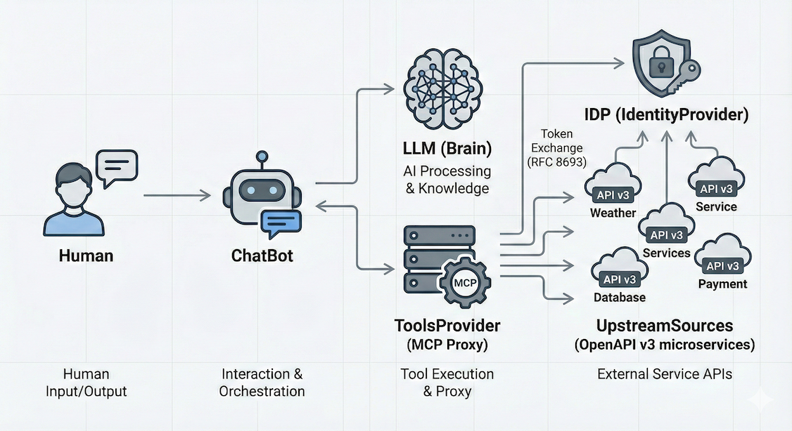
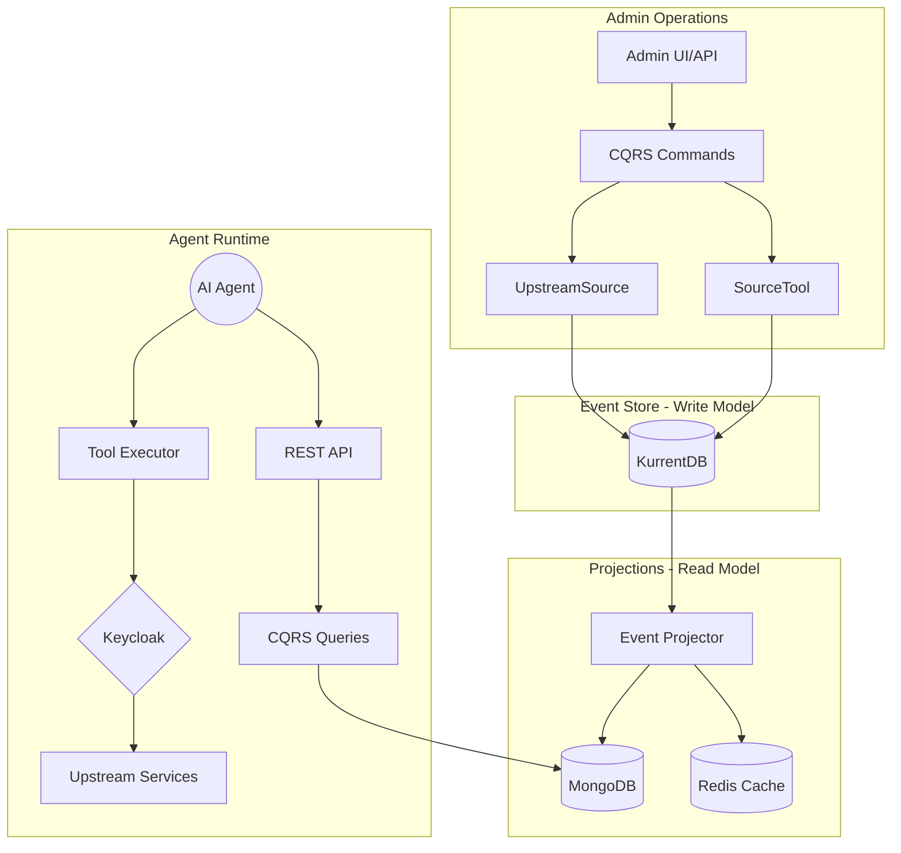

# MCP Tools Provider

[](https://www.python.org/downloads/)
[](https://python-poetry.org/)
[](https://fastapi.tiangolo.com)
[](https://github.com/neuroglia-io/python-framework)
[](LICENSE)
[](https://github.com/psf/black)
[](https://github.com/astral-sh/ruff)
[](https://docs.pytest.org/)
[](docker-compose.yml)
[](https://www.keycloak.org/)
[](https://www.kurrent.io/)
[](https://www.mongodb.com/)
[](https://redis.io/)

> ⚠️ **Work in Progress** - This project is under active development. APIs and features may change without notice.

An intelligent infrastructure layer that discovers, normalizes, and serves MCP (Model Context Protocol) tools from upstream OpenAPI services to AI Agents. Built with **Event Sourcing**, **CQRS**, and **Domain-Driven Design** using the Neuroglia Python Framework.



- 🔍 **Tool Discovery**: Automatically ingests and normalizes tools from OpenAPI specifications
- 🎯 **Tool Curation**: Group tools with pattern-based selectors and explicit membership
- 🔐 **Dual Authentication**: OAuth2/OIDC (session) + JWT Bearer tokens via Keycloak
- 📋 **CQRS + Event Sourcing**: Write model (KurrentDB) + Read model (MongoDB)
- 🛡️ **RBAC**: Role-based access control with admin-only operations
- 📡 **Full Observability**: OpenTelemetry tracing, metrics, and structured logging

> Read **Full Documentation** at https://bvandewe.github.io/tools-provider

## 🏗️ Architecture

The MCP Tools Provider acts as a **dynamic projection engine** that:

1. **Discovers** capabilities from OpenAPI endpoints (and future Workflow Engines)
2. **Normalizes** them into standard MCP Tool definitions
3. **Curates** them into logical Tool Groups with fine-grained endpoint selection
4. **Secures** access via Keycloak with JWT claim-based policies

### System Architecture



### Database Architecture

| Layer | Technology | Purpose |
|-------|------------|---------|
| **Write Model** | KurrentDB (EventStoreDB) | Event persistence, audit trail, aggregate streams |
| **Read Model** | MongoDB | Complex queries, full-text search, queryable projections |
| **Cache Layer** | Redis | Sessions, resolved manifests, pub/sub notifications |

### Domain Aggregates

- **`UpstreamSource`**: Manages connections to external OpenAPI services with health monitoring
- **`SourceTool`**: Individual tool/endpoint with admin enable/disable controls
- **`ToolGroup`** _(planned)_: Curates tools using pattern selectors + explicit membership
- **`AccessPolicy`** _(planned)_: Maps JWT claims to allowed Tool Groups

### Project Structure

```
tools-provider/
├── src/
│   ├── main.py                      # FastAPI app factory with Neuroglia DI
│   ├── api/                         # REST API controllers
│   │   ├── controllers/             # Sources, Tools, Tasks endpoints
│   │   ├── dependencies.py          # Auth dependencies (session + JWT)
│   │   └── services/                # DualAuthService, OpenAPI config
│   ├── application/                 # CQRS handlers
│   │   ├── commands/                # RegisterSource, RefreshInventory, Delete*
│   │   ├── queries/                 # GetSources, GetTools, Search
│   │   └── services/                # OpenAPISourceAdapter, ingestion logic
│   ├── domain/                      # Pure domain model
│   │   ├── entities/                # UpstreamSource, SourceTool aggregates
│   │   ├── events/                  # Domain events with @cloudevent decorator
│   │   └── repositories/            # Repository interfaces (ports)
│   ├── integration/                 # Concrete implementations
│   │   ├── models/                  # DTOs with @queryable decorator
│   │   └── repositories/            # Motor (MongoDB) repositories
│   ├── infrastructure/              # Session stores (in-memory/Redis)
│   └── ui/                          # Admin UI (Bootstrap 5 + Parcel)
├── tests/                           # Pytest suites (domain, application)
├── docs/                            # MkDocs documentation
│   └── specs/                       # Design specifications
├── deployment/                      # Keycloak realm, OTEL collector config
├── docker-compose.yml               # Full local stack
├── pyproject.toml                   # Python dependencies & tool config (Poetry)
└── README.md                        # This file
```

## 🚀 Quick Start

### Prerequisites

- Python 3.12+
- Poetry
- Node.js 20+ (for UI build)
- Docker & Docker Compose

### Quick Setup (Recommended)

Use the Makefile for easy setup and management:

```bash
# Complete setup for new developers
make setup

# Start infrastructure (KurrentDB, MongoDB, Keycloak, Redis)
make up

# Run the application locally
make run

# See all available commands
make help
```

### Docker Development

Run the complete stack with Docker Compose:

```bash
# Build and start all services
make up

# View logs
make logs

# Stop services
make down
```

This will start:

- ✅ Tools Provider App (http://localhost:8040)
- ✅ API Documentation (http://localhost:8040/api/docs)
- ✅ KurrentDB (http://localhost:2113) - Event Store
- ✅ MongoDB + Mongo Express (http://localhost:8043)
- ✅ Keycloak (http://localhost:8041)
- ✅ Redis (localhost:6379)
- ✅ OpenTelemetry Collector

## 👥 Test Users

The application includes test users with different roles:

| Username | Password | Role | Access Level |
|----------|----------|------|--------------|
| admin | test | admin | Full admin access, can register/delete sources |
| user | test | user | Read-only access to tools |

See [deployment/keycloak/](./deployment/keycloak/) for realm configuration.

## 🔐 Authentication

The Tools Provider supports **dual authentication**:

### 1. OAuth2/OIDC (Session-based)

- Backend-for-Frontend pattern with Keycloak
- Session cookies stored in Redis
- Used by the Admin UI

### 2. JWT Bearer Tokens

- Stateless API authentication
- For programmatic access by AI Agents
- RS256 signature validation via Keycloak JWKS

### Role-Based Access Control

- **Admin**: Can register sources, refresh inventory, delete sources/tools
- **User**: Can list and search tools

```python
# Admin-only endpoints use require_roles dependency
@delete("/{source_id}")
async def delete_source(self, user: dict = Depends(require_roles("admin"))):
    ...
```

## 📡 API Endpoints

### Sources (Upstream OpenAPI Services)

| Method | Endpoint | Role | Description |
|--------|----------|------|-------------|
| GET | `/api/sources` | user | List all registered sources |
| GET | `/api/sources/{id}` | user | Get source details |
| POST | `/api/sources` | admin | Register new OpenAPI source |
| POST | `/api/sources/{id}/refresh` | admin | Refresh tool inventory |
| DELETE | `/api/sources/{id}` | admin | Delete source (cascades to tools) |

### Tools (Discovered from Sources)

| Method | Endpoint | Role | Description |
|--------|----------|------|-------------|
| GET | `/api/tools` | user | List all tools |
| GET | `/api/tools/{id}` | user | Get tool details |
| GET | `/api/tools/search` | user | Search tools by name/description |
| DELETE | `/api/tools/{id}` | admin | Delete individual tool |
| DELETE | `/api/tools/orphaned/cleanup` | admin | Cleanup orphaned tools |

## 🛠️ Configuration

### Environment Variables

Key configuration options (see `src/application/settings.py`):

```bash
# Application
APP_HOST=127.0.0.1
APP_PORT=8040

# Keycloak OAuth2/OIDC
KEYCLOAK_URL=http://localhost:8041
KEYCLOAK_REALM=tools-provider
KEYCLOAK_CLIENT_ID=tools-provider-public

# Database connections (JSON)
CONNECTION_STRINGS='{"eventstore": "esdb://...", "mongo": "mongodb://..."}'

# Redis
REDIS_ENABLED=true
REDIS_URL=redis://redis:6379/0

# OpenTelemetry
OTEL_ENABLED=true
OTEL_ENDPOINT=http://otel-collector:4317
```

## 📚 Documentation

### API Documentation

Once running, visit http://localhost:8040/api/docs for interactive Swagger documentation.

### Design Specifications

Detailed design documents are in `docs/specs/`:

- **[tools-provider.md](docs/specs/tools-provider.md)** - Full project specification with domain model
- **[design-review.md](docs/specs/design-review.md)** - Architecture review and recommendations
- **[implementation-plan.md](docs/specs/implementation-plan.md)** - Phased implementation roadmap
- **[pattern-mapping.md](docs/specs/pattern-mapping.md)** - Neuroglia pattern mapping

## 🧰 Makefile Commands

### Docker Commands

```bash
make up          # Start all services in background
make down        # Stop and remove services
make logs        # Show logs from all services
make rebuild     # Rebuild from scratch (no cache)
```

### Local Development

```bash
make setup       # Complete setup (Python + Node deps, build UI)
make run         # Run application locally with hot-reload
make run-debug   # Run with LOG_LEVEL=DEBUG
```

### Testing & Quality

```bash
make test        # Run all tests
make test-cov    # Run tests with coverage report
make lint        # Run linting checks (Ruff)
make format      # Format code with Black
```

## 🧪 Testing

```bash
# Run all tests
poetry run pytest

# Run with coverage
poetry run pytest --cov=. --cov-report=html

# Run specific test categories
make test-domain       # Domain layer tests
make test-application  # CQRS handler tests
```

## 🔗 Related Documentation

- [Neuroglia Python Framework](https://github.com/neuroglia-io/python-framework)
- [KurrentDB (EventStoreDB)](https://www.kurrent.io/)
- [Model Context Protocol](https://modelcontextprotocol.io/)

## 🪝 Pre-Commit Hooks

Automated formatting, linting, and security checks run before you commit.

### What's Included

- Black (Python formatting) + isort (imports)
- Ruff (linting)
- Bandit (Python security scanning)

### Setup

```bash
poetry run pre-commit install --install-hooks
poetry run pre-commit run --all-files
```

## 📦 Deployment

### Production Checklist

- [ ] Configure Keycloak for production OAuth/OIDC
- [ ] Set up KurrentDB cluster for event store
- [ ] Configure MongoDB replica set
- [ ] Enable Redis for session storage
- [ ] Configure CORS for production domains
- [ ] Set up OpenTelemetry collector endpoint
- [ ] Use environment-specific configuration

### Docker Production Build

```bash
docker build -t tools-provider:latest .
docker run -p 8040:8040 tools-provider:latest
```

## 🤝 Contributing

This project follows the Neuroglia Python Framework patterns and Clean Architecture principles.

## 📄 License

Licensed under the Apache License, Version 2.0. See `LICENSE` for the full text.

---

Built with ❤️ using [Neuroglia Python Framework](https://github.com/neuroglia-io/python-framework)
