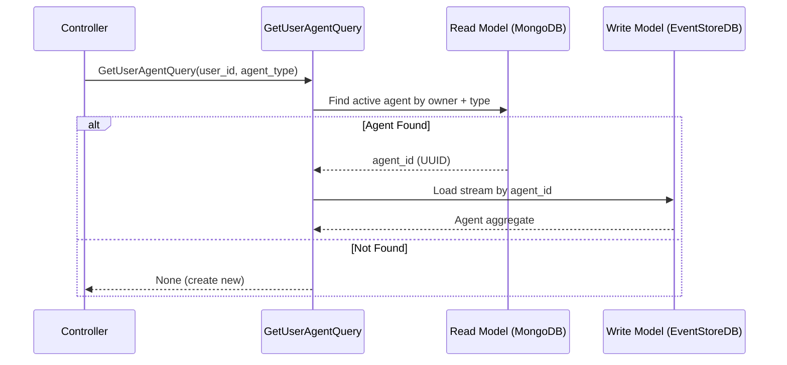
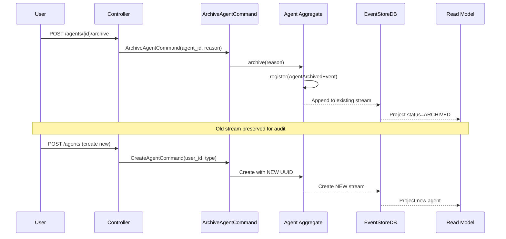
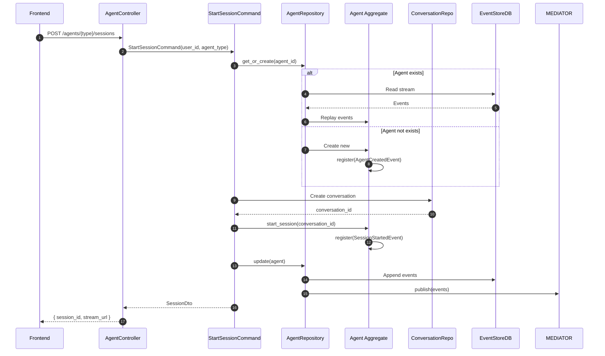
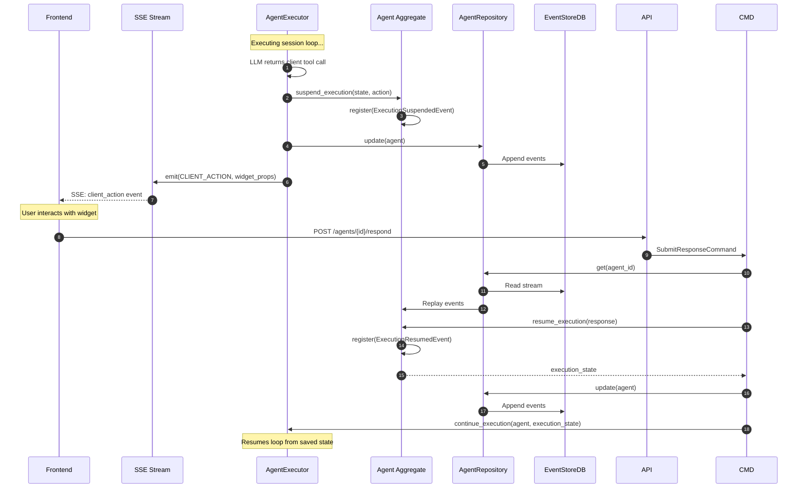
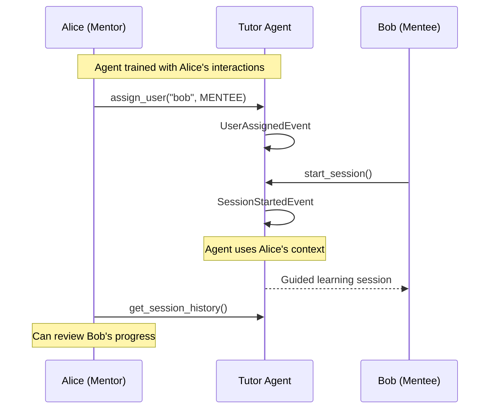

# Agent Aggregate Architecture Design

**Version:** 1.1.0
**Status:** `APPROVED`
**Date:** December 15, 2025
**Application:** agent-host (primary)

---

## 1. Executive Summary

This document defines the architecture for promoting **Agent** to a first-class Domain Aggregate, with **Session** demoted to a value object within the Agent's aggregate boundary. This design enables:

- **Stateful Agents**: Each user has dedicated agent instances that persist state across sessions
- **Cross-Session Learning**: Agents remember user preferences, history, and context
- **Crash Recovery**: Execution state is event-sourced and survives restarts
- **Specialized Agents**: Easy addition of TutorAgent, EvaluatorAgent, CoachAgent, etc.
- **Clean Boundaries**: Single aggregate root (Agent) owns the Session lifecycle
- **Multi-User Sharing**: Agents can be assigned to multiple users with different roles
- **Clean Reset**: Users can archive and create fresh agents without EventStoreDB conflicts

### Design Principles

1. **UUID-Based Identity**: Agents have unique UUIDs; user mapping via owner_id and assignments
2. **Session-as-Child**: Sessions are value objects owned by their parent Agent
3. **Execution Persistence**: LLM conversation state is event-sourced within Agent
4. **Single Driver**: Each Session is driven by exactly one Agent (no multi-agent sessions)
5. **Mono-Dimensional First**: Start with standard event-sourced aggregates, add Polyglot aspects later
6. **Archivable Lifecycle**: Agents can be archived and replaced with fresh instances

---

## 2. Current vs. Target Architecture

### 2.1 Current Architecture (Problems)

```
┌─────────────────────────────────────────────────────────────────┐
│                    Current: Stateless Agents                    │
├─────────────────────────────────────────────────────────────────┤
│                                                                  │
│  ┌──────────────┐     ┌──────────────┐     ┌──────────────┐    │
│  │   Session    │     │ Conversation │     │    Agent     │    │
│  │  Aggregate   │────▶│  Aggregate   │     │  (Service)   │    │
│  │              │     │              │     │  STATELESS   │    │
│  └──────┬───────┘     └──────────────┘     └──────┬───────┘    │
│         │                                         │             │
│         │  pending_action                         │ _suspended  │
│         │  (persisted)                            │ _state      │
│         │                                         │ (IN-MEMORY) │
│         │                                         │             │
│         └─────────────── SPLIT BRAIN ────────────┘             │
│                                                                  │
│  Problems:                                                       │
│  • Agent execution state lost on restart                        │
│  • No cross-session memory                                       │
│  • Session/Agent boundary unclear                                │
│  • Cannot add specialized agent behaviors                        │
└─────────────────────────────────────────────────────────────────┘
```

### 2.2 Target Architecture (Solution)

```
┌─────────────────────────────────────────────────────────────────┐
│                   Target: Stateful Agent Aggregate               │
├─────────────────────────────────────────────────────────────────┤
│                                                                  │
│  ┌──────────────────────────────────────────────────────────┐   │
│  │                    Agent Aggregate                        │   │
│  │  ┌────────────────────────────────────────────────────┐  │   │
│  │  │  AgentState                                         │  │   │
│  │  │  ├── id: "550e8400-e29b-41d4-a716-446655440000"   │  │   │
│  │  │  ├── owner_user_id: "user123"                      │  │   │
│  │  │  ├── agent_type: AgentType.TUTOR                   │  │   │
│  │  │  ├── status: AgentStatus.ACTIVE                    │  │   │
│  │  │  ├── preferences: {...}                            │  │   │
│  │  │  ├── interaction_count: 47                         │  │   │
│  │  │  │                                                  │  │   │
│  │  │  ├── active_session: Session | None ◄──────────────┼──┼───┤
│  │  │  │   ├── session_id                                │  │   │  Value
│  │  │  │   ├── conversation_id                           │  │   │  Object
│  │  │  │   ├── status                                    │  │   │
│  │  │  │   ├── items[]                                   │  │   │
│  │  │  │   └── pending_action                            │  │   │
│  │  │  │                                                  │  │   │
│  │  │  └── execution_state: ExecutionState | None ◄──────┼──┼───┤
│  │  │      ├── conversation_snapshot: LlmMessage[]       │  │   │  Persisted!
│  │  │      ├── iteration: 3                              │  │   │
│  │  │      ├── tool_calls_made: 5                        │  │   │
│  │  │      └── pending_tool_call: LlmToolCall            │  │   │
│  │  └────────────────────────────────────────────────────┘  │   │
│  │                                                           │   │
│  │  Domain Events:                                           │   │
│  │  ├── AgentCreatedDomainEvent                             │   │
│  │  ├── SessionStartedDomainEvent                           │   │
│  │  ├── ExecutionSuspendedDomainEvent  ◄── NEW              │   │
│  │  ├── ExecutionResumedDomainEvent    ◄── NEW              │   │
│  │  ├── ClientActionRequestedDomainEvent                    │   │
│  │  ├── ClientResponseReceivedDomainEvent                   │   │
│  │  ├── SessionCompletedDomainEvent                         │   │
│  │  ├── AgentPreferencesUpdatedDomainEvent                  │   │
│  │  ├── AgentArchivedDomainEvent       ◄── NEW              │   │
│  │  └── UserAssignedToAgentDomainEvent ◄── NEW              │   │
│  └──────────────────────────────────────────────────────────┘   │
│                          │                                       │
│                          │ owns                                  │
│                          ▼                                       │
│  ┌──────────────────────────────────────────────────────────┐   │
│  │              Conversation Aggregate (Unchanged)           │   │
│  │  ├── id                                                   │   │
│  │  ├── user_id                                              │   │
│  │  └── messages[]                                           │   │
│  └──────────────────────────────────────────────────────────┘   │
│                                                                  │
│  Benefits:                                                       │
│  ✓ Execution state survives restarts (event-sourced)            │
│  ✓ Agent learns across sessions (same user)                     │
│  ✓ Clean aggregate boundary (Agent owns Session)                │
│  ✓ Easy to add specialized agent types                          │
└─────────────────────────────────────────────────────────────────┘
```

---

## 3. Domain Model

### 3.1 Agent Identity Strategy

Agents use **UUID-based identity** with owner mapping to support clean lifecycle management:

```python
# Agent ID: UUID (immutable, globally unique)
# Owner Mapping: owner_user_id field links Agent to creating User
# User Assignments: AgentAssignment value objects for multi-user access

# Examples:
#   id: "550e8400-e29b-41d4-a716-446655440000"
#   owner_user_id: "user123"
#   agent_type: AgentType.TUTOR
#   status: AgentStatus.ACTIVE

from uuid import uuid4

def generate_agent_id() -> str:
    """Generate a new unique agent ID."""
    return str(uuid4())
```

#### Why UUID over Deterministic ID?

| Aspect | Deterministic (`{type}-{user}`) | UUID + Mapping |
|--------|--------------------------------|----------------|
| **Lookup** | Direct stream name | Query read model |
| **Reset/Archive** | ❌ Stream collision | ✅ New UUID, clean stream |
| **Multi-User** | ❌ Single owner hardcoded | ✅ Assignments with roles |
| **Sharing** | ❌ Not possible | ✅ Multiple users, one agent |
| **History** | ❌ Overwritten | ✅ Archived agents preserved |
| **Complexity** | Simple | Moderate |

#### Agent Lookup Flow



#### Agent Reset Flow

When a user wants to "reset" their agent and start fresh:



### 3.2 AgentType Enumeration

```python
# domain/enums/agent_type.py

from enum import Enum


class AgentType(str, Enum):
    """Types of agents available in the system.

    Each type represents a specialized agent with distinct behaviors,
    prompts, and interaction patterns.
    """

    # Core Agents (Phase 1)
    TUTOR = "tutor"           # Learning sessions - teaches concepts
    THOUGHT = "thought"       # Thought sessions - Socratic dialogue
    EVALUATOR = "evaluator"   # Validation sessions - assessments

    # Future Agents (Phase 2+)
    COACH = "coach"           # Goal tracking and motivation
    CONNECTOR = "connector"   # Social/mentorship matching
    WELLNESS = "wellness"     # Fatigue detection, break reminders
    PLANNER = "planner"       # Schedule optimization
    RESEARCHER = "researcher" # Deep web research
```

### 3.3 AgentStatus Enumeration

```python
# domain/enums/agent_status.py

from enum import Enum


class AgentStatus(str, Enum):
    """Lifecycle status of an Agent.

    Agents can be archived and replaced with fresh instances.
    Archived agents remain in EventStoreDB for audit but are
    excluded from active queries in the read model.
    """

    ACTIVE = "active"       # Normal operating state
    ARCHIVED = "archived"   # Soft-deleted, preserved for audit
```

### 3.4 AssignmentRole Enumeration

```python
# domain/enums/assignment_role.py

from enum import Enum


class AssignmentRole(str, Enum):
    """Role types for agent-user assignments.

    Different roles control access levels and interaction patterns.
    See Section 12 for multi-user sharing use cases.
    """

    PRIMARY = "primary"     # Owner - full control
    SHARED = "shared"       # Team member - can interact
    MENTEE = "mentee"       # Being mentored - limited write
    OBSERVER = "observer"   # Read-only access
```

### 3.5 AgentAssignment Value Object

```python
# domain/models/agent_assignment.py

from dataclasses import dataclass
from datetime import datetime
from typing import Any

from domain.enums.assignment_role import AssignmentRole


@dataclass
class AgentAssignment:
    """Tracks a user's assignment to an agent.

    Enables multi-user sharing with role-based access.
    """

    user_id: str
    role: AssignmentRole
    assigned_at: datetime
    assigned_by: str  # User ID who made the assignment

    def to_dict(self) -> dict[str, Any]:
        return {
            "user_id": self.user_id,
            "role": self.role.value,
            "assigned_at": self.assigned_at.isoformat(),
            "assigned_by": self.assigned_by,
        }

    @classmethod
    def from_dict(cls, data: dict[str, Any]) -> "AgentAssignment":
        return cls(
            user_id=data["user_id"],
            role=AssignmentRole(data["role"]),
            assigned_at=datetime.fromisoformat(data["assigned_at"]),
            assigned_by=data["assigned_by"],
        )
```

### 3.6 Session Value Object

Session is demoted from an Aggregate to a Value Object within Agent:

```python
# domain/models/session.py

from dataclasses import dataclass, field
from datetime import datetime
from typing import Any
from uuid import uuid4

from domain.enums.session_status import SessionStatus
from domain.models.session_item import SessionItem
from domain.models.client_action import ClientAction


@dataclass
class Session:
    """A session within an Agent's interaction history.

    Sessions are value objects owned by an Agent aggregate.
    They track structured interactions (items) and UI state.

    Lifecycle:
    - Created when user starts a new interaction with an agent
    - Active while agent is driving the session
    - Completed when agent decides session is done
    - Terminated if user ends early
    """

    session_id: str = field(default_factory=lambda: str(uuid4()))
    conversation_id: str = ""
    session_type: str = ""  # Maps to agent's specialty

    # Status
    status: SessionStatus = SessionStatus.PENDING

    # Progress
    items: list[SessionItem] = field(default_factory=list)
    current_item_id: str | None = None

    # Client Interaction
    pending_action: ClientAction | None = None
    ui_state: dict[str, Any] = field(default_factory=dict)

    # Timestamps
    started_at: datetime | None = None
    completed_at: datetime | None = None
    terminated_reason: str | None = None

    def to_dict(self) -> dict[str, Any]:
        """Serialize for persistence."""
        return {
            "session_id": self.session_id,
            "conversation_id": self.conversation_id,
            "session_type": self.session_type,
            "status": self.status.value,
            "items": [item.to_dict() for item in self.items],
            "current_item_id": self.current_item_id,
            "pending_action": self.pending_action.to_dict() if self.pending_action else None,
            "ui_state": self.ui_state,
            "started_at": self.started_at.isoformat() if self.started_at else None,
            "completed_at": self.completed_at.isoformat() if self.completed_at else None,
            "terminated_reason": self.terminated_reason,
        }

    @classmethod
    def from_dict(cls, data: dict[str, Any]) -> "Session":
        """Deserialize from persistence."""
        return cls(
            session_id=data["session_id"],
            conversation_id=data["conversation_id"],
            session_type=data["session_type"],
            status=SessionStatus(data["status"]),
            items=[SessionItem.from_dict(i) for i in data.get("items", [])],
            current_item_id=data.get("current_item_id"),
            pending_action=ClientAction.from_dict(data["pending_action"]) if data.get("pending_action") else None,
            ui_state=data.get("ui_state", {}),
            started_at=datetime.fromisoformat(data["started_at"]) if data.get("started_at") else None,
            completed_at=datetime.fromisoformat(data["completed_at"]) if data.get("completed_at") else None,
            terminated_reason=data.get("terminated_reason"),
        )
```

### 3.7 ExecutionState Value Object

The critical piece that was previously in-memory only:

```python
# domain/models/execution_state.py

from dataclasses import dataclass, field
from typing import Any


@dataclass
class LlmMessageSnapshot:
    """Snapshot of an LLM message for persistence.

    Simplified representation that can be serialized/deserialized.
    """
    role: str  # system, user, assistant, tool
    content: str
    tool_calls: list[dict[str, Any]] = field(default_factory=list)
    tool_call_id: str | None = None
    name: str | None = None  # Tool name for tool results

    def to_dict(self) -> dict[str, Any]:
        return {
            "role": self.role,
            "content": self.content,
            "tool_calls": self.tool_calls,
            "tool_call_id": self.tool_call_id,
            "name": self.name,
        }

    @classmethod
    def from_dict(cls, data: dict[str, Any]) -> "LlmMessageSnapshot":
        return cls(
            role=data["role"],
            content=data["content"],
            tool_calls=data.get("tool_calls", []),
            tool_call_id=data.get("tool_call_id"),
            name=data.get("name"),
        )


@dataclass
class PendingToolCall:
    """A tool call waiting for client response."""
    call_id: str
    tool_name: str
    arguments: dict[str, Any]

    def to_dict(self) -> dict[str, Any]:
        return {
            "call_id": self.call_id,
            "tool_name": self.tool_name,
            "arguments": self.arguments,
        }

    @classmethod
    def from_dict(cls, data: dict[str, Any]) -> "PendingToolCall":
        return cls(
            call_id=data["call_id"],
            tool_name=data["tool_name"],
            arguments=data["arguments"],
        )


@dataclass
class ExecutionState:
    """Captures agent execution state for suspension/resume.

    This is the critical state that was previously held in-memory
    by ProactiveAgent._suspended_state. Now it's persisted as part
    of the Agent aggregate.

    When an agent suspends (waiting for client widget response),
    this state captures everything needed to resume exactly where
    the agent left off.
    """

    # Conversation context
    conversation_snapshot: list[LlmMessageSnapshot] = field(default_factory=list)

    # Loop state
    iteration: int = 0
    tool_calls_made: int = 0

    # Pending interaction
    pending_tool_call: PendingToolCall | None = None

    # Timing (for metrics)
    started_at_ms: float = 0.0
    suspended_at_ms: float = 0.0

    def to_dict(self) -> dict[str, Any]:
        return {
            "conversation_snapshot": [m.to_dict() for m in self.conversation_snapshot],
            "iteration": self.iteration,
            "tool_calls_made": self.tool_calls_made,
            "pending_tool_call": self.pending_tool_call.to_dict() if self.pending_tool_call else None,
            "started_at_ms": self.started_at_ms,
            "suspended_at_ms": self.suspended_at_ms,
        }

    @classmethod
    def from_dict(cls, data: dict[str, Any]) -> "ExecutionState":
        return cls(
            conversation_snapshot=[LlmMessageSnapshot.from_dict(m) for m in data.get("conversation_snapshot", [])],
            iteration=data.get("iteration", 0),
            tool_calls_made=data.get("tool_calls_made", 0),
            pending_tool_call=PendingToolCall.from_dict(data["pending_tool_call"]) if data.get("pending_tool_call") else None,
            started_at_ms=data.get("started_at_ms", 0.0),
            suspended_at_ms=data.get("suspended_at_ms", 0.0),
        )
```

### 3.8 Agent Aggregate

```python
# domain/entities/agent.py

from datetime import UTC, datetime
from typing import Any, cast
from uuid import uuid4

from multipledispatch import dispatch
from neuroglia.data.abstractions import AggregateRoot, AggregateState
from neuroglia.mapping.mapper import map_to

from domain.enums.agent_type import AgentType
from domain.enums.agent_status import AgentStatus
from domain.enums.session_status import SessionStatus
from domain.events.agent import (
    AgentArchivedDomainEvent,
    AgentCreatedDomainEvent,
    AgentPreferencesUpdatedDomainEvent,
    ClientActionRequestedDomainEvent,
    ClientResponseReceivedDomainEvent,
    ExecutionResumedDomainEvent,
    ExecutionSuspendedDomainEvent,
    SessionCompletedDomainEvent,
    SessionStartedDomainEvent,
    SessionTerminatedDomainEvent,
    UserAssignedToAgentDomainEvent,
)
from domain.models.client_action import ClientAction
from domain.models.client_response import ClientResponse
from domain.models.execution_state import ExecutionState
from domain.models.session import Session
from integration.models.agent_dto import AgentDto


class DomainError(Exception):
    """Exception raised for domain rule violations."""
    pass


@map_to(AgentDto)
class AgentState(AggregateState[str]):
    """Encapsulates the persisted state for the Agent aggregate.

    An Agent is identified by UUID with owner_user_id mapping.
    Persists:
    - Owner and status information
    - User assignments for multi-user access
    - User-specific preferences
    - Interaction history metrics
    - Active session (if any)
    - Execution state for suspended sessions
    - Completed session history (last N)
    """

    # Identity (UUID-based)
    id: str
    owner_user_id: str  # User who created this agent
    agent_type: str
    status: str  # AgentStatus value

    # User Assignments (for multi-user access)
    assignments: list[dict[str, Any]]  # List of AgentAssignment

    # Configuration
    name: str
    system_prompt_override: str | None
    preferences: dict[str, Any]

    # Metrics
    total_sessions: int
    total_interactions: int
    successful_completions: int

    # Active Session (value object)
    active_session: dict[str, Any] | None

    # Execution State (for suspend/resume)
    execution_state: dict[str, Any] | None

    # Session History (last N completed sessions, for context)
    session_history: list[dict[str, Any]]
    max_history_size: int

    # Archive info
    archived_at: datetime | None
    archive_reason: str | None

    # Audit
    created_at: datetime
    updated_at: datetime
    last_interaction_at: datetime | None

    def __init__(self) -> None:
        super().__init__()
        self.id = ""
        self.owner_user_id = ""
        self.agent_type = ""
        self.status = "active"  # AgentStatus.ACTIVE
        self.assignments = []
        self.name = ""
        self.system_prompt_override = None
        self.preferences = {}
        self.total_sessions = 0
        self.total_interactions = 0
        self.successful_completions = 0
        self.active_session = None
        self.execution_state = None
        self.session_history = []
        self.max_history_size = 10
        self.archived_at = None
        self.archive_reason = None
        now = datetime.now(UTC)
        self.created_at = now
        self.updated_at = now
        self.last_interaction_at = None

    # =========================================================================
    # Event Handlers
    # =========================================================================

    @dispatch(AgentCreatedDomainEvent)
    def on(self, event: AgentCreatedDomainEvent) -> None:
        """Apply the agent creation event."""
        self.id = event.aggregate_id
        self.owner_user_id = event.owner_user_id
        self.agent_type = event.agent_type
        self.status = "active"  # AgentStatus.ACTIVE
        self.name = event.name
        self.created_at = event.created_at
        self.updated_at = event.created_at
        # Owner is automatically assigned as PRIMARY
        self.assignments = [{
            "user_id": event.owner_user_id,
            "role": "primary",
            "assigned_at": event.created_at.isoformat(),
            "assigned_by": event.owner_user_id,
        }]

    @dispatch(AgentPreferencesUpdatedDomainEvent)
    def on(self, event: AgentPreferencesUpdatedDomainEvent) -> None:
        """Apply preferences update."""
        self.preferences.update(event.preferences)
        self.updated_at = datetime.now(UTC)

    @dispatch(SessionStartedDomainEvent)
    def on(self, event: SessionStartedDomainEvent) -> None:
        """Apply session started event."""
        self.active_session = {
            "session_id": event.session_id,
            "conversation_id": event.conversation_id,
            "session_type": event.session_type,
            "status": SessionStatus.ACTIVE.value,
            "items": [],
            "current_item_id": None,
            "pending_action": None,
            "ui_state": {},
            "started_at": event.started_at.isoformat(),
            "completed_at": None,
            "terminated_reason": None,
        }
        self.total_sessions += 1
        self.updated_at = datetime.now(UTC)
        self.last_interaction_at = event.started_at

    @dispatch(ExecutionSuspendedDomainEvent)
    def on(self, event: ExecutionSuspendedDomainEvent) -> None:
        """Apply execution suspended event."""
        self.execution_state = event.execution_state
        if self.active_session:
            self.active_session["status"] = SessionStatus.AWAITING_CLIENT_ACTION.value
            self.active_session["pending_action"] = event.pending_action
        self.updated_at = datetime.now(UTC)

    @dispatch(ExecutionResumedDomainEvent)
    def on(self, event: ExecutionResumedDomainEvent) -> None:
        """Apply execution resumed event."""
        # Execution state will be updated when next suspension occurs or session completes
        if self.active_session:
            self.active_session["status"] = SessionStatus.ACTIVE.value
            self.active_session["pending_action"] = None
        self.total_interactions += 1
        self.updated_at = datetime.now(UTC)
        self.last_interaction_at = datetime.now(UTC)

    @dispatch(ClientActionRequestedDomainEvent)
    def on(self, event: ClientActionRequestedDomainEvent) -> None:
        """Apply client action requested event."""
        if self.active_session:
            self.active_session["pending_action"] = event.action
            self.active_session["status"] = SessionStatus.AWAITING_CLIENT_ACTION.value
        self.updated_at = datetime.now(UTC)

    @dispatch(ClientResponseReceivedDomainEvent)
    def on(self, event: ClientResponseReceivedDomainEvent) -> None:
        """Apply client response received event."""
        if self.active_session:
            self.active_session["pending_action"] = None
            self.active_session["status"] = SessionStatus.ACTIVE.value
            # Add to items if applicable
            if event.item_data:
                self.active_session["items"].append(event.item_data)
        self.total_interactions += 1
        self.updated_at = datetime.now(UTC)
        self.last_interaction_at = datetime.now(UTC)

    @dispatch(SessionCompletedDomainEvent)
    def on(self, event: SessionCompletedDomainEvent) -> None:
        """Apply session completed event."""
        if self.active_session:
            self.active_session["status"] = SessionStatus.COMPLETED.value
            self.active_session["completed_at"] = event.completed_at.isoformat()

            # Archive to history
            self._archive_session(self.active_session)
            self.active_session = None

        self.execution_state = None
        self.successful_completions += 1
        self.updated_at = datetime.now(UTC)

    @dispatch(SessionTerminatedDomainEvent)
    def on(self, event: SessionTerminatedDomainEvent) -> None:
        """Apply session terminated event."""
        if self.active_session:
            self.active_session["status"] = SessionStatus.TERMINATED.value
            self.active_session["terminated_reason"] = event.reason
            self.active_session["completed_at"] = event.terminated_at.isoformat()

            # Archive to history
            self._archive_session(self.active_session)
            self.active_session = None

        self.execution_state = None
        self.updated_at = datetime.now(UTC)

    @dispatch(AgentArchivedDomainEvent)
    def on(self, event: AgentArchivedDomainEvent) -> None:
        """Apply agent archived event."""
        self.status = "archived"  # AgentStatus.ARCHIVED
        self.archived_at = event.archived_at
        self.archive_reason = event.reason
        self.updated_at = event.archived_at

    @dispatch(UserAssignedToAgentDomainEvent)
    def on(self, event: UserAssignedToAgentDomainEvent) -> None:
        """Apply user assignment event."""
        self.assignments.append({
            "user_id": event.user_id,
            "role": event.role,
            "assigned_at": event.assigned_at.isoformat(),
            "assigned_by": event.assigned_by,
        })
        self.updated_at = event.assigned_at

    def _archive_session(self, session: dict[str, Any]) -> None:
        """Archive a completed session to history, maintaining max size."""
        self.session_history.insert(0, session)
        if len(self.session_history) > self.max_history_size:
            self.session_history = self.session_history[:self.max_history_size]


class Agent(AggregateRoot[AgentState, str]):
    """Agent aggregate root managing user-specific AI agent instances.

    An Agent is a stateful entity that:
    - Has a UUID-based identity (not deterministic)
    - Tracks owner via owner_user_id field
    - Supports multi-user access via assignments
    - Persists across sessions for assigned users
    - Owns Sessions as value objects
    - Stores execution state for crash recovery
    - Learns user preferences over time
    - Can be archived and replaced with fresh instances

    Key Design Decisions:
    - ID: UUID (enables archive + reset without stream collision)
    - Owner Mapping: owner_user_id links agent to creating user
    - Multi-User: AgentAssignment enables sharing with roles
    - One active session at a time per agent
    - Execution state persisted for suspend/resume
    - Session history maintained for context

    State Transitions:
    - create() -> ACTIVE (status)
    - start_session() -> HAS_ACTIVE_SESSION
    - suspend_execution() -> AWAITING_CLIENT_ACTION
    - resume_execution() -> HAS_ACTIVE_SESSION
    - complete_session() -> IDLE
    - terminate_session() -> IDLE
    - archive() -> ARCHIVED (status)
    """

    def __init__(
        self,
        owner_user_id: str,
        agent_type: AgentType,
        name: str | None = None,
        agent_id: str | None = None,
        created_at: datetime | None = None,
    ) -> None:
        """Create a new Agent.

        Args:
            owner_user_id: The user who owns this agent (will be primary assignee)
            agent_type: Type of agent (determines behavior)
            name: Display name for the agent
            agent_id: Optional specific ID (generates UUID if None)
            created_at: Optional creation timestamp
        """
        super().__init__()

        # Generate UUID-based ID (not deterministic)
        aggregate_id = agent_id or str(uuid4())
        created_time = created_at or datetime.now(UTC)
        display_name = name or f"{agent_type.value.title()} Agent"

        self.state.on(
            self.register_event(
                AgentCreatedDomainEvent(
                    aggregate_id=aggregate_id,
                    owner_user_id=owner_user_id,
                    agent_type=agent_type.value,
                    name=display_name,
                    created_at=created_time,
                )
            )
        )

    def id(self) -> str:
        """Return the aggregate identifier."""
        aggregate_id = super().id()
        if aggregate_id is None:
            raise ValueError("Agent aggregate identifier has not been initialized")
        return cast(str, aggregate_id)

    # =========================================================================
    # Queries
    # =========================================================================

    def has_active_session(self) -> bool:
        """Check if agent has an active session."""
        return self.state.active_session is not None

    def get_active_session(self) -> Session | None:
        """Get the active session as a value object."""
        if self.state.active_session is None:
            return None
        return Session.from_dict(self.state.active_session)

    def get_execution_state(self) -> ExecutionState | None:
        """Get the current execution state."""
        if self.state.execution_state is None:
            return None
        return ExecutionState.from_dict(self.state.execution_state)

    def is_suspended(self) -> bool:
        """Check if agent is suspended waiting for client response."""
        return (
            self.state.active_session is not None
            and self.state.active_session.get("status") == SessionStatus.AWAITING_CLIENT_ACTION.value
        )

    # =========================================================================
    # Commands
    # =========================================================================

    def update_preferences(self, preferences: dict[str, Any]) -> None:
        """Update user-specific preferences for this agent."""
        self.state.on(
            self.register_event(
                AgentPreferencesUpdatedDomainEvent(
                    aggregate_id=self.id(),
                    preferences=preferences,
                )
            )
        )

    def start_session(
        self,
        conversation_id: str,
        session_type: str,
        session_id: str | None = None,
    ) -> Session:
        """Start a new session within this agent.

        Args:
            conversation_id: The linked Conversation aggregate ID
            session_type: Type of session (learning, thought, validation)
            session_id: Optional specific session ID

        Returns:
            The created Session value object

        Raises:
            DomainError: If agent already has an active session
        """
        if self.has_active_session():
            raise DomainError(
                f"Agent {self.id()} already has an active session. "
                "Complete or terminate the current session first."
            )

        session_id = session_id or str(uuid4())
        started_at = datetime.now(UTC)

        self.state.on(
            self.register_event(
                SessionStartedDomainEvent(
                    aggregate_id=self.id(),
                    session_id=session_id,
                    conversation_id=conversation_id,
                    session_type=session_type,
                    started_at=started_at,
                )
            )
        )

        return self.get_active_session()

    def suspend_execution(
        self,
        execution_state: ExecutionState,
        pending_action: ClientAction,
    ) -> None:
        """Suspend execution, waiting for client response.

        Args:
            execution_state: The full execution state to persist
            pending_action: The client action awaiting response

        Raises:
            DomainError: If no active session
        """
        if not self.has_active_session():
            raise DomainError("Cannot suspend: no active session")

        self.state.on(
            self.register_event(
                ExecutionSuspendedDomainEvent(
                    aggregate_id=self.id(),
                    execution_state=execution_state.to_dict(),
                    pending_action=pending_action.to_dict(),
                    suspended_at=datetime.now(UTC),
                )
            )
        )

    def resume_execution(self, response: ClientResponse) -> ExecutionState:
        """Resume execution after receiving client response.

        Args:
            response: The client's response to the pending action

        Returns:
            The execution state to resume from

        Raises:
            DomainError: If not suspended or response doesn't match
        """
        if not self.is_suspended():
            raise DomainError("Cannot resume: agent is not suspended")

        execution_state = self.get_execution_state()
        if execution_state is None:
            raise DomainError("Cannot resume: no execution state")

        pending = execution_state.pending_tool_call
        if pending and response.tool_call_id != pending.call_id:
            raise DomainError(
                f"Response tool_call_id {response.tool_call_id} "
                f"doesn't match pending {pending.call_id}"
            )

        self.state.on(
            self.register_event(
                ExecutionResumedDomainEvent(
                    aggregate_id=self.id(),
                    tool_call_id=response.tool_call_id,
                    response_data=response.response,
                    resumed_at=datetime.now(UTC),
                )
            )
        )

        return execution_state

    def request_client_action(self, action: ClientAction) -> None:
        """Request a client-side action (widget display).

        Args:
            action: The action to request

        Raises:
            DomainError: If no active session
        """
        if not self.has_active_session():
            raise DomainError("Cannot request action: no active session")

        self.state.on(
            self.register_event(
                ClientActionRequestedDomainEvent(
                    aggregate_id=self.id(),
                    action=action.to_dict(),
                    requested_at=datetime.now(UTC),
                )
            )
        )

    def receive_client_response(
        self,
        response: ClientResponse,
        item_data: dict[str, Any] | None = None,
    ) -> None:
        """Record a client response to a pending action.

        Args:
            response: The client's response
            item_data: Optional session item data to record

        Raises:
            DomainError: If no pending action or mismatch
        """
        if not self.has_active_session():
            raise DomainError("Cannot receive response: no active session")

        session = self.get_active_session()
        if session.pending_action is None:
            raise DomainError("Cannot receive response: no pending action")

        if response.tool_call_id != session.pending_action.tool_call_id:
            raise DomainError(
                f"Response tool_call_id {response.tool_call_id} "
                f"doesn't match pending {session.pending_action.tool_call_id}"
            )

        self.state.on(
            self.register_event(
                ClientResponseReceivedDomainEvent(
                    aggregate_id=self.id(),
                    tool_call_id=response.tool_call_id,
                    response_data=response.response,
                    item_data=item_data,
                    received_at=datetime.now(UTC),
                )
            )
        )

    def complete_session(self, summary: dict[str, Any] | None = None) -> None:
        """Complete the active session successfully.

        Args:
            summary: Optional completion summary data

        Raises:
            DomainError: If no active session
        """
        if not self.has_active_session():
            raise DomainError("Cannot complete: no active session")

        self.state.on(
            self.register_event(
                SessionCompletedDomainEvent(
                    aggregate_id=self.id(),
                    session_id=self.state.active_session["session_id"],
                    summary=summary or {},
                    completed_at=datetime.now(UTC),
                )
            )
        )

    def terminate_session(self, reason: str = "User terminated") -> None:
        """Terminate the active session early.

        Args:
            reason: Reason for termination

        Raises:
            DomainError: If no active session
        """
        if not self.has_active_session():
            raise DomainError("Cannot terminate: no active session")

        self.state.on(
            self.register_event(
                SessionTerminatedDomainEvent(
                    aggregate_id=self.id(),
                    session_id=self.state.active_session["session_id"],
                    reason=reason,
                    terminated_at=datetime.now(UTC),
                )
            )
        )

    def archive(self, reason: str = "User requested reset") -> None:
        """Archive this agent, marking it as inactive.

        Used when a user wants to "reset" their agent and start fresh.
        The agent's event stream is preserved for audit purposes,
        but the agent will no longer appear in active queries.

        Args:
            reason: Reason for archiving

        Raises:
            DomainError: If agent is already archived or has active session
        """
        if self.state.status == "archived":
            raise DomainError("Agent is already archived")

        if self.has_active_session():
            raise DomainError("Cannot archive: terminate active session first")

        self.state.on(
            self.register_event(
                AgentArchivedDomainEvent(
                    aggregate_id=self.id(),
                    reason=reason,
                    archived_at=datetime.now(UTC),
                )
            )
        )

    def assign_user(
        self,
        user_id: str,
        role: str,
        assigned_by: str,
    ) -> None:
        """Assign a user to this agent with a specific role.

        Enables multi-user sharing of agents. See Section 12 for use cases.

        Args:
            user_id: The user to assign
            role: The assignment role (primary, shared, mentee, observer)
            assigned_by: User who is making the assignment

        Raises:
            DomainError: If user is already assigned or agent is archived
        """
        if self.state.status == "archived":
            raise DomainError("Cannot assign user to archived agent")

        # Check if user already assigned
        for assignment in self.state.assignments:
            if assignment["user_id"] == user_id:
                raise DomainError(f"User {user_id} is already assigned to this agent")

        self.state.on(
            self.register_event(
                UserAssignedToAgentDomainEvent(
                    aggregate_id=self.id(),
                    user_id=user_id,
                    role=role,
                    assigned_by=assigned_by,
                    assigned_at=datetime.now(UTC),
                )
            )
        )

    def is_archived(self) -> bool:
        """Check if agent is archived."""
        return self.state.status == "archived"

    def is_user_assigned(self, user_id: str) -> bool:
        """Check if a user is assigned to this agent."""
        return any(a["user_id"] == user_id for a in self.state.assignments)

    def get_user_role(self, user_id: str) -> str | None:
        """Get the role for a specific user assignment."""
        for assignment in self.state.assignments:
            if assignment["user_id"] == user_id:
                return assignment["role"]
        return None
```

---

## 4. Domain Events

### 4.1 Event Definitions

```python
# domain/events/agent.py

from datetime import datetime
from typing import Any

from neuroglia.data.abstractions import DomainEvent
from neuroglia.eventing.cloud_events import cloudevent


@cloudevent("agent.created.v1")
class AgentCreatedDomainEvent(DomainEvent[str]):
    """Agent instance created for a user."""
    owner_user_id: str  # User who created/owns this agent
    agent_type: str
    name: str
    created_at: datetime


@cloudevent("agent.archived.v1")
class AgentArchivedDomainEvent(DomainEvent[str]):
    """Agent archived (soft-deleted) by user.

    Used when user wants to reset and start with fresh agent.
    Stream is preserved for audit, but agent excluded from active queries.
    """
    reason: str
    archived_at: datetime


@cloudevent("agent.user.assigned.v1")
class UserAssignedToAgentDomainEvent(DomainEvent[str]):
    """User assigned to agent with specific role.

    Enables multi-user sharing. See Section 12 for use cases.
    """
    user_id: str  # User being assigned
    role: str     # AssignmentRole value (primary, shared, mentee, observer)
    assigned_by: str  # User who made the assignment
    assigned_at: datetime


@cloudevent("agent.preferences.updated.v1")
class AgentPreferencesUpdatedDomainEvent(DomainEvent[str]):
    """User preferences updated for this agent."""
    preferences: dict[str, Any]


@cloudevent("agent.session.started.v1")
class SessionStartedDomainEvent(DomainEvent[str]):
    """New session started within the agent."""
    session_id: str
    conversation_id: str
    session_type: str
    started_at: datetime


@cloudevent("agent.execution.suspended.v1")
class ExecutionSuspendedDomainEvent(DomainEvent[str]):
    """Agent execution suspended, waiting for client response."""
    execution_state: dict[str, Any]
    pending_action: dict[str, Any]
    suspended_at: datetime


@cloudevent("agent.execution.resumed.v1")
class ExecutionResumedDomainEvent(DomainEvent[str]):
    """Agent execution resumed after client response."""
    tool_call_id: str
    response_data: Any
    resumed_at: datetime


@cloudevent("agent.client.action.requested.v1")
class ClientActionRequestedDomainEvent(DomainEvent[str]):
    """Client-side action (widget) requested."""
    action: dict[str, Any]
    requested_at: datetime


@cloudevent("agent.client.response.received.v1")
class ClientResponseReceivedDomainEvent(DomainEvent[str]):
    """Client response received for pending action."""
    tool_call_id: str
    response_data: Any
    item_data: dict[str, Any] | None
    received_at: datetime


@cloudevent("agent.session.completed.v1")
class SessionCompletedDomainEvent(DomainEvent[str]):
    """Session completed successfully."""
    session_id: str
    summary: dict[str, Any]
    completed_at: datetime


@cloudevent("agent.session.terminated.v1")
class SessionTerminatedDomainEvent(DomainEvent[str]):
    """Session terminated early."""
    session_id: str
    reason: str
    terminated_at: datetime
```

---

## 5. Aggregate Boundary Analysis

### 5.1 What's Inside the Agent Aggregate

| Component | Type | Rationale |
|-----------|------|-----------|
| `AgentState` | State | Root state container |
| `AgentStatus` | Enum | Lifecycle state (active/archived) |
| `AgentAssignment` | Value Object | User-to-agent role mapping |
| `Session` | Value Object | Owned by agent, no independent identity |
| `ExecutionState` | Value Object | Agent's execution context |
| `SessionItem` | Value Object | Q&A pairs within session |
| `ClientAction` | Value Object | Pending widget state |
| `preferences` | Value Object | User-specific settings |

### 5.2 What's Outside (Separate Aggregates)

| Entity | Type | Rationale |
|--------|------|-----------|
| `Conversation` | Aggregate | Shared identity (referenced by ID) |
| `User` | Aggregate (Future) | Cross-cutting concerns |
| `Blueprint` | Aggregate (Future) | Exam/content definitions |

### 5.3 Invariants Enforced

1. **Single Active Session**: An agent can have at most one active session
2. **Execution State Consistency**: Execution state only exists when suspended
3. **Response Matching**: Client responses must match pending tool_call_id
4. **Session Lifecycle**: Sessions cannot be started while another is active
5. **Archive Prerequisites**: Cannot archive agent with active session
6. **Assignment Uniqueness**: Each user can only have one assignment per agent
7. **Primary Owner Required**: At least one PRIMARY assignment must exist

---

## 6. Reconciliation Architecture

### 6.1 When Reconciliation Applies

For the mono-dimensional Agent aggregate, reconciliation is **not required** because:

- State changes are event-sourced (immediate consistency)
- Read model projections are updated via DomainEventHandlers

### 6.2 Future Multi-Dimensional Reconciliation

When Polyglot aspects are added:

| Dimension | Trigger | Reconciliation Strategy |
|-----------|---------|------------------------|
| **Temporal** (Events) | Immediate | Event-driven (no polling) |
| **Intentional** (Spec/Status) | Drift detection | Hybrid: Event + Polling (30-60s) |
| **Semantic** (Graph) | Relationship changes | Event-driven (no polling needed) |
| **Observational** (Telemetry) | Time window | Stream aggregation (5-15s windows) |

**Rationale for Hybrid on Intentional**:

- Event-driven: Catches explicit spec changes immediately
- Polling: Detects "drift" (e.g., velocity dropped, deadline approaching)
- Polling is necessary because drift is computed from time-based metrics, not events

**Graph (Semantic) is Event-Driven Only**:

- Relationships change via explicit domain events
- No "drift" concept—graph is either consistent or needs repair
- Polling would be inefficient for graph queries

---

## 7. Agent Executor Refactoring

### 7.1 Current ProactiveAgent Changes

The `ProactiveAgent` application service becomes truly stateless:

```python
# application/agents/proactive_agent.py (refactored)

class ProactiveAgent(Agent):
    """Stateless proactive agent executor.

    All state is now managed by the Agent aggregate.
    This class only orchestrates LLM calls and tool execution.
    """

    async def start_session(
        self,
        agent_aggregate: AgentAggregate,
        context: ProactiveSessionContext,
    ) -> AsyncIterator[AgentEvent]:
        """Start execution for a session.

        Args:
            agent_aggregate: The stateful Agent aggregate (source of truth)
            context: Session context with config

        Yields:
            Agent events as execution proceeds
        """
        # All state is read from agent_aggregate
        # Suspension writes back to agent_aggregate
        ...

    async def resume_with_response(
        self,
        agent_aggregate: AgentAggregate,
        response: ClientResponse,
    ) -> AsyncIterator[AgentEvent]:
        """Resume execution after client response.

        Args:
            agent_aggregate: The stateful Agent aggregate
            response: Client's response

        Yields:
            Agent events as execution continues
        """
        # Read execution_state from agent_aggregate
        # Continue loop
        # Write suspension or completion back to agent_aggregate
        ...
```

### 7.2 Agent/Executor Relationship

```
┌─────────────────────────────────────────────────────────────────┐
│                    Runtime Architecture                          │
├─────────────────────────────────────────────────────────────────┤
│                                                                  │
│  ┌─────────────────┐       ┌─────────────────────────────────┐  │
│  │ AgentController │       │      Agent Aggregate            │  │
│  │   (API Layer)   │──────▶│    (Domain - Stateful)          │  │
│  └────────┬────────┘       │    • Owns Session               │  │
│           │                │    • Persists ExecutionState    │  │
│           │                │    • Event-Sourced              │  │
│           │                └─────────────────────────────────┘  │
│           │                               │                      │
│           │                               │ read/write           │
│           │                               ▼                      │
│           │                ┌─────────────────────────────────┐  │
│           └───────────────▶│    Agent Executor               │  │
│                            │  (Application - Stateless)      │  │
│                            │    • Orchestrates LLM calls     │  │
│                            │    • Executes tools             │  │
│                            │    • Emits events               │  │
│                            │    • Reads from aggregate       │  │
│                            │    • Writes via aggregate cmds  │  │
│                            └─────────────────────────────────┘  │
│                                                                  │
└─────────────────────────────────────────────────────────────────┘
```

---

## 8. API Changes

### 8.1 New Endpoints

| Method | Path | Description |
|--------|------|-------------|
| `GET` | `/api/agents` | List user's accessible agents |
| `POST` | `/api/agents` | Create new agent |
| `GET` | `/api/agents/{agent_id}` | Get agent details |
| `POST` | `/api/agents/{agent_id}/sessions` | Start session |
| `GET` | `/api/agents/{agent_id}/sessions/{session_id}` | Get session |
| `POST` | `/api/agents/{agent_id}/respond` | Submit response |
| `DELETE` | `/api/agents/{agent_id}/sessions/current` | Terminate session |
| `POST` | `/api/agents/{agent_id}/archive` | Archive agent (reset) |
| `POST` | `/api/agents/{agent_id}/assign` | Assign user to agent |
| `GET` | `/api/agents/{agent_id}/stream` | SSE stream |

### 8.2 Backward Compatibility

Existing `/api/session/*` endpoints will be deprecated but maintained:

- Route to appropriate agent based on session_type
- Create agent on-demand if not exists
- Return session data in existing format

---

## 9. Migration Strategy

### 9.1 Approach: Dual-Write Period

```
Phase 1: New Agent aggregate created alongside existing Session
Phase 2: New endpoints active, old endpoints route to new
Phase 3: Old Session aggregate deprecated
Phase 4: Old Session aggregate removed
```

### 9.2 Data Migration

Existing sessions will be migrated by:

1. Creating Agent aggregates for each (user_id, session_type) pair
2. Importing session history into agent's session_history
3. Active sessions become agent's active_session

---

## 10. Testing Strategy

### 10.1 Unit Tests

| Test Category | Coverage |
|---------------|----------|
| Agent aggregate invariants | Single active session rule |
| Event handlers | State transitions |
| Execution state serialization | Round-trip persistence |
| Session value object | to_dict/from_dict |

### 10.2 Integration Tests

| Scenario | Test |
|----------|------|
| Start session | Agent created, session active |
| Suspend/resume | Execution state persisted, recoverable |
| Crash recovery | Server restart, resume from persisted state |
| Complete session | Session archived, metrics updated |

---

## 11. References

- [Polyglot Entity Model](./polyglot-entity-model.md) - Framework theory
- [Polyglot User/Agent Architecture](./polyglot-user-agent.md) - Future aspects
- [Event Sourcing Architecture](./event-sourcing.md) - Base patterns
- [Agent Host LLD](../specs/agent-host-lld.md) - Current implementation

---

## Appendix A: Sequence Diagrams

### A.1 Start Session Flow



### A.2 Suspend/Resume Flow



---

## 12. Multi-User Sharing Use Cases

This section documents future use cases for agent sharing between multiple users. The UUID-based identity and `AgentAssignment` model enable these scenarios without architectural changes.

### 12.1 Overview

```
┌─────────────────────────────────────────────────────────────────┐
│                    Multi-User Agent Sharing                      │
├─────────────────────────────────────────────────────────────────┤
│                                                                  │
│  ┌──────────────────────────────────────────────────────────┐   │
│  │                    Agent (UUID)                           │   │
│  │  owner_user_id: "alice"                                   │   │
│  │  agent_type: COACH                                        │   │
│  │  status: ACTIVE                                           │   │
│  │                                                           │   │
│  │  assignments: [                                           │   │
│  │    { user_id: "alice",   role: PRIMARY   },  ◄── Owner   │   │
│  │    { user_id: "bob",     role: SHARED    },  ◄── Team    │   │
│  │    { user_id: "charlie", role: MENTEE    },  ◄── Student │   │
│  │    { user_id: "dana",    role: OBSERVER  },  ◄── Viewer  │   │
│  │  ]                                                        │   │
│  └──────────────────────────────────────────────────────────┘   │
│                                                                  │
│  Role Permissions:                                               │
│  ┌────────────┬─────────┬─────────┬─────────┬─────────────┐    │
│  │ Role       │ Interact│ History │ Archive │ Assign Users│    │
│  ├────────────┼─────────┼─────────┼─────────┼─────────────┤    │
│  │ PRIMARY    │    ✓    │    ✓    │    ✓    │      ✓      │    │
│  │ SHARED     │    ✓    │    ✓    │    ✗    │      ✗      │    │
│  │ MENTEE     │    ✓    │  Own    │    ✗    │      ✗      │    │
│  │ OBSERVER   │    ✗    │    ✓    │    ✗    │      ✗      │    │
│  └────────────┴─────────┴─────────┴─────────┴─────────────┘    │
│                                                                  │
└─────────────────────────────────────────────────────────────────┘
```

### 12.2 Use Case: Team Coach

**Scenario**: A team uses a shared Coach agent to track goals and progress.

```
Team Lead (Alice) creates a Coach Agent
    └── Assigns team members as SHARED
        └── Bob, Carol, Dave can interact with same coach
            └── Coach remembers team context
            └── Each session visible to all members
```

**Benefits**:

- Coach learns team dynamics across all interactions
- Consistent advice based on full team context
- Single source of truth for team goals

**Implementation**:

```python
# Alice creates agent
agent = Agent(owner_user_id="alice", agent_type=AgentType.COACH)

# Alice assigns team members
agent.assign_user("bob", role="shared", assigned_by="alice")
agent.assign_user("carol", role="shared", assigned_by="alice")
agent.assign_user("dave", role="shared", assigned_by="alice")

# Bob starts a session
# Query finds agent where bob is in assignments
agent_dto = await get_user_agent_query(user_id="bob", agent_type=AgentType.COACH)
```

### 12.3 Use Case: Mentorship Program

**Scenario**: A mentor shares their agent with mentees for guided learning.

```
Mentor (Alice) has experienced Tutor Agent
    └── Assigns mentee as MENTEE role
        └── Mentee can interact with agent
        └── Agent has mentor's learning context
        └── Mentee sessions visible to mentor
```

**Benefits**:

- Mentee benefits from mentor's agent training
- Mentor can review mentee progress
- Agent provides consistent guidance

**Sequence**:



### 12.4 Use Case: Supervised Learning

**Scenario**: Instructors observe student interactions with agents.

```
Instructor (Prof. Smith) observes student agents
    └── Assigned as OBSERVER to student agents
        └── Can view session history
        └── Cannot interact with agent
        └── Student maintains primary control
```

**Benefits**:

- Non-intrusive observation
- Assessment of student learning patterns
- Early intervention for struggling students

### 12.5 Use Case: Agent Handoff

**Scenario**: Employee leaving transfers agent to successor.

```
Departing Employee (Alice)
    └── Has trained Research Agent with company context
        └── Assigns successor (Bob) as SHARED
            └── Bob learns from agent's history
            └── Alice archives her assignment
            └── Bob becomes effective owner
```

**Benefits**:

- Institutional knowledge preserved
- Smooth transition
- No context loss

### 12.6 Query Patterns for Multi-User

```python
# Find all agents accessible to a user
class GetUserAccessibleAgentsQuery(Query[list[AgentDto]]):
    user_id: str

# Handler queries MongoDB read model
async def handle(query: GetUserAccessibleAgentsQuery) -> list[AgentDto]:
    return await mongo.find({
        "status": "active",
        "assignments.user_id": query.user_id
    })

# Find specific agent type for user
class GetUserAgentByTypeQuery(Query[AgentDto | None]):
    user_id: str
    agent_type: AgentType

# Handler: Find agent where user is assigned
async def handle(query: GetUserAgentByTypeQuery) -> AgentDto | None:
    return await mongo.find_one({
        "status": "active",
        "agent_type": query.agent_type.value,
        "assignments.user_id": query.user_id
    })
```

### 12.7 Security Considerations

| Concern | Mitigation |
|---------|------------|
| Unauthorized access | Check assignment before allowing interaction |
| Role escalation | Only PRIMARY can assign/modify roles |
| Data leakage | MENTEE sees only own session history |
| Orphaned agents | Require at least one PRIMARY assignment |

### 12.8 Implementation Priority

| Phase | Feature | Priority |
|-------|---------|----------|
| Phase 1 | Single-user (owner only) | **Current** |
| Phase 2 | SHARED role (team) | Medium |
| Phase 3 | MENTEE role (asymmetric) | Medium |
| Phase 4 | OBSERVER role (read-only) | Low |
| Phase 5 | Assignment transfer/removal | Low |

> **Note**: Phase 1 implements the foundation (UUID identity, assignments array, events).
> Multi-user roles are future enhancements that build on this architecture.

---

## 13. Changelog

| Version | Date | Changes |
|---------|------|---------|
| 1.0.0 | 2025-12-15 | Initial design with deterministic ID |
| 1.1.0 | 2025-12-15 | UUID-based identity, AgentStatus, AgentAssignment, archive() command, multi-user sharing section |
