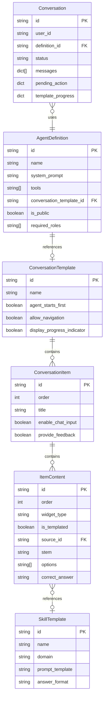
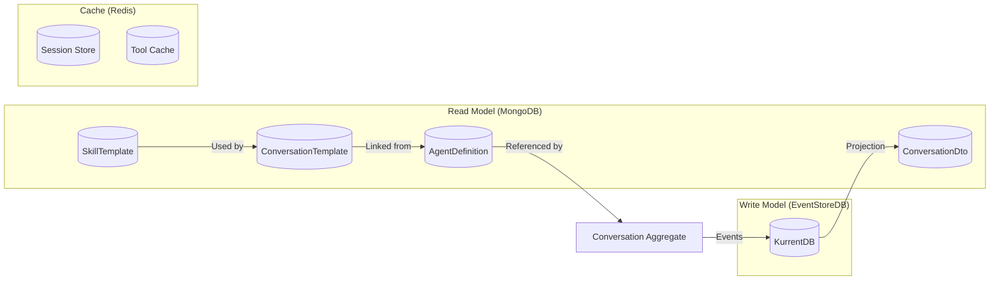
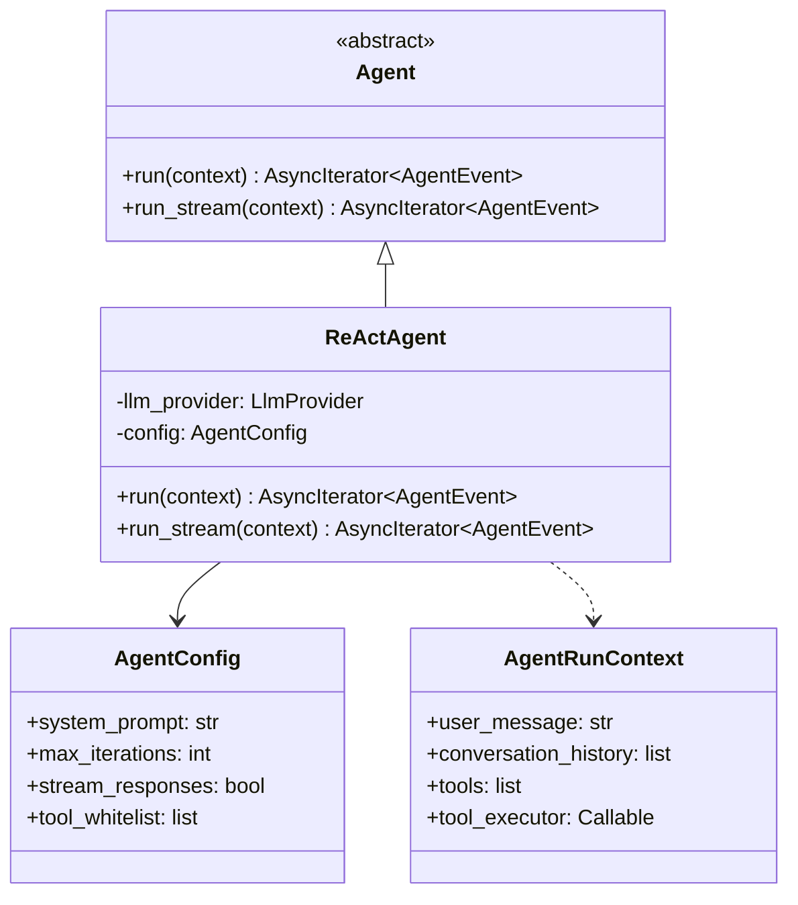

# Agent Host Architecture

**Version:** 2.0.0 (December 2025)
**Status:** Current Implementation

---

## 1. Overview

The **Agent Host** is a Backend-for-Frontend (BFF) service that provides a conversational AI interface for users. It implements:

- **CQRS with Event Sourcing** using the Neuroglia framework
- **Dual Authentication** (OAuth2 session cookies + JWT Bearer tokens)
- **LLM Integration** via pluggable providers (Ollama, OpenAI)
- **Tool Execution** through the MCP Tools Provider
- **Structured Conversations** via ConversationTemplates

!!! important "Single Aggregate Design"
    The **Conversation** is the only AggregateRoot in this architecture. All conversation state is managed and persisted through event sourcing, ensuring complete audit trails and the ability to replay state.

## 2. Entity Hierarchy



## 3. Storage Strategy

| Entity | Storage | Access Pattern |
|--------|---------|----------------|
| **Conversation** | EventStoreDB (Write) + MongoDB (Read) | Event-sourced aggregate with read projections |
| **AgentDefinition** | MongoDB | State-based configuration entity |
| **ConversationTemplate** | MongoDB | State-based configuration entity |
| **SkillTemplate** | MongoDB | State-based configuration entity |



## 4. Domain Model Details

### 4.1 Conversation (AggregateRoot)

The **Conversation** is the single aggregate root, managing all state through domain events:

```python
class ConversationStatus(str, Enum):
    """Lifecycle status of a conversation."""
    PENDING = "pending"           # Created but no messages yet
    ACTIVE = "active"             # Agent is processing
    AWAITING_USER = "awaiting_user"     # Waiting for text input
    AWAITING_WIDGET = "awaiting_widget" # Waiting for widget response
    PAUSED = "paused"             # User paused
    COMPLETED = "completed"       # Successfully finished
    TERMINATED = "terminated"     # Ended early
    ARCHIVED = "archived"         # Soft-deleted
```

**Domain Events:**

| Event | Trigger |
|-------|---------|
| `ConversationCreatedDomainEvent` | New conversation started |
| `MessageAddedDomainEvent` | User or assistant message added |
| `ToolCallAddedDomainEvent` | LLM requested tool execution |
| `ToolResultAddedDomainEvent` | Tool execution completed |
| `ClientActionRequestedDomainEvent` | Widget presented to user |
| `ClientResponseReceivedDomainEvent` | User responded to widget |
| `ItemGeneratedDomainEvent` | LLM generated templated content |
| `ItemAnsweredDomainEvent` | User answered templated item |
| `TemplateAdvancedDomainEvent` | Moved to next template item |
| `ConversationCompletedDomainEvent` | Conversation finished |

### 4.2 AgentDefinition (State-Based)

**AgentDefinition** is a configuration entity that defines agent behavior. It is **NOT** an aggregate - it uses standard MongoDB CRUD operations.

**Key Properties:**

| Property | Purpose |
|----------|---------|
| `system_prompt` | Instructions for the LLM |
| `tools` | List of MCP tool IDs the agent can use |
| `conversation_template_id` | Links to a ConversationTemplate for proactive behavior |
| `is_public` | Whether all authenticated users can access |
| `required_roles` | JWT roles required for access |

**Behavior Determination:**

```python
# Agents WITHOUT a template → Reactive (user speaks first)
# Agents WITH a template → Controlled by template.agent_starts_first
```

### 4.3 ConversationTemplate (State-Based)

Defines structured conversation flows for proactive agents:

```
ConversationTemplate
├── agent_starts_first: bool      # Who initiates
├── allow_navigation: bool        # Can user jump between items
├── display_progress_indicator    # Show progress bar
├── items: ConversationItem[]     # Ordered content steps
│   ├── ConversationItem
│   │   ├── enable_chat_input     # Can user type freely
│   │   ├── provide_feedback      # Give feedback after response
│   │   └── contents: ItemContent[]
│   │       ├── ItemContent
│   │       │   ├── widget_type   # message, multiple_choice, free_text
│   │       │   ├── is_templated  # Use SkillTemplate to generate
│   │       │   ├── stem          # Static question text
│   │       │   ├── options       # Static answer options
│   │       │   └── correct_answer # For grading (never sent to client)
```

### 4.4 SkillTemplate (State-Based)

Used for LLM-generated assessment content:

```python
@dataclass
class SkillTemplate:
    id: str
    name: str                    # "Two-digit Addition"
    domain: str                  # "mathematics"
    prompt_template: str         # LLM prompt to generate items
    answer_format: str           # "single_choice", "numeric", "text"
    evaluation_criteria: dict    # Rubric for grading
```

## 5. Application Layer

### 5.1 Agent Abstraction

The agent is implemented as a **stateless service**, not a domain entity:



### 5.2 ChatService

The **ChatService** orchestrates the conversation flow:

```python
class ChatService:
    """High-level orchestrator for conversations."""

    async def send_message(
        self,
        conversation: Conversation,
        user_message: str,
        access_token: str,
        model_id: str | None = None,
    ) -> AsyncIterator[dict[str, Any]]:
        """
        Flow:
        1. Add user message to conversation (event)
        2. If templated: record answer, advance, generate feedback
        3. Build AgentRunContext with history + tools
        4. Stream Agent events to client
        5. Persist messages to conversation (events)
        6. If templated and more items: emit next item
        """
```

## 6. API Layer

### 6.1 Chat Controller - Dual Transport

The Chat Controller supports **two streaming transports**:

| Transport | Endpoint | Use Case |
|-----------|----------|----------|
| **SSE** | `POST /api/chat/send` | Reactive chat, tool calling |
| **WebSocket** | `WS /api/chat/ws` | Proactive templates, bidirectional |

#### 6.1.1 SSE Endpoint (Reactive Chat)

**Endpoint:** `POST /api/chat/send`

**Request:**

```json
{
    "message": "User's text message",
    "conversation_id": "optional-uuid",
    "model_id": "optional:provider:model",
    "definition_id": "optional-agent-definition-id"
}
```

**Response:** Server-Sent Events (SSE) stream

| Event Type | Purpose |
|------------|---------|
| `stream_started` | Connection established, returns conversation_id |
| `content_chunk` | LLM-generated text token |
| `tool_call` | Tool execution started |
| `tool_result` | Tool execution completed |
| `client_action` | Widget data for user interaction |
| `template_progress` | Current position in template |
| `message_complete` | Full message assembled |
| `stream_complete` | Conversation turn complete |
| `error` | Error occurred |

#### 6.1.2 WebSocket Endpoint (Proactive Templates)

**Endpoint:** `WS /api/chat/ws`

**Query Parameters:**

| Parameter | Type | Description |
|-----------|------|-------------|
| `definition_id` | string | Agent definition ID for new templated conversation |
| `conversation_id` | string | Existing conversation ID to continue |

**Client → Server Messages:**

| Type | Payload | Purpose |
|------|---------|---------|
| `start` | `{}` | Start template flow |
| `message` | `{content: "..."}` | User message or widget response |
| `ping` | `{}` | Keepalive |

**Server → Client Messages:**

| Type | Payload | Purpose |
|------|---------|---------|
| `connected` | `{conversation_id, definition_id}` | Connection established |
| `content` | `{content: "..."}` | Streaming text |
| `widget` | `{widget_type, stem, options, ...}` | Widget to render |
| `progress` | `{current_item, total_items}` | Template progress |
| `complete` | `{}` | Template finished |
| `error` | `{message}` | Error |
| `pong` | `{}` | Keepalive response |

### 6.2 Authentication

The API supports **dual authentication**:

1. **Session Cookies** (OAuth2 BFF pattern) - for browser clients
2. **JWT Bearer Tokens** - for API clients

```python
# api/dependencies.py
async def get_current_user(
    request: Request,
    auth_service: AuthService = Depends(get_auth_service),
) -> dict[str, Any]:
    """Resolve user from session cookie OR Bearer token."""
    # 1. Try session cookie
    # 2. Fall back to Bearer token
    # 3. Return user info dict
```

For WebSocket connections, authentication is resolved via query parameters or session cookies:

```python
# api/dependencies.py
async def get_ws_current_user(websocket: WebSocket) -> dict[str, Any]:
    """Resolve user for WebSocket from session cookie or query token."""
```

## 7. Future Improvements

!!! note "Planned Enhancements"
