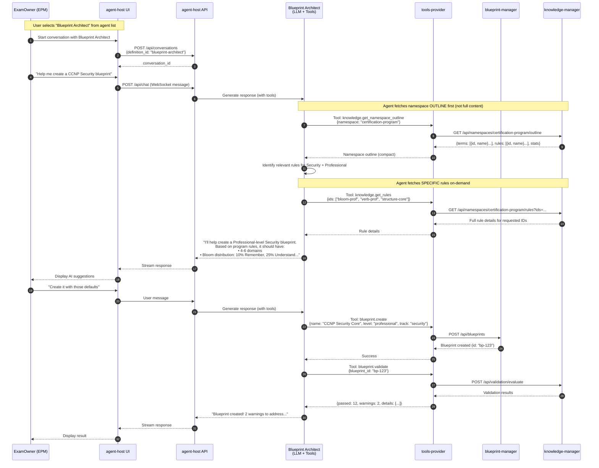
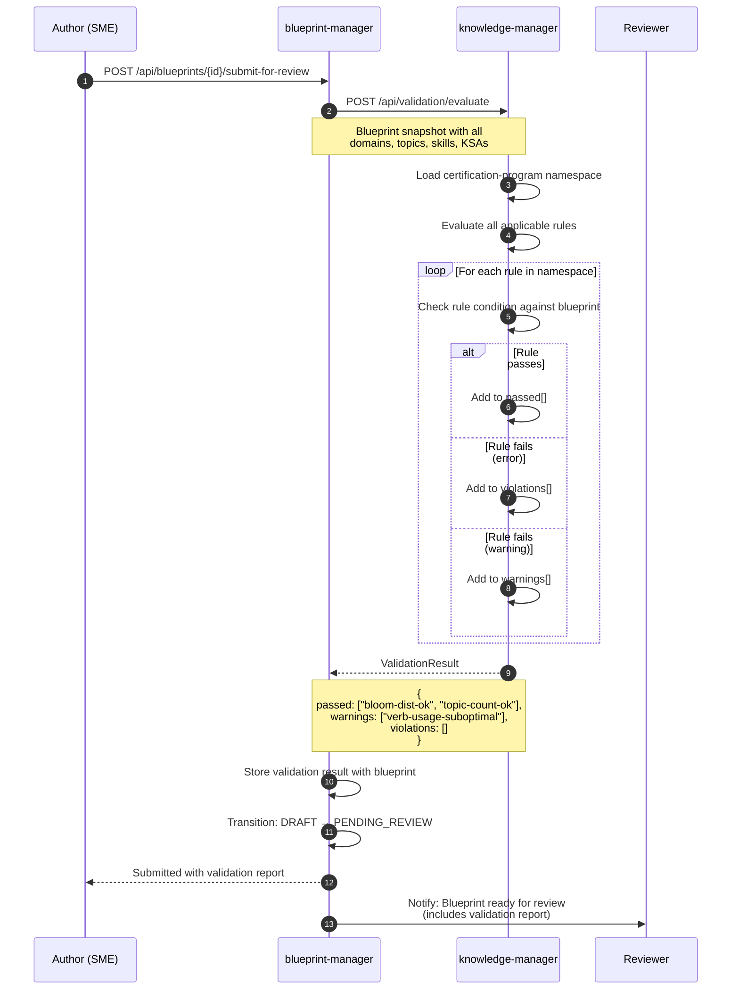
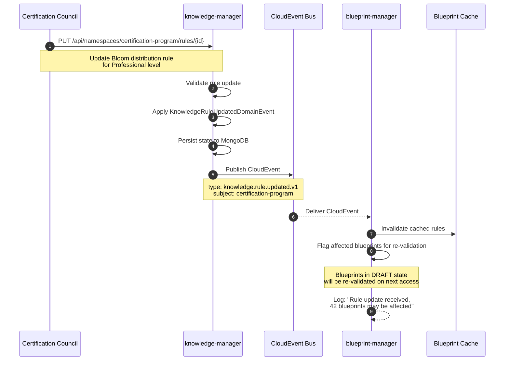
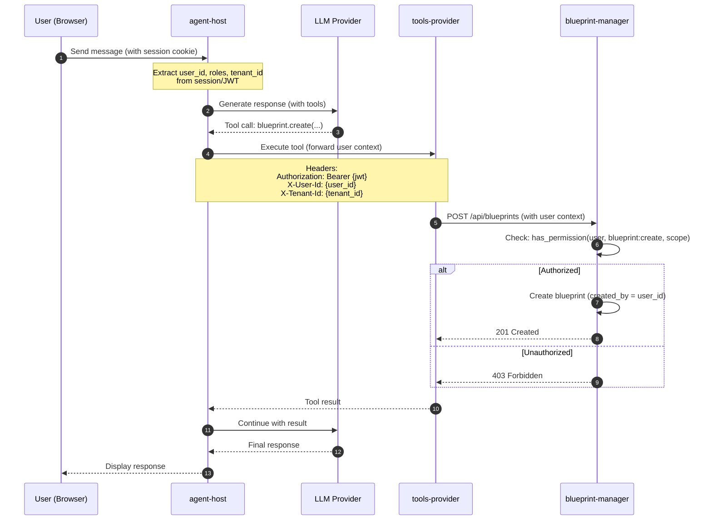

# AI-Driven Certification Domain: Vision and Integration Architecture

> **Status:** Approved Design
> **Version:** 1.0
> **Last Updated:** December 2025
> **Scope:** Blueprint-manager, knowledge-manager, agent-host integration

---

## Table of Contents

1. [Executive Vision](#1-executive-vision)
2. [Service Integration Architecture](#2-service-integration-architecture)
3. [knowledge-manager Deep Dive](#3-knowledge-manager-deep-dive)
   - [3.7 Vector and Graph Infrastructure (ASAP)](#37-vector-and-graph-infrastructure-asap)
   - [3.8 Hybrid Validation Strategy](#38-hybrid-validation-strategy)
   - [3.9 Semantic Groups](#39-semantic-groups)
4. [Data Flow and Event Choreography](#4-data-flow-and-event-choreography)
5. [RBAC and Multi-tenancy](#5-rbac-and-multi-tenancy)
6. [Related Documents](#6-related-documents)
7. [Future Improvements](#7-future-improvements)

---

## 1. Executive Vision

### 1.1 The Problem We're Solving

Certification programs face a fundamental challenge: **the gap between tribal knowledge and enforceable standards**. Today, "what makes CCNP harder than CCNA" exists as scattered opinions, inconsistent documentation, and implicit institutional memory. This leads to:

- **Inconsistent blueprints**: Authors interpret "Professional level" differently
- **Manual, error-prone validation**: No automated checks against program rules
- **Slow authoring cycles**: 2-4 weeks for review cycles due to lack of AI assistance
- **Knowledge silos**: SMEs rediscover domain knowledge each certification cycle
- **Audit scrambles**: ANSI/ISO 17024 compliance documentation created reactively

### 1.2 The AI-Driven Certification Ecosystem

We're building a **three-service ecosystem** where AI agents augment every actor's workflow:

```
┌─────────────────────────────────────────────────────────────────────────────────────┐
│                        AI-DRIVEN CERTIFICATION ECOSYSTEM                             │
│                                                                                      │
│  ┌────────────────────────────────────────────────────────────────────────────────┐ │
│  │                           KNOWLEDGE LAYER                                       │ │
│  │                                                                                 │ │
│  │   ┌─────────────────────────────────────────────────────────────────────────┐  │ │
│  │   │                      knowledge-manager                                   │  │ │
│  │   │                                                                         │  │ │
│  │   │   "What certification means" - the rules, vocabulary, constraints       │  │ │
│  │   │                                                                         │  │ │
│  │   │   ┌─────────────┐ ┌─────────────┐ ┌─────────────┐ ┌─────────────────┐  │  │ │
│  │   │   │   Terms     │ │   Rules     │ │Relationships│ │   Revisions     │  │  │ │
│  │   │   │ (Levels,    │ │ (Bloom dist,│ │ (prereqs,   │ │ (version        │  │  │ │
│  │   │   │  Tracks,    │ │  verb usage,│ │  verb→bloom,│ │  history,       │  │  │ │
│  │   │   │  Types)     │ │  structure) │ │  track→tech)│ │  rollback)      │  │  │ │
│  │   │   └─────────────┘ └─────────────┘ └─────────────┘ └─────────────────┘  │  │ │
│  │   │                                                                         │  │ │
│  │   │   Namespace: "certification-program"                                    │  │ │
│  │   │   Persistence: MongoDB via MotorRepository                              │  │ │
│  │   │   Changes: Quarterly (Council-controlled)                               │  │ │
│  │   └─────────────────────────────────────────────────────────────────────────┘  │ │
│  └────────────────────────────────────────────────────────────────────────────────┘ │
│                                         │                                            │
│                    CloudEvents (program structure changes)                           │
│                    Validation API (runtime rule evaluation)                          │
│                                         ▼                                            │
│  ┌────────────────────────────────────────────────────────────────────────────────┐ │
│  │                           CONTENT LAYER                                         │ │
│  │                                                                                 │ │
│  │   ┌─────────────────────────────────────────────────────────────────────────┐  │ │
│  │   │                       blueprint-manager                                  │  │ │
│  │   │                                                                         │  │ │
│  │   │   "What exams contain" - actively authored exam definitions             │  │ │
│  │   │                                                                         │  │ │
│  │   │   ┌──────────────────┐ ┌──────────────────┐ ┌──────────────────┐       │  │ │
│  │   │   │  ExamBlueprint   │ │  SkillTemplate   │ │     FormSpec     │       │  │ │
│  │   │   │  (Topics→Skills  │ │  (Reusable item  │ │  (Form structure,│       │  │ │
│  │   │   │   →KSAs, MQC)    │ │   guidance)      │ │   scoring)       │       │  │ │
│  │   │   └──────────────────┘ └──────────────────┘ └──────────────────┘       │  │ │
│  │   │                                                                         │  │ │
│  │   │   Persistence: MongoDB via MotorRepository                              │  │ │
│  │   │   Changes: Daily (Author-driven)                                        │  │ │
│  │   └─────────────────────────────────────────────────────────────────────────┘  │ │
│  └────────────────────────────────────────────────────────────────────────────────┘ │
│                                         │                                            │
│                    MCP Tools (agent access to blueprints/templates)                  │
│                    REST API (human and agent interactions)                           │
│                                         ▼                                            │
│  ┌────────────────────────────────────────────────────────────────────────────────┐ │
│  │                         INTERACTION LAYER                                       │ │
│  │                                                                                 │ │
│  │   ┌─────────────────────────────────────────────────────────────────────────┐  │ │
│  │   │                          agent-host                                      │  │ │
│  │   │                                                                         │  │ │
│  │   │   AI agents that augment human workflows                                │  │ │
│  │   │                                                                         │  │ │
│  │   │   ┌────────────────┐ ┌────────────────┐ ┌────────────────────────────┐ │  │ │
│  │   │   │ Conversations  │ │ Agent Defs     │ │ Conversation Templates     │ │  │ │
│  │   │   │ (User↔Agent)   │ │ (Capabilities) │ │ (Structured flows)         │ │  │ │
│  │   │   └────────────────┘ └────────────────┘ └────────────────────────────┘ │  │ │
│  │   │                                                                         │  │ │
│  │   │   Persistence: MongoDB via MotorRepository                              │  │ │
│  │   │   Real-time: WebSocket connections                                      │  │ │
│  │   └─────────────────────────────────────────────────────────────────────────┘  │ │
│  └────────────────────────────────────────────────────────────────────────────────┘ │
│                                                                                      │
└─────────────────────────────────────────────────────────────────────────────────────┘
```

### 1.3 Key Actors and AI Augmentation

| Actor | Role | AI Agent Assistance |
|-------|------|---------------------|
| **ExamOwner (EPM)** | Manages exam program, owns blueprints | Blueprint Architect: Suggests topic structures, validates coverage, ensures level-appropriate difficulty |
| **Author (SME)** | Creates exam content (items, tasks) | Item Writing Coach: Generates stems from templates, validates measurability, suggests distractors |
| **Reviewer** | Validates content quality | Review Assistant: Pre-screens for common issues, enforces standards, provides checklists |
| **Proctor** | Monitors exam delivery | (Future) Proctoring Support: Anomaly detection, accommodation guidance |
| **Candidate** | Takes certification exams | Feedback Coach: Post-exam coaching, personalized study plans, confidence building |
| **Analyst** | Analyzes psychometric data | Analytics Advisor: Pattern detection, item performance insights, reliability analysis |

### 1.4 Value Proposition

| Metric | Current State | Future State | Improvement |
|--------|---------------|--------------|-------------|
| Blueprint authoring time | 3-4 weeks | 1 week | 75% reduction |
| Review cycle duration | 2-4 weeks | 3-5 days | 80% reduction |
| Content consistency | Variable | Enforced by rules | Standardized |
| Candidate retake rate | 40% | 60%+ | 50% improvement |
| ANSI audit prep time | Days of scrambling | Real-time reports | Eliminated |

---

## 2. Service Integration Architecture

### 2.1 Service Responsibilities

```
┌─────────────────────────────────────────────────────────────────────────────────────┐
│                          SERVICE RESPONSIBILITY MATRIX                               │
│                                                                                      │
│  ┌───────────────────────┬───────────────────────────────────────────────────────┐  │
│  │ knowledge-manager     │ UPSTREAM - Defines the rules that govern certification │  │
│  │                       │                                                        │  │
│  │ Owns:                 │ Provides:                                              │  │
│  │ • certification-      │ • Validation queries (evaluate blueprint vs rules)    │  │
│  │   program namespace   │ • Term lookups (get level/track/type definitions)     │  │
│  │ • Terms, Rules,       │ • Rule retrieval (Bloom distributions, constraints)   │  │
│  │   Relationships       │ • CloudEvents on structure changes                    │  │
│  │ • Revision history    │                                                        │  │
│  └───────────────────────┴───────────────────────────────────────────────────────┘  │
│                                         │                                            │
│                                         │ CONFORMIST relationship                    │
│                                         │ (downstream conforms to upstream rules)    │
│                                         ▼                                            │
│  ┌───────────────────────┬───────────────────────────────────────────────────────┐  │
│  │ blueprint-manager     │ DOWNSTREAM - Applies the rules to exam content         │  │
│  │                       │                                                        │  │
│  │ Owns:                 │ Provides:                                              │  │
│  │ • ExamBlueprint       │ • Blueprint CRUD operations                            │  │
│  │ • SkillTemplate       │ • Workflow management (submit/approve/publish)         │  │
│  │ • FormSpec            │ • Template linking for skills                          │  │
│  │ • Lifecycle states    │ • Mosaic publishing integration                        │  │
│  └───────────────────────┴───────────────────────────────────────────────────────┘  │
│                                         │                                            │
│                                         │ Provides MCP tools + REST APIs             │
│                                         ▼                                            │
│  ┌───────────────────────┬───────────────────────────────────────────────────────┐  │
│  │ agent-host            │ CONSUMER - Uses both services via agents               │  │
│  │                       │                                                        │  │
│  │ Owns:                 │ Provides:                                              │  │
│  │ • Conversations       │ • WebSocket chat interface                             │  │
│  │ • AgentDefinitions    │ • Tool execution (MCP protocol)                        │  │
│  │ • Templates           │ • User authentication passthrough                      │  │
│  │ • Message history     │ • Multi-agent orchestration                            │  │
│  └───────────────────────┴───────────────────────────────────────────────────────┘  │
│                                                                                      │
└─────────────────────────────────────────────────────────────────────────────────────┘
```

### 2.2 Agent Selection Model

Before diving into sequence diagrams, we need to clarify **how users reach the right agent**. There are two primary patterns:

#### Pattern A: Direct Selection (Current Implementation)

Users explicitly choose an agent from a list. Each `AgentDefinition` is displayed in the UI, and starting a conversation requires selecting one:

```
┌─────────────────────────────────────────────────────────────────────────────────────┐
│                          DIRECT AGENT SELECTION                                      │
│                                                                                      │
│   User                         agent-host UI                    agent-host API       │
│    │                                │                                │               │
│    │  Browse available agents       │                                │               │
│    │───────────────────────────────►│                                │               │
│    │                                │  GET /api/definitions          │               │
│    │                                │───────────────────────────────►│               │
│    │                                │◄───────────────────────────────│               │
│    │                                │  [Blueprint Architect,         │               │
│    │  Display agent cards           │   Review Assistant,            │               │
│    │◄───────────────────────────────│   Feedback Coach, ...]         │               │
│    │                                │                                │               │
│    │  Click "Blueprint Architect"   │                                │               │
│    │───────────────────────────────►│                                │               │
│    │                                │  POST /api/conversations       │               │
│    │                                │  {definition_id: "blueprint-   │               │
│    │                                │   architect"}                  │               │
│    │                                │───────────────────────────────►│               │
│    │                                │                                │               │
│    │  Conversation started          │                                │               │
│    │◄───────────────────────────────│◄───────────────────────────────│               │
│    │                                │                                │               │
└─────────────────────────────────────────────────────────────────────────────────────┘
```

#### Pattern B: Concierge Agent (Future Enhancement)

A "Concierge" or "Gateway" agent that helps users discover the right specialist. This agent has tools to:

1. List available specialists and their capabilities
2. Understand user intent
3. **Handoff** to the appropriate agent (creates new conversation with context transfer)

```yaml
# Future: Concierge agent definition
agent_id: 'concierge'
name: 'Certification Assistant'
description: 'I help you find the right specialist for your task'

tools:
  - agents.list_available       # List specialists user can access
  - agents.get_capabilities     # Describe what each agent can do
  - agents.handoff              # Transfer to specialist (creates new conversation)

system_prompt: |
  You are a helpful concierge for the certification program.
  Help users understand what assistance is available and connect
  them with the right specialist.

  Available specialists:
  - Blueprint Architect: Creating and refining exam blueprints
  - Review Assistant: Reviewing exam content
  - Feedback Coach: Post-exam personalized coaching
  - Item Writing Coach: Writing quality exam items

  When the user's intent is clear, use agents.handoff to transfer
  them to the specialist. Include context about their goal.
```

**Handoff Tool Semantics:**

```python
# tools-provider: agents.handoff tool
class AgentHandoffTool:
    """
    Creates a new conversation with a target agent,
    transferring relevant context from the current conversation.

    Returns a deep link to the new conversation.
    """

    async def execute(
        self,
        target_agent_id: str,      # e.g., "blueprint-architect"
        context_summary: str,       # Concierge's summary of user intent
        user_info: dict,           # Forwarded from current session
    ) -> dict:
        # 1. Create new conversation with target agent
        # 2. Inject context_summary as initial system context
        # 3. Return URL/ID for client to navigate
        return {
            "conversation_id": new_conv_id,
            "agent_name": "Blueprint Architect",
            "url": f"/chat/{new_conv_id}",
            "message": "I've connected you with the Blueprint Architect..."
        }
```

> **Current Status:** Pattern A is implemented. Pattern B (Concierge + Handoff) is a future enhancement requiring the `agents.handoff` tool and UI support for conversation switching.

### 2.3 Sequence Diagram: Blueprint Creation with AI Assistance



### 2.3 Sequence Diagram: Validation Against knowledge-manager Rules



### 2.4 Sequence Diagram: Namespace Updates and Propagation



### 2.5 CloudEvent-Driven Integration Pattern

All three services follow the **State-Based Persistence with CloudEvent Publishing** pattern:

```python
# Pattern: State mutation + event publishing (NOT event-sourced persistence)
class ExamBlueprint(AggregateRoot[ExamBlueprintState, str]):
    def add_domain(self, domain: Domain) -> str:
        # 1. Validate business rules
        if domain.id in self.state.domains:
            raise DomainAlreadyExistsError(domain.id)

        # 2. Mutate state directly
        self.state.domains[domain.id] = domain.to_dict()
        self.state.updated_at = datetime.now(UTC)

        # 3. Register event (published as CloudEvent, NOT persisted)
        self.register_event(DomainAddedDomainEvent(
            aggregate_id=self.id(),
            domain_id=domain.id,
            domain_name=domain.name,
            created_at=datetime.now(UTC)
        ))

        return domain.id
```

**Key Points:**

- State is persisted to MongoDB via `MotorRepository`
- Events are published to CloudEvent bus for external consumers
- Events are NOT persisted to EventStoreDB (no event sourcing)
- This matches the pattern in `agent-host` and `knowledge-manager`

---

## 3. knowledge-manager Deep Dive

### 3.1 KnowledgeNamespace Aggregate Structure

The `KnowledgeNamespace` is the core aggregate in knowledge-manager, providing a flexible container for domain knowledge:

```python
# From: src/knowledge-manager/domain/entities/knowledge_namespace.py

class KnowledgeNamespaceState(AggregateState[str]):
    """Encapsulates the persisted state for the KnowledgeNamespace aggregate."""

    # Identity
    id: str                           # Namespace identifier (e.g., "certification-program")
    owner_tenant_id: str | None       # Tenant owner (None = global/shared)
    owner_user_id: str | None         # User who created this namespace

    # Display
    name: str                         # Human-readable name
    description: str                  # Markdown-supported description
    icon: str | None                  # Bootstrap icon class

    # Access Control
    access_level: str                 # "private" | "tenant" | "public"
    allowed_tenant_ids: list[str]     # Explicit tenant allow list

    # Versioning
    current_revision: int             # Current active revision number
    revisions: list[dict]             # Revision metadata history

    # Content (keyed by ID for O(1) lookup)
    terms: dict[str, dict]            # term_id -> KnowledgeTerm
    relationships: dict[str, dict]    # relationship_id -> KnowledgeRelationship
    rules: dict[str, dict]            # rule_id -> KnowledgeRule

    # Denormalized counts
    term_count: int
    relationship_count: int
    rule_count: int

    # Audit
    created_by: str | None
    created_at: datetime
    updated_at: datetime
    state_version: int                # Optimistic concurrency
```

### 3.2 Content Model: Terms, Rules, Relationships

```
┌─────────────────────────────────────────────────────────────────────────────────────┐
│                     KNOWLEDGENAMESPACE CONTENT MODEL                                 │
│                                                                                      │
│  ┌─────────────────────────────────────────────────────────────────────────────┐    │
│  │                              TERMS                                           │    │
│  │  Domain vocabulary with aliases and examples                                │    │
│  │                                                                              │    │
│  │  term_id: str           # Unique identifier                                  │    │
│  │  term: str              # Canonical name (e.g., "Professional")              │    │
│  │  definition: str        # Detailed explanation (Markdown)                    │    │
│  │  aliases: list[str]     # Alternative names ["CCNP", "Mid Level"]            │    │
│  │  examples: list[str]    # Usage examples                                     │    │
│  │  context_hint: str      # When to inject this term                           │    │
│  │  is_active: bool        # Soft delete flag                                   │    │
│  └─────────────────────────────────────────────────────────────────────────────┘    │
│                                         │                                            │
│                    Terms can be connected via Relationships                          │
│                                         ▼                                            │
│  ┌─────────────────────────────────────────────────────────────────────────────┐    │
│  │                           RELATIONSHIPS                                      │    │
│  │  Semantic connections between terms                                          │    │
│  │                                                                              │    │
│  │  relationship_id: str                                                        │    │
│  │  source_term_id: str    # From term                                          │    │
│  │  target_term_id: str    # To term                                            │    │
│  │  relationship_type: str # "prerequisite_for", "related_to", "uses_verb", etc.│    │
│  │  description: str       # Optional description                               │    │
│  │  bidirectional: bool    # If true, applies both ways                         │    │
│  │  weight: float          # For graph algorithms (default: 1.0)                │    │
│  │  is_active: bool        # Soft delete flag                                   │    │
│  │                                                                              │    │
│  │  Example: Associate --prerequisite_for--> Professional                       │    │
│  └─────────────────────────────────────────────────────────────────────────────┘    │
│                                         │                                            │
│                    Rules reference terms and define constraints                      │
│                                         ▼                                            │
│  ┌─────────────────────────────────────────────────────────────────────────────┐    │
│  │                              RULES                                           │    │
│  │  Business logic and constraints                                              │    │
│  │                                                                              │    │
│  │  rule_id: str                                                                │    │
│  │  name: str              # Human-readable name                                │    │
│  │  condition: str         # When to apply (e.g., "level == 'professional'")   │    │
│  │  rule_text: str         # The actual rule content (evaluated or displayed)   │    │
│  │  applies_to_term_ids: list[str]  # Related terms                             │    │
│  │  rule_type: str         # "constraint", "incentive", "procedure"             │    │
│  │  priority: int          # Evaluation order                                   │    │
│  │  is_active: bool        # Soft delete flag                                   │    │
│  │                                                                              │    │
│  │  Example:                                                                    │    │
│  │    name: "Professional Bloom Distribution"                                   │    │
│  │    condition: "blueprint.level == 'professional'"                            │    │
│  │    rule_text: "Bloom distribution must be: Remember 10%, Understand 25%,    │    │
│  │                Apply 35%, Analyze 25%, Evaluate 5%, Create 0%"              │    │
│  └─────────────────────────────────────────────────────────────────────────────┘    │
│                                                                                      │
└─────────────────────────────────────────────────────────────────────────────────────┘
```

### 3.3 Domain Events and CloudEvent Publishing

All state changes in `KnowledgeNamespace` emit domain events that are published as CloudEvents:

```python
# From: src/knowledge-manager/domain/events/knowledge_namespace.py

# Namespace-level events
@cloudevent("knowledge.namespace.created.v1")
class KnowledgeNamespaceCreatedDomainEvent(DomainEvent): ...

@cloudevent("knowledge.namespace.updated.v1")
class KnowledgeNamespaceUpdatedDomainEvent(DomainEvent): ...

@cloudevent("knowledge.namespace.deleted.v1")
class KnowledgeNamespaceDeletedDomainEvent(DomainEvent): ...

# Term events
@cloudevent("knowledge.term.added.v1")
class KnowledgeTermAddedDomainEvent(DomainEvent): ...

@cloudevent("knowledge.term.updated.v1")
class KnowledgeTermUpdatedDomainEvent(DomainEvent): ...

@cloudevent("knowledge.term.removed.v1")
class KnowledgeTermRemovedDomainEvent(DomainEvent): ...

# Relationship events
@cloudevent("knowledge.relationship.added.v1")
class KnowledgeRelationshipAddedDomainEvent(DomainEvent): ...

@cloudevent("knowledge.relationship.removed.v1")
class KnowledgeRelationshipRemovedDomainEvent(DomainEvent): ...

# Rule events
@cloudevent("knowledge.rule.added.v1")
class KnowledgeRuleAddedDomainEvent(DomainEvent): ...

@cloudevent("knowledge.rule.updated.v1")
class KnowledgeRuleUpdatedDomainEvent(DomainEvent): ...

@cloudevent("knowledge.rule.removed.v1")
class KnowledgeRuleRemovedDomainEvent(DomainEvent): ...

# Revision events
@cloudevent("knowledge.revision.created.v1")
class KnowledgeRevisionCreatedDomainEvent(DomainEvent): ...

@cloudevent("knowledge.revision.rolledback.v1")
class KnowledgeRevisionRolledBackDomainEvent(DomainEvent): ...
```

### 3.4 The "certification-program" Namespace Schema

The `certification-program` namespace contains the reference data that defines "what certification means":

| Category | Terms | Purpose |
|----------|-------|---------|
| **Certification Levels** | Associate, Professional, Expert | Define difficulty tiers |
| **Certification Types** | Core, Concentration, Specialist | Define exam role in program |
| **Certification Tracks** | Enterprise, Security, DevNet, Collaboration, Service Provider, Data Center | Define technology domains |
| **Bloom's Taxonomy** | Remember, Understand, Apply, Analyze, Evaluate, Create | Define cognitive levels |

| Category | Rules (examples) | Purpose |
|----------|------------------|---------|
| **Bloom Distribution** | "Professional level: 10% Remember, 25% Understand, 35% Apply, 25% Analyze, 5% Evaluate" | Enforce cognitive complexity |
| **Verb Usage** | "Expert level prohibits: identify, list, describe (too simple)" | Ensure level-appropriate language |
| **Structure Constraints** | "Core exam must have 4-8 domains" | Enforce blueprint structure |
| **Naming Conventions** | "Skill statements must start with action verb" | Standardize content |

| Category | Relationships (examples) | Purpose |
|----------|--------------------------|---------|
| **Level Prerequisites** | Associate → Professional → Expert | Define progression path |
| **Track Technologies** | Enterprise → [routing, switching, wireless, SD-WAN] | Map technologies to tracks |
| **Bloom → Verb** | Apply → [configure, implement, deploy] | Map taxonomy to action verbs |

See: [03-namespace-seed-data.md](03-namespace-seed-data.md) for complete seed data.

### 3.5 Persistence Configuration

```python
# From: src/knowledge-manager/main.py

MotorRepository.configure(
    builder,
    entity_type=KnowledgeNamespace,
    key_type=str,
    database_name=app_settings.database_name,
    collection_name="namespaces",
    domain_repository_type=KnowledgeNamespaceRepository,
    implementation_type=MotorKnowledgeNamespaceRepository,
)
```

### 3.6 Namespace Access Patterns: Context Window Management

A key architectural concern is **how agents access namespace content without exceeding LLM context windows**. The `certification-program` namespace may contain 50+ terms, 20+ rules, and 30+ relationships—too much to load into every agent conversation.

#### The Problem

```
┌─────────────────────────────────────────────────────────────────────────────────────┐
│                         CONTEXT WINDOW CONSTRAINTS                                   │
│                                                                                      │
│   Naive Approach:                                                                    │
│   ─────────────────                                                                  │
│   Agent starts conversation → Load ENTIRE namespace → Inject into system prompt     │
│                                                                                      │
│   Problems:                                                                          │
│   • ~50 terms × 200 tokens each = 10,000 tokens                                     │
│   • ~20 rules × 300 tokens each = 6,000 tokens                                      │
│   • ~30 relationships × 50 tokens = 1,500 tokens                                    │
│   • Total: ~17,500 tokens BEFORE conversation starts                                │
│                                                                                      │
│   Impact:                                                                            │
│   • Less room for conversation history                                               │
│   • Higher latency (more tokens to process)                                          │
│   • Higher cost (per-token pricing)                                                  │
│   • Most content is irrelevant to current task                                       │
│                                                                                      │
└─────────────────────────────────────────────────────────────────────────────────────┘
```

#### Solution: Hierarchical On-Demand Loading

The knowledge-manager API provides **three levels of detail** for namespace access:

| Endpoint | Returns | Token Cost | Use Case |
|----------|---------|------------|----------|
| `/outline` | Names, IDs, counts only | ~500 tokens | Agent orientation, tool selection |
| `/summary` | Names, IDs, brief descriptions | ~2,000 tokens | Task scoping, entity discovery |
| `/full` or `/items?ids=` | Complete details | Variable | Specific rule evaluation, validation |

```
┌─────────────────────────────────────────────────────────────────────────────────────┐
│                       HIERARCHICAL NAMESPACE ACCESS                                  │
│                                                                                      │
│   Level 1: OUTLINE (~500 tokens)                                                     │
│   ─────────────────────────────────                                                  │
│   GET /api/namespaces/certification-program/outline                                  │
│                                                                                      │
│   {                                                                                  │
│     "id": "certification-program",                                                   │
│     "name": "Certification Program Structure",                                       │
│     "term_count": 16, "rule_count": 14, "relationship_count": 20,                   │
│     "term_categories": ["levels", "types", "tracks", "bloom"],                       │
│     "terms": [                                                                       │
│       {"id": "level-associate", "name": "Associate"},                               │
│       {"id": "level-professional", "name": "Professional"},                         │
│       {"id": "bloom-analyze", "name": "Analyze"},                                   │
│       ...                                                                            │
│     ],                                                                               │
│     "rules": [                                                                       │
│       {"id": "bloom-prof", "name": "Professional Bloom Distribution"},              │
│       {"id": "verb-prof", "name": "Professional Verb Usage"},                       │
│       ...                                                                            │
│     ]                                                                                │
│   }                                                                                  │
│                                                                                      │
│   Level 2: TARGETED FETCH (~300-500 tokens per item)                                │
│   ────────────────────────────────────────────────────                               │
│   GET /api/namespaces/certification-program/rules?ids=bloom-prof,verb-prof          │
│                                                                                      │
│   [                                                                                  │
│     {                                                                                │
│       "id": "bloom-prof",                                                            │
│       "name": "Professional Bloom Distribution",                                     │
│       "condition": "blueprint.level == 'professional'",                              │
│       "rule_text": "Bloom distribution must be: Remember 10%, Understand 25%...",   │
│       "applies_to_term_ids": ["level-professional"]                                  │
│     },                                                                               │
│     ...                                                                              │
│   ]                                                                                  │
│                                                                                      │
└─────────────────────────────────────────────────────────────────────────────────────┘
```

#### Agent Tool Design for Efficient Access

The MCP tools for knowledge-manager should encourage efficient access patterns:

```yaml
# tools-provider: Knowledge namespace tools
tools:
  # 1. Start with outline - agent learns what's available
  knowledge.get_namespace_outline:
    description: |
      Get a compact overview of a namespace including term names, rule names,
      and category summaries. Use this FIRST to understand what's available
      before fetching specific details.
    parameters:
      namespace_id: string
    returns:
      id, name, description, term_count, rule_count,
      terms: [{id, name}], rules: [{id, name}]

  # 2. Fetch specific items by ID
  knowledge.get_terms:
    description: |
      Get full details for specific terms by ID. Use after consulting
      the outline to fetch only what you need.
    parameters:
      namespace_id: string
      term_ids: array[string]  # Specific IDs to fetch
    returns:
      Full term objects with definitions, examples, aliases

  knowledge.get_rules:
    description: |
      Get full details for specific rules by ID.
    parameters:
      namespace_id: string
      rule_ids: array[string]
    returns:
      Full rule objects with conditions and rule text

  # 3. Semantic search when ID is unknown
  knowledge.search_terms:
    description: |
      Search for terms by keyword or concept when you don't know the exact ID.
    parameters:
      namespace_id: string
      query: string
      limit: integer (default: 5)
    returns:
      Matching terms with relevance scores
```

#### Agent System Prompt Guidance

```yaml
# Blueprint Architect agent definition
system_prompt: |
  You are an expert psychometrician assisting with certification exam blueprints.

  ## Knowledge Access Pattern

  The certification-program namespace contains the rules and vocabulary for
  certification programs. Access it efficiently:

  1. **First**: Use `knowledge.get_namespace_outline` to see available terms and rules
  2. **Then**: Use `knowledge.get_rules` or `knowledge.get_terms` to fetch ONLY
     the specific items you need for the current task
  3. **Avoid**: Fetching the entire namespace - it wastes context window

  Example workflow:
  - User asks about Professional level blueprint
  - Fetch outline → identify rule IDs for "professional" level
  - Fetch specific rules: bloom-prof, verb-prof, structure-core
  - Apply those rules to the task

  ...
```

#### Implementation Checklist

- [ ] Add `/outline` endpoint to knowledge-manager API
- [ ] Add `/terms?ids=` filtered endpoint
- [ ] Add `/rules?ids=` filtered endpoint
- [ ] Create MCP tools in tools-provider with efficient patterns
- [ ] Update agent system prompts with access guidance
- [ ] Add caching for frequently-accessed outlines (Redis, 5-min TTL)

### 3.7 Vector and Graph Infrastructure (ASAP)

> **Status**: Infrastructure scaffolds exist; integration is **critical path** for MVP.

Vector and Graph capabilities are **not future enhancements**—they are required for core use-cases. The clients already exist as scaffolds in `infrastructure/clients/`:

| Component | File | Status |
|-----------|------|--------|
| `Neo4jClient` | `neo4j_client.py` | Scaffold (Phase 2 label) |
| `QdrantVectorClient` | `qdrant_client.py` | Scaffold (Phase 3 label) |
| `EmbeddingProvider` | TBD | Not yet implemented |

**Docker Compose**: Neo4j and Qdrant services are already running.

**EmbeddingProvider Abstraction**: Following the same pattern as `LLMProvider` in agent-host, we need an `EmbeddingProvider` protocol that supports both:

- **Remote providers**: OpenAI, Cohere, Azure OpenAI
- **Local providers**: Sentence-Transformers, Ollama embeddings, local ONNX models

This ensures flexibility to choose cost vs. latency tradeoffs per deployment.

#### Critical Use-Cases Requiring Vector/Graph

| Use-Case | Store | Query Pattern |
|----------|-------|---------------|
| **Find semantically similar terms** | Qdrant | Embed user query → k-NN search on term embeddings |
| **Find related constraints** | Neo4j | Given term X → traverse `APPLIES_TO` edges → return rules |
| **Find prerequisites** | Neo4j | Given skill Y → traverse `PREREQUISITE_FOR` edges → ordered list |
| **Find dependencies** | Neo4j | Given term Z → traverse `DEPENDS_ON` edges → dependency tree |
| **Detect circular dependencies** | Neo4j | Cycle detection in prerequisite graph |
| **Semantic group discovery** | Qdrant + Neo4j | Cluster embeddings + community detection |

#### Event-Driven Sync with Rate-Limiting

To avoid explosive side-effects when processing external CloudEvents:

```
┌─────────────────────────────────────────────────────────────────────────────────────┐
│                    EVENT-DRIVEN VECTOR/GRAPH SYNC                                    │
│                                                                                      │
│  CloudEvent                  Queue (Redis)                  Sync Worker              │
│      │                            │                              │                   │
│  knowledge.term.added.v1          │                              │                   │
│      │────────────────────────────►                              │                   │
│      │                       enqueue                             │                   │
│      │                            │                              │                   │
│      │                            │    rate-limited dequeue      │                   │
│      │                            │    (10 events/sec max)       │                   │
│      │                            │─────────────────────────────►│                   │
│      │                            │                              │                   │
│      │                            │                              │  1. Generate      │
│      │                            │                              │     embedding     │
│      │                            │                              │                   │
│      │                            │                              │  2. Upsert to     │
│      │                            │                              │     Qdrant        │
│      │                            │                              │                   │
│      │                            │                              │  3. Create Neo4j  │
│      │                            │                              │     node          │
│      │                            │                              │                   │
│      │                            │                              │  4. Create edges  │
│      │                            │                              │     from          │
│      │                            │                              │     relationships │
│      │                            │                              │                   │
└─────────────────────────────────────────────────────────────────────────────────────┘
```

**Rate-Limiting Strategy:**

| Concern | Mitigation |
|---------|------------|
| **Burst of term additions** | Redis queue with configurable rate limit (default: 10/sec) |
| **Embedding API costs** | Batch embeddings (up to 100 terms per API call) |
| **Neo4j write throughput** | Batch Cypher transactions (10-50 nodes per transaction) |
| **Failure recovery** | Dead-letter queue with manual retry endpoint |

#### Implementation Checklist

- [ ] Wire `Neo4jClient` and `QdrantVectorClient` in `main.py` lifespan
- [ ] Create `EmbeddingProvider` protocol with OpenAI implementation
- [ ] Create event handlers for `knowledge.term.added.v1` → Qdrant + Neo4j sync
- [ ] Create event handlers for `knowledge.relationship.added.v1` → Neo4j edge sync
- [ ] Add Redis queue for rate-limited processing
- [ ] Add `/search/semantic` endpoint (Qdrant k-NN)
- [ ] Add `/graph/related` endpoint (Neo4j traversal)
- [ ] Add health checks for Qdrant and Neo4j connectivity

### 3.8 Hybrid Validation Strategy

knowledge-manager provides **hybrid validation** combining programmatic rules (Neuroglia BusinessRule) and LLM-mediated evaluation (via agent-host delegation).

#### Validation Architecture

```
┌─────────────────────────────────────────────────────────────────────────────────────┐
│                         HYBRID VALIDATION ARCHITECTURE                               │
│                                                                                      │
│  ┌─────────────────────────────────────────────────────────────────────────────┐    │
│  │                        VALIDATION REQUEST                                    │    │
│  │                                                                              │    │
│  │   POST /api/validation/evaluate                                              │    │
│  │   {                                                                          │    │
│  │     "input": { ... any structured input ... },                               │    │
│  │     "context": { "namespace_id": "certification-program" }                   │    │
│  │   }                                                                          │    │
│  └─────────────────────────────────────────────────────────────────────────────┘    │
│                                         │                                            │
│                                         ▼                                            │
│  ┌─────────────────────────────────────────────────────────────────────────────┐    │
│  │                     1. TERM DETECTION                                        │    │
│  │                                                                              │    │
│  │   - Extract text fields from input                                           │    │
│  │   - Match against namespace terms (exact + semantic)                         │    │
│  │   - Identify applicable rules via term_id links                              │    │
│  │                                                                              │    │
│  │   Matched Terms: ["ExamBlueprint", "Professional Level", "Bloom's Taxonomy"] │    │
│  │   Applicable Rules: ["bloom-prof", "verb-prof", "structure-core"]            │    │
│  └─────────────────────────────────────────────────────────────────────────────┘    │
│                                         │                                            │
│                     ┌───────────────────┼───────────────────┐                        │
│                     ▼                                       ▼                        │
│  ┌────────────────────────────────┐        ┌────────────────────────────────────┐   │
│  │  2A. PROGRAMMATIC VALIDATION   │        │  2B. LLM-MEDIATED VALIDATION       │   │
│  │                                │        │                                    │   │
│  │  Rules with structured logic:  │        │  Rules requiring interpretation:   │   │
│  │  - PropertyRule                │        │  - "KSA must be measurable"        │   │
│  │  - ConditionalRule             │        │  - "Avoid culturally biased content"│   │
│  │  - CompositeRule               │        │  - "Distractor must be plausible"  │   │
│  │                                │        │                                    │   │
│  │  Evaluated via:                │        │  Evaluated via:                    │   │
│  │  BusinessRuleValidator         │        │  Agent delegation (private)        │   │
│  │                                │        │                                    │   │
│  │  Result: bool + violations     │        │  Result: score + reasoning         │   │
│  └────────────────────────────────┘        └────────────────────────────────────┘   │
│                     │                                       │                        │
│                     └───────────────────┬───────────────────┘                        │
│                                         ▼                                            │
│  ┌─────────────────────────────────────────────────────────────────────────────┐    │
│  │                     3. AGGREGATED RESULT                                     │    │
│  │                                                                              │    │
│  │   {                                                                          │    │
│  │     "is_valid": false,                                                       │    │
│  │     "programmatic_violations": [                                             │    │
│  │       { "rule": "bloom-prof", "message": "Missing Apply-level KSAs" }        │    │
│  │     ],                                                                       │    │
│  │     "llm_evaluations": [                                                     │    │
│  │       { "rule": "ksa-measurable", "score": 0.7,                              │    │
│  │         "reasoning": "KSA uses 'understand' - consider action verb" }        │    │
│  │     ],                                                                       │    │
│  │     "suggestions": [ ... ]                                                   │    │
│  │   }                                                                          │    │
│  └─────────────────────────────────────────────────────────────────────────────┘    │
└─────────────────────────────────────────────────────────────────────────────────────┘
```

#### Programmatic Validation with Neuroglia BusinessRule

Leverages `neuroglia.validation.business_rules` for structured, deterministic rules:

```python
from neuroglia.validation.business_rules import (
    BusinessRule, PropertyRule, ConditionalRule, CompositeRule,
    BusinessRuleValidator, ValidationResult
)

# Example: Validate ExamBlueprint structure
blueprint_rules = [
    PropertyRule(
        name="min-sections",
        property_getter=lambda bp: len(bp.get("sections", [])),
        predicate=lambda count: count >= 3,
        field_name="sections",
        message="ExamBlueprint must have at least 3 sections"
    ),
    ConditionalRule(
        name="professional-bloom-dist",
        condition=lambda bp: bp.get("level") == "Professional",
        rule=PropertyRule(
            name="bloom-distribution",
            property_getter=lambda bp: bp.get("bloom_distribution", {}),
            predicate=lambda dist: dist.get("Apply", 0) >= 0.35,
            message="Professional blueprints require ≥35% Apply-level KSAs"
        ),
        condition_description="when blueprint is Professional level"
    ),
]

# Validate input
validator = BusinessRuleValidator(blueprint_rules)
result: ValidationResult = validator.validate(blueprint_data)
```

#### LLM-Mediated Validation via Agent Delegation

For rules requiring interpretation, knowledge-manager delegates to a **statically assigned agent** in agent-host:

```
┌─────────────────────────────────────────────────────────────────────────────────────┐
│                    AGENT DELEGATION FOR LLM VALIDATION                               │
│                                                                                      │
│  knowledge-manager                      agent-host                                   │
│        │                                     │                                       │
│        │  POST /api/internal/evaluate        │                                       │
│        │  {                                  │                                       │
│        │    "agent_id": "validation-agent",  │    ← Statically configured           │
│        │    "input": { ... },                │                                       │
│        │    "rules": [                       │                                       │
│        │      { "id": "ksa-measurable",      │                                       │
│        │        "rule_text": "..." }         │                                       │
│        │    ],                               │                                       │
│        │    "private": true                  │    ← Not displayed to end-user       │
│        │  }                                  │                                       │
│        │─────────────────────────────────────►                                       │
│        │                                     │                                       │
│        │                                     │  1. Create private Conversation      │
│        │                                     │  2. Inject rules as system context   │
│        │                                     │  3. Invoke LLM with structured       │
│        │                                     │     output schema                    │
│        │                                     │  4. Return evaluation result         │
│        │                                     │                                       │
│        │  {                                  │                                       │
│        │    "evaluations": [                 │                                       │
│        │      { "rule_id": "ksa-measurable", │                                       │
│        │        "satisfied": false,          │                                       │
│        │        "score": 0.7,                │                                       │
│        │        "reasoning": "..." }         │                                       │
│        │    ]                                │                                       │
│        │  }                                  │                                       │
│        │◄─────────────────────────────────────                                       │
│        │                                     │                                       │
└─────────────────────────────────────────────────────────────────────────────────────┘
```

**Key Design Decisions:**

| Decision | Rationale |
|----------|-----------|
| **knowledge-manager does NOT have LLM integration** | Clean separation of concerns; LLM logic lives in agent-host |
| **Private conversation** | Validation is internal; not shown to end-user |
| **Statically assigned agent** | `validation-agent` is preconfigured with evaluation capabilities |
| **Structured output schema** | LLM returns JSON matching `EvaluationResult` schema |

#### Rule Type Classification

| Rule Type | Evaluation Method | Example |
|-----------|-------------------|---------|
| **Constraint (Structural)** | BusinessRule (programmatic) | "Blueprint must have ≥3 sections" |
| **Constraint (Semantic)** | LLM-mediated | "KSA must be objectively measurable" |
| **Incentive** | LLM-mediated | "Prefer scenario-based stems for Apply-level" |
| **Procedure** | Both | "Run bias check before submission" |

#### Implementation Checklist

- [ ] Create `application/services/validation_service.py` with hybrid evaluation
- [ ] Define `ValidationRequest` and `ValidationResult` DTOs
- [ ] Add `/api/validation/evaluate` endpoint
- [ ] Create `validation-agent` AgentDefinition in agent-host
- [ ] Add internal API endpoint in agent-host for private evaluation
- [ ] Map `KnowledgeRule.rule_type` to evaluation strategy
- [ ] Add term detection (exact match + semantic via Qdrant)

### 3.9 Semantic Groups

Semantic groups organize terms into smaller, cohesive units for efficient retrieval and context management.

#### Design Principles

| Principle | Description |
|-----------|-------------|
| **Separate from Namespace** | Groups are an orthogonal organization; namespaces remain the primary container |
| **Single-level scoping** | A group is either namespace-level OR cross-namespace, not both |
| **Smaller than namespace** | Designed for focused retrieval (~10-50 terms per group) |
| **User-defined first** | Manual curation initially; auto-generation as future enhancement |

#### Semantic Group Structure

```python
@dataclass
class SemanticGroup:
    """A cohesive grouping of related terms for efficient retrieval."""

    id: str
    """Unique identifier (UUID or slug)."""

    name: str
    """Human-readable name (e.g., 'Item Response Theory')."""

    description: str
    """Purpose and scope of this group."""

    scope: GroupScope
    """NAMESPACE_LOCAL or CROSS_NAMESPACE."""

    # For NAMESPACE_LOCAL scope
    namespace_id: str | None
    """Parent namespace (required if scope is NAMESPACE_LOCAL)."""

    # For CROSS_NAMESPACE scope
    source_namespaces: list[str]
    """Namespaces from which terms are drawn (required if CROSS_NAMESPACE)."""

    term_ids: list[str]
    """Terms belonging to this group."""

    # Metadata
    created_by: str
    created_at: datetime
    is_auto_generated: bool = False
    """True if created by clustering algorithm."""


class GroupScope(str, Enum):
    NAMESPACE_LOCAL = "namespace_local"  # All terms from single namespace
    CROSS_NAMESPACE = "cross_namespace"  # Terms span multiple namespaces
```

#### Use Cases for Semantic Groups

| Use Case | Group Scope | Example |
|----------|-------------|---------|
| **Focused context injection** | Namespace-local | "Psychometrics → IRT" group for CAT discussions |
| **Cross-domain concepts** | Cross-namespace | "Security Fundamentals" spanning networking + cloud namespaces |
| **UI organization** | Namespace-local | Collapsible sections in namespace browser |
| **Tiered retrieval** | Either | Load group outline → fetch specific terms |

#### API Endpoints

```
GET  /api/groups                          # List all groups (paginated)
GET  /api/groups/{group_id}               # Get group with term IDs
GET  /api/groups/{group_id}/terms         # Get full term details
POST /api/groups                          # Create group (user-defined)
PUT  /api/groups/{group_id}               # Update group
DELETE /api/groups/{group_id}             # Delete group

# Namespace-scoped
GET  /api/namespaces/{ns_id}/groups       # Groups within namespace
```

#### Future: Auto-Generated Groups

When knowledge-manager can delegate to agents:

1. **Embedding-based clustering**: Group terms with high cosine similarity
2. **Graph community detection**: Neo4j Louvain algorithm on relationship graph
3. **Agent-proposed groupings**: LLM suggests logical groupings based on term definitions

---

## 4. Data Flow and Event Choreography

### 4.1 Data Ownership Matrix

| Data | Owning Service | Persistence | Consumers |
|------|----------------|-------------|-----------|
| **Program Structure** (Levels, Tracks, Types, Rules) | knowledge-manager | MongoDB | blueprint-manager (validation), agent-host (context) |
| **ExamBlueprint** (Topics, Skills, KSAs) | blueprint-manager | MongoDB | agent-host (MCP tools), Mosaic (publish) |
| **SkillTemplate** (Stem patterns, distractors) | blueprint-manager | MongoDB | agent-host (item writing), blueprint-manager (linking) |
| **FormSpec** (Form structure, scoring) | blueprint-manager | MongoDB | Mosaic (form assembly) |
| **Conversation** (Messages, tool calls) | agent-host | MongoDB | Users (chat UI) |
| **AgentDefinition** (Capabilities, tools) | agent-host | MongoDB | agent-host (runtime) |

> **Note on Mosaic Integration**: Mosaic is accessed via **tools-provider** which already supports registering Mosaic as an upstream OpenAPI source. Agents invoke Mosaic operations through MCP tools exposed by tools-provider, not direct API calls.

### 4.2 Event Catalog

#### From knowledge-manager

| Event Type | Trigger | Consumers | Consumer Action |
|------------|---------|-----------|-----------------|
| `knowledge.namespace.created.v1` | New namespace created | (none currently) | - |
| `knowledge.term.added.v1` | New term added | blueprint-manager | Update term dropdowns |
| `knowledge.term.updated.v1` | Term definition changed | blueprint-manager | Invalidate cached terms |
| `knowledge.rule.added.v1` | New validation rule | blueprint-manager | Add to rule evaluation |
| `knowledge.rule.updated.v1` | Rule constraint changed | blueprint-manager | Invalidate cached rules, flag blueprints |
| `knowledge.relationship.added.v1` | New term relationship | blueprint-manager | Update relationship graph |

#### From blueprint-manager

| Event Type | Trigger | Consumers | Consumer Action |
|------------|---------|-----------|-----------------|
| `blueprint.created.v1` | New blueprint created | knowledge-manager | Update knowledge graph (optional) |
| `blueprint.submitted.v1` | Blueprint submitted for review | Notification service | Alert reviewers |
| `blueprint.approved.v1` | Blueprint approved | Mosaic | Prepare for item authoring |
| `blueprint.published.v1` | Blueprint published | Mosaic, knowledge-manager | Sync to content system |
| `skill_template.created.v1` | New template created | (observability) | - |
| `skill_template.linked.v1` | Template linked to skill | (observability) | - |

#### From agent-host

| Event Type | Trigger | Consumers | Consumer Action |
|------------|---------|-----------|-----------------|
| `conversation.started.v1` | User begins conversation | Analytics | Track engagement |
| `conversation.completed.v1` | Conversation ends | Analytics | Compute metrics |
| `tool.called.v1` | Agent invokes MCP tool | Observability | Log tool usage |

### 4.3 Event Flow: blueprint-manager Reacts to knowledge-manager Changes

```
┌─────────────────────────────────────────────────────────────────────────────────────┐
│                    EVENT-DRIVEN RULE PROPAGATION                                     │
│                                                                                      │
│  SCENARIO: Council updates the Professional level Bloom distribution rule           │
│                                                                                      │
│  ┌─────────────────────────────────────────────────────────────────────────────┐    │
│  │ 1. MUTATION                                                                  │    │
│  │                                                                              │    │
│  │    Council Member                       knowledge-manager                    │    │
│  │         │                                     │                              │    │
│  │         │  PUT /api/namespaces/certification-program/rules/bloom-prof       │    │
│  │         │  { "rule_text": "Remember 8%, Understand 27%, Apply 35%, ..." }   │    │
│  │         │─────────────────────────────────────►│                              │    │
│  │         │                                     │                              │    │
│  │         │                                     │  1a. Validate rule format    │    │
│  │         │                                     │  1b. Apply event to state    │    │
│  │         │                                     │  1c. Persist to MongoDB      │    │
│  │         │                                     │  1d. Publish CloudEvent      │    │
│  │         │                                     │                              │    │
│  └─────────────────────────────────────────────────────────────────────────────┘    │
│                                         │                                            │
│                                         │ CloudEvent: knowledge.rule.updated.v1     │
│                                         │ { aggregate_id: "certification-program",  │
│                                         │   rule_id: "bloom-prof", ... }            │
│                                         ▼                                            │
│  ┌─────────────────────────────────────────────────────────────────────────────┐    │
│  │ 2. PROPAGATION                                                               │    │
│  │                                                                              │    │
│  │    CloudEvent Bus                         blueprint-manager                  │    │
│  │         │                                     │                              │    │
│  │         │  Deliver event to subscribers       │                              │    │
│  │         │─────────────────────────────────────►│                              │    │
│  │         │                                     │                              │    │
│  │         │                                     │  2a. Receive event            │    │
│  │         │                                     │  2b. Invalidate rule cache    │    │
│  │         │                                     │  2c. Query affected blueprints│    │
│  │         │                                     │  2d. Flag for re-validation   │    │
│  │         │                                     │                              │    │
│  │         │                                     │  (No immediate re-validation  │    │
│  │         │                                     │   - done lazily on access)    │    │
│  │         │                                     │                              │    │
│  └─────────────────────────────────────────────────────────────────────────────┘    │
│                                         │                                            │
│                                         │ Next time DRAFT blueprint is accessed     │
│                                         ▼                                            │
│  ┌─────────────────────────────────────────────────────────────────────────────┐    │
│  │ 3. LAZY RE-VALIDATION                                                        │    │
│  │                                                                              │    │
│  │    Author                             blueprint-manager      knowledge-mgr   │    │
│  │         │                                     │                   │          │    │
│  │         │  GET /api/blueprints/{id}           │                   │          │    │
│  │         │─────────────────────────────────────►│                   │          │    │
│  │         │                                     │                   │          │    │
│  │         │                                     │  Check: needs     │          │    │
│  │         │                                     │  re-validation?   │          │    │
│  │         │                                     │       │           │          │    │
│  │         │                                     │       ▼           │          │    │
│  │         │                                     │  POST /validation │          │    │
│  │         │                                     │───────────────────►          │    │
│  │         │                                     │                   │          │    │
│  │         │                                     │  Updated results  │          │    │
│  │         │                                     │◄───────────────────          │    │
│  │         │                                     │                   │          │    │
│  │         │  Blueprint with new warnings         │                   │          │    │
│  │         │◄─────────────────────────────────────│                   │          │    │
│  │         │                                     │                   │          │    │
│  └─────────────────────────────────────────────────────────────────────────────┘    │
│                                                                                      │
└─────────────────────────────────────────────────────────────────────────────────────┘
```

### 4.4 Agent Access Patterns

```
┌─────────────────────────────────────────────────────────────────────────────────────┐
│                    AGENT ACCESS TO BACKEND SERVICES                                  │
│                                                                                      │
│  ┌─────────────────────────────────────────────────────────────────────────────┐    │
│  │                              agent-host                                      │    │
│  │                                                                              │    │
│  │   ┌─────────────────────────────────────────────────────────────────────┐   │    │
│  │   │                     AgentDefinition                                  │   │    │
│  │   │                                                                     │   │    │
│  │   │   id: "blueprint-architect"                                         │   │    │
│  │   │   name: "Blueprint Architect"                                       │   │    │
│  │   │   tools:                                                            │   │    │
│  │   │     - blueprint.create           # MCP tool → blueprint-manager     │   │    │
│  │   │     - blueprint.update           # MCP tool → blueprint-manager     │   │    │
│  │   │     - blueprint.validate         # MCP tool → knowledge-manager     │   │    │
│  │   │     - knowledge.get_namespace    # MCP tool → knowledge-manager     │   │    │
│  │   │     - knowledge.search_terms     # MCP tool → knowledge-manager     │   │    │
│  │   │                                                                     │   │    │
│  │   └─────────────────────────────────────────────────────────────────────┘   │    │
│  │                                         │                                    │    │
│  │                                         │ Tool execution                     │    │
│  │                                         ▼                                    │    │
│  │   ┌─────────────────────────────────────────────────────────────────────┐   │    │
│  │   │                     tools-provider (MCP Server)                      │   │    │
│  │   │                                                                     │   │    │
│  │   │   Routes tool calls to appropriate backend service:                 │   │    │
│  │   │   • blueprint.* → blueprint-manager REST API                        │   │    │
│  │   │   • knowledge.* → knowledge-manager REST API                        │   │    │
│  │   │   • mosaic.* → Mosaic API (external)                                │   │    │
│  │   │                                                                     │   │    │
│  │   │   Authentication: Forwards user JWT from agent-host                 │   │    │
│  │   │                                                                     │   │    │
│  │   └─────────────────────────────────────────────────────────────────────┘   │    │
│  │                                         │                                    │    │
│  └─────────────────────────────────────────┼────────────────────────────────────┘    │
│                                            │                                         │
│                    ┌───────────────────────┼───────────────────────┐                 │
│                    ▼                       ▼                       ▼                 │
│            ┌──────────────┐        ┌──────────────┐        ┌──────────────┐         │
│            │ blueprint-   │        │ knowledge-   │        │   Mosaic     │         │
│            │ manager      │        │ manager      │        │ (External)   │         │
│            │              │        │              │        │              │         │
│            │ /api/...     │        │ /api/...     │        │ /api/...     │         │
│            └──────────────┘        └──────────────┘        └──────────────┘         │
│                                                                                      │
└─────────────────────────────────────────────────────────────────────────────────────┘
```

---

## 5. RBAC and Multi-tenancy

### 5.1 Permission Model Across Services

Each service enforces its own permission model while sharing common patterns:

```
┌─────────────────────────────────────────────────────────────────────────────────────┐
│                         CROSS-SERVICE PERMISSION MODEL                               │
│                                                                                      │
│  ┌─────────────────────────────────────────────────────────────────────────────┐    │
│  │                        knowledge-manager                                     │    │
│  │                                                                              │    │
│  │  Namespace-level permissions:                                                │    │
│  │  • namespace:view        - Read namespace content                            │    │
│  │  • namespace:edit        - Modify terms/rules/relationships                  │    │
│  │  • namespace:admin       - Change access settings, delete                    │    │
│  │                                                                              │    │
│  │  Access Levels:                                                              │    │
│  │  • private   - Only owner can access                                         │    │
│  │  • tenant    - All users in allowed_tenant_ids can access                    │    │
│  │  • public    - All authenticated users can read                              │    │
│  │                                                                              │    │
│  │  "certification-program" namespace: access_level = public (all can read)     │    │
│  └─────────────────────────────────────────────────────────────────────────────┘    │
│                                                                                      │
│  ┌─────────────────────────────────────────────────────────────────────────────┐    │
│  │                        blueprint-manager                                     │    │
│  │                                                                              │    │
│  │  Blueprint permissions (see 01-exam-blueprint-aggregate.md):                 │    │
│  │  • blueprint:view[:draft|:all]                                               │    │
│  │  • blueprint:create                                                          │    │
│  │  • blueprint:edit[:domain|:topic|:skill]                                     │    │
│  │  • blueprint:submit / :approve / :request_changes                            │    │
│  │  • blueprint:publish / :retire                                               │    │
│  │                                                                              │    │
│  │  Scopes:                                                                     │    │
│  │  • OWN     - Only blueprints created by this user                            │    │
│  │  • TRACK   - Blueprints in user's assigned tracks                            │    │
│  │  • ALL     - All blueprints (admin)                                          │    │
│  └─────────────────────────────────────────────────────────────────────────────┘    │
│                                                                                      │
│  ┌─────────────────────────────────────────────────────────────────────────────┐    │
│  │                            agent-host                                        │    │
│  │                                                                              │    │
│  │  Conversation permissions:                                                   │    │
│  │  • conversation:create    - Start new conversations                          │    │
│  │  • conversation:view      - View own conversations                           │    │
│  │  • conversation:share     - Share conversations with others                  │    │
│  │                                                                              │    │
│  │  Agent access:                                                               │    │
│  │  • AgentDefinition.allowed_roles controls who can use which agents           │    │
│  │  • Tool permissions inherited from user's permissions in target service      │    │
│  └─────────────────────────────────────────────────────────────────────────────┘    │
│                                                                                      │
└─────────────────────────────────────────────────────────────────────────────────────┘
```

### 5.2 User Context Flow Through Agent Interactions



### 5.3 Scope-Based Access Implementation

```python
# Pattern: Authorization check in command handler (blueprint-manager)

class UpdateDomainCommandHandler(CommandHandler[UpdateDomainCommand, OperationResult]):
    async def handle(self, command: UpdateDomainCommand) -> OperationResult:
        # 1. Load the blueprint
        blueprint = await self.repository.get(command.blueprint_id)
        if not blueprint:
            return self.not_found("Blueprint not found")

        # 2. Check authorization with scope
        authorized = await self.auth_service.has_permission(
            user=command.user_info,
            permission=BlueprintPermission.EDIT_DOMAIN,
            resource=blueprint,
            scope_check=self._check_scope,
        )

        if not authorized:
            return self.forbidden("Insufficient permissions")

        # 3. Proceed with update
        blueprint.update_domain(...)
        await self.repository.save(blueprint)
        return self.ok(...)

    def _check_scope(self, user: dict, blueprint: ExamBlueprint, scope: BlueprintScope) -> bool:
        """Check if user has access within the specified scope."""
        match scope:
            case BlueprintScope.OWN:
                return blueprint.state.created_by == user.get("sub")
            case BlueprintScope.TRACK:
                user_tracks = user.get("tracks", [])
                return blueprint.state.track in user_tracks
            case BlueprintScope.ALL:
                return True  # Admin scope, already verified by permission
        return False
```

### 5.4 Multi-tenancy Considerations

| Aspect | Implementation |
|--------|----------------|
| **Tenant isolation** | `tenant_id` field on aggregates; queries filtered by tenant |
| **Cross-tenant sharing** | Explicit `allowed_tenant_ids` lists on namespaces |
| **Global resources** | `owner_tenant_id = null` for shared resources (like certification-program) |
| **Tenant context** | Extracted from JWT claims, propagated in all service calls |

---

## 6. Related Documents

### Detailed Aggregate Designs

- [01-exam-blueprint-aggregate.md](01-exam-blueprint-aggregate.md) - ExamBlueprint aggregate with Topics → Skills → KSAs hierarchy
- [02-skill-template-aggregate.md](02-skill-template-aggregate.md) - SkillTemplate for reusable item development guidance
- [03-namespace-seed-data.md](03-namespace-seed-data.md) - Complete seed data for certification-program namespace

### Use Cases

- [Blueprint Authoring](../../domain/certification-program/use-cases/blueprint-authoring.md) - AI-assisted blueprint creation
- [Certification Program Design](../../domain/certification-program/use-cases/certification-program-design.md) - Defining program structure
- [Content Review](../../domain/certification-program/use-cases/content-review.md) - AI-augmented review workflow
- [Candidate Personalized Feedback](../../domain/certification-program/use-cases/candidate-personalized-feedback.md) - Post-exam coaching

### Reference Implementations

- `src/knowledge-manager/domain/entities/knowledge_namespace.py` - KnowledgeNamespace aggregate
- `src/agent-host/domain/entities/conversation.py` - Conversation aggregate pattern
- `src/agent-host/main.py` - MotorRepository configuration

### Architecture

- [00-bounded-context-map.md](00-bounded-context-map.md) - Bounded context boundaries and integration patterns

---

## 7. Future Improvements

### 7.1 User Profile Manager

A dedicated User Profile aggregate that structures user state, intent, history, and relationships as a multi-dimensional entity.

> **Status**: Deferred until core domain is fully implemented.

#### Motivation

Current user representation relies solely on Keycloak JWT claims (sub, email, tenant_id, roles). This is insufficient for:

| Capability | Current State | With User Profile |
|------------|---------------|-------------------|
| **Learning preferences** | ❌ None | "Prefers visual content", "Morning learner" |
| **Skill profile** | ❌ None | "Strong in networking, weak in security" |
| **Assessment history** | ❌ None | Past attempts, scores, growth trajectory |
| **Agent relationships** | ❌ None | Trust levels, preferred agents |
| **Goals/Intents** | ❌ None | "Wants CCNA by Q3", "Exploring cloud track" |

#### Proposed Design

```
┌─────────────────────────────────────────────────────────────────────────────────────┐
│                         USER PROFILE (Multi-Dimensional Entity)                      │
│                                                                                      │
│  ┌─────────────────────────────────────────────────────────────────────────────┐    │
│  │                              UserProfile                                     │    │
│  │                                                                              │    │
│  │   user_id: str (Keycloak sub)                                               │    │
│  │                                                                              │    │
│  │   ┌────────────────┐ ┌────────────────┐ ┌────────────────┐                  │    │
│  │   │   TEMPORAL     │ │    SEMANTIC    │ │  INTENTIONAL   │                  │    │
│  │   │   DIMENSION    │ │    DIMENSION   │ │   DIMENSION    │                  │    │
│  │   │                │ │                │ │                │                  │    │
│  │   │ • History      │ │ • Skills       │ │ • Goals        │                  │    │
│  │   │ • Events       │ │ • Knowledge    │ │ • Preferences  │                  │    │
│  │   │ • Milestones   │ │ • Gaps         │ │ • Constraints  │                  │    │
│  │   └────────────────┘ └────────────────┘ └────────────────┘                  │    │
│  │                                                                              │    │
│  │   ┌────────────────┐                                                        │    │
│  │   │  RELATIONAL    │                                                        │    │
│  │   │   DIMENSION    │                                                        │    │
│  │   │                │                                                        │    │
│  │   │ • Agent trust  │                                                        │    │
│  │   │ • Peer network │                                                        │    │
│  │   │ • Mentors      │                                                        │    │
│  │   └────────────────┘                                                        │    │
│  │                                                                              │    │
│  └─────────────────────────────────────────────────────────────────────────────┘    │
│                                                                                      │
│  Storage:                                                                           │
│  • MongoDB (aggregate state)                                                        │
│  • Neo4j (user ↔ term/skill relationships)                                          │
│  • Qdrant (user embedding for recommendations)                                      │
│                                                                                      │
│  Owning Service: TBD (agent-host or dedicated user-profile-manager)                 │
│                                                                                      │
└─────────────────────────────────────────────────────────────────────────────────────┘
```

#### Open Questions

1. **Service ownership**: Does agent-host own UserProfile, or is a dedicated service needed?
2. **Keycloak integration**: Sync profile data to Keycloak custom claims, or keep separate?
3. **Privacy considerations**: What data can agents access? User consent model?
4. **Edge vs Entity**: Should users be graph nodes (relationships to terms/skills) rather than first-class aggregates?

#### Dependencies

- Core domain (blueprint-manager, knowledge-manager integration) must be stable
- Vector/Graph infrastructure must be operational
- Agent delegation pattern must be proven

### 7.2 Auto-Generated Semantic Groups

Once knowledge-manager can delegate tasks to agents:

1. **Embedding clustering**: K-means on term embeddings → propose group boundaries
2. **Community detection**: Neo4j Louvain on relationship graph → natural clusters
3. **Agent curation**: LLM reviews auto-groups, suggests refinements

### 7.3 Advanced Rule Lifecycle

```
PHASE 1: Seed (Current)          PHASE 2: Refine (Future)
────────────────────             ────────────────────────
• Hardcoded rules                • Agent suggestions
• Admin UI entry                 • Usage analytics
• Import from docs               • A/B testing variants

PHASE 3: Emerge (Future)         PHASE 4: Stabilize (Future)
────────────────────             ───────────────────────────
• Pattern detection              • Promote to "blessed" rules
• Anomaly-based rules            • Version and audit
• Agent-proposed rules           • Cross-namespace propagation
```

---

_This document defines the architectural vision for the AI-driven Certification Domain. Implementation should proceed incrementally, starting with the MVP use-cases: blueprint authoring, content authoring, and exam delivery._

_Last updated: December 2025_
