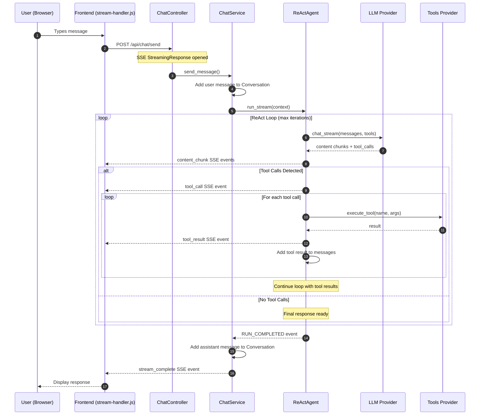
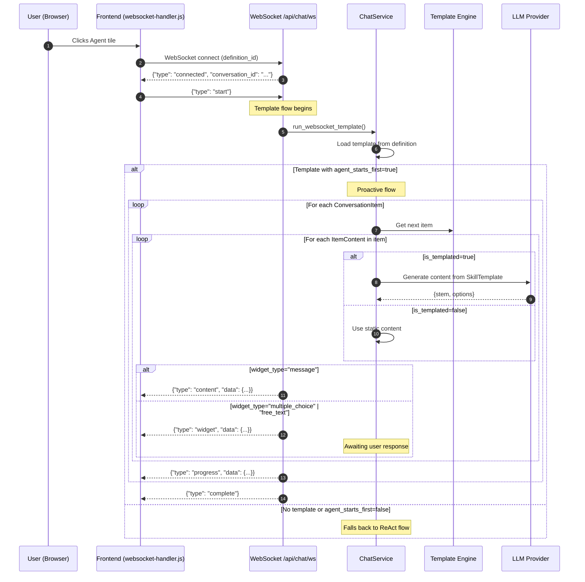
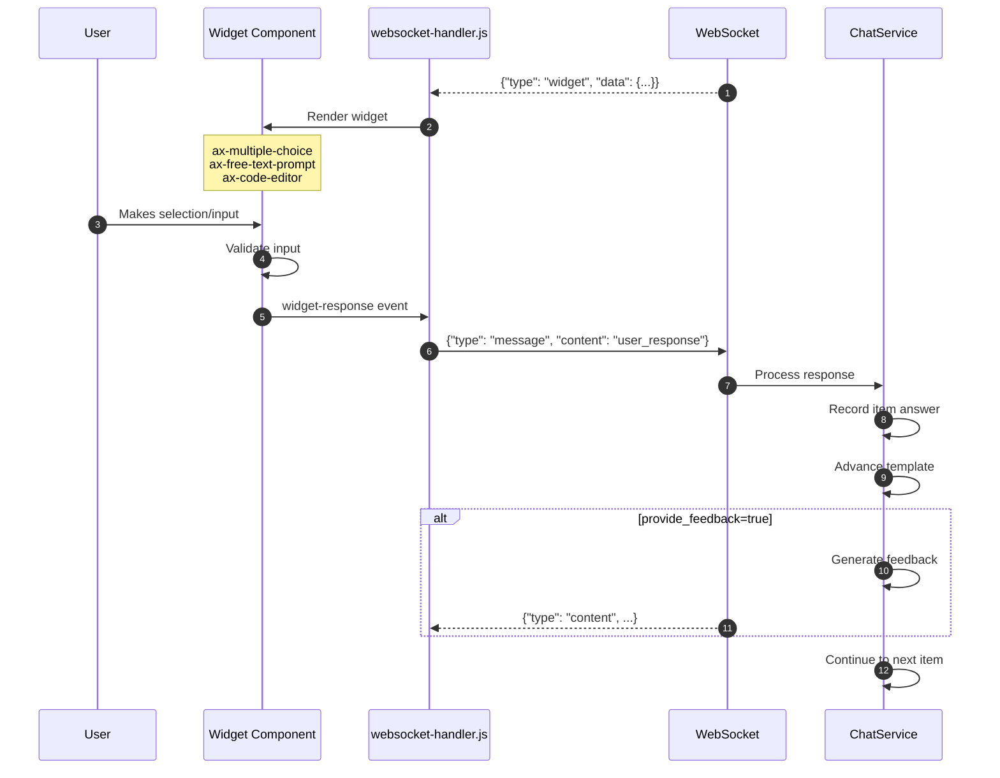
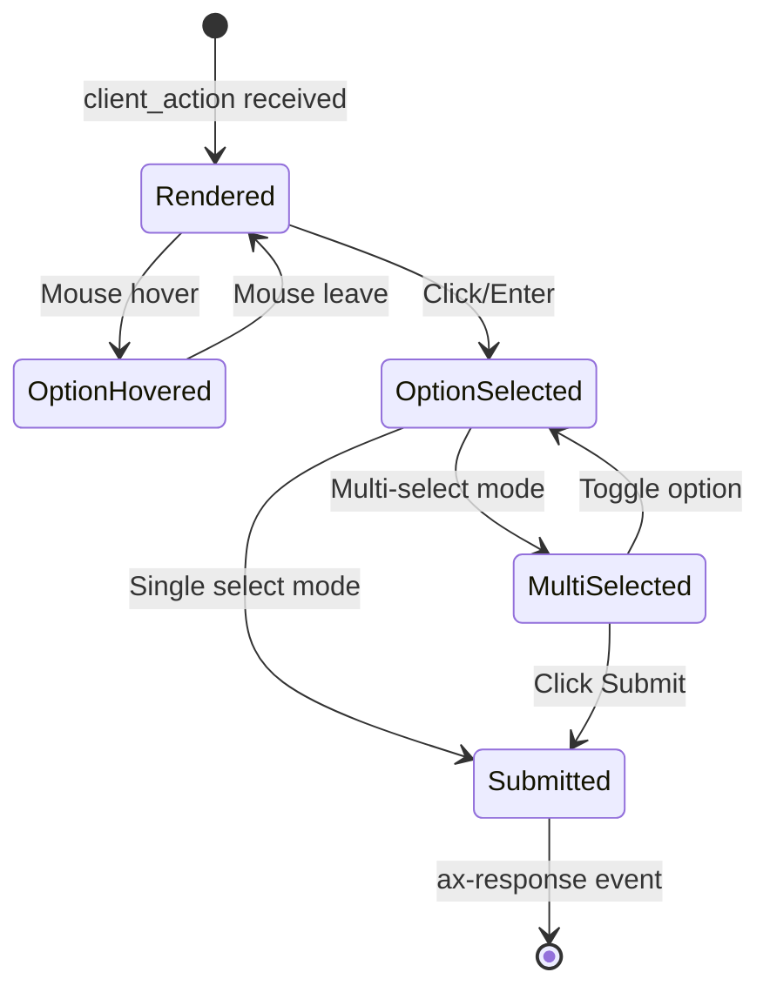
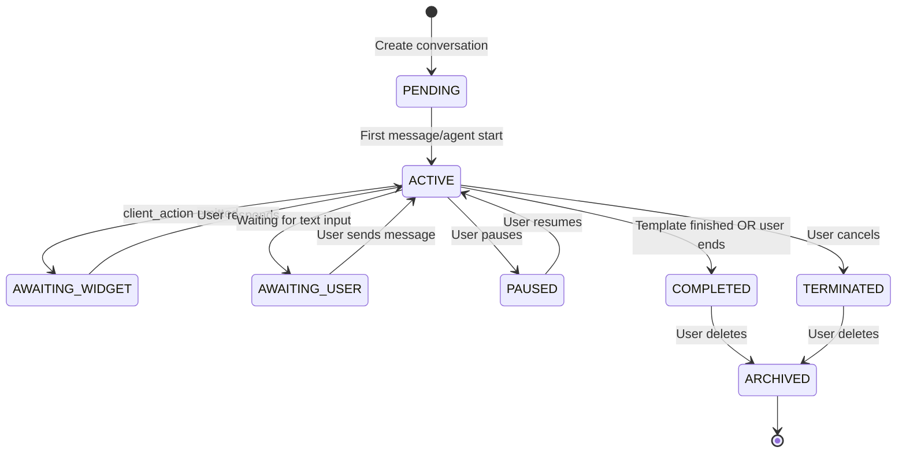
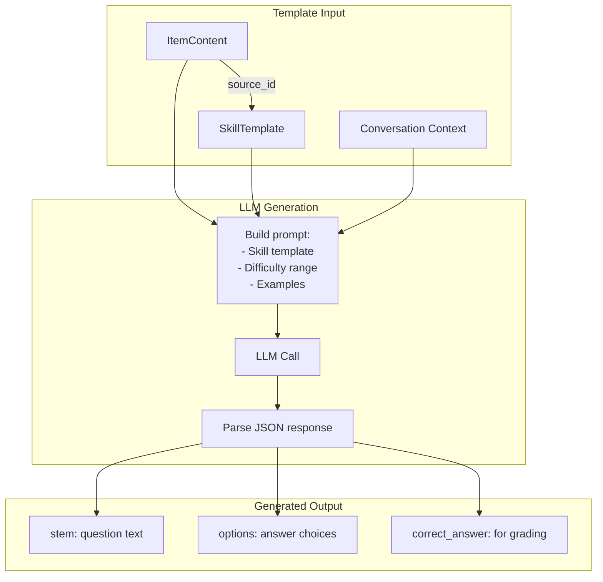

# Conversation Flows

**Version:** 2.1.0 (December 2025)
**Status:** Current Implementation

---

## Overview

The Agent Host supports two conversation flows determined by the **AgentDefinition** configuration:

| Flow Type | Trigger | Transport | Behavior |
|-----------|---------|-----------|----------|
| **Reactive (ReAct)** | No template OR template with `agent_starts_first=false` | **SSE** (`POST /api/chat/send`) | User initiates, agent responds |
| **Proactive** | Template with `agent_starts_first=true` | **WebSocket** (`/api/chat/ws`) | Agent initiates, presents structured content |

!!! info "Dual Transport Architecture"
    The Agent Host uses **two streaming transports**:

    - **Server-Sent Events (SSE)**: Unidirectional streaming for reactive chat (`POST /api/chat/send`)
    - **WebSocket**: Bidirectional communication for proactive template flows (`/api/chat/ws`)

## 1. Reactive Conversation Flow (ReAct)

The ReAct pattern (**Re**asoning and **Act**ing) is the default conversation mode where users drive the interaction. This flow uses **Server-Sent Events (SSE)** for unidirectional streaming from server to client.

### 1.1 Flow Diagram



### 1.2 SSE Event Types During ReAct Flow

| Event | Data | Purpose |
|-------|------|---------|
| `stream_started` | `{request_id, conversation_id}` | SSE connection established |
| `message_added` | `{message_id, role, content}` | User message recorded |
| `content_chunk` | `{content: "..."}` | Streaming LLM response token |
| `tool_call` | `{call_id, tool_name, arguments}` | Tool execution started |
| `tool_result` | `{call_id, success, result}` | Tool execution completed |
| `message_complete` | `{role, content}` | Full response assembled |
| `stream_complete` | `{}` | Turn finished |
| `error` | `{error, error_code, is_retryable}` | Error occurred |
| `cancelled` | `{message}` | Request cancelled by user |

### 1.3 Code Flow (Backend)

```python
# ChatService.send_message()
async def send_message(self, conversation, user_message, access_token):
    # 1. Add user message to conversation (domain event)
    user_msg_id = conversation.add_user_message(user_message)
    await self._conversation_repo.update_async(conversation)
    yield {"event": "message_added", "data": {...}}

    # 2. Build agent context
    tools = await self.get_tools(access_token)
    context = AgentRunContext(
        user_message=user_message,
        conversation_history=conversation.get_context_messages(),
        tools=tool_definitions,
        tool_executor=self._tool_executor,
    )

    # 3. Run agent (streaming)
    async for event in self._agent.run_stream(context):
        yield self._translate_event(event)

    # 4. Persist final state
    await self._conversation_repo.update_async(conversation)
```

### 1.4 Frontend Handling (SSE)

```javascript
// stream-handler.js - SSE handler for reactive chat
export async function sendMessage(message, conversationId, modelId, thinkingElement) {
    const response = await api.sendMessage(message, conversationId, modelId);
    const reader = response.body.getReader();
    const decoder = new TextDecoder();
    let currentEventType = '';

    while (true) {
        const { done, value } = await reader.read();
        if (done) break;

        const text = decoder.decode(value, { stream: true });
        const lines = text.split('\n');

        for (const line of lines) {
            if (line.startsWith('event: ')) {
                currentEventType = line.slice(7).trim();
            } else if (line.startsWith('data: ')) {
                const data = JSON.parse(line.slice(6));
                handleStreamEvent(currentEventType, data, thinkingElement);
            }
        }
    }
}
```

---

## 2. Proactive Conversation Flow (WebSocket)

Proactive conversations are driven by **ConversationTemplates** that define structured content and widget interactions. This flow uses **WebSocket** for bidirectional communication, allowing the server to push content/widgets and receive user responses through the same persistent connection.

!!! important "WebSocket Transport"
    Proactive flows use WebSocket (`/api/chat/ws`) instead of SSE for true bidirectional communication.

### 2.1 Flow Diagram



### 2.2 Widget Interaction Cycle (WebSocket)



### 2.3 WebSocket Message Protocol

**Client → Server Messages:**

| Type | Payload | Purpose |
|------|---------|---------|
| `start` | `{}` | Start template flow (proactive agent) |
| `message` | `{content: "..."}` | User message or widget response |
| `ping` | `{}` | Keepalive ping |

**Server → Client Messages:**

| Type | Payload | Purpose |
|------|---------|---------|
| `connected` | `{conversation_id, definition_id}` | Connection established |
| `content` | `{content: "..."}` | Streaming text content |
| `widget` | `{widget_type, stem, options, ...}` | Widget to render |
| `progress` | `{current_item, total_items, ...}` | Template progress update |
| `message_complete` | `{content}` | Full message assembled |
| `complete` | `{}` | Template flow finished |
| `error` | `{message}` | Error occurred |
| `pong` | `{}` | Keepalive response |

### 2.4 Widget Event Structure (WebSocket)

```json
{
    "type": "widget",
    "data": {
        "widget_type": "multiple_choice",
        "content_id": "content-uuid",
        "item_id": "item-uuid",
        "stem": "What is the capital of France?",
        "options": ["London", "Paris", "Berlin", "Madrid"],
        "widget_config": {
            "shuffle_options": true
        },
        "required": true,
        "skippable": false,
        "show_user_response": true
    }
}
```

### 2.5 Template Progress Event (WebSocket)

```json
{
    "type": "progress",
    "data": {
        "current_item": 2,
        "total_items": 5,
        "item_id": "item-uuid",
        "item_title": "Question 3",
        "enable_chat_input": false
    }
}
```

---

## 3. Widget Types

The frontend renders different widgets based on `widget_type`:

### 3.1 Available Widgets

| Widget Type | Component | Input Mode | Use Case |
|-------------|-----------|------------|----------|
| `message` | Text display | None | Information/instructions |
| `multiple_choice` | `<ax-multiple-choice>` | Click/keyboard | Single or multi-select |
| `free_text` | `<ax-free-text-prompt>` | Text area | Open-ended responses |
| `code_editor` | `<ax-code-editor>` | Monaco editor | Code exercises |

### 3.2 Multiple Choice Widget



**Widget Attributes:**

```html
<ax-multiple-choice
    prompt="What is the capital of France?"
    options='["London", "Paris", "Berlin", "Madrid"]'
    allow-multiple="false">
</ax-multiple-choice>
```

### 3.3 Free Text Widget

```html
<ax-free-text-prompt
    prompt="Explain the concept of recursion in your own words."
    min-length="50"
    max-length="500"
    placeholder="Type your answer...">
</ax-free-text-prompt>
```

---

## 4. Conversation State Transitions



---

## 5. Template-Driven Generation

When an `ItemContent` has `is_templated=true`, the ChatService uses the LLM to generate content:



**Example Generation Prompt:**

```text
Generate content for a conversation item based on the following template.
Return ONLY the requested content as valid JSON, no explanations.

Stem template: Generate a math problem about ${topic}
Options template: Generate 4 plausible answers

REQUIRED FORMAT: Return a JSON object with exactly these keys:
  - "stem": A string with the question or prompt text
  - "options": An array of 3-5 option strings

Example: {"stem": "What is 15 + 27?", "options": ["32", "42", "52", "62"]}
```

---

## 6. Error Handling

### 6.1 SSE Error Events

```json
{
    "event": "error",
    "data": {
        "error": "Tool execution failed: file_reader",
        "error_code": "tool_execution_failed",
        "is_retryable": true
    }
}
```

### 6.2 WebSocket Error Messages

```json
{
    "type": "error",
    "message": "Tool execution failed: file_reader"
}
```

### 6.3 Common Error Scenarios

| Error | Cause | Recovery |
|-------|-------|----------|
| `rate_limit_exceeded` | Too many requests | Wait and retry |
| `tool_execution_failed` | Upstream tool error | Automatic retry or skip |
| `llm_timeout` | LLM response too slow | Retry with shorter context |
| `template_render_error` | Invalid template config | Log and report |
| `unauthorized` | Session expired | Redirect to login |

---

## 7. For Developers

### 7.1 Adding a New Widget Type

1. Create component in `ui/src/scripts/components/ax-new-widget.js`
2. Register in `main.js`
3. Handle in **both** handlers:
   - `stream-handler.js` for SSE `client_action` processing
   - `websocket-handler.js` for WebSocket `widget` message handling
4. Add to `widget_type` validation in backend

### 7.2 Frontend Handler Files

| File | Transport | Use Case |
|------|-----------|----------|
| `stream-handler.js` | SSE | Reactive chat, tool calling |
| `websocket-handler.js` | WebSocket | Proactive templates, bidirectional |

### 7.3 Debugging Conversation Flow

```python
# Enable debug logging
LOG_LEVEL=DEBUG

# Key log patterns:
# 📋 Template: ... - Template progression
# 🚀 Proactive... - Agent initiation
# 🎯 Model override... - LLM selection
# [WebSocket] ... - WebSocket connection events
```

### 7.4 Testing WebSocket Connection

```javascript
// Browser console test
const ws = new WebSocket('ws://localhost:8001/api/chat/ws?definition_id=YOUR_ID');
ws.onmessage = e => console.log(JSON.parse(e.data));
ws.onopen = () => ws.send(JSON.stringify({type: 'start'}));
