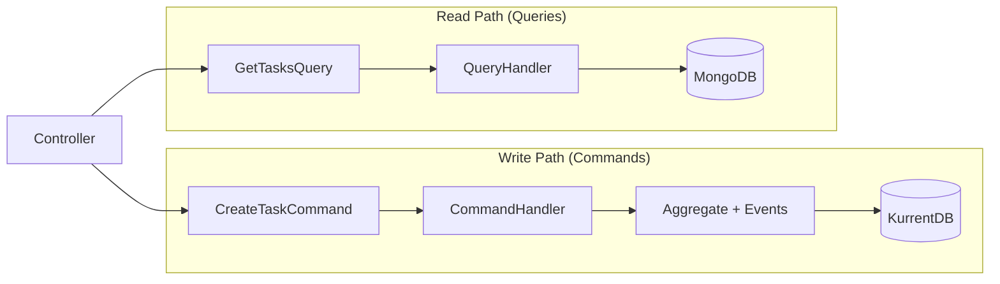
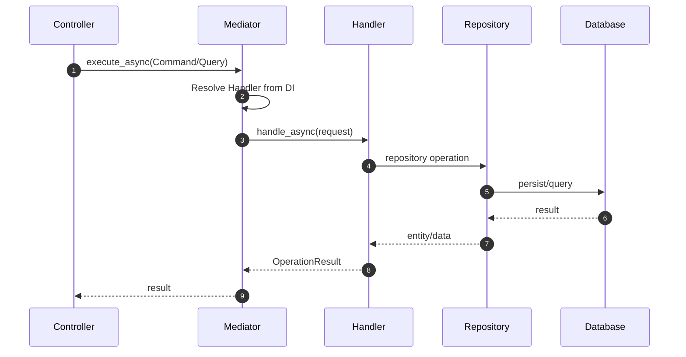

# CQRS Architecture with Neuroglia

This application implements Command Query Responsibility Segregation (CQRS) using the Neuroglia framework's Mediator pattern.

## What is CQRS?

CQRS separates operations that modify data (Commands) from operations that read data (Queries), providing clearer separation of concerns and better scalability.



### Commands (Write Operations)

- **Purpose**: Modify system state
- **Return**: `OperationResult` with created entity or status
- **Examples**: `CreateTaskCommand`, `RegisterSourceCommand`, `EnableToolCommand`
- **Side Effects**: Yes - events persisted, projections updated, SSE notifications sent

### Queries (Read Operations)

- **Purpose**: Retrieve data from Read Model
- **Return**: `OperationResult` with data
- **Examples**: `GetTasksQuery`, `GetSourcesQuery`
- **Side Effects**: No (read-only)

## Architecture Pattern



## Project Structure

### Self-Contained Modules

Each command/query lives in a single file with its handler:

```
src/application/
├── commands/
│   ├── __init__.py
│   ├── command_handler_base.py    # Shared base class
│   ├── create_task_command.py     # CreateTaskCommand + Handler
│   ├── register_source_command.py # RegisterSourceCommand + Handler
│   ├── enable_tool_command.py     # EnableToolCommand + Handler
│   └── ...
└── queries/
    ├── __init__.py
    ├── get_tasks_query.py         # GetTasksQuery + Handler
    ├── get_sources_query.py       # GetSourcesQuery + Handler
    └── ...
```

**Benefits:**

- High cohesion - request and handler together
- Easy to find - one file per operation
- Simple imports - just import what you need

## Command Example: Real Implementation

### CreateTaskCommand

File: `src/application/commands/create_task_command.py`

```python
import logging
import time
from dataclasses import dataclass
from datetime import datetime, timezone

from neuroglia.core import OperationResult
from neuroglia.data.infrastructure.abstractions import Repository
from neuroglia.eventing.cloud_events.infrastructure.cloud_event_bus import CloudEventBus
from neuroglia.eventing.cloud_events.infrastructure.cloud_event_publisher import CloudEventPublishingOptions
from neuroglia.mapping import Mapper
from neuroglia.mediation import Command, CommandHandler, Mediator
from neuroglia.observability.tracing import add_span_attributes
from opentelemetry import trace

from domain.entities import Task
from domain.enums import TaskPriority, TaskStatus
from integration.models.task_dto import TaskDto
from observability import task_processing_time, tasks_created

from .command_handler_base import CommandHandlerBase

log = logging.getLogger(__name__)
tracer = trace.get_tracer(__name__)


@dataclass
class CreateTaskCommand(Command[OperationResult[TaskDto]]):
    """Command to create a new task."""
    title: str
    description: str
    status: str = "pending"
    priority: str = "medium"
    assignee_id: str | None = None
    department: str | None = None
    user_info: dict | None = None


class CreateTaskCommandHandler(
    CommandHandlerBase,
    CommandHandler[CreateTaskCommand, OperationResult[TaskDto]],
):
    """Handle task creation with telemetry and event sourcing."""

    def __init__(
        self,
        mediator: Mediator,
        mapper: Mapper,
        cloud_event_bus: CloudEventBus,
        cloud_event_publishing_options: CloudEventPublishingOptions,
        task_repository: Repository[Task, str],
    ):
        super().__init__(mediator, mapper, cloud_event_bus, cloud_event_publishing_options)
        self.task_repository = task_repository

    async def handle_async(self, request: CreateTaskCommand) -> OperationResult[TaskDto]:
        """Handle create task command with custom instrumentation."""
        command = request
        start_time = time.time()

        # Add business context to automatic span
        add_span_attributes({
            "task.title": command.title,
            "task.priority": command.priority,
            "task.has_user_info": command.user_info is not None,
        })

        # Create custom span for entity creation
        with tracer.start_as_current_span("create_task_entity") as span:
            # Convert string values to enums
            status = TaskStatus(command.status) if command.status else TaskStatus.PENDING
            priority = TaskPriority(command.priority) if command.priority else TaskPriority.MEDIUM

            # Create aggregate (emits TaskCreatedDomainEvent internally)
            task = Task(
                title=command.title,
                description=command.description,
                priority=priority,
                status=status,
                assignee_id=command.assignee_id,
                department=command.department,
                created_by=command.user_info.get("sub") if command.user_info else None,
            )
            span.set_attribute("task.status", status.value)
            span.set_attribute("task.priority", priority.value)

        # Save to event store (publishes domain events via Mediator)
        saved_task = await self.task_repository.add_async(task)

        # Record metrics
        processing_time_ms = (time.time() - start_time) * 1000
        tasks_created.add(1, {"priority": priority.value, "status": status.value})
        task_processing_time.record(processing_time_ms, {"operation": "create"})

        # Map to DTO for response
        dto = TaskDto(
            id=saved_task.id(),
            title=saved_task.state.title,
            description=saved_task.state.description,
            status=saved_task.state.status,
            priority=saved_task.state.priority,
        )

        return self.ok(dto)
```

### Key Differences from Generic CQRS

1. **`CommandHandlerBase`**: Shared base with `Mediator`, `Mapper`, `CloudEventBus`
2. **`Repository[Task, str]`**: Generic repository typed to aggregate
3. **`OperationResult[TaskDto]`**: Typed result with DTO
4. **OpenTelemetry**: `add_span_attributes()` and custom spans
5. **Metrics**: `tasks_created.add()` and `task_processing_time.record()`

## Query Example: Real Implementation

### GetTasksQuery

File: `src/application/queries/get_tasks_query.py`

```python
from dataclasses import dataclass

from neuroglia.core import OperationResult
from neuroglia.data.infrastructure.abstractions import Repository
from neuroglia.mediation import Query, QueryHandler

from integration.models.task_dto import TaskDto


@dataclass
class GetTasksQuery(Query[OperationResult[list[TaskDto]]]):
    """Query to retrieve tasks with optional filtering."""
    user_info: dict | None = None
    status: str | None = None
    limit: int = 100


class GetTasksQueryHandler(QueryHandler[GetTasksQuery, OperationResult[list[TaskDto]]]):
    """Handle task retrieval from Read Model (MongoDB)."""

    def __init__(self, repository: Repository[TaskDto, str]):
        super().__init__()
        self._repository = repository

    async def handle_async(self, query: GetTasksQuery) -> OperationResult[list[TaskDto]]:
        """Query tasks from MongoDB Read Model with RBAC filtering."""
        user_roles = query.user_info.get("roles", []) if query.user_info else []

        # RBAC filtering
        if "admin" in user_roles:
            # Admins see all tasks
            tasks = await self._repository.list_async()
        elif "manager" in user_roles:
            # Managers see department tasks
            department = query.user_info.get("department")
            tasks = await self._repository.query().where(
                lambda t: t.department == department
            ).to_list_async()
        else:
            # Users see only their tasks
            user_id = query.user_info.get("sub")
            tasks = await self._repository.query().where(
                lambda t: t.assignee_id == user_id
            ).to_list_async()

        # Apply additional filters
        if query.status:
            tasks = [t for t in tasks if t.status.value == query.status]

        return self.ok(tasks[:query.limit])
```

## Controller Usage

Controllers use the Mediator to dispatch requests:

```python
from classy_fastapi.decorators import get, post
from fastapi import Depends
from neuroglia.mvc import ControllerBase
from pydantic import BaseModel

from api.dependencies import get_current_user
from application.commands import CreateTaskCommand
from application.queries import GetTasksQuery


class CreateTaskRequest(BaseModel):
    title: str
    description: str
    priority: str = "medium"


class TasksController(ControllerBase):

    @post("/")
    async def create_task(
        self,
        request: CreateTaskRequest,
        user: dict = Depends(get_current_user)
    ):
        command = CreateTaskCommand(
            title=request.title,
            description=request.description,
            priority=request.priority,
            user_info=user
        )
        result = await self.mediator.execute_async(command)
        return self.process(result)

    @get("/")
    async def get_tasks(self, user: dict = Depends(get_current_user)):
        query = GetTasksQuery(user_info=user)
        result = await self.mediator.execute_async(query)
        return self.process(result)
```

## Handler Registration

Neuroglia auto-discovers handlers via module scanning:

```python
# src/main.py
Mediator.configure(
    builder,
    [
        "application.commands",           # Command handlers
        "application.queries",            # Query handlers
        "application.events.domain",      # Domain event handlers
        "application.events.integration", # Integration event handlers
    ],
)
```

Handlers are automatically registered based on their type signatures.

## Dependency Injection

Handlers receive dependencies through constructor injection:

```python
class CreateTaskCommandHandler(...):
    def __init__(
        self,
        mediator: Mediator,                    # For publishing events
        mapper: Mapper,                        # For DTO mapping
        cloud_event_bus: CloudEventBus,        # For CloudEvent publishing
        cloud_event_publishing_options: CloudEventPublishingOptions,
        task_repository: Repository[Task, str], # Injected by type
    ):
        ...
```

Repository mappings are configured in `main.py`:

```python
DataAccessLayer.WriteModel(...).configure(builder, ["domain.entities"])
DataAccessLayer.ReadModel(
    repository_mappings={
        TaskDtoRepository: MotorTaskDtoRepository,
        SourceDtoRepository: MotorSourceDtoRepository,
    },
).configure(builder, ["integration.models"])
```

## Observability

### Automatic Tracing

The Mediator middleware automatically creates spans for each command/query.

### Custom Instrumentation

```python
from neuroglia.observability.tracing import add_span_attributes
from opentelemetry import trace

tracer = trace.get_tracer(__name__)

class CreateTaskCommandHandler(...):
    async def handle_async(self, command):
        # Add attributes to automatic span
        add_span_attributes({
            "task.title": command.title,
            "task.priority": command.priority,
        })

        # Create custom span
        with tracer.start_as_current_span("business_logic") as span:
            span.set_attribute("custom.attribute", "value")
            # ... logic ...
```

### Custom Metrics

```python
from observability import task_processing_time, tasks_created

# Counter
tasks_created.add(1, {"priority": "high", "status": "pending"})

# Histogram
task_processing_time.record(processing_time_ms, {"operation": "create"})
```

## Best Practices

✅ **One responsibility per handler** - Single operation per file
✅ **Use `OperationResult`** - Consistent response pattern
✅ **Type your repositories** - `Repository[Task, str]` not just `Repository`
✅ **Add telemetry** - Spans and metrics for observability
✅ **RBAC in queries** - Filter based on user roles
✅ **Use enums** - `TaskStatus.PENDING` not `"pending"`
✅ **Map to DTOs** - Don't expose aggregates directly

## Related Documentation

- [Event Sourcing](./event-sourcing.md) - How events flow from aggregates to projections
- [Data Layer](./data-layer.md) - Repository pattern and aggregate state
- [Architecture Overview](./overview.md) - System architecture
