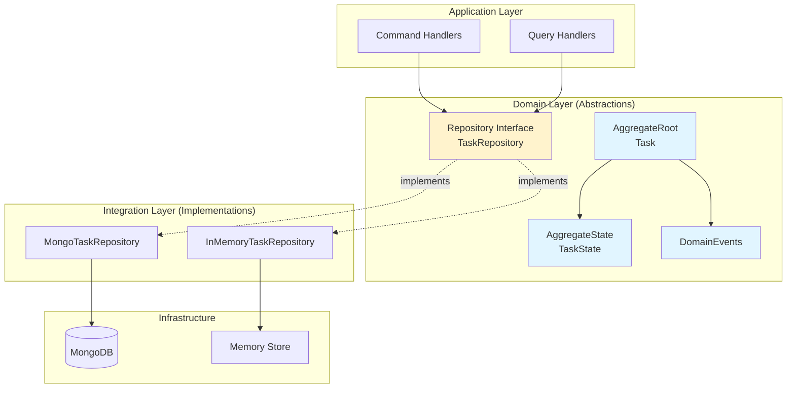

# Data Layer Architecture

This document explains the data layer architecture of the Starter App, covering domain abstractions, repository patterns, and how they integrate with Domain-Driven Design (DDD) principles using the Neuroglia framework.

## Overview

The data layer in this application follows a clean architecture approach with clear separation between:

1. **Domain Layer** - Abstract interfaces and entity definitions (what)
2. **Integration Layer** - Concrete implementations (how)
3. **Infrastructure** - Technical adapters and persistence mechanisms



## Domain-Driven Design Concepts

### AggregateRoot: Behavior Container

The `AggregateRoot` is the entry point for all domain operations. It encapsulates business logic and ensures consistency within the aggregate boundary.

**Key Characteristics:**

- ✅ Contains business methods that enforce invariants
- ✅ Generates domain events for state changes
- ✅ Maintains aggregate boundary and identity
- ✅ Delegates state storage to `AggregateState`

**Example: Task Aggregate**

```python
from neuroglia.data.abstractions import AggregateRoot

class Task(AggregateRoot[TaskState, str]):
    """Task aggregate root - encapsulates task behavior."""

    def __init__(
        self,
        title: str,
        description: str,
        status: TaskStatus = TaskStatus.PENDING,
        priority: TaskPriority = TaskPriority.MEDIUM,
        # ... other parameters
    ) -> None:
        super().__init__()
        aggregate_id = task_id or str(uuid4())

        # Register domain event for creation
        self.state.on(
            self.register_event(
                TaskCreatedDomainEvent(
                    aggregate_id=aggregate_id,
                    title=title,
                    description=description,
                    status=status,
                    priority=priority,
                    # ...
                )
            )
        )

    def update_title(self, new_title: str) -> None:
        """Business method to update title."""
        if not new_title or not new_title.strip():
            raise ValueError("Title cannot be empty")

        # Register event
        event = TaskTitleUpdatedDomainEvent(
            aggregate_id=self.id(),
            new_title=new_title
        )

        # Apply state change through event
        self.state.on(self.register_event(event))

    def update_status(self, new_status: TaskStatus) -> None:
        """Business method to update status."""
        # Enforce business rules
        if self.state.status == TaskStatus.COMPLETED:
            raise ValueError("Cannot modify completed tasks")

        event = TaskStatusUpdatedDomainEvent(
            aggregate_id=self.id(),
            new_status=new_status
        )
        self.state.on(self.register_event(event))
```

**Why This Matters:**

- Business rules are centralized in the aggregate
- State changes always go through domain events
- Aggregate maintains consistency of its data
- External code cannot bypass business logic

### AggregateState: Attribute Storage

The `AggregateState` stores the data attributes and applies events to update state. It's purely about data, not behavior.

**Key Characteristics:**

- ✅ Holds all persisted attributes
- ✅ Implements event handlers (`on` methods) to apply events
- ✅ No business logic - pure data container
- ✅ Supports event sourcing through event replay

**Example: TaskState**

```python
from neuroglia.data.abstractions import AggregateState
from multipledispatch import dispatch

class TaskState(AggregateState[str]):
    """Encapsulates the persisted state for the Task aggregate."""

    # All persisted attributes
    id: str
    title: str
    description: str
    status: TaskStatus
    priority: TaskPriority
    assignee_id: Optional[str]
    department: Optional[str]
    created_at: datetime
    updated_at: datetime
    created_by: Optional[str]

    def __init__(self) -> None:
        super().__init__()
        # Initialize with defaults
        self.id = ""
        self.title = ""
        self.description = ""
        self.status = TaskStatus.PENDING
        self.priority = TaskPriority.MEDIUM
        # ...

    @dispatch(TaskCreatedDomainEvent)
    def on(self, event: TaskCreatedDomainEvent) -> None:
        """Apply creation event to state."""
        self.id = event.aggregate_id
        self.title = event.title
        self.description = event.description
        self.status = event.status
        self.priority = event.priority
        # ...

    @dispatch(TaskTitleUpdatedDomainEvent)
    def on(self, event: TaskTitleUpdatedDomainEvent) -> None:
        """Apply title update event to state."""
        self.title = event.new_title
        self.updated_at = datetime.now(timezone.utc)

    @dispatch(TaskStatusUpdatedDomainEvent)
    def on(self, event: TaskStatusUpdatedDomainEvent) -> None:
        """Apply status update event to state."""
        self.status = event.new_status
        self.updated_at = datetime.now(timezone.utc)
```

**Benefits:**

- Clean separation between behavior (AggregateRoot) and data (AggregateState)
- Easy to serialize/deserialize for persistence
- Supports event sourcing by replaying events
- Type-safe attribute access through Python type hints

### DomainEvents: Decoupling Side Effects

Domain events represent facts about what happened in the domain. They decouple the aggregate from side effects like notifications, integrations, or updating read models.

**Key Characteristics:**

- ✅ Immutable records of what happened
- ✅ Named in past tense (TaskCreated, TitleUpdated)
- ✅ Contain all data needed to process the event
- ✅ Published automatically by repositories after persistence

**Example: Domain Events**

```python
from neuroglia.data.abstractions import DomainEvent
from neuroglia.eventing.cloud_events.decorators import cloudevent

@cloudevent("task.created.v1")
@dataclass
class TaskCreatedDomainEvent(DomainEvent):
    """Event raised when a new task is created."""

    aggregate_id: str
    title: str
    description: str
    status: TaskStatus
    priority: TaskPriority
    assignee_id: Optional[str]
    department: Optional[str]
    created_at: datetime
    updated_at: datetime
    created_by: Optional[str]

    def __init__(self, aggregate_id: str, title: str, ...):
        super().__init__(aggregate_id)
        self.aggregate_id = aggregate_id
        self.title = title
        # ...

@cloudevent("task.title.updated.v1")
@dataclass
class TaskTitleUpdatedDomainEvent(DomainEvent):
    """Event raised when task title is updated."""

    aggregate_id: str
    new_title: str

    def __init__(self, aggregate_id: str, new_title: str):
        super().__init__(aggregate_id)
        self.aggregate_id = aggregate_id
        self.new_title = new_title
```

**Event Flow:**

```
1. Aggregate method called → register_event()
2. Event applied to state → state.on(event)
3. Aggregate persisted → repository.add_async() or update_async()
4. Repository publishes events → mediator.publish()
5. Event handlers react → Send notification, update cache, etc.
```

**Benefits:**

- Loose coupling between aggregates and side effects
- Audit trail of all domain changes
- Easy to add new event handlers without modifying aggregates
- Supports event-driven architecture and CQRS
- CloudEvent format enables cross-platform integration

## Repository Pattern

### Abstract Repository Interface

The repository interface defines the contract for data access without exposing implementation details.

**Location:** `src/domain/repositories/task_repository.py`

```python
from abc import ABC, abstractmethod
from domain.entities import Task

class TaskRepository(ABC):
    """Abstract repository for Task entities."""

    @abstractmethod
    async def get_all_async(self) -> list[Task]:
        """Retrieve all tasks."""
        pass

    @abstractmethod
    async def get_by_id_async(self, task_id: str) -> Task | None:
        """Retrieve a task by ID."""
        pass

    @abstractmethod
    async def get_by_assignee_async(self, assignee_id: str) -> list[Task]:
        """Retrieve tasks assigned to a specific user."""
        pass

    @abstractmethod
    async def get_by_department_async(self, department: str) -> list[Task]:
        """Retrieve tasks for a specific department."""
        pass

    @abstractmethod
    async def add_async(self, entity: Task) -> Task:
        """Add a new task."""
        pass

    @abstractmethod
    async def update_async(self, entity: Task) -> Task:
        """Update an existing task."""
        pass

    @abstractmethod
    async def delete_async(self, task_id: str, task: Task | None = None) -> bool:
        """Delete a task by ID."""
        pass
```

**Design Principles:**

- ✅ Technology-agnostic (no MongoDB/SQL specifics)
- ✅ Focused on domain operations (not CRUD)
- ✅ Async methods for non-blocking I/O
- ✅ Returns domain entities, not DTOs or dicts
- ✅ Lives in domain layer (pure abstraction)

### Concrete Implementations

#### In-Memory Repository (Testing)

**Location:** `src/integration/repositories/in_memory_task_repository.py`

```python
from domain.entities import Task
from domain.repositories import TaskRepository

class InMemoryTaskRepository(TaskRepository):
    """In-memory implementation for testing."""

    def __init__(self) -> None:
        self._tasks: dict[str, Task] = {}

    async def get_all_async(self) -> list[Task]:
        return list(self._tasks.values())

    async def get_by_id_async(self, task_id: str) -> Task | None:
        return self._tasks.get(task_id)

    async def get_by_assignee_async(self, assignee_id: str) -> list[Task]:
        return [
            task for task in self._tasks.values()
            if task.state.assignee_id == assignee_id
        ]

    async def get_by_department_async(self, department: str) -> list[Task]:
        return [
            task for task in self._tasks.values()
            if task.state.department == department
        ]

    async def add_async(self, entity: Task) -> Task:
        self._tasks[entity.id()] = entity
        return entity

    async def update_async(self, entity: Task) -> Task:
        self._tasks[entity.id()] = entity
        return entity

    async def delete_async(self, task_id: str, task: Task | None = None) -> bool:
        if task_id in self._tasks:
            del self._tasks[task_id]
            return True
        return False
```

**Use Cases:**

- ✅ Unit testing without external dependencies
- ✅ Fast test execution
- ✅ Deterministic test behavior
- ✅ Local development without Docker

#### MongoDB Repository (Production)

**Location:** `src/integration/repositories/motor_task_repository.py`

```python
from motor.motor_asyncio import AsyncIOMotorClient
from neuroglia.data.infrastructure.mongo import MotorRepository
from neuroglia.data.infrastructure.tracing_mixin import TracedRepositoryMixin
from domain.entities import Task
from domain.repositories import TaskRepository

class MongoTaskRepository(
    TracedRepositoryMixin,
    MotorRepository[Task, str],
    TaskRepository
):
    """MongoDB repository with automatic event publishing and tracing."""

    def __init__(
        self,
        client: AsyncIOMotorClient,
        database_name: str,
        collection_name: str,
        serializer: JsonSerializer,
        entity_type: Optional[type[Task]] = None,
        mediator: Optional["Mediator"] = None,
    ):
        super().__init__(
            client=client,
            database_name=database_name,
            collection_name=collection_name,
            serializer=serializer,
            entity_type=entity_type,
            mediator=mediator,
        )

    # Inherits from MotorRepository:
    # - get_async(id) → automatic event publishing
    # - add_async(entity) → automatic event publishing
    # - update_async(entity) → automatic event publishing
    # - remove_async(id)

    async def get_all_async(self) -> list[Task]:
        """Custom query: retrieve all tasks."""
        cursor = self.collection.find({})
        tasks = []
        async for document in cursor:
            task = self._deserialize_entity(document)
            tasks.append(task)
        return tasks

    async def get_by_id_async(self, task_id: str) -> Task | None:
        """Delegates to inherited get_async."""
        return await self.get_async(task_id)

    async def get_by_assignee_async(self, assignee_id: str) -> list[Task]:
        """Custom query: find by assignee."""
        cursor = self.collection.find({"assignee_id": assignee_id})
        tasks = []
        async for document in cursor:
            task = self._deserialize_entity(document)
            tasks.append(task)
        return tasks

    async def get_by_department_async(self, department: str) -> list[Task]:
        """Custom query: find by department."""
        cursor = self.collection.find({"department": department})
        tasks = []
        async for document in cursor:
            task = self._deserialize_entity(document)
            tasks.append(task)
        return tasks

    async def delete_async(self, task_id: str, task: Task | None = None) -> bool:
        """Custom delete with optional event publishing."""
        try:
            entity = task if task else await self.get_async(task_id)

            if entity:
                # Publish domain events (including TaskDeletedDomainEvent)
                await self._publish_domain_events(entity)

            # Physical deletion
            await self.remove_async(task_id)
            return True
        except Exception:
            return False
```

**Key Features:**

- ✅ **Automatic Event Publishing**: MotorRepository publishes domain events after persistence
- ✅ **Tracing**: TracedRepositoryMixin adds OpenTelemetry spans automatically
- ✅ **Inheritance**: Reuses CRUD operations from base repository
- ✅ **Custom Queries**: Adds domain-specific query methods
- ✅ **Type Safety**: Full type hints for entities and IDs

## Creating New Domain Entities

### Step 1: Define Domain Events

```python
# src/domain/events/order.py
from dataclasses import dataclass
from datetime import datetime
from neuroglia.data.abstractions import DomainEvent
from neuroglia.eventing.cloud_events.decorators import cloudevent

@cloudevent("order.created.v1")
@dataclass
class OrderCreatedDomainEvent(DomainEvent):
    """Event raised when an order is created."""

    aggregate_id: str
    customer_id: str
    total_amount: float
    items: list[dict]
    created_at: datetime

    def __init__(self, aggregate_id: str, customer_id: str, total_amount: float, items: list[dict], created_at: datetime):
        super().__init__(aggregate_id)
        self.aggregate_id = aggregate_id
        self.customer_id = customer_id
        self.total_amount = total_amount
        self.items = items
        self.created_at = created_at

@cloudevent("order.confirmed.v1")
@dataclass
class OrderConfirmedDomainEvent(DomainEvent):
    """Event raised when an order is confirmed."""

    aggregate_id: str
    confirmed_at: datetime

    def __init__(self, aggregate_id: str, confirmed_at: datetime):
        super().__init__(aggregate_id)
        self.aggregate_id = aggregate_id
        self.confirmed_at = confirmed_at
```

### Step 2: Create AggregateState

```python
# src/domain/entities/order.py
from datetime import datetime, timezone
from typing import Optional
from multipledispatch import dispatch
from neuroglia.data.abstractions import AggregateState
from domain.events.order import OrderCreatedDomainEvent, OrderConfirmedDomainEvent

class OrderState(AggregateState[str]):
    """Persisted state for Order aggregate."""

    id: str
    customer_id: str
    total_amount: float
    items: list[dict]
    status: str  # "pending", "confirmed", "shipped", "delivered"
    created_at: datetime
    confirmed_at: Optional[datetime]

    def __init__(self) -> None:
        super().__init__()
        self.id = ""
        self.customer_id = ""
        self.total_amount = 0.0
        self.items = []
        self.status = "pending"
        self.created_at = datetime.now(timezone.utc)
        self.confirmed_at = None

    @dispatch(OrderCreatedDomainEvent)
    def on(self, event: OrderCreatedDomainEvent) -> None:
        """Apply creation event."""
        self.id = event.aggregate_id
        self.customer_id = event.customer_id
        self.total_amount = event.total_amount
        self.items = event.items
        self.status = "pending"
        self.created_at = event.created_at

    @dispatch(OrderConfirmedDomainEvent)
    def on(self, event: OrderConfirmedDomainEvent) -> None:
        """Apply confirmation event."""
        self.status = "confirmed"
        self.confirmed_at = event.confirmed_at
```

### Step 3: Create AggregateRoot

```python
# src/domain/entities/order.py (continued)
from uuid import uuid4
from neuroglia.data.abstractions import AggregateRoot

class Order(AggregateRoot[OrderState, str]):
    """Order aggregate root."""

    def __init__(
        self,
        customer_id: str,
        items: list[dict],
        order_id: Optional[str] = None,
    ) -> None:
        super().__init__()

        # Calculate total
        total_amount = sum(item["price"] * item["quantity"] for item in items)

        # Validate business rules
        if total_amount <= 0:
            raise ValueError("Order total must be positive")
        if not items:
            raise ValueError("Order must contain items")

        aggregate_id = order_id or str(uuid4())

        # Register creation event
        self.state.on(
            self.register_event(
                OrderCreatedDomainEvent(
                    aggregate_id=aggregate_id,
                    customer_id=customer_id,
                    total_amount=total_amount,
                    items=items,
                    created_at=datetime.now(timezone.utc),
                )
            )
        )

    def id(self) -> str:
        """Return aggregate identifier."""
        return self.state.id

    def confirm(self) -> None:
        """Business method to confirm order."""
        # Enforce business rules
        if self.state.status != "pending":
            raise ValueError("Can only confirm pending orders")

        if not self.state.items:
            raise ValueError("Cannot confirm empty order")

        # Register event
        event = OrderConfirmedDomainEvent(
            aggregate_id=self.id(),
            confirmed_at=datetime.now(timezone.utc)
        )
        self.state.on(self.register_event(event))
```

### Step 4: Define Repository Interface

```python
# src/domain/repositories/order_repository.py
from abc import ABC, abstractmethod
from domain.entities import Order

class OrderRepository(ABC):
    """Abstract repository for Order entities."""

    @abstractmethod
    async def get_by_id_async(self, order_id: str) -> Order | None:
        """Retrieve order by ID."""
        pass

    @abstractmethod
    async def get_by_customer_async(self, customer_id: str) -> list[Order]:
        """Retrieve orders for a customer."""
        pass

    @abstractmethod
    async def get_pending_orders_async(self) -> list[Order]:
        """Retrieve all pending orders."""
        pass

    @abstractmethod
    async def add_async(self, entity: Order) -> Order:
        """Add new order."""
        pass

    @abstractmethod
    async def update_async(self, entity: Order) -> Order:
        """Update existing order."""
        pass
```

### Step 5: Implement Repository

```python
# src/integration/repositories/mongo_order_repository.py
from motor.motor_asyncio import AsyncIOMotorClient
from neuroglia.data.infrastructure.mongo import MotorRepository
from neuroglia.data.infrastructure.tracing_mixin import TracedRepositoryMixin
from neuroglia.serialization.json import JsonSerializer
from domain.entities import Order
from domain.repositories import OrderRepository

class MongoOrderRepository(
    TracedRepositoryMixin,
    MotorRepository[Order, str],
    OrderRepository
):
    """MongoDB implementation of OrderRepository."""

    def __init__(
        self,
        client: AsyncIOMotorClient,
        database_name: str,
        collection_name: str,
        serializer: JsonSerializer,
        entity_type: Optional[type[Order]] = None,
        mediator: Optional["Mediator"] = None,
    ):
        super().__init__(
            client=client,
            database_name=database_name,
            collection_name=collection_name,
            serializer=serializer,
            entity_type=entity_type,
            mediator=mediator,
        )

    async def get_by_id_async(self, order_id: str) -> Order | None:
        """Retrieve order by ID."""
        return await self.get_async(order_id)

    async def get_by_customer_async(self, customer_id: str) -> list[Order]:
        """Retrieve orders for a customer."""
        cursor = self.collection.find({"customer_id": customer_id})
        orders = []
        async for document in cursor:
            order = self._deserialize_entity(document)
            orders.append(order)
        return orders

    async def get_pending_orders_async(self) -> list[Order]:
        """Retrieve pending orders."""
        cursor = self.collection.find({"status": "pending"})
        orders = []
        async for document in cursor:
            order = self._deserialize_entity(document)
            orders.append(order)
        return orders
```

### Step 6: Register with Dependency Injection

```python
# src/main.py or appropriate configuration location
from neuroglia.dependency_injection import ServiceCollection
from domain.repositories import OrderRepository
from integration.repositories import MongoOrderRepository

# Register repository
services.add_singleton(
    OrderRepository,
    lambda sp: MongoOrderRepository(
        client=sp.get_required_service(AsyncIOMotorClient),
        database_name="starter_app",
        collection_name="orders",
        serializer=sp.get_required_service(JsonSerializer),
        entity_type=Order,
        mediator=sp.get_required_service(Mediator),
    )
)
```

## Best Practices

### 1. Aggregate Design

✅ **DO:**

- Keep aggregates small and focused
- Enforce invariants within aggregate boundaries
- Generate events for all state changes
- Use value objects for complex attributes

❌ **DON'T:**

- Load multiple aggregates in one transaction
- Modify aggregates directly from outside
- Skip event generation for state changes
- Put business logic in state classes

### 2. Domain Events

✅ **DO:**

- Name events in past tense (OrderCreated, not CreateOrder)
- Include all data needed by event handlers
- Use immutable dataclasses
- Version events with CloudEvent type (v1, v2)

❌ **DON'T:**

- Mutate events after creation
- Reference other aggregates in events
- Include behavior in event classes
- Skip event versioning

### 3. Repository Pattern

✅ **DO:**

- Define interfaces in domain layer
- Implement in integration layer
- Use async methods for I/O
- Return domain entities, not dictionaries

❌ **DON'T:**

- Leak infrastructure details into domain
- Mix query and command operations
- Return DTOs from repositories
- Bypass repository to access database directly

### 4. State Management

✅ **DO:**

- Apply all state changes through events
- Use `@dispatch` decorators for event handlers
- Initialize state with sensible defaults
- Keep state classes focused on data

❌ **DON'T:**

- Modify state directly from aggregate
- Add business logic to state classes
- Skip event handlers for state changes
- Use mutable collections without copying

## Testing Strategies

### Unit Testing Aggregates

```python
def test_order_confirmation():
    # Arrange
    order = Order(
        customer_id="customer-1",
        items=[{"name": "Widget", "price": 10.0, "quantity": 2}]
    )

    # Act
    order.confirm()

    # Assert
    assert order.state.status == "confirmed"
    assert order.state.confirmed_at is not None
    assert len(order.pending_events) == 2  # Created + Confirmed

def test_order_validation():
    # Assert business rule enforcement
    with pytest.raises(ValueError, match="Order total must be positive"):
        Order(customer_id="customer-1", items=[])
```

### Integration Testing Repositories

```python
@pytest.mark.asyncio
async def test_order_persistence(order_repository: OrderRepository):
    # Arrange
    order = Order(
        customer_id="customer-1",
        items=[{"name": "Widget", "price": 10.0, "quantity": 2}]
    )

    # Act
    saved_order = await order_repository.add_async(order)
    retrieved_order = await order_repository.get_by_id_async(saved_order.id())

    # Assert
    assert retrieved_order is not None
    assert retrieved_order.state.customer_id == "customer-1"
    assert retrieved_order.state.total_amount == 20.0
```

## Troubleshooting

### Common Issues

**Problem:** Events not being published

**Solution:** Ensure repository has mediator injected and inherits from `MotorRepository`

```python
# ✅ Correct
class MongoOrderRepository(MotorRepository[Order, str], OrderRepository):
    def __init__(self, ..., mediator: Mediator):
        super().__init__(..., mediator=mediator)

# ❌ Missing mediator
class MongoOrderRepository(OrderRepository):
    def __init__(self, ...):  # No mediator parameter
        pass
```

**Problem:** State not updating after event

**Solution:** Ensure `@dispatch` decorator is used and event is registered

```python
# ✅ Correct
@dispatch(OrderConfirmedDomainEvent)
def on(self, event: OrderConfirmedDomainEvent) -> None:
    self.status = "confirmed"

# Also in aggregate:
event = OrderConfirmedDomainEvent(...)
self.state.on(self.register_event(event))  # register_event is key!
```

**Problem:** Type checker warnings with MotorRepository

**Solution:** This is a known limitation with generic variance. Use type: ignore or cast:

```python
async def get_by_id_async(self, order_id: str) -> Order | None:
    return cast(Order | None, await self.get_async(order_id))
```

## Related Documentation

- [CQRS Pattern](./cqrs-pattern.md) - Command and query separation
- [Dependency Injection](./dependency-injection.md) - DI patterns and setup
- [Architecture Overview](./overview.md) - High-level architecture concepts
- [Testing Guide](../development/testing.md) - Testing strategies and examples

## Additional Resources

### Neuroglia Framework

- [Neuroglia Documentation](https://bvandewe.github.io/pyneuro/) - Framework documentation
- [AggregateRoot Pattern](https://bvandewe.github.io/pyneuro/patterns/aggregate/) - Aggregate pattern details
- [Repository Pattern](https://bvandewe.github.io/pyneuro/patterns/repository/) - Repository implementation guide

### Domain-Driven Design

- [DDD Aggregates](https://martinfowler.com/bliki/DDD_Aggregate.html) - Martin Fowler on aggregates
- [Event Sourcing](https://martinfowler.com/eaaDev/EventSourcing.html) - Event sourcing pattern
- [Repository Pattern](https://martinfowler.com/eaaCatalog/repository.html) - Classic pattern description
