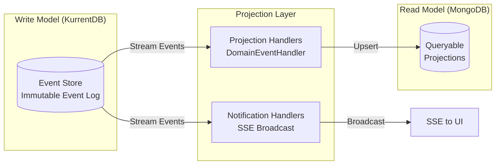
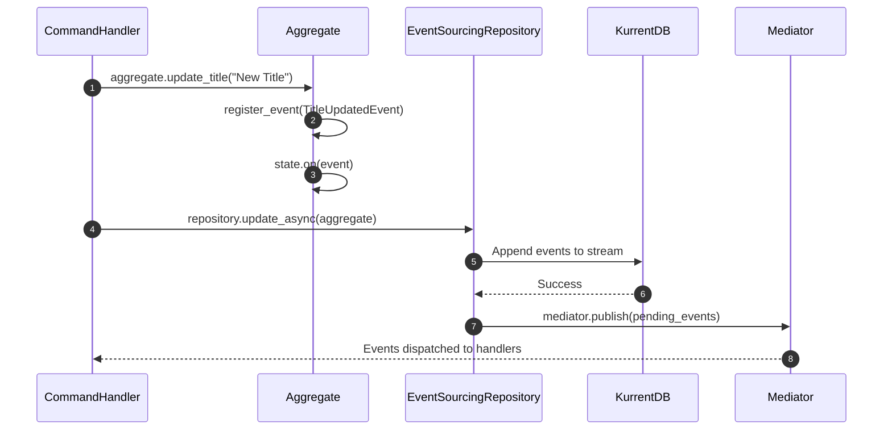
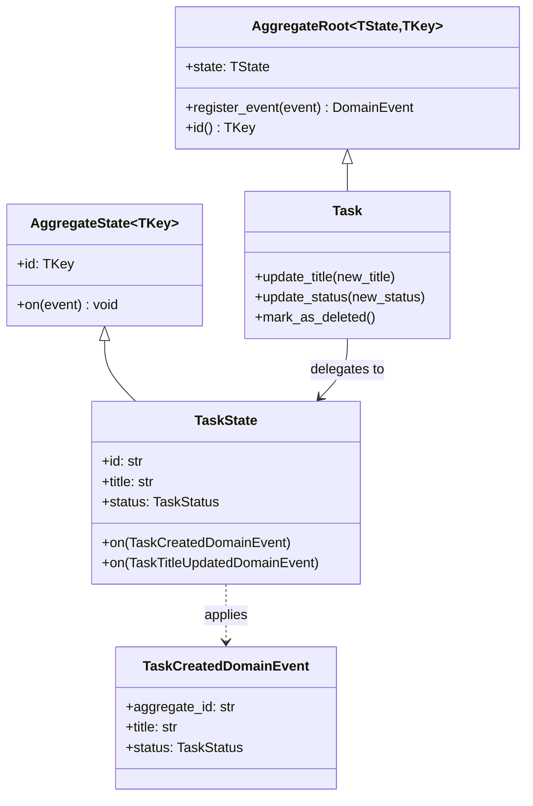

# Event Sourcing Architecture

This document explains how Event Sourcing is implemented in the MCP Tools Provider, including the flow from aggregate state changes through to Read Model projections and real-time UI updates.

## Overview

Event Sourcing captures all changes to application state as a sequence of immutable events. Instead of storing only the current state, every state transition is recorded, providing:

- **Complete audit trail** of all changes
- **Temporal queries** ("what was the state at time X?")
- **Event replay** for rebuilding read models
- **Loose coupling** between write and read operations



## The Event Flow Pipeline

### Step 1: Aggregate State Change

When a command modifies domain state, the aggregate:

1. Creates a domain event with all relevant data
2. Registers the event with `register_event()`
3. Applies the event to its internal state via `state.on(event)`

```python
# src/domain/entities/task.py
class Task(AggregateRoot[TaskState, str]):
    def update_title(self, new_title: str) -> bool:
        if self.state.title == new_title:
            return False

        # 1. Create and register the event
        self.state.on(
            self.register_event(
                TaskTitleUpdatedDomainEvent(
                    aggregate_id=self.id(),
                    new_title=new_title,
                )
            )
        )
        return True
```

### Step 2: Event Persistence

The `EventSourcingRepository` persists events to KurrentDB:



### Step 3: Projection to Read Model

Projection handlers implement `DomainEventHandler[TEvent]` and update MongoDB:

```python
# src/application/events/domain/task_projection_handlers.py
class TaskTitleUpdatedProjectionHandler(DomainEventHandler[TaskTitleUpdatedDomainEvent]):
    def __init__(self, repository: Repository[TaskDto, str]):
        super().__init__()
        self._repository = repository

    async def handle_async(self, event: TaskTitleUpdatedDomainEvent) -> None:
        logger.info(f"Projecting TaskTitleUpdated: {event.aggregate_id}")

        # Fetch current read model
        task = await self._repository.get_async(event.aggregate_id)
        if task:
            # Apply update
            task.title = event.new_title
            task.updated_at = datetime.now(timezone.utc)
            await self._repository.update_async(task)
```

### Step 4: Real-Time SSE Notification

Notification handlers broadcast events to connected admin clients:

```python
# src/application/events/domain/admin_sse_notification_handlers.py
class SourceRegisteredNotificationHandler(DomainEventHandler[SourceRegisteredDomainEvent]):
    async def handle_async(self, event: SourceRegisteredDomainEvent) -> None:
        await broadcast_source_event(
            action="registered",
            source_id=event.aggregate_id,
            source_name=event.name,
            details={
                "url": event.url,
                "source_type": str(event.source_type),
            },
        )
```

## Domain Events with CloudEvent Decorator

All domain events are decorated with `@cloudevent` for standardized event metadata:

```python
# src/domain/events/task.py
from neuroglia.eventing.cloud_events.decorators import cloudevent

@cloudevent("task.title.updated.v1")  # CloudEvent type
@dataclass
class TaskTitleUpdatedDomainEvent(DomainEvent):
    aggregate_id: str
    new_title: str

    def __init__(self, aggregate_id: str, new_title: str):
        super().__init__(aggregate_id)
        self.aggregate_id = aggregate_id
        self.new_title = new_title
```

The `@cloudevent` decorator enables:

- **Standardized `type` field** for event routing
- **Version management** (e.g., `task.created.v1` → `task.created.v2`)
- **Cross-platform compatibility** with CloudEvents spec

## Aggregate State Pattern

The Neuroglia framework separates aggregate behavior (`AggregateRoot`) from state storage (`AggregateState`):



### Why Separate State?

1. **Event Replay**: State can be rebuilt by replaying events through `on()` handlers
2. **Serialization**: State is a pure data container, easily serializable
3. **Testing**: State can be tested independently of behavior
4. **Clarity**: Behavior methods return domain outcomes, state handlers update fields

## Event Handler Discovery

Handlers are auto-discovered by the Mediator based on package configuration:

```python
# src/main.py
Mediator.configure(
    builder,
    [
        "application.commands",
        "application.queries",
        "application.events.domain",      # Projection handlers here
        "application.events.integration",
    ],
)
```

The `application.events.domain` package exports all handlers:

```python
# src/application/events/domain/__init__.py
from .task_projection_handlers import (
    TaskCreatedProjectionHandler,
    TaskTitleUpdatedProjectionHandler,
    # ...
)
from .admin_sse_notification_handlers import (
    SourceRegisteredNotificationHandler,
    ToolEnabledNotificationHandler,
    # ...
)
```

## Write Model vs Read Model Configuration

The `DataAccessLayer` helper configures both models:

```python
# src/main.py

# Write Model: Event Sourcing with KurrentDB
DataAccessLayer.WriteModel(
    database_name=app_settings.database_name,
    consumer_group=app_settings.consumer_group,
    delete_mode=DeleteMode.HARD,
).configure(builder, ["domain.entities"])

# Read Model: MongoDB with Motor repositories
DataAccessLayer.ReadModel(
    database_name=app_settings.database_name,
    repository_type="motor",
    repository_mappings={
        TaskDtoRepository: MotorTaskDtoRepository,
        SourceDtoRepository: MotorSourceDtoRepository,
        # ...
    },
).configure(builder, ["integration.models", "application.events.domain"])
```

## Idempotency in Projections

Projection handlers implement idempotency to handle event replay:

```python
class TaskCreatedProjectionHandler(DomainEventHandler[TaskCreatedDomainEvent]):
    async def handle_async(self, event: TaskCreatedDomainEvent) -> None:
        # Idempotency check - skip if already exists
        existing = await self._repository.get_async(event.aggregate_id)
        if existing:
            logger.info(f"Task already exists, skipping: {event.aggregate_id}")
            return

        # Create new DTO
        task_dto = TaskDto(
            id=event.aggregate_id,
            title=event.title,
            # ...
        )
        await self._repository.add_async(task_dto)
```

## Complete Event Types

### Source Events

| Event | CloudEvent Type | Triggered By |
|-------|----------------|--------------|
| `SourceRegisteredDomainEvent` | `source.registered.v1` | `RegisterSourceCommand` |
| `InventoryIngestedDomainEvent` | `source.inventory.ingested.v1` | `RefreshInventoryCommand` |
| `SourceHealthChangedDomainEvent` | `source.health.changed.v1` | Health check background job |
| `SourceDeregisteredDomainEvent` | `source.deregistered.v1` | `DeleteSourceCommand` |

### Tool Events

| Event | CloudEvent Type | Triggered By |
|-------|----------------|--------------|
| `SourceToolDiscoveredDomainEvent` | `tool.discovered.v1` | Inventory refresh |
| `SourceToolEnabledDomainEvent` | `tool.enabled.v1` | `EnableToolCommand` |
| `SourceToolDisabledDomainEvent` | `tool.disabled.v1` | `DisableToolCommand` |
| `SourceToolDeprecatedDomainEvent` | `tool.deprecated.v1` | Inventory refresh (tool removed upstream) |

### Task Events (Demo)

| Event | CloudEvent Type | Triggered By |
|-------|----------------|--------------|
| `TaskCreatedDomainEvent` | `task.created.v1` | `CreateTaskCommand` |
| `TaskTitleUpdatedDomainEvent` | `task.title.updated.v1` | `UpdateTaskCommand` |
| `TaskStatusUpdatedDomainEvent` | `task.status.updated.v1` | `UpdateTaskCommand` |
| `TaskDeletedDomainEvent` | `task.deleted.v1` | `DeleteTaskCommand` |

## Debugging Event Flow

### Enable Debug Logging

```bash
LOG_LEVEL=DEBUG make run
```

### Check Event Store (KurrentDB UI)

Access `http://localhost:2113` and navigate to:

- **Stream Browser**: View individual aggregate streams (e.g., `task-<uuid>`)
- **Category Stream**: View all events (`$ce-tools_provider`)

### Verify MongoDB Projections

```bash
# Connect to Mongo Express
open http://localhost:8043

# Or use mongosh
mongosh "mongodb://localhost:27017/tools_provider"
db.tasks.find()
db.sources.find()
```

## Code References

| Concept | File Location |
|---------|---------------|
| Aggregate with Events | `src/domain/entities/task.py` |
| Domain Events | `src/domain/events/task.py` |
| Projection Handlers | `src/application/events/domain/task_projection_handlers.py` |
| SSE Notification Handlers | `src/application/events/domain/admin_sse_notification_handlers.py` |
| DataAccessLayer Config | `src/main.py` |
| Handler Package Exports | `src/application/events/domain/__init__.py` |
