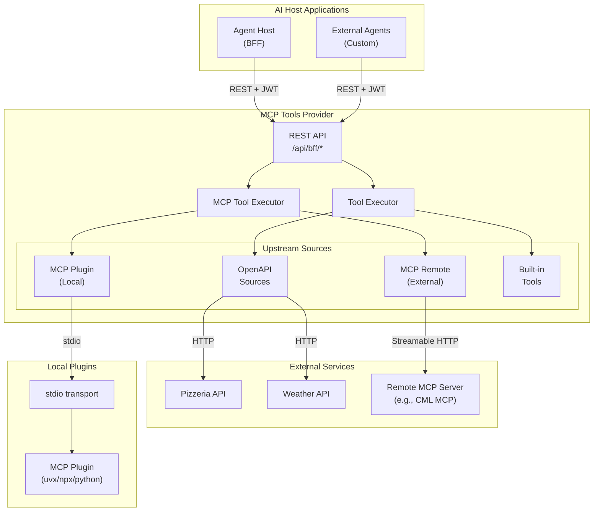
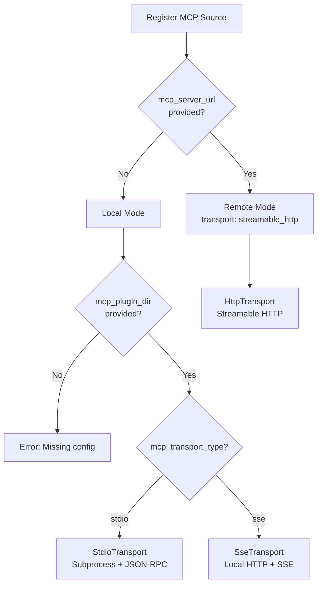
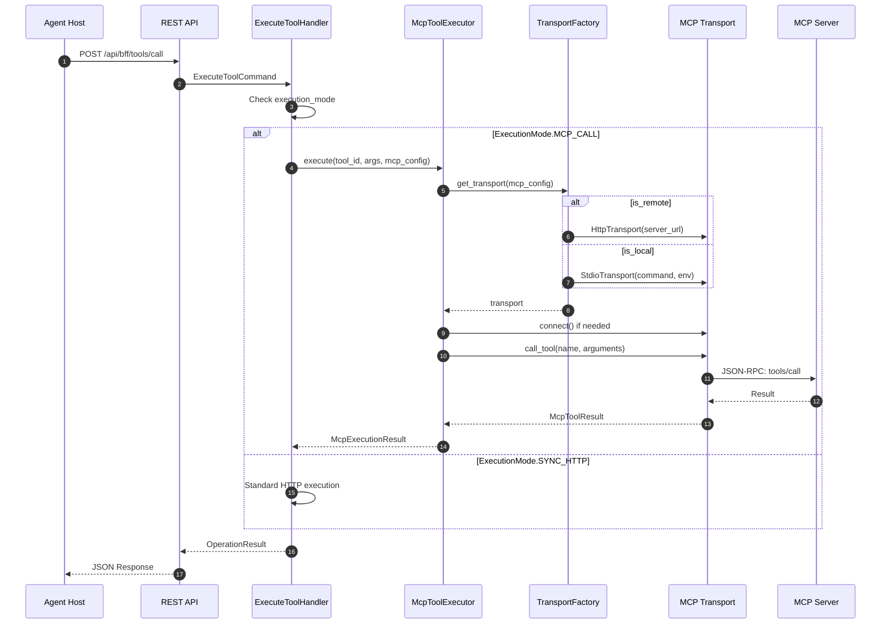

# Architecture Decision Record: MCP Protocol Strategy

**ADR-005: MCP Tools Provider - Hybrid MCP Integration**
**Date:** December 5, 2025
**Updated:** December 15, 2025
**Status:** Accepted
**Deciders:** Principal Engineer, System Architect

## Context

The MCP Tools Provider needs to serve tools to AI agents from multiple source types:

1. **OpenAPI Services** - REST APIs with OpenAPI specifications
2. **MCP Servers** - Native Model Context Protocol servers (local plugins or remote)
3. **Built-in Tools** - Utility tools bundled with the provider

The original question was whether to implement MCP-compliant JSON-RPC endpoints for agent communication. A broader question emerged: **How do we integrate with upstream MCP servers while maintaining our security model?**

## Decision

**Dual Strategy:**

1. **External API**: Maintain our purpose-built REST API for Host Applications (BFF pattern) - we do NOT expose MCP JSON-RPC endpoints externally
2. **Upstream Integration**: Support MCP servers as tool sources with two modes:
   - **Plugin Mode** (local): Spawn MCP servers as subprocesses via stdio transport
   - **Remote Mode**: Connect to external MCP servers via Streamable HTTP transport

## Architecture Overview



## Rationale

### 1. External API: REST over MCP JSON-RPC

| Aspect | Standard MCP Protocol | Our REST API |
|--------|----------------------|--------------|
| **Identity Model** | Machine identity (static API key) | End-user identity (dynamic JWT) |
| **Token Source** | Static configuration | OAuth2 user session |
| **Tool Filtering** | Server-side, usually static | Dynamic, based on JWT claims |
| **Token Exchange** | Not part of MCP spec | **Core requirement** |

Standard MCP clients (Claude Desktop, VS Code) cannot:

- Perform OAuth2 login flows
- Inject per-user JWT tokens
- Refresh expired tokens dynamically

### 2. MCP Server Integration: Why Both Modes?

| Mode | Use Case | Transport | Lifecycle |
|------|----------|-----------|-----------|
| **Plugin** | Existing MCP packages (uvx, npx) | stdio | Managed by Tools Provider |
| **Remote** | Dedicated MCP services, shared infrastructure | Streamable HTTP | External management |

**Plugin Mode Benefits:**

- Leverage npm/PyPI ecosystem of MCP tools
- No infrastructure overhead
- Strong isolation via subprocess

**Remote Mode Benefits:**

- Shared state across multiple clients
- External scaling and management
- Suited for complex or stateful tools

## MCP Source Types

### Source Type Enumeration

The system supports four source types via `SourceType` enum:

```python
class SourceType(str, Enum):
    OPENAPI = "openapi"   # OpenAPI 3.x specification
    WORKFLOW = "workflow" # Workflow engine (future)
    BUILTIN = "builtin"   # Built-in utility tools
    MCP = "mcp"           # Model Context Protocol plugin/server
```

### Execution Mode

Tools declare their execution mode via `ExecutionMode`:

```python
class ExecutionMode(str, Enum):
    SYNC_HTTP = "sync_http"    # Standard HTTP request/response
    ASYNC_POLL = "async_poll"  # Async trigger with polling
    MCP_CALL = "mcp_call"      # Execute via MCP protocol
```

## MCP Transport Types

Three transport mechanisms are supported:

```python
class McpTransportType(str, Enum):
    STDIO = "stdio"              # Subprocess stdin/stdout JSON-RPC
    SSE = "sse"                  # Server-Sent Events (local subprocess)
    STREAMABLE_HTTP = "streamable_http"  # Remote server via HTTP
```

### Transport Selection Flow



## MCP Source Configuration

### McpSourceConfig Value Object

Configuration for MCP sources is encapsulated in `McpSourceConfig`:

```python
@dataclass(frozen=True)
class McpSourceConfig:
    manifest_path: str          # Path to server.json (empty for remote)
    plugin_dir: str             # Plugin directory (empty for remote)
    transport_type: McpTransportType
    lifecycle_mode: PluginLifecycleMode
    runtime_hint: str           # uvx, npx, python, etc.
    command: list[str]          # Command to start server
    environment: dict[str, str] # Resolved environment variables
    env_definitions: list[McpEnvironmentVariable]
    server_url: str | None      # URL for remote servers

    @property
    def is_remote(self) -> bool:
        """Check if this is a remote MCP server."""
        return (self.transport_type == McpTransportType.STREAMABLE_HTTP
                and self.server_url is not None)
```

### Registration Examples

**Local Plugin (stdio):**

```json
{
  "name": "GitHub MCP",
  "url": "mcp://github-plugin",
  "source_type": "mcp",
  "mcp_plugin_dir": "/opt/mcp-plugins/github",
  "mcp_transport_type": "stdio",
  "mcp_runtime_hint": "uvx",
  "mcp_env_vars": {
    "GITHUB_TOKEN": "ghp_xxx..."
  }
}
```

**Remote Server (Streamable HTTP):**

```json
{
  "name": "CML MCP Server",
  "url": "http://cml-mcp:9000",
  "source_type": "mcp",
  "mcp_server_url": "http://cml-mcp:9000",
  "mcp_transport_type": "streamable_http"
}
```

## Tool Execution Flow

### MCP Tool Execution



## BFF API Design

The BFF API remains REST-based under `/api/bff/` prefix:

| Endpoint | Method | Purpose |
|----------|--------|---------|
| `/api/bff/tools` | GET | List tools accessible to the authenticated user |
| `/api/bff/tools/call` | POST | Execute a tool with user's identity delegation |
| `/api/bff/sse` | GET | SSE stream for real-time tool updates |

### Authentication

All endpoints require `Authorization: Bearer <user_jwt>` header where:

- The JWT is the **end-user's** access token from Keycloak
- The Host App obtains this token via standard OAuth2 flow
- The token is used for:
  1. Access policy evaluation (tool filtering)
  2. RFC 8693 token exchange (identity delegation to upstream services)

## Consequences

### Positive

- **Unified tool abstraction**: OpenAPI, MCP, and built-in tools exposed through same API
- **MCP ecosystem access**: Can use existing MCP plugins from npm/PyPI
- **Flexible deployment**: Local plugins OR remote servers based on needs
- **Security preserved**: BFF pattern maintained with JWT-based access control
- **No external MCP exposure**: Attack surface remains controlled

### Negative

- **Additional complexity**: MCP transport layer adds code paths
- **Plugin management**: Local plugins need lifecycle management
- **No direct MCP client support**: Still cannot use Claude Desktop directly

### Mitigations

- Transport abstraction (`IMcpTransport`) isolates complexity
- Plugin lifecycle modes (`transient` vs `singleton`) manage resources
- Reference implementation in `agent-host` demonstrates integration

## Related Documents

- [MCP Tools Architecture](./mcp-tools.md) - Detailed MCP integration guide
- [Source Registration](../implementation/source-registration.md) - How to register sources
- [Tool Discovery](../implementation/tool-discovery.md) - How tools are discovered
- [Token Exchange Setup Guide](../security/keycloak-token-exchange-setup.md)

## References

- [Model Context Protocol Specification](https://modelcontextprotocol.io/specification)
- [MCP Transports](https://modelcontextprotocol.io/docs/concepts/transports)
- [RFC 8693: OAuth 2.0 Token Exchange](https://datatracker.ietf.org/doc/html/rfc8693)
