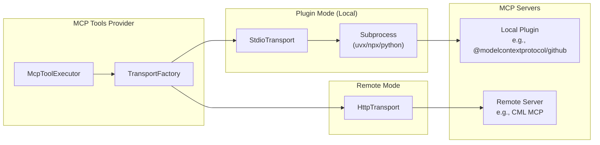
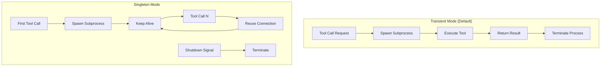
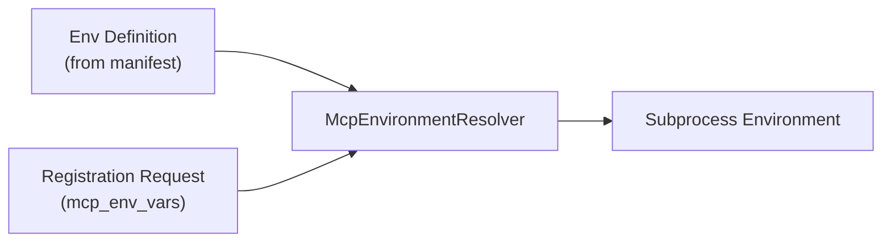
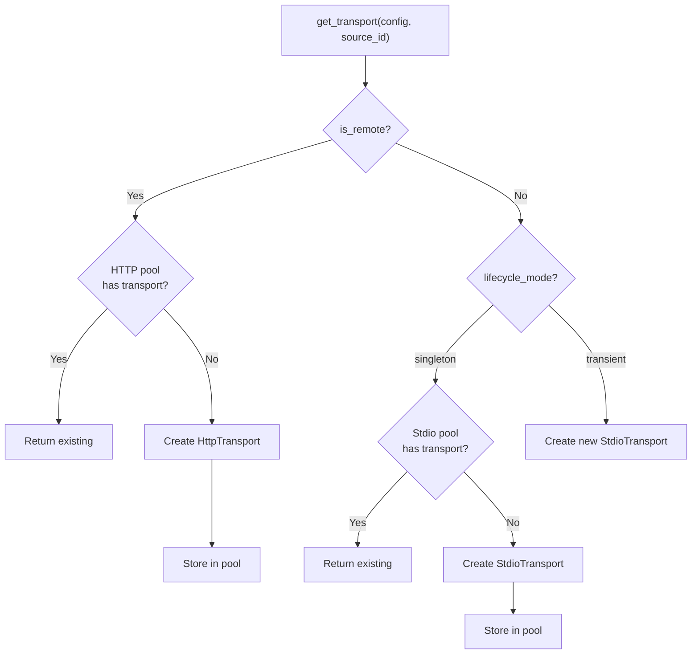
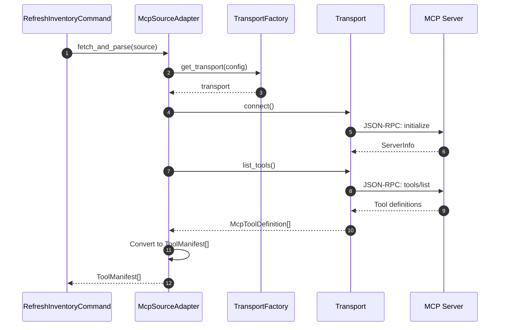
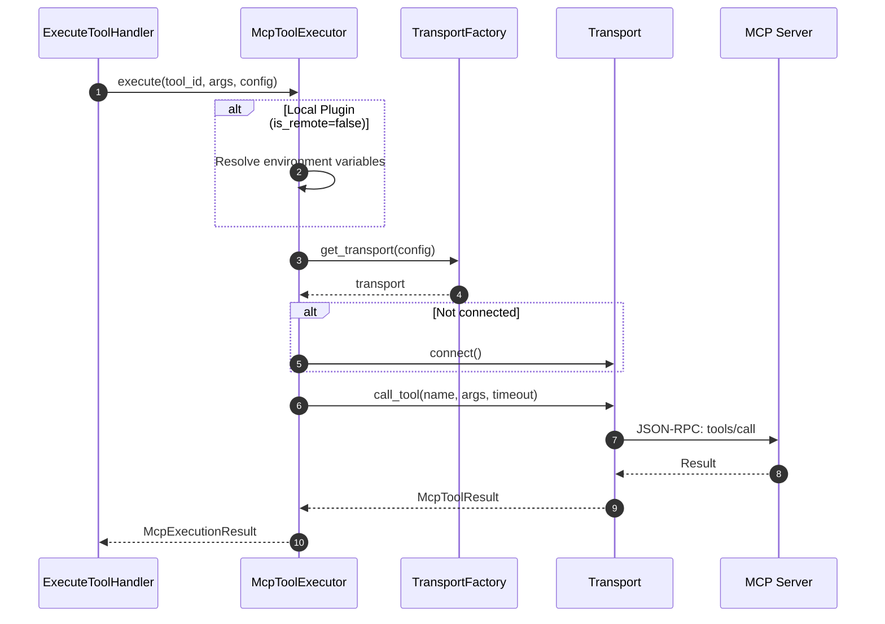

# MCP Tools Architecture

This document describes how the MCP Tools Provider integrates with Model Context Protocol (MCP) servers as upstream tool sources.

!!! info "Prerequisites"
    Before reading this document, familiarize yourself with:

    - [MCP Protocol Decision ADR](./mcp-protocol-decision.md) - Why we use this architecture
    - [Source Registration](../implementation/source-registration.md) - How sources are registered

## Overview

The MCP Tools Provider supports two modes for integrating MCP servers:

| Mode | Description | Transport | Use Case |
|------|-------------|-----------|----------|
| **Plugin** | Local subprocess spawned by the provider | `stdio` or `sse` | NPM/PyPI MCP packages |
| **Remote** | External MCP server running independently | `streamable_http` | Dedicated services |



## Plugin Mode (Local MCP Servers)

Plugin mode spawns MCP servers as subprocesses, communicating via JSON-RPC over stdin/stdout.

### When to Use Plugin Mode

- Using MCP packages from npm (`npx`) or PyPI (`uvx`)
- Single-tenant scenarios (one provider instance per user)
- Tools that don't require shared state across clients
- Development and testing of MCP servers

### Plugin Configuration

Register a local plugin source with `source_type: "mcp"` and `mcp_plugin_dir`:

```json
{
  "name": "GitHub MCP",
  "url": "mcp://github-plugin",
  "source_type": "mcp",
  "mcp_plugin_dir": "/opt/mcp-plugins/github",
  "mcp_transport_type": "stdio",
  "mcp_runtime_hint": "uvx",
  "mcp_lifecycle_mode": "transient",
  "mcp_env_vars": {
    "GITHUB_TOKEN": "ghp_xxx..."
  }
}
```

| Field | Required | Description |
|-------|----------|-------------|
| `mcp_plugin_dir` | Yes | Directory containing the plugin manifest (`plugin.json` or `server.json`) |
| `mcp_transport_type` | No | `stdio` (default) or `sse` |
| `mcp_runtime_hint` | No | Runtime: `uvx`, `npx`, `python`, `node`, `docker` |
| `mcp_lifecycle_mode` | No | `transient` (default) or `singleton` |
| `mcp_env_vars` | No | Environment variables for the subprocess |
| `mcp_command` | No | Custom command (overrides manifest) |
| `mcp_args` | No | Additional command arguments |

### Plugin Lifecycle Modes



| Mode | Behavior | Use Case |
|------|----------|----------|
| `transient` | Start process per call, terminate after | Stateless tools, resource cleanup |
| `singleton` | Keep process running, reuse across calls | Stateful tools, faster execution |

### Plugin Manifest (plugin.json)

The plugin directory must contain a manifest file describing the MCP server:

```json
{
  "name": "@modelcontextprotocol/github",
  "version": "1.0.0",
  "description": "GitHub MCP server for repository operations",
  "packages": [
    {
      "name": "default",
      "transport_type": "stdio",
      "runtime": "uvx",
      "command": ["mcp-server-github"],
      "environment_variables": [
        {
          "name": "GITHUB_TOKEN",
          "description": "GitHub Personal Access Token",
          "required": true,
          "secret": true
        }
      ]
    }
  ]
}
```

### Environment Variable Resolution

Environment variables are resolved at execution time:



The `McpEnvironmentResolver` validates that required variables are provided and marks secrets appropriately.

## Remote Mode (External MCP Servers)

Remote mode connects to externally-managed MCP servers via HTTP.

### When to Use Remote Mode

- Shared MCP servers across multiple clients
- Complex or stateful tools requiring persistent connections
- MCP servers requiring external scaling/management
- Integration with existing MCP infrastructure

### Remote Server Configuration

Register a remote MCP source with `mcp_server_url`:

```json
{
  "name": "CML MCP Server",
  "url": "http://cml-mcp:9000",
  "source_type": "mcp",
  "mcp_server_url": "http://cml-mcp:9000",
  "mcp_transport_type": "streamable_http",
  "mcp_env_vars": {
    "API_KEY": "optional-auth-header"  // pragma: allowlist secret
  }
}
```

| Field | Required | Description |
|-------|----------|-------------|
| `mcp_server_url` | Yes | Base URL of the remote MCP server |
| `mcp_transport_type` | No | Must be `streamable_http` for remote |
| `mcp_env_vars` | No | Headers/auth for the HTTP connection |

### Remote Server Requirements

Remote MCP servers must implement the [MCP Streamable HTTP Transport](https://modelcontextprotocol.io/docs/concepts/transports#http-with-sse):

- POST endpoint for JSON-RPC requests
- SSE endpoint for server-initiated messages
- Support for `initialize`, `tools/list`, and `tools/call` methods

## Transport Implementation

### Transport Interface

All transports implement the `IMcpTransport` interface:

```python
class IMcpTransport(ABC):
    """Abstract base class for MCP transport implementations."""

    @abstractmethod
    async def connect(self) -> McpServerInfo:
        """Establish connection and perform MCP handshake."""
        ...

    @abstractmethod
    async def disconnect(self) -> None:
        """Close the connection gracefully."""
        ...

    @abstractmethod
    async def list_tools(self) -> list[McpToolDefinition]:
        """Discover available tools from the server."""
        ...

    @abstractmethod
    async def call_tool(
        self,
        tool_name: str,
        arguments: dict[str, Any],
        timeout: float | None = None,
    ) -> McpToolResult:
        """Execute a tool call."""
        ...

    @property
    @abstractmethod
    def is_connected(self) -> bool:
        """Check if connected and ready."""
        ...
```

### Transport Factory

The `TransportFactory` creates and pools transports:



### StdioTransport

Manages subprocess lifecycle and JSON-RPC communication:

```python
class StdioTransport(IMcpTransport):
    """Transport for MCP servers running as subprocesses."""

    def __init__(
        self,
        command: list[str],
        environment: dict[str, str],
        working_dir: str | None = None,
    ):
        self._command = command
        self._environment = environment
        self._process: asyncio.subprocess.Process | None = None
```

**Key behaviors:**

- Spawns subprocess with specified command and environment
- Reads/writes JSON-RPC messages via stdin/stdout
- Handles process lifecycle (start, monitor, terminate)
- Implements connection timeout and error recovery

### HttpTransport

Manages HTTP connections to remote MCP servers:

```python
class HttpTransport(IMcpTransport):
    """Transport for remote MCP servers via Streamable HTTP."""

    def __init__(
        self,
        server_url: str,
        headers: dict[str, str] | None = None,
    ):
        self._server_url = server_url
        self._headers = headers or {}
```

**Key behaviors:**

- Sends JSON-RPC requests via HTTP POST
- Maintains session for connection reuse
- Handles authentication headers
- Supports streaming responses (SSE)

## Tool Discovery

When an MCP source is registered, tool discovery is automatic:



Each discovered tool becomes a `SourceTool` aggregate with:

- `execution_profile.mode = ExecutionMode.MCP_CALL`
- Full JSON schema for parameters
- Reference to parent MCP source

## Tool Execution

MCP tools are executed via the `McpToolExecutor`:



### Execution Result

```python
@dataclass
class McpExecutionResult:
    success: bool
    content: list[dict[str, Any]]  # Text, images, etc.
    is_error: bool = False
    error: str | None = None
    execution_time_ms: float = 0.0
    metadata: dict[str, Any] | None = None

    def get_text(self) -> str:
        """Get combined text from all text content blocks."""
        ...
```

## Error Handling

### Transport Errors

```python
class McpTransportError(Exception):
    """Base exception for transport errors."""

class McpConnectionError(McpTransportError):
    """Failed to establish connection."""

class McpProtocolError(McpTransportError):
    """Invalid MCP protocol message."""

class McpTimeoutError(McpTransportError):
    """Timeout waiting for response."""
```

### Error Recovery

| Error Type | Recovery Strategy |
|------------|-------------------|
| Connection failure | Retry with backoff, mark source unhealthy |
| Timeout | Return error result, log for monitoring |
| Protocol error | Log details, return error result |
| Process crash (local) | Restart subprocess on next call |

## Configuration Reference

### McpSourceConfig

The complete configuration object for MCP sources:

```python
@dataclass(frozen=True)
class McpSourceConfig:
    manifest_path: str                    # Path to manifest file
    plugin_dir: str                       # Plugin directory
    transport_type: McpTransportType      # stdio/sse/streamable_http
    lifecycle_mode: PluginLifecycleMode   # transient/singleton
    runtime_hint: str                     # uvx/npx/python/node
    command: list[str]                    # Startup command
    environment: dict[str, str]           # Resolved env vars
    env_definitions: list[McpEnvironmentVariable]
    server_url: str | None                # Remote server URL
```

### McpTransportType

```python
class McpTransportType(str, Enum):
    STDIO = "stdio"              # Local subprocess
    SSE = "sse"                  # Local with SSE (future)
    STREAMABLE_HTTP = "streamable_http"  # Remote HTTP
```

### PluginLifecycleMode

```python
class PluginLifecycleMode(str, Enum):
    TRANSIENT = "transient"  # Start/stop per call
    SINGLETON = "singleton"  # Keep alive
```

## Best Practices

### Local Plugins

1. **Use transient mode for stateless tools** - Ensures clean state and resource cleanup
2. **Provide all required env vars at registration** - Avoids runtime failures
3. **Test plugins locally first** - Use `uvx` or `npx` directly to verify behavior
4. **Monitor subprocess health** - Check logs for startup/shutdown issues

### Remote Servers

1. **Implement health checks** - Ensure server availability before registration
2. **Use connection pooling** - Reduce handshake overhead
3. **Set appropriate timeouts** - Balance responsiveness and reliability
4. **Secure connections** - Use HTTPS in production, authenticate requests

### General

1. **Version your MCP servers** - Track changes to tool schemas
2. **Log tool execution metrics** - Monitor performance and errors
3. **Test with realistic data** - Validate argument handling and edge cases

## Related Documents

- [MCP Protocol Decision](./mcp-protocol-decision.md) - Architecture decision record
- [Source Registration](../implementation/source-registration.md) - Registration flow
- [Tool Discovery](../implementation/tool-discovery.md) - Discovery mechanism
- [Tool Execution](../implementation/tool-execution.md) - Execution flow

## External References

- [Model Context Protocol Specification](https://modelcontextprotocol.io/specification)
- [MCP Transports](https://modelcontextprotocol.io/docs/concepts/transports)
- [MCP Server Examples](https://github.com/modelcontextprotocol/servers)
