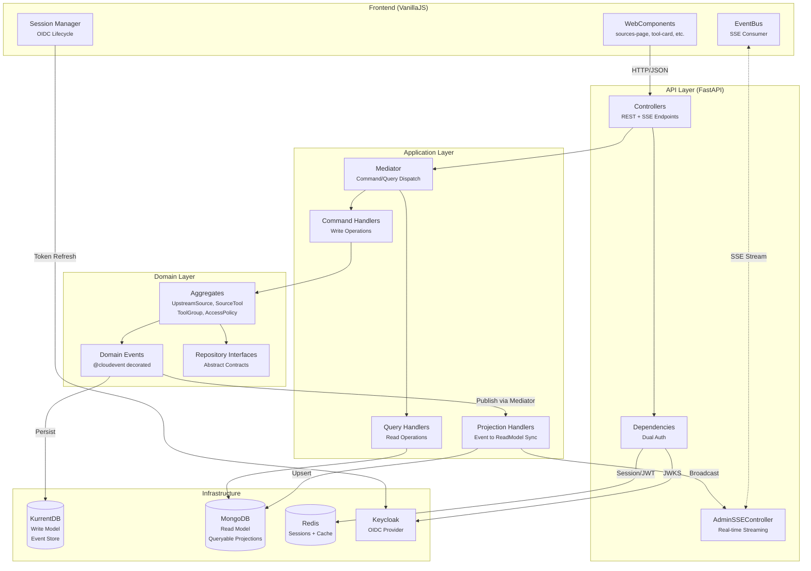
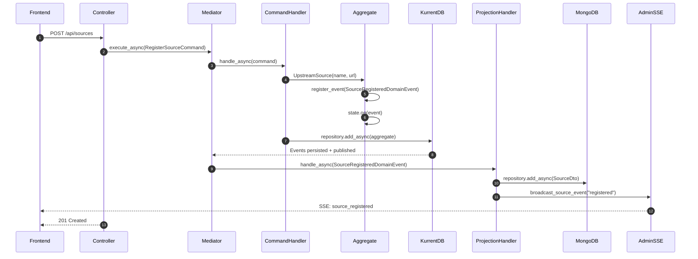
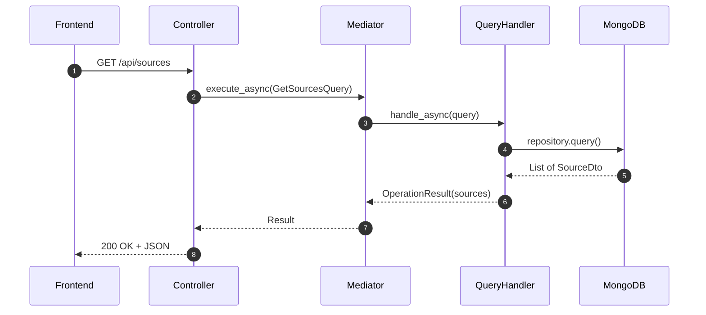
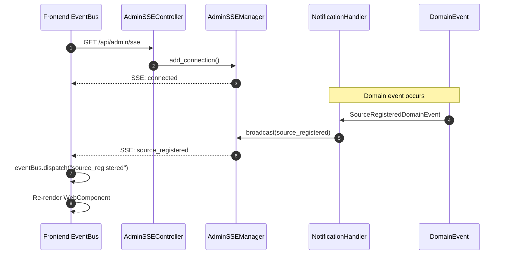

# Architecture Overview

This project is built using the **neuroglia-python** framework, implementing a **Domain-Driven Design (DDD)** architecture with **CQRS** (Command Query Responsibility Segregation) and **Event Sourcing** patterns.

!!! info "Framework Documentation"
    - **GitHub Repository**: [https://github.com/bvandewe/pyneuro](https://github.com/bvandewe/pyneuro)
    - **Public Documentation**: [https://bvandewe.github.io/pyneuro/](https://bvandewe.github.io/pyneuro/)

## System Overview

The MCP Tools Provider is a **dynamic projection engine** that discovers, normalizes, and serves MCP (Model Context Protocol) tools to AI Agents.

## Layer Responsibilities

### Domain Layer (`src/domain/`)

Pure domain model with no external dependencies.

| Component | Location | Responsibility |
|-----------|----------|----------------|
| **Aggregates** | `entities/` | Business logic, invariant enforcement, event generation |
| **Domain Events** | `events/` | Immutable facts decorated with `@cloudevent` |
| **Repository Interfaces** | `repositories/` | Abstract contracts for persistence |
| **Enums** | `enums/` | Domain value objects (TaskStatus, HealthStatus, etc.) |

**Key Entities:**

- `UpstreamSource` - OpenAPI service registration with health monitoring
- `SourceTool` - Individual tool/endpoint discovered from a source
- `ToolGroup` - Curated tool collections with pattern selectors
- `AccessPolicy` - RBAC policy definitions for tool access
- `Label` - Tool categorization metadata
- `Task` - Example aggregate for demonstration

### Application Layer (`src/application/`)

Orchestrates domain operations via CQRS handlers.

| Component | Location | Responsibility |
|-----------|----------|----------------|
| **Commands** | `commands/` | Write operations (CreateTask, RegisterSource, etc.) |
| **Queries** | `queries/` | Read operations (GetTasks, GetSources, etc.) |
| **Domain Event Handlers** | `events/domain/` | Projection handlers syncing to Read Model |
| **Integration Event Handlers** | `events/integration/` | Cross-boundary event processing |
| **Settings** | `settings.py` | Environment configuration |

### API Layer (`src/api/`)

REST controllers and authentication.

| Component | Location | Responsibility |
|-----------|----------|----------------|
| **Controllers** | `controllers/` | HTTP endpoints using `classy-fastapi` |
| **Dependencies** | `dependencies.py` | FastAPI DI for auth (`get_current_user`, `require_roles`) |
| **Services** | `services/` | Auth service, OpenAPI configuration |

### Infrastructure Layer (`src/infrastructure/`)

External service adapters.

| Component | Responsibility |
|-----------|----------------|
| `RedisSessionStore` | Server-side session storage |
| `RedisCacheService` | Tool manifest caching |
| `KeycloakTokenExchanger` | Token exchange for upstream calls |

### Integration Layer (`src/integration/`)

Concrete repository implementations and DTOs.

| Component | Location | Responsibility |
|-----------|----------|----------------|
| **DTOs** | `models/` | Queryable read model entities (`@queryable` decorated) |
| **Repositories** | `repositories/` | Motor (MongoDB) implementations |

### UI Layer (`src/ui/`)

Frontend built with Parcel, Nunjucks templates, and VanillaJS WebComponents.

| Component | Location | Responsibility |
|-----------|----------|----------------|
| **WebComponents** | `src/scripts/components/` | Reusable UI elements (`<source-card>`, etc.) |
| **Pages** | `src/scripts/pages/` | Full-page components (`<sources-page>`, etc.) |
| **EventBus** | `src/scripts/core/event-bus.js` | SSE consumer and pub/sub dispatcher |
| **Session Manager** | `src/scripts/core/session-manager.js` | OIDC lifecycle management |

## Data Flow Patterns

### Command Flow (Write Path)

### Query Flow (Read Path)

### Real-Time Update Flow (SSE)

## Key Architectural Decisions

### 1. Event Sourcing with Separate Read Model

- **Write Model**: KurrentDB (EventStoreDB) stores all domain events as immutable facts
- **Read Model**: MongoDB provides optimized query projections
- **Sync**: Projection handlers listen to domain events and update MongoDB

### 2. Dual Authentication

- **Session Cookies**: Browser clients use httpOnly cookies backed by Redis
- **JWT Bearer Tokens**: API clients use RS256 tokens from Keycloak

### 3. CloudEvent Integration

All domain events are decorated with `@cloudevent("type.v1")` enabling:

- Cross-platform event publishing
- Event replay capabilities
- Audit trail generation

### 4. Shadow-Free WebComponents

UI components render directly to `innerHTML` (no Shadow DOM) for:

- Bootstrap 5 style compatibility
- Simpler debugging
- Global CSS access

## Code References

| Concept | Primary File |
|---------|-------------|
| Aggregate Pattern | `src/domain/entities/task.py` |
| Command Handler | `src/application/commands/create_task_command.py` |
| Projection Handler | `src/application/events/domain/task_projection_handlers.py` |
| SSE Notifications | `src/application/events/domain/admin_sse_notification_handlers.py` |
| Dual Auth | `src/api/dependencies.py` |
| EventBus (Frontend) | `src/ui/src/scripts/core/event-bus.js` |
| WebComponent Example | `src/ui/src/scripts/components/source-card.js` |
