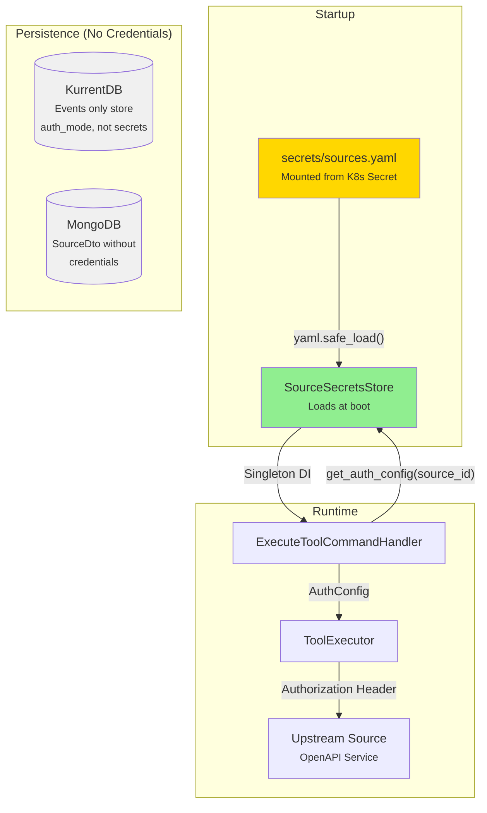

# Secret Management Architecture

This document describes the architecture for managing authentication credentials for upstream sources. Credentials are stored externally from the event stream and database, loaded from a YAML file at startup.

## Overview

The MCP Tools Provider connects to upstream OpenAPI services (sources) that may require authentication. Since Event Sourcing stores all events immutably, storing credentials in the event stream would create security and compliance issues. Similarly, storing plaintext credentials in MongoDB provides no additional security benefit.

The solution treats **source credentials as infrastructure configuration** rather than dynamic application data, following the [12-Factor App](https://12factor.net/config) principle of separating config from code.



## Design Decisions

### Why Not Store in EventStore?

Event Sourcing requires events to be **immutable** and **replayable**. Storing credentials would:

- Expose secrets in event replays and projections
- Make credential rotation complex (old events retain old credentials)
- Create audit/compliance concerns (who accessed the stream?)

### Why Not Store in MongoDB?

MongoDB provides no additional security over EventStore:

- Both are unencrypted at rest by default
- Both require the same network access controls
- Neither solves the "credentials in application data" problem

### File-Based Approach Benefits

| Benefit | Description |
|---------|-------------|
| **Kubernetes Native** | Secrets mount directly as files; no application changes for rotation |
| **GitOps Compatible** | Secrets managed via sealed-secrets, external-secrets, or vault-injector |
| **Clear Separation** | Credentials are infrastructure config, not application state |
| **Audit Trail** | K8s tracks who modified secrets; app doesn't log credentials |

## Component Architecture

### SourceSecretsStore

Location: `src/tools-provider/infrastructure/secrets/source_secrets_store.py`

```python
class SourceSecretsStore:
    """File-based secrets store for source authentication credentials."""

    def __init__(self, secrets_path: str | Path | None = None):
        """Load credentials at initialization."""

    def get_auth_config(self, source_id: str) -> AuthConfig | None:
        """Retrieve credentials for a source."""

    def has_credentials(self, source_id: str) -> bool:
        """Check if credentials exist."""

    def reload(self) -> None:
        """Reload from file (development only)."""

    @staticmethod
    def configure(builder: "WebApplicationBuilder") -> None:
        """Register as singleton in DI container."""
```

### Path Resolution

The secrets file path is resolved in order:

1. **Constructor argument** - Explicit path passed at initialization
2. **Environment variable** - `SOURCE_SECRETS_PATH`
3. **Default** - `secrets/sources.yaml` relative to working directory

### DI Registration

Registered as a singleton in `main.py`:

```python
from infrastructure.secrets import SourceSecretsStore

# In configure_services()
SourceSecretsStore.configure(builder)
```

## File Format

### Location

```
src/tools-provider/
├── secrets/
│   ├── sources.yaml          # Actual credentials (gitignored)
│   └── sources.yaml.example  # Template with examples (committed)
```

### Schema

```yaml
sources:
  <source-id>:  # UUID from UI when registering source
    auth_type: http_basic | api_key | oauth2 | bearer

    # For http_basic
    basic_username: string
    basic_password: string

    # For api_key
    api_key_name: string      # Header or query param name
    api_key_value: string     # The actual key
    api_key_in: header | query

    # For oauth2 (client_credentials flow)
    oauth2_token_url: string
    oauth2_client_id: string
    oauth2_client_secret: string
    oauth2_scopes:            # Optional
      - scope1
      - scope2

    # For bearer (static token)
    bearer_token: string
```

### Example

```yaml
sources:
  # HTTP Basic authentication
  63389e5e-863c-4b51-b2bc-b8dbe8de8746:
    auth_type: http_basic
    basic_username: user
    basic_password: pass  # pragma:

  # API Key in header
  a1b2c3d4-e5f6-7890-abcd-ef1234567890:
    auth_type: api_key
    api_key_name: X-API-Key
    api_key_value: sk-live-abc123def456
    api_key_in: header
```

## Integration Points

### ExecuteToolCommandHandler

When executing a tool, the handler retrieves credentials from the store:

```python
class ExecuteToolCommandHandler(CommandHandlerBase, ...):

    def __init__(self, ..., secrets_store: SourceSecretsStore):
        self._secrets_store = secrets_store

    async def handle_async(self, command: ExecuteToolCommand, ...):
        # Get tool metadata
        tool_dto = await self._get_tool(command.tool_id)

        # Load credentials from file-based store
        auth_config = self._secrets_store.get_auth_config(tool_dto.source_id)

        if source.auth_mode != AuthMode.NONE and not auth_config:
            logger.warning(f"Source {source_id} requires {auth_mode} but no credentials found")

        # Execute with credentials
        result = await self._tool_executor.execute(tool_dto, auth_config=auth_config, ...)
```

### ToolExecutor

Renders the appropriate `Authorization` header based on auth type:

| AuthMode | Header Format |
|----------|---------------|
| `HTTP_BASIC` | `Authorization: Basic <base64(user:pass)>` |
| `API_KEY` | `{api_key_name}: {api_key_value}` or query param |
| `CLIENT_CREDENTIALS` | Fetches OAuth2 token, then `Authorization: Bearer <token>` |
| `TOKEN_EXCHANGE` | Exchanges user token, then `Authorization: Bearer <token>` |

## Deployment

### Local Development

1. Copy the example file:

   ```bash
   cp secrets/sources.yaml.example secrets/sources.yaml
   ```

2. Add your source credentials (get source ID from UI after registration)

3. Restart the service to load credentials

### Kubernetes

Create a Secret from the file:

```bash
kubectl create secret generic source-secrets \
  --from-file=sources.yaml=secrets/sources.yaml
```

Mount in the deployment:

```yaml
apiVersion: apps/v1
kind: Deployment
spec:
  template:
    spec:
      containers:
        - name: tools-provider
          env:
            - name: SOURCE_SECRETS_PATH
              value: /etc/secrets/sources.yaml
          volumeMounts:
            - name: source-secrets
              mountPath: /etc/secrets
              readOnly: true
      volumes:
        - name: source-secrets
          secret:
            secretName: source-secrets
```

### Credential Rotation

1. Update the Secret:

   ```bash
   kubectl create secret generic source-secrets \
     --from-file=sources.yaml=new-sources.yaml \
     --dry-run=client -o yaml | kubectl apply -f -
   ```

2. Restart pods to pick up new credentials:

   ```bash
   kubectl rollout restart deployment/tools-provider
   ```

!!! tip "Automatic Rotation"
    For automatic rotation without pod restarts, consider using a sidecar like
    [Reloader](https://github.com/stakater/Reloader) or implementing file-watching
    in the `SourceSecretsStore`.

## Security Considerations

### What IS Protected

- ✅ Credentials are never stored in EventStore or MongoDB
- ✅ Credentials are not logged (only source IDs and auth types)
- ✅ File is gitignored, preventing accidental commits
- ✅ Kubernetes Secret provides base64 encoding and RBAC

### What IS NOT Protected (Out of Scope)

- ❌ Encryption at rest (requires K8s encrypted etcd or external vault)
- ❌ Credential access auditing (requires vault integration)
- ❌ Automatic credential rotation (requires external secrets operator)

### Recommendations for Production

| Requirement | Solution |
|-------------|----------|
| Encryption at rest | Enable etcd encryption or use external-secrets with Vault |
| Access auditing | Use HashiCorp Vault with audit logging |
| Automatic rotation | External Secrets Operator with rotation policies |
| Zero-trust | Service mesh with mTLS between tools-provider and upstream |

## Trade-offs

### Limitations

1. **Static Configuration**: Adding new credentialed sources requires file edit + service restart
2. **No Hot Reload**: Changes require restart (though `reload()` method exists for development)
3. **Single File**: All source credentials in one file (could be split if needed)

### Why This Is Acceptable

- Source registration is an **admin operation**, not user-facing
- New sources without credentials work immediately; credentials can be added later
- Kubernetes deployments naturally support rolling restarts
- This matches how most services handle database passwords and API keys

## Related Documents

- [Data Layer Architecture](data-layer.md) - Repository patterns and persistence
- [Event Sourcing](event-sourcing.md) - Why events don't contain credentials
- [Dependency Injection](dependency-injection.md) - How SourceSecretsStore is wired
