# System Integration & Architecture

This document provides a comprehensive overview of the MCP Tools Provider ecosystem, including all Docker services, the Agent Host integration, identity propagation, and future extension points.

## Table of Contents

1. [Infrastructure Services](#infrastructure-services)
2. [Tools Provider Runtime](#tools-provider-runtime)
3. [Tools Provider Provisioning](#tools-provider-provisioning)
4. [Agent Host Architecture](#agent-host-architecture)
5. [Identity Propagation](#identity-propagation)
6. [MCP Protocol Emulation](#mcp-protocol-emulation)
7. [Future Extensions](#future-extensions)

---

## Infrastructure Services

The Docker Compose orchestrates a complete development environment with 12 services working together:

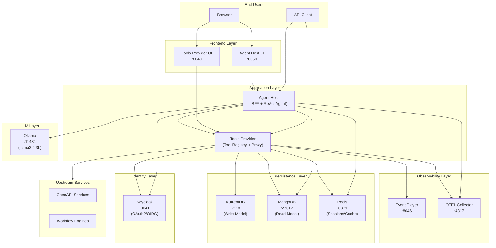

### Service Inventory

| Service | Port | Purpose | Technology |
|---------|------|---------|------------|
| **Tools Provider** | 8040 | Tool registry, access control, execution proxy | FastAPI + Neuroglia |
| **Agent Host** | 8050 | Chat UI, ReAct agent, conversation management | FastAPI + Ollama |
| **Keycloak** | 8041 | OAuth2/OIDC identity provider, token exchange | Keycloak 26.x |
| **KurrentDB** | 2113 | Event store (write model) | KurrentDB 25.x |
| **MongoDB** | 27017 | Read model projections, conversations | MongoDB 6.0 |
| **Mongo Express** | 8044 | MongoDB admin UI | Mongo Express |
| **Redis** | 6379 | Sessions (DB 0), cache (DB 1), agent sessions (DB 2) | Redis 7 |
| **Redis Commander** | 8045 | Redis admin UI | Redis Commander |
| **Event Player** | 8046 | CloudEvent visualization and replay | Custom Go service |
| **OTEL Collector** | 4317/4318 | Telemetry ingestion (traces, metrics) | OpenTelemetry Collector |
| **UI Builder** | - | Parcel watch mode for both UIs | Node.js 20 |
| **Ollama** | 11434 | Local LLM inference (optional in Docker) | Ollama |

### Redis Database Allocation

```
DB 0: Tools Provider sessions (session cookies, OIDC state)
DB 1: Tools Provider cache (tool definitions, token exchange results)
DB 2: Agent Host sessions (conversation context, rate limiting)
```

---

## Tools Provider Runtime

At runtime, the Tools Provider acts as a **secure proxy** between AI agents and upstream services, enforcing access control and propagating identity.

### Runtime Flow: Agent Tool Discovery & Execution

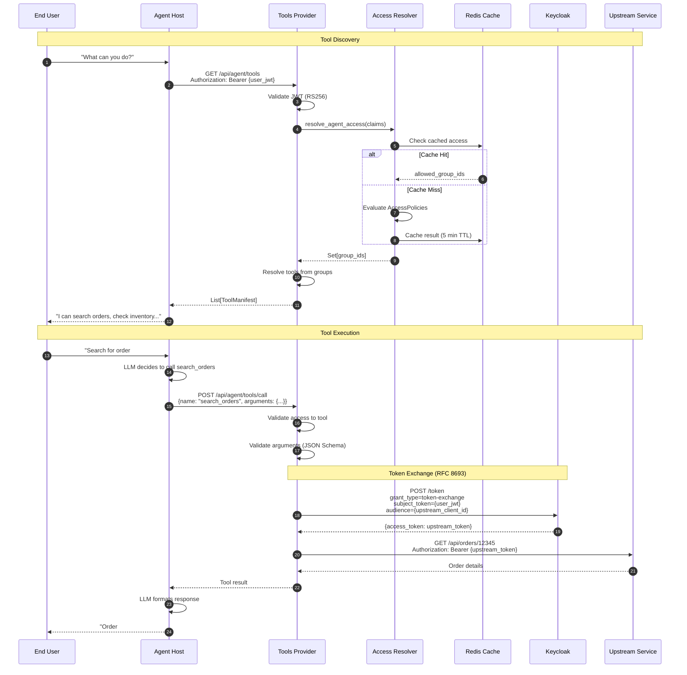

### Key Runtime Components

#### 1. Agent Controller (`/api/agent/*`)

```python
# src/api/controllers/agent_controller.py
class AgentController(ControllerBase):
    """REST API for Host Applications (Agent Host)."""

    @get("/tools")
    async def get_tools(self, user: dict = Depends(get_current_user)):
        """Get tools accessible to this user based on JWT claims."""
        query = GetAgentToolsQuery(claims=user)
        result = await self.mediator.execute_async(query)
        return self.process(result)

    @post("/tools/call")
    async def execute_tool(self, request: ToolCallRequest, user: dict = Depends(get_current_user)):
        """Execute a tool with identity delegation via token exchange."""
        command = ExecuteToolCommand(
            tool_id=request.get_tool_id(),
            arguments=request.arguments,
            claims=user,
        )
        result = await self.mediator.execute_async(command)
        return self.process(result)
```

#### 2. Access Resolver

Evaluates JWT claims against AccessPolicies to determine allowed ToolGroups:

```python
# src/application/services/access_resolver.py
class AccessResolver:
    """Resolves agent access rights based on JWT claims."""

    async def resolve_agent_access(self, claims: Dict[str, Any]) -> Set[str]:
        """
        1. Hash claims for cache key
        2. Check Redis cache
        3. Evaluate all active AccessPolicies
        4. Return union of allowed group IDs
        """
        cache_key = f"access:{self._hash_claims(claims)}"

        # Check cache first
        cached = await self._cache.get(cache_key)
        if cached:
            return set(json.loads(cached))

        # Evaluate policies (OR logic between policies)
        allowed_groups = await self._evaluate_policies(claims)

        # Cache result
        await self._cache.setex(cache_key, self.DEFAULT_CACHE_TTL, json.dumps(list(allowed_groups)))
        return allowed_groups
```

#### 3. Tool Executor

Proxies tool execution with token exchange and circuit breaker protection:

```python
# src/application/services/tool_executor.py
class ToolExecutor:
    """Executes tools by proxying requests to upstream services."""

    async def execute(self, tool_id: str, definition: ToolDefinition,
                      arguments: Dict, agent_token: str) -> ToolExecutionResult:
        """
        1. Validate arguments against JSON Schema
        2. Exchange agent token for upstream token
        3. Render Jinja2 templates (URL, headers, body)
        4. Execute HTTP request with circuit breaker
        5. Return result
        """
        # Token exchange
        upstream_token = await self._token_exchanger.exchange(
            subject_token=agent_token,
            audience=definition.execution_profile.audience,
        )

        # Execute with circuit breaker
        circuit = self._get_circuit(definition.source_id)
        result = await circuit.call(self._http_execute, definition, arguments, upstream_token)
        return result
```

---

## Tools Provider Provisioning

Provisioning is the administrative process of configuring what tools are available and who can access them.

### Provisioning Workflow

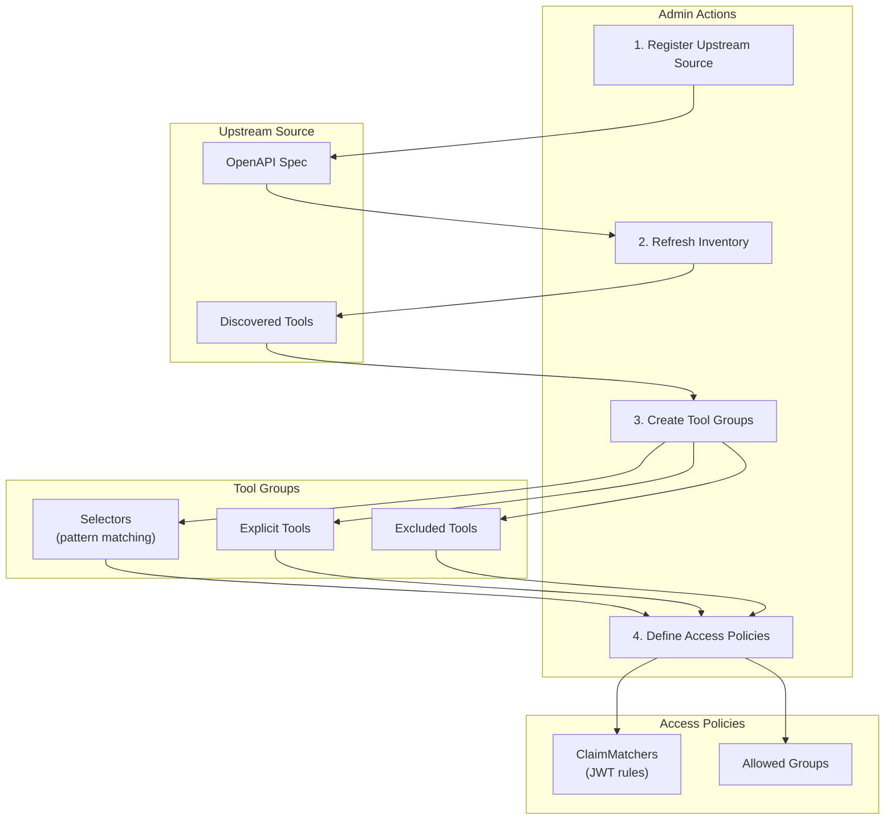

### 1. Registering Upstream Sources

An upstream source represents an external service (OpenAPI or Workflow) that provides tools:

```bash
# Register an OpenAPI source
POST /api/sources
{
  "name": "Order Management API",
  "url": "https://orders.example.com/openapi.json",
  "source_type": "OPENAPI",
  "auth_config": {
    "type": "oauth2_client_credentials",
    "client_id": "orders-api-client",
    "token_endpoint": "https://auth.example.com/token"
  }
}
```

**Domain Events Emitted:**

- `source.registered.v1` - Source created
- `source.inventory.ingested.v1` - Tools discovered after sync

### 2. Tool Discovery & Labeling

When an upstream source is synced, tools are automatically discovered from the OpenAPI spec:

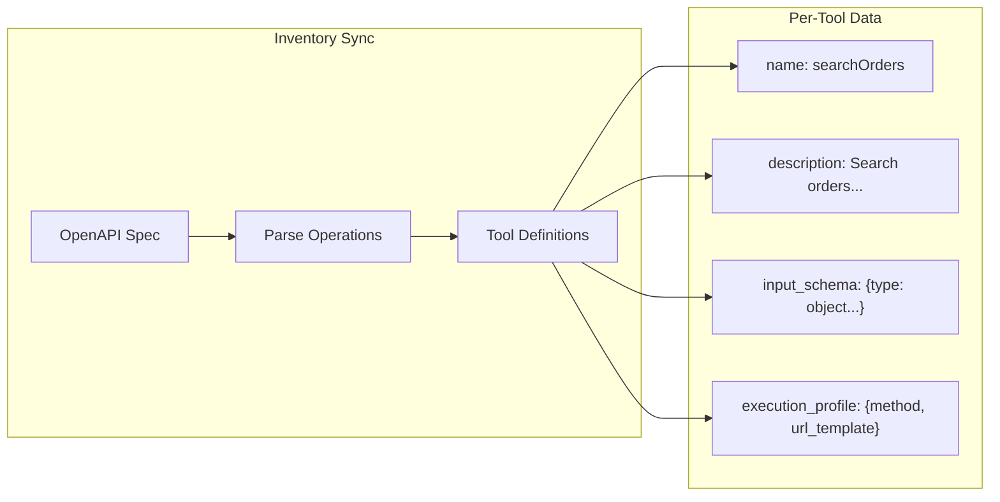

**Tool Definition Structure:**

```python
@dataclass
class ToolDefinition:
    """A tool discovered from an upstream source."""
    id: str                        # {source_id}:{operation_id}
    name: str                      # e.g., "searchOrders"
    description: str               # From OpenAPI operation
    input_schema: Dict[str, Any]   # JSON Schema for arguments
    execution_profile: ExecutionProfile
    tags: List[str]                # For grouping/filtering
    is_enabled: bool               # Admin toggle
```

### 3. Creating Tool Groups

Tool Groups are curated collections of tools for access control:

```bash
# Create a Tool Group with selectors
POST /api/groups
{
  "name": "Finance Tools",
  "description": "Tools for finance team",
  "selectors": [
    {
      "source_pattern": "orders-*",
      "name_pattern": "*Order*",
      "required_tags": ["finance"]
    }
  ],
  "explicit_tool_ids": ["invoices:createInvoice"],
  "excluded_tool_ids": ["orders:deleteOrder"]
}
```

**Selector Logic:**

- Selectors use glob patterns (`*`, `?`)
- Multiple selectors = OR logic
- Explicit tools are always included
- Excluded tools are always removed

### 4. Defining Access Policies

Access Policies map JWT claims to allowed Tool Groups:

```bash
# Create an Access Policy
POST /api/policies
{
  "name": "Finance Team Access",
  "description": "Grant finance tools to finance department",
  "claim_matchers": [
    {
      "json_path": "realm_access.roles",
      "operator": "CONTAINS",
      "value": "finance_user"
    },
    {
      "json_path": "department",
      "operator": "EQUALS",
      "value": "finance"
    }
  ],
  "allowed_group_ids": ["finance-tools", "reporting-tools"],
  "priority": 100
}
```

**ClaimMatcher Operators:**

| Operator | Description | Example |
|----------|-------------|---------|
| `EQUALS` | Exact match | `department == "finance"` |
| `CONTAINS` | Array contains value | `roles.contains("admin")` |
| `MATCHES` | Regex match | `email.matches(".*@corp.com")` |
| `NOT_EQUALS` | Negation | `status != "suspended"` |
| `NOT_CONTAINS` | Array excludes | `!roles.contains("guest")` |

**Evaluation Logic:**

- Within a policy: ClaimMatchers use **AND** logic (all must match)
- Between policies: Use **OR** logic (any matching policy grants access)
- Higher priority policies are evaluated first

---

## Agent Host Architecture

The Agent Host is a **Backend-for-Frontend (BFF)** that provides a chat interface with tool-calling capabilities.

### Component Architecture

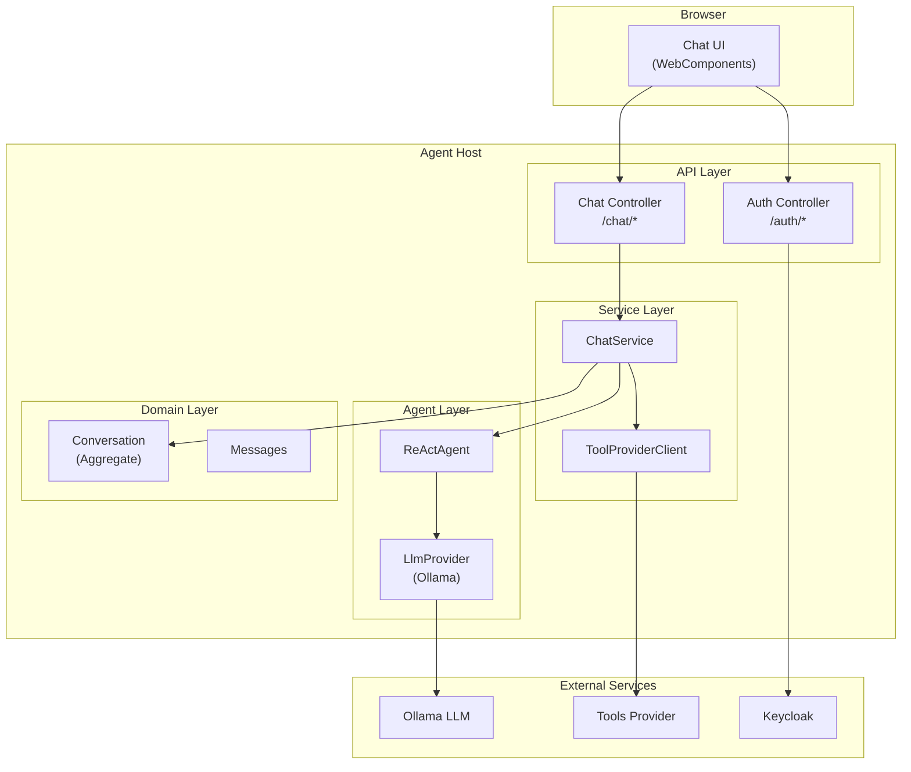

### ReAct Agent Pattern

The Agent Host implements the **ReAct** (Reasoning + Acting) pattern:

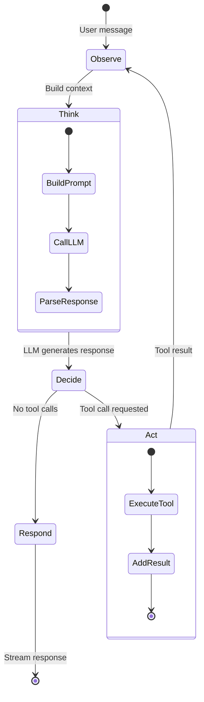

**ReAct Loop Implementation:**

```python
# agent-host/src/application/agents/react_agent.py
class ReActAgent(Agent):
    async def run_stream(self, context: AgentRunContext) -> AsyncIterator[AgentEvent]:
        messages = self._build_messages(context)

        for iteration in range(self._config.max_iterations):
            # Think: Call LLM
            response = await self._llm.chat(messages, tools=context.tools)

            # Decide: Check for tool calls
            if not response.has_tool_calls:
                # Respond: Yield final response
                yield AgentEvent(type=AgentEventType.RUN_COMPLETED, data={"response": response.content})
                return

            # Act: Execute tool calls
            for tool_call in response.tool_calls:
                result = await context.tool_executor(ToolExecutionRequest(
                    tool_name=tool_call.name,
                    arguments=tool_call.arguments,
                ))
                messages.append(result.to_llm_message())

            # Loop back to Observe with new context
```

### Chat Service Flow

```python
# agent-host/src/application/services/chat_service.py
class ChatService:
    async def send_message(self, conversation: Conversation,
                           user_message: str, access_token: str) -> AsyncIterator[dict]:
        # 1. Add user message to conversation aggregate
        conversation.add_user_message(user_message)
        await self._conversation_repo.update_async(conversation)

        # 2. Get available tools from Tools Provider
        tools = await self._tool_provider.get_tools(access_token)

        # 3. Build agent context
        run_context = AgentRunContext(
            user_message=user_message,
            conversation_history=conversation.get_context_messages(),
            tools=[self._tool_to_llm_definition(t) for t in tools],
            tool_executor=lambda req: self._execute_tool(req, access_token),
        )

        # 4. Stream agent events to client
        async for event in self._agent.run_stream(run_context):
            yield self._translate_event(event)

        # 5. Persist final state
        await self._conversation_repo.update_async(conversation)
```

---

## Identity Propagation

Identity propagation ensures that **end-user identity flows through the entire system**, enabling fine-grained access control at every layer.

### Why Identity Propagation Matters

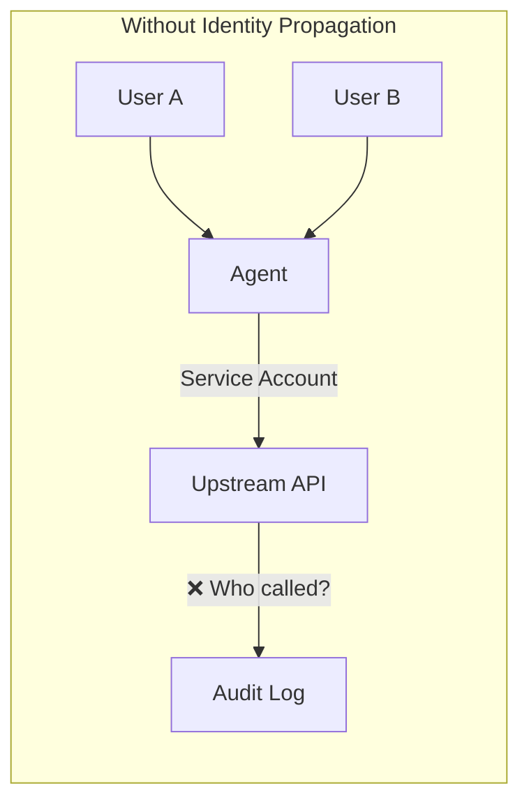

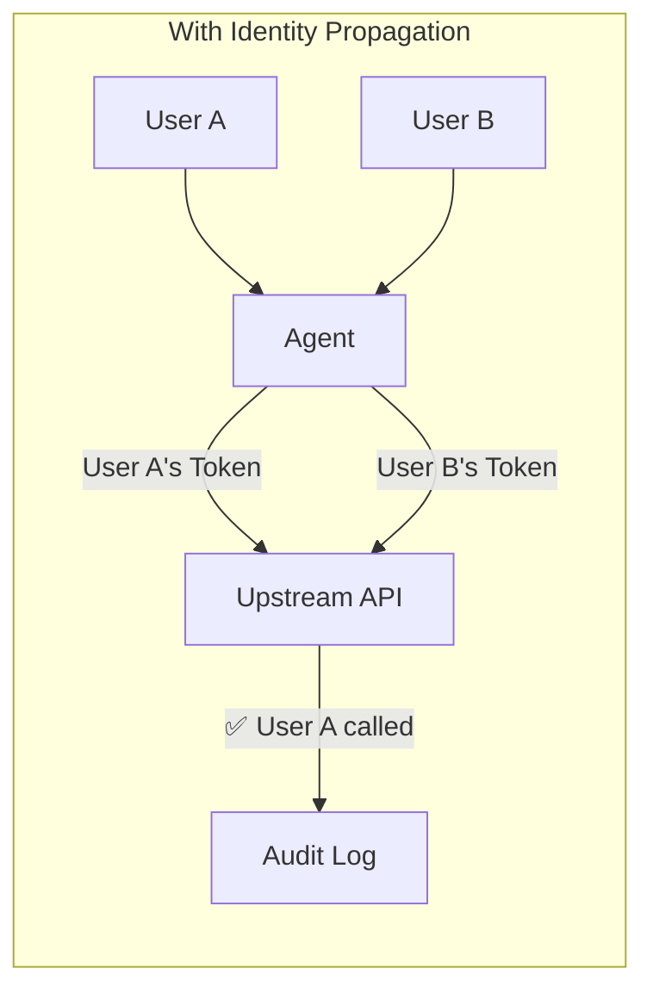

### Token Exchange Flow (RFC 8693)

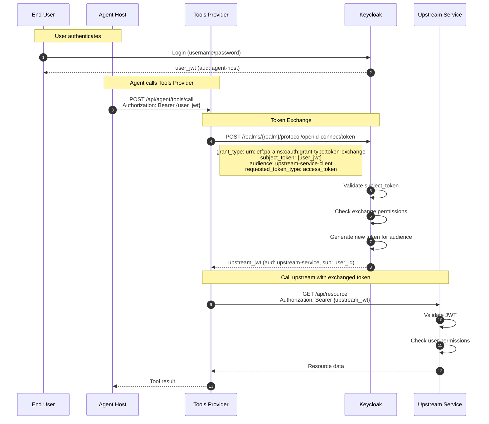

### Keycloak Token Exchange Configuration

```python
# src/infrastructure/adapters/keycloak_token_exchanger.py
class KeycloakTokenExchanger:
    """Implements RFC 8693 Token Exchange with caching and circuit breaker."""

    async def exchange(self, subject_token: str, audience: str) -> TokenExchangeResult:
        """
        Exchange an agent's access token for an upstream service token.

        Args:
            subject_token: The end-user's JWT from the agent
            audience: The Keycloak client ID of the upstream service

        Returns:
            TokenExchangeResult with the new access token
        """
        # Check cache first (key: hash of subject_token + audience)
        cache_key = self._cache_key(subject_token, audience)
        cached = await self._cache.get(cache_key)
        if cached and not cached.is_expired():
            return cached

        # Perform token exchange
        response = await self._http_client.post(
            f"{self._keycloak_url}/realms/{self._realm}/protocol/openid-connect/token",
            data={
                "grant_type": "urn:ietf:params:oauth:grant-type:token-exchange",
                "client_id": self._client_id,
                "client_secret": self._client_secret,
                "subject_token": subject_token,
                "subject_token_type": "urn:ietf:params:oauth:token-type:access_token",
                "audience": audience,
                "requested_token_type": "urn:ietf:params:oauth:token-type:access_token",
            },
        )

        result = TokenExchangeResult(
            access_token=response["access_token"],
            expires_in=response["expires_in"],
        )

        # Cache with TTL buffer
        await self._cache.setex(cache_key, result.expires_in - 60, result)
        return result
```

### Benefits of Identity Propagation

| Benefit | Description |
|---------|-------------|
| **Audit Trail** | Upstream services log actual user identity |
| **Fine-grained Access** | Upstream can apply user-specific permissions |
| **Compliance** | Meets regulatory requirements (SOC2, GDPR) |
| **Least Privilege** | Tokens scoped to specific services |
| **Revocation** | Revoking user access affects all downstream calls |

---

## MCP Protocol Emulation

The Tools Provider does **NOT** implement the standard MCP (Model Context Protocol) specification. Instead, it provides an "MCP-like" API optimized for multi-tenant, secure environments.

### Why Not Standard MCP?

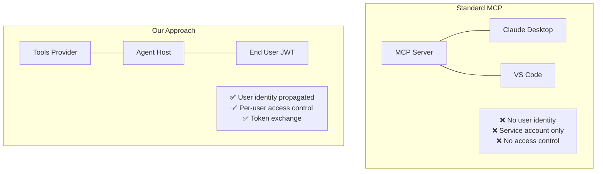

### Key Differences

| Aspect | Standard MCP | Our Implementation |
|--------|--------------|-------------------|
| **Authentication** | None / API key | JWT Bearer token (user identity) |
| **Authorization** | Server-wide | Per-user via AccessPolicies |
| **Tool Discovery** | Static list | Dynamic per-user based on claims |
| **Tool Execution** | Direct call | Proxied with token exchange |
| **Multi-tenancy** | Not supported | First-class support |

### How LLM Sees Our Tools

The Agent Host translates our tool manifests into the LLM's expected format:

```python
# agent-host/src/application/services/chat_service.py
def _tool_to_llm_definition(self, tool: Tool) -> LlmToolDefinition:
    """Convert our tool format to Ollama/OpenAI function format."""
    return LlmToolDefinition(
        name=tool.name,
        description=tool.description,
        parameters={
            "type": "object",
            "properties": {p.name: p.schema for p in tool.parameters},
            "required": [p.name for p in tool.parameters if p.required],
        },
    )
```

**Ollama API Format:**

```json
{
  "model": "llama3.2:3b",
  "messages": [...],
  "tools": [
    {
      "type": "function",
      "function": {
        "name": "searchOrders",
        "description": "Search orders by customer or date",
        "parameters": {
          "type": "object",
          "properties": {
            "customer_id": {"type": "string"},
            "from_date": {"type": "string", "format": "date"}
          },
          "required": ["customer_id"]
        }
      }
    }
  ]
}
```

The LLM doesn't know or care that:

1. Tools are fetched dynamically per-user
2. Tool execution goes through a proxy
3. Tokens are exchanged for upstream access

---

## Future Extensions

The architecture supports several planned extensions:

### 1. Multiple LLM Backends

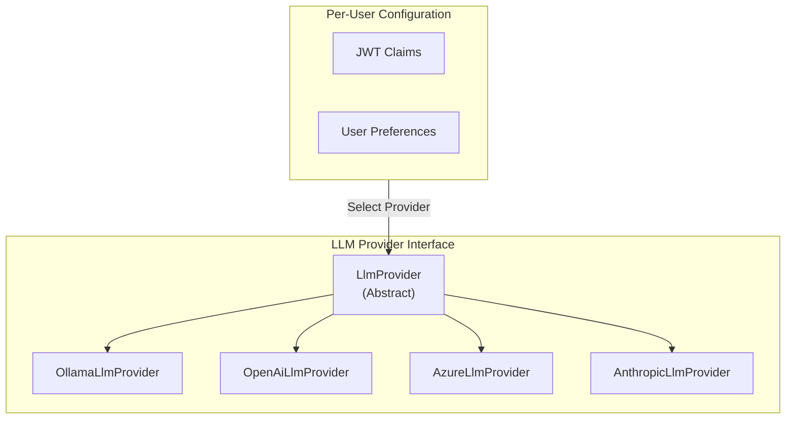

**Implementation Path:**

- Abstract `LlmProvider` interface already exists
- Add `OpenAiLlmProvider`, `AzureLlmProvider`
- Configure per-user via JWT claims or preferences

### 2. Multiple System Prompts (RBAC)

```python
# Future: SystemPromptResolver
class SystemPromptResolver:
    """Resolve system prompt based on user claims."""

    def resolve(self, claims: Dict[str, Any]) -> str:
        if "admin" in claims.get("roles", []):
            return ADMIN_SYSTEM_PROMPT
        elif "developer" in claims.get("roles", []):
            return DEVELOPER_SYSTEM_PROMPT
        else:
            return DEFAULT_SYSTEM_PROMPT
```

### 3. Knowledge Base (RAG)

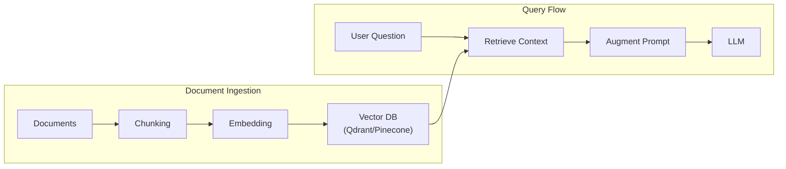

### 4. Conversation Features

| Feature | Description |
|---------|-------------|
| **Sharing** | Generate shareable links for conversations |
| **Pinning** | Pin important conversations to dashboard |
| **Export** | Export as Markdown, JSON, or PDF |
| **Branching** | Fork conversation from any point |
| **Templates** | Save and reuse conversation templates |

### 5. Additional Upstream Types

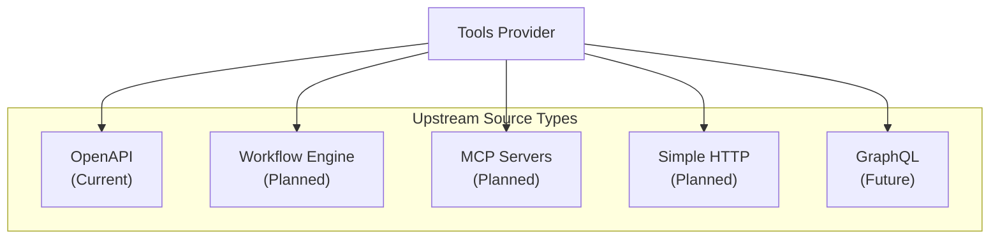

### 6. Multi-Modal Support

```python
# Future: Multi-modal message support
@dataclass
class MultiModalContent:
    type: Literal["text", "image", "audio", "file"]
    content: Union[str, bytes]
    mime_type: Optional[str] = None

class Conversation:
    def add_user_message(self, content: List[MultiModalContent]) -> str:
        """Add message with mixed content types."""
        ...
```

### Extension Architecture

All extensions follow the same patterns:

1. **Interface-based**: Define abstract interfaces
2. **DI-configured**: Register implementations in `main.py`
3. **Claims-driven**: Use JWT claims for personalization
4. **Event-sourced**: Emit domain events for all state changes
5. **Observable**: Include OpenTelemetry instrumentation

---

## Code References

| Component | File Location |
|-----------|---------------|
| Agent Controller | `src/api/controllers/agent_controller.py` |
| Access Resolver | `src/application/services/access_resolver.py` |
| Tool Executor | `src/application/services/tool_executor.py` |
| Token Exchanger | `src/infrastructure/adapters/keycloak_token_exchanger.py` |
| ReAct Agent | `agent-host/src/application/agents/react_agent.py` |
| Chat Service | `agent-host/src/application/services/chat_service.py` |
| Tool Provider Client | `agent-host/src/application/services/tool_provider_client.py` |
| Ollama Provider | `agent-host/src/infrastructure/adapters/ollama_llm_provider.py` |
| Access Policy Entity | `src/domain/entities/access_policy.py` |
| Tool Group Entity | `src/domain/entities/tool_group.py` |
| Upstream Source Entity | `src/domain/entities/upstream_source.py` |
