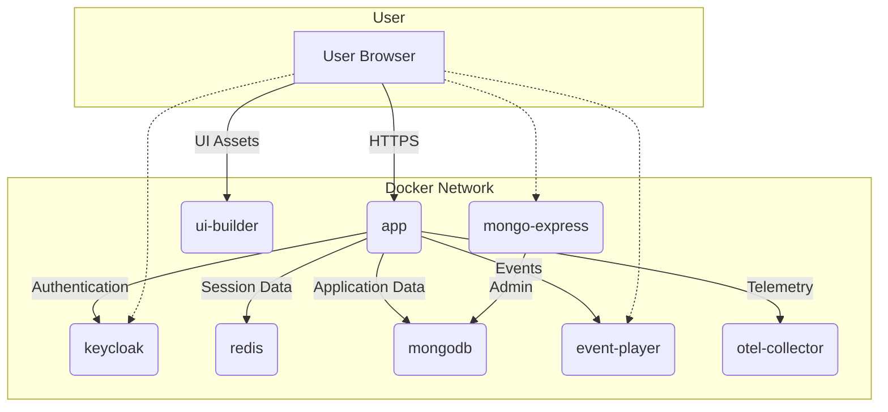

# Docker Environment

This document outlines the Docker environment for the starter application.

## Services

The `docker-compose.yml` file defines the following services:

- **app**: The main Python application.
- **ui-builder**: A service that automatically rebuilds UI assets on file changes.
- **keycloak**: The authentication server.
- **mongodb**: The database.
- **mongo-express**: A web-based MongoDB admin interface.
- **redis**: A Redis instance for session storage.
- **event-player**: A tool for event gateway/sink, visualization and replay.
- **otel-collector**: The OpenTelemetry collector for observability.

## Data Flow Diagram

The following diagram illustrates the services and their interactions within the Docker environment.



## Usage

## Usage

1. Copy the `.env.example` to `.env` and edit it as you see fit...

2. Start the environment, run:

    ```bash
    make up
    ```

3. Check available services, run:

    ```bash
    make urls
    ```

4. Stop the environment, run:

    ```bash
    make down
    ```
