# Agent Host Implementation Guide

**Audience:** Junior Developers new to AI Agents
**Status:** Current Implementation (December 2025)

---

## Introduction: What is an AI Agent?

An **AI Agent** is software that uses a Large Language Model (LLM) to process natural language, reason about tasks, and take actions. Unlike a simple chatbot that just generates text, an agent can:

1. **Understand** user intent from natural language
2. **Reason** about what actions to take
3. **Execute tools** (APIs, file operations, calculations)
4. **Learn from results** and continue iterating
5. **Present structured UI** (widgets) when appropriate

This guide walks you through the Agent Host codebase, explaining how these capabilities are implemented.

---

## Part 1: The User Experience

Before diving into code, let's understand what users see and do.

### 1.1 Starting a Conversation


### 1.2 Two Conversation Types

| Type | Who Starts | Example |
|------|------------|---------|
| **Reactive** | User | "Help me write a Python function to sort a list" |
| **Proactive** | Agent | Quiz agent presents "Question 1: What is 2+2?" |

### 1.3 Message Types Users See

1. **Text messages** - Conversational responses
2. **Tool calls** - Visual cards showing tool execution
3. **Widgets** - Interactive UI (multiple choice, text input)
4. **Progress indicators** - Template position in proactive flows

---

## Part 2: Frontend Architecture

The UI is built with **VanillaJS WebComponents** (no React/Vue).

### 2.1 Key Files

```
src/agent-host/ui/src/scripts/
├── app.js                      # Main ChatApp class
├── core/
│   ├── stream-handler.js       # SSE event processing
│   ├── message-renderer.js     # Message display
│   ├── conversation-manager.js # Conversation CRUD
│   └── ui-manager.js           # DOM utilities
├── components/
│   ├── ax-multiple-choice.js   # Multiple choice widget
│   ├── ax-free-text-prompt.js  # Text input widget
│   ├── ax-code-editor.js       # Code editor widget
│   ├── ChatMessage.js          # Message bubble
│   └── ToolCallCard.js         # Tool execution display
└── services/
    └── api.js                  # HTTP client
```

### 2.2 The Chat Flow (Frontend)

```javascript
// Simplified flow in app.js

class ChatApp {
    async handleSubmit(event) {
        event.preventDefault();
        const message = this.getInputValue();

        // 1. Show user's message immediately
        addUserMessage(message);

        // 2. Start streaming response
        const response = await sendMessage({
            message: message,
            conversation_id: getCurrentConversationId(),
        });

        // 3. Process Server-Sent Events
        for await (const event of handleStreamEvents(response)) {
            // Events handled by stream-handler.js
        }
    }
}
```

### 2.3 SSE Event Handling

```javascript
// stream-handler.js (simplified)

async function* handleStreamEvents(response) {
    // Parse SSE stream
    for (const event of parseSSE(response)) {
        switch (event.type) {
            case 'stream_started':
                // New conversation created, save ID
                setCurrentConversationId(event.data.conversation_id);
                break;

            case 'content_chunk':
                // LLM is streaming text
                appendToCurrentMessage(event.data.content);
                break;

            case 'tool_call':
                // Agent is using a tool
                showToolCallCard(event.data);
                break;

            case 'client_action':
                // Agent wants user to interact with widget
                renderWidget(event.data);
                break;

            case 'stream_complete':
                // Turn finished
                finalizeMessage();
                break;
        }
    }
}
```

### 2.4 Widget Components

Widgets are custom HTML elements:

```javascript
// ax-multiple-choice.js (simplified)

class AxMultipleChoice extends HTMLElement {
    connectedCallback() {
        this.render();
        this.bindEvents();
    }

    render() {
        const options = JSON.parse(this.getAttribute('options'));
        this.innerHTML = `
            <div class="widget-container">
                <div class="prompt">${this.getAttribute('prompt')}</div>
                <div class="options">
                    ${options.map((opt, i) => `
                        <button class="option-btn" data-index="${i}">
                            ${opt}
                        </button>
                    `).join('')}
                </div>
            </div>
        `;
    }

    handleSelection(index) {
        // Emit event for ChatApp to handle
        this.dispatchEvent(new CustomEvent('ax-response', {
            bubbles: true,
            detail: { selection: this.options[index] }
        }));
    }
}

customElements.define('ax-multiple-choice', AxMultipleChoice);
```

---

## Part 3: Backend Architecture

The backend is a **FastAPI** application using the **Neuroglia framework** for CQRS/Event Sourcing.

### 3.1 Layer Overview

```
src/agent-host/
├── main.py                     # FastAPI app setup
├── api/
│   ├── controllers/
│   │   └── chat_controller.py  # HTTP endpoints
│   └── dependencies.py         # Auth, DI resolution
├── application/
│   ├── agents/
│   │   ├── base_agent.py       # Agent interface
│   │   └── react_agent.py      # ReAct implementation
│   ├── services/
│   │   └── chat_service.py     # Conversation orchestrator
│   └── commands/               # CQRS commands
├── domain/
│   ├── entities/
│   │   └── conversation.py     # Aggregate root
│   ├── models/
│   │   ├── agent_definition.py
│   │   ├── conversation_template.py
│   │   └── item_content.py
│   └── events/                 # Domain events
└── infrastructure/
    └── session_store.py        # Redis sessions
```

### 3.2 The Conversation Entity

The **Conversation** is an Event-Sourced Aggregate. All changes are recorded as events:

```python
# domain/entities/conversation.py (simplified)

class Conversation(AggregateRoot[ConversationState, str]):
    """The single AggregateRoot in this architecture."""

    def __init__(self, user_id: str, definition_id: str, ...):
        # Emit creation event
        self.state.on(
            self.register_event(
                ConversationCreatedDomainEvent(
                    aggregate_id=str(uuid4()),
                    user_id=user_id,
                    definition_id=definition_id,
                    ...
                )
            )
        )

    def add_user_message(self, content: str) -> str:
        """Add a user message - emits MessageAddedDomainEvent."""
        msg_id = str(uuid4())
        self.state.on(
            self.register_event(
                MessageAddedDomainEvent(
                    aggregate_id=self.id(),
                    message_id=msg_id,
                    role="user",
                    content=content,
                    ...
                )
            )
        )
        return msg_id
```

**Why Event Sourcing?**

- Complete audit trail of every change
- Ability to replay state at any point
- Natural fit for streaming conversations

### 3.3 The ChatService

The **ChatService** orchestrates the conversation flow:

```python
# application/services/chat_service.py (simplified)

class ChatService:
    async def send_message(
        self,
        conversation: Conversation,
        user_message: str,
        access_token: str,
    ) -> AsyncIterator[dict]:
        """Process a user message and stream the response."""

        # 1. Record user message (if provided)
        if user_message.strip():
            conversation.add_user_message(user_message)
            await self._conversation_repo.update_async(conversation)
            yield {"event": "message_added", "data": {...}}

        # 2. Check for template (proactive flow)
        template = await self._load_conversation_template(conversation)

        if template:
            # 3a. Template-driven flow
            async for event in self._run_templated_agent_loop(...):
                yield event
        else:
            # 3b. Standard ReAct flow
            async for event in self._run_single_agent_pass(...):
                yield event

        # 4. Save final state
        await self._conversation_repo.update_async(conversation)
        yield {"event": "stream_complete", "data": {}}
```

### 3.4 The ReAct Agent

The **ReAct** pattern (**Re**asoning and **Act**ing) is the core agent loop:

```python
# application/agents/react_agent.py (simplified)

class ReActAgent(Agent):
    """ReAct agent: Think → Act → Observe → Repeat"""

    async def run_stream(self, context: AgentRunContext):
        """Execute the ReAct loop with streaming."""
        messages = self._build_messages(context)

        for iteration in range(self._config.max_iterations):
            # 1. Think: Ask LLM what to do
            yield AgentEvent(type=AgentEventType.LLM_REQUEST_STARTED, ...)

            response = await self._llm.chat(messages, tools=context.tools)

            # 2. Observe: Check if LLM wants to use tools
            if response.tool_calls:
                yield AgentEvent(type=AgentEventType.TOOL_CALLS_DETECTED, ...)

                # 3. Act: Execute each tool
                for tool_call in response.tool_calls:
                    yield AgentEvent(type=AgentEventType.TOOL_EXECUTION_STARTED, ...)

                    result = await context.tool_executor(tool_call)
                    messages.append(result.to_llm_message())

                    yield AgentEvent(type=AgentEventType.TOOL_EXECUTION_COMPLETED, ...)

                # Continue loop with tool results
            else:
                # No tools needed - LLM has final answer
                yield AgentEvent(type=AgentEventType.RUN_COMPLETED, ...)
                return
```

**The ReAct Loop Visualized:**

```mermaid
flowchart TB
    START[User Message] --> THINK

    subgraph LOOP["ReAct Loop (max iterations)"]
        THINK["🧠 THINK<br/>LLM reasons about task"]
        DECIDE{Tools needed?}
        ACT["⚡ ACT<br/>Execute tool"]
        OBSERVE["👁️ OBSERVE<br/>Process result"]

        THINK --> DECIDE
        DECIDE -->|Yes| ACT
        ACT --> OBSERVE
        OBSERVE --> THINK
    end

    DECIDE -->|No| RESPOND["📝 RESPOND<br/>Final answer"]
    RESPOND --> END[Stream to User]
```



---

## Part 4: Data Flow Example

Let's trace a complete request: **"What's the weather in Paris?"**

### 4.1 Request Flow

```mermaid
sequenceDiagram
    participant U as User
    participant F as Frontend
    participant C as ChatController
    participant S as ChatService
    participant A as ReActAgent
    participant L as LLM
    participant T as Tools Provider
    participant E as EventStoreDB

    U->>F: Types "What's the weather in Paris?"
    F->>C: POST /api/chat/send

    C->>S: send_message(conversation, "What's...")
    S->>E: Save user message event
    S-->>F: SSE: message_added

    S->>A: run_stream(context)
    A->>L: "What's the weather in Paris?"
    L-->>A: tool_call: get_weather(city="Paris")
    A-->>F: SSE: tool_call

    A->>T: Execute get_weather
    T-->>A: {"temp": 15, "condition": "Cloudy"}
    A-->>F: SSE: tool_result

    A->>L: [previous + tool result]
    L-->>A: "The weather in Paris is 15°C and cloudy"
    A-->>F: SSE: content_chunk (streaming)

    S->>E: Save assistant message event
    S-->>F: SSE: stream_complete
    F-->>U: Display response
```



### 4.2 Events Generated

1. `ConversationCreatedDomainEvent` (if new)
2. `MessageAddedDomainEvent` (user message)
3. `ToolCallAddedDomainEvent` (weather tool)
4. `ToolResultAddedDomainEvent` (weather data)
5. `MessageAddedDomainEvent` (assistant response)

---

## Part 5: Adding Features

### 5.1 Adding a New Tool

Tools come from the **MCP Tools Provider**. To use a new tool:

1. Register the tool in Tools Provider
2. Add tool ID to AgentDefinition.tools list
3. The agent will automatically discover and use it

### 5.2 Adding a New Widget

1. **Create component:**

  ```javascript
  // ui/src/scripts/components/ax-slider.js
  class AxSlider extends HTMLElement {
      // ... implementation
  }
  customElements.define('ax-slider', AxSlider);
  ```

1. **Register in main.js:**

  ```javascript
  import './components/ax-slider.js';
  ```

1. **Handle in stream-handler.js:**

  ```javascript
  case 'client_action':
      if (data.widget_type === 'slider') {
          renderSliderWidget(data);
      }
      break;
  ```

1. **Add backend support:**

  ```python
  # In ItemContent model
  widget_type: str = "message"  # Add "slider" as valid type
  ```

### 5.3 Creating a New AgentDefinition

```json
POST /api/admin/definitions
{
    "id": "math-tutor",
    "name": "Math Tutor",
    "description": "Helps with math problems",
    "system_prompt": "You are a patient math tutor. Explain concepts step by step.",
    "tools": ["calculator", "wolfram_alpha"],
    "is_public": true
}
```

### 5.4 Creating a Proactive Agent

1. **Create ConversationTemplate:**

```json
POST /api/admin/templates
{
    "id": "math-quiz",
    "name": "Math Quiz",
    "agent_starts_first": true,
    "items": [
        {
            "id": "q1",
            "order": 0,
            "contents": [{
                "id": "q1-content",
                "widget_type": "multiple_choice",
                "stem": "What is 7 × 8?",
                "options": ["54", "56", "58", "64"],
                "correct_answer": "56"
            }]
        }
    ]
}
```

1. **Link to AgentDefinition:**

```json
PUT /api/admin/definitions/math-quiz-agent
{
    "conversation_template_id": "math-quiz"
}
```

---

## Part 6: Debugging Tips

### 6.1 Enabling Debug Logs

```bash
# In .env or environment
LOG_LEVEL=DEBUG
```

Look for these log patterns:

- `📋 Template:` - Template progression
- `🚀 Proactive` - Agent initiation
- `🎯 Model override` - LLM selection
- `🔄 set_model_override` - Provider switching

### 6.2 Testing SSE in Browser

Open DevTools → Network → Filter "EventStream":

```
event: stream_started
data: {"request_id": "...", "conversation_id": "..."}

event: content_chunk
data: {"content": "The "}

event: content_chunk
data: {"content": "weather "}
...
```

### 6.3 Common Issues

| Issue | Cause | Solution |
|-------|-------|----------|
| Widget not rendering | Component not registered | Check `main.js` imports |
| Tool calls failing | Missing access token | Check auth flow |
| Template not advancing | State not persisted | Verify `update_async` calls |
| Infinite agent loop | Max iterations too high | Lower `max_iterations` |

---

## Summary

The Agent Host implements a sophisticated AI conversation system:

1. **Frontend** streams responses via SSE and renders widgets
2. **ChatService** orchestrates the conversation flow
3. **ReActAgent** implements the Think→Act→Observe loop
4. **Conversation** aggregate persists all state via events
5. **Templates** enable proactive, structured interactions

Start exploring with the code paths outlined above, and don't hesitate to add debug logging to trace the flow!
