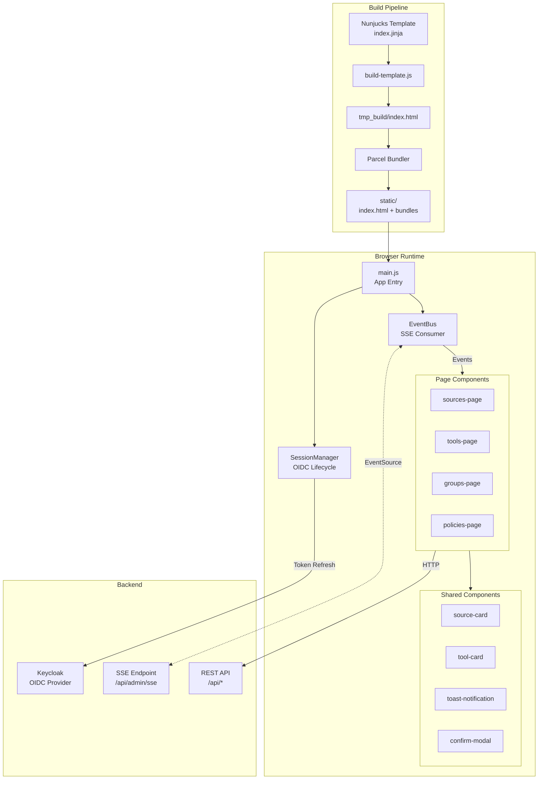
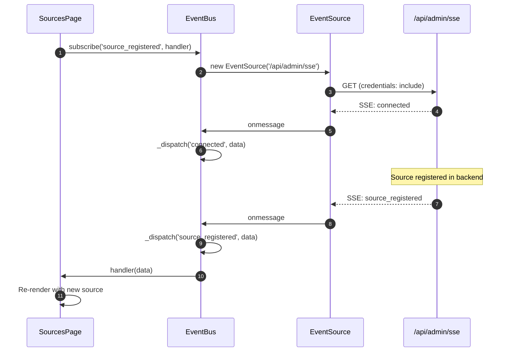
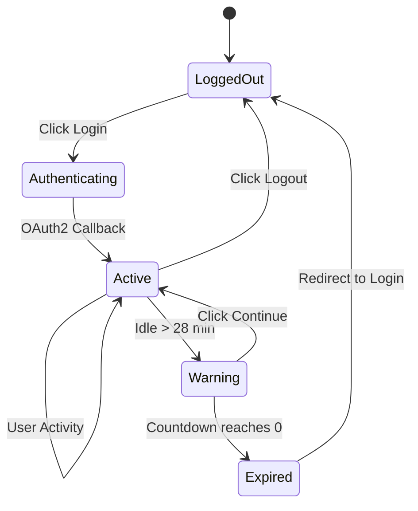

# Frontend Architecture

The MCP Tools Provider frontend is built with **VanillaJS WebComponents**, using a **Parcel** bundler and **Nunjucks** templates. This document covers the component architecture, real-time SSE integration, and session management.

## Architecture Overview



## WebComponent Pattern

This application uses **shadow-free WebComponents** - custom elements that render directly to `innerHTML` without Shadow DOM encapsulation.

### Why No Shadow DOM?

1. **Bootstrap 5 Compatibility**: Global CSS classes work without piercing shadow boundaries
2. **Simpler Debugging**: DevTools show actual DOM structure
3. **Event Bubbling**: Native events propagate naturally to parent components
4. **Smaller Bundle**: No need for CSS-in-JS or style duplication

### Component Structure

```javascript
// src/ui/src/scripts/components/source-card.js
class SourceCard extends HTMLElement {
    constructor() {
        super();
        this._data = null;
        this._loading = false;
    }

    // Property setter triggers re-render
    set data(value) {
        this._data = value;
        this.render();
    }

    get data() {
        return this._data;
    }

    // Called when element is added to DOM
    connectedCallback() {
        this.render();
    }

    render() {
        // Direct innerHTML assignment (no Shadow DOM)
        this.innerHTML = `
            <div class="card h-100 source-card">
                <div class="card-header">
                    <span>${this._escapeHtml(this._data?.name)}</span>
                </div>
                <div class="card-body">
                    <!-- ... -->
                </div>
            </div>
        `;
        this._attachEventListeners();
    }

    _attachEventListeners() {
        this.querySelector('[data-action="refresh"]')
            ?.addEventListener('click', () => this._handleRefresh());
    }

    // Emit custom events for parent handling
    async _handleRefresh() {
        this.dispatchEvent(new CustomEvent('source-refresh', {
            detail: { id: this._data.id },
            bubbles: true,  // Propagates to parent
        }));
    }
}

// Register the custom element
customElements.define('source-card', SourceCard);
```

### Page Components

Page components orchestrate data fetching, child components, and SSE event handling:

```javascript
// src/ui/src/scripts/pages/sources-page.js
class SourcesPage extends HTMLElement {
    constructor() {
        super();
        this._sources = [];
        this._loading = true;
        this._eventSubscriptions = [];
    }

    connectedCallback() {
        this.render();
        this._loadSources();
        this._subscribeToEvents();
    }

    disconnectedCallback() {
        // Clean up SSE subscriptions
        this._unsubscribeFromEvents();
    }

    _subscribeToEvents() {
        // Subscribe to real-time SSE events
        this._eventSubscriptions.push(
            eventBus.subscribe('source_registered', (data) => {
                this._handleSourceRegistered(data);
            }),
            eventBus.subscribe('source_deleted', (data) => {
                this._handleSourceDeleted(data);
            })
        );
    }

    render() {
        this.innerHTML = `
            <div class="sources-page">
                <h2>OpenAPI Sources</h2>
                <div class="row g-4">
                    ${this._sources.map(source => `
                        <div class="col-md-4">
                            <source-card data-source-id="${source.id}"></source-card>
                        </div>
                    `).join('')}
                </div>
            </div>
        `;

        // Bind data to child components
        this.querySelectorAll('source-card').forEach(card => {
            const source = this._sources.find(s => s.id === card.dataset.sourceId);
            if (source) card.data = source;
        });
    }
}

customElements.define('sources-page', SourcesPage);
```

## EventBus: SSE Integration

The `EventBus` maintains a single SSE connection and dispatches events to subscribers:



### EventBus Implementation

```javascript
// src/ui/src/scripts/core/event-bus.js
class EventBus {
    constructor() {
        this._eventSource = null;
        this._handlers = new Map();
        this._connected = false;
    }

    async connect() {
        if (this._eventSource) return;

        this._eventSource = new EventSource('/api/admin/sse', {
            withCredentials: true,  // Send session cookie
        });

        this._eventSource.onopen = () => {
            this._connected = true;
            this._notifyConnectionListeners(true);
        };

        this._eventSource.onerror = () => {
            this._connected = false;
            this._scheduleReconnect();
        };

        this._setupEventListeners();
    }

    _setupEventListeners() {
        // Typed event listeners
        const eventTypes = [
            'connected', 'heartbeat', 'shutdown',
            'source_registered', 'source_deleted', 'source_inventory_updated',
            'tool_discovered', 'tool_enabled', 'tool_disabled',
            'group_created', 'group_updated', 'group_deleted',
            'policy_defined', 'policy_activated', 'policy_deleted',
        ];

        eventTypes.forEach(eventType => {
            this._eventSource.addEventListener(eventType, (event) => {
                const data = JSON.parse(event.data);
                this._dispatch(eventType, data);
            });
        });
    }

    subscribe(eventType, handler) {
        if (!this._handlers.has(eventType)) {
            this._handlers.set(eventType, new Set());
        }
        this._handlers.get(eventType).add(handler);

        // Return unsubscribe function
        return () => {
            this._handlers.get(eventType)?.delete(handler);
        };
    }

    _dispatch(eventType, data) {
        const handlers = this._handlers.get(eventType);
        if (handlers) {
            handlers.forEach(handler => {
                try {
                    handler(data);
                } catch (error) {
                    console.error(`EventBus handler error:`, error);
                }
            });
        }
    }
}

// Singleton export
export const eventBus = new EventBus();
```

### SSE Event Types

| Event Type | Payload | Triggered By |
|------------|---------|--------------|
| `connected` | `{ message, timestamp, user }` | SSE connection established |
| `heartbeat` | `{ timestamp }` | Keep-alive (every 30s) |
| `source_registered` | `{ entity_id, entity_name, details }` | New source added |
| `source_deleted` | `{ entity_id }` | Source removed |
| `source_inventory_updated` | `{ entity_id, tool_count }` | Inventory refresh complete |
| `tool_enabled` | `{ entity_id, enabled_by }` | Tool enabled |
| `tool_disabled` | `{ entity_id, reason }` | Tool disabled |
| `group_created` | `{ entity_id, entity_name }` | New group created |
| `policy_activated` | `{ entity_id }` | Access policy activated |
| `shutdown` | `{ message }` | Server shutting down |

## Session Management

The `SessionManager` implements comprehensive session lifecycle:



### Key Features

1. **Activity Tracking**: Monitors mouse, keyboard, touch, scroll events
2. **Idle Detection**: Warns users before session expires (default: 2 min warning)
3. **Token Refresh**: Background refresh every 4 minutes when active
4. **OIDC Session Iframe**: Detects cross-app logout via Keycloak
5. **Graceful Expiration**: Redirects to login when session expires

### Implementation Highlights

```javascript
// src/ui/src/scripts/core/session-manager.js

// Activity events to track
const ACTIVITY_EVENTS = [
    'mousedown', 'mousemove', 'keydown', 'keypress',
    'scroll', 'touchstart', 'touchmove', 'click', 'focus'
];

function startActivityTracking() {
    ACTIVITY_EVENTS.forEach(event => {
        document.addEventListener(event, recordActivity, { passive: true });
    });
}

// Token refresh (every 4 minutes when active)
function startTokenRefresh() {
    setInterval(async () => {
        const idleMinutes = getIdleTimeMinutes();
        if (idleMinutes < 5 && !isPaused) {
            await fetch('/api/auth/refresh', {
                method: 'POST',
                credentials: 'include',
            });
        }
    }, 4 * 60 * 1000);
}

// Idle detection (check every 10 seconds)
function checkIdleStatus() {
    const idleSeconds = getIdleTimeSeconds();
    const warningThreshold = config.ssoSessionIdleTimeoutSeconds
                           - config.sessionExpirationWarningMinutes * 60;

    if (idleSeconds >= warningThreshold) {
        showIdleWarning();
    }
}
```

!!! note "No keycloak-js Dependency"
    This implementation does **not** use the `keycloak-js` library to avoid Parcel bundler compatibility issues. Instead, it implements the OIDC Session Management specification manually using the `postMessage` API.

## API Client

A thin wrapper around `fetch` for authenticated API calls:

```javascript
// src/ui/src/scripts/api/client.js
export async function apiRequest(path, options = {}) {
    const response = await fetch(`/api${path}`, {
        ...options,
        credentials: 'include',  // Send session cookie
        headers: {
            'Content-Type': 'application/json',
            ...options.headers,
        },
    });

    if (response.status === 401) {
        // Session expired - trigger re-login
        eventBus._dispatch('session_expired', {});
        throw new Error('Session expired');
    }

    if (!response.ok) {
        const error = await response.json();
        throw new Error(error.detail || 'Request failed');
    }

    return response.json();
}

// Domain-specific API modules
// src/ui/src/scripts/api/sources.js
export async function getSources() {
    return apiRequest('/sources');
}

export async function refreshInventory(sourceId) {
    return apiRequest(`/sources/${sourceId}/refresh`, { method: 'POST' });
}

export async function deleteSource(sourceId) {
    return apiRequest(`/sources/${sourceId}`, { method: 'DELETE' });
}
```

## Component Catalog

### Shared Components (`src/ui/src/scripts/components/`)

| Component | Element | Purpose |
|-----------|---------|---------|
| `source-card.js` | `<source-card>` | Displays source with health status, actions |
| `tool-card.js` | `<tool-card>` | Displays tool with enable/disable toggle |
| `group-card.js` | `<group-card>` | Displays tool group with member count |
| `policy-card.js` | `<policy-card>` | Displays access policy with activation toggle |
| `toast-notification.js` | `<toast-notification>` | Bootstrap toast wrapper |
| `confirm-modal.js` | - | `confirmDelete()` function for delete confirmation |
| `loading-spinner.js` | `<loading-spinner>` | Centered spinner for loading states |

### Page Components (`src/ui/src/scripts/pages/`)

| Component | Element | Route |
|-----------|---------|-------|
| `sources-page.js` | `<sources-page>` | Sources management |
| `tools-page.js` | `<tools-page>` | Tool inventory |
| `groups-page.js` | `<groups-page>` | Tool group curation |
| `policies-page.js` | `<policies-page>` | Access policy management |
| `labels-page.js` | `<labels-page>` | Label management |

## Build Process

```bash
# Development (with hot reload)
cd src/ui
npm run watch

# Production build
npm run build

# Build steps:
# 1. Nunjucks → HTML (build-template.js)
# 2. Parcel bundles JS/SCSS
# 3. Output to ../../static/
```

### Directory Structure

```
src/ui/
├── build-template.js       # Nunjucks → HTML compiler
├── package.json            # Scripts and dependencies
├── .parcelrc               # Parcel configuration
└── src/
    ├── templates/
    │   └── index.jinja     # Main HTML template
    ├── scripts/
    │   ├── main.js         # Entry point
    │   ├── app.js          # App initialization
    │   ├── api/            # API client modules
    │   ├── core/           # EventBus, SessionManager, theme
    │   ├── components/     # Shared WebComponents
    │   ├── pages/          # Page WebComponents
    │   └── ui/             # UI utilities (auth, tasks)
    └── styles/
        └── main.scss       # SCSS entry point
```

## Code References

| Concept | File Location |
|---------|---------------|
| EventBus (SSE) | `src/ui/src/scripts/core/event-bus.js` |
| Session Manager | `src/ui/src/scripts/core/session-manager.js` |
| API Client | `src/ui/src/scripts/api/client.js` |
| Source Card | `src/ui/src/scripts/components/source-card.js` |
| Sources Page | `src/ui/src/scripts/pages/sources-page.js` |
| Build Script | `src/ui/build-template.js` |
