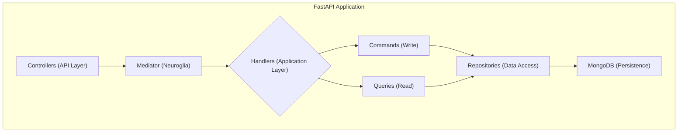

# Getting Started

To get started with the application, please refer to the **[Getting Started](getting-started/installation.md)** guide, which will walk you through the installation and setup process.

## Key Sections

- **[Architecture](architecture/overview.md)**: Learn about the core concepts of the application's architecture and the `neuroglia-python` framework.
- **[Security](security/authentication-flows.md)**: Understand the dual authentication system, including session-based and JWT bearer token flows, plus authorization with OAuth2/OIDC.
- **[Development](development/makefile-reference.md)**: Find information on the development workflow, including the `Makefile` commands and documentation setup.
- **[Deployment](deployment/docker-environment.md)**: Learn how to deploy the application using Docker and other related technologies.

