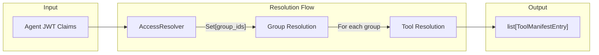
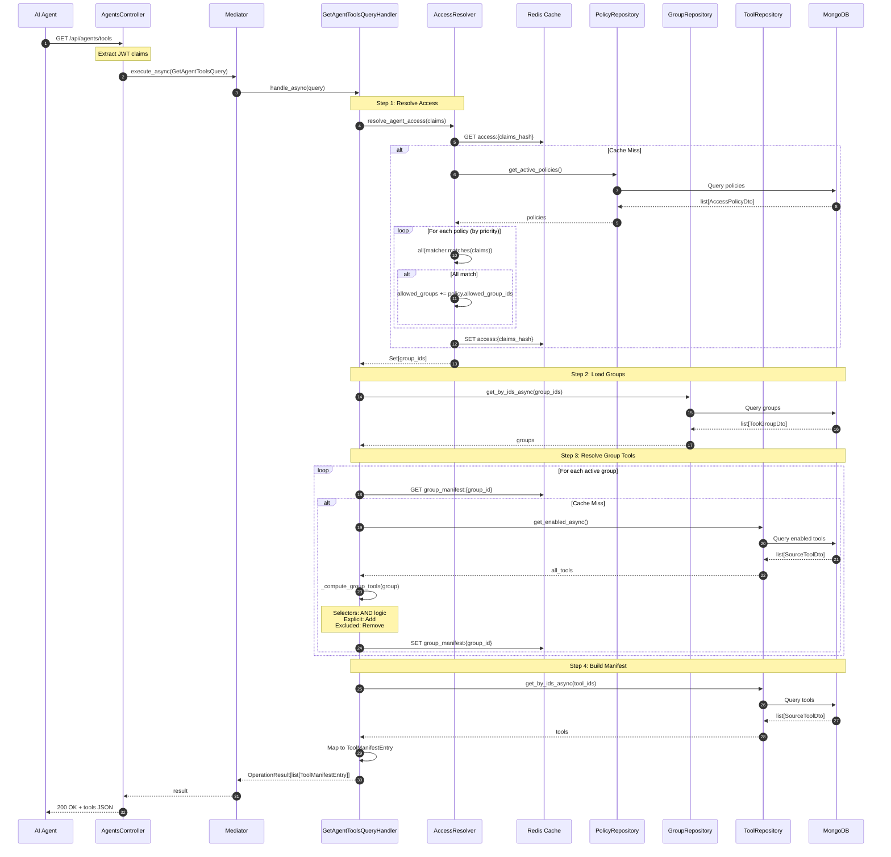

# Agent Tools Query

This document explains how AI agents discover their available tools based on JWT claims, access policies, and tool groups.

## Overview

The `GetAgentToolsQuery` is the **critical query** for tool discovery. It resolves the complete set of tools available to an authenticated agent by evaluating their JWT claims against configured access policies.



## Query Definition

**File**: `src/application/queries/get_agent_tools_query.py`

```python
@dataclass
class GetAgentToolsQuery(Query[OperationResult[list[ToolManifestEntry]]]):
    """Query to resolve the tools available to an authenticated agent.

    This query:
    1. Evaluates the agent's JWT claims against active AccessPolicies
    2. Resolves which ToolGroups the agent can access
    3. Resolves the tools in those groups (selectors + explicit - excluded)
    4. Returns a deduplicated list of tool manifests
    """

    claims: dict[str, Any]
    """Decoded JWT claims from the agent's token."""

    skip_cache: bool = False
    """If True, bypass the access resolution cache."""

    include_disabled_tools: bool = False
    """If True, include disabled tools (for admin preview)."""
```

## Query Handler

```python
class GetAgentToolsQueryHandler(QueryHandler[GetAgentToolsQuery, OperationResult[list[ToolManifestEntry]]]):
    """Handle agent tool discovery.

    Resolution Flow:
    1. AccessResolver evaluates claims against policies → Set[group_ids]
    2. For each group, resolve tools (via CatalogProjector or cached manifests)
    3. Deduplicate tools across groups
    4. Return as ToolManifestEntry list
    """

    def __init__(
        self,
        policy_repository: AccessPolicyDtoRepository,
        group_repository: ToolGroupDtoRepository,
        tool_repository: SourceToolDtoRepository,
        cache: RedisCacheService | None = None,
    ):
        self._policy_repository = policy_repository
        self._group_repository = group_repository
        self._tool_repository = tool_repository
        self._cache = cache

        # Create AccessResolver
        self._access_resolver = AccessResolver(
            policy_repository=policy_repository,
            group_repository=group_repository,
            cache=cache,
        )
```

!!! note "Dependencies"
    The handler uses **Read Model repositories** (MongoDB) since this is a query operation. The `AccessResolver` is instantiated internally with the same repositories.

## Resolution Flow

### Step 1: Evaluate Access Policies

The `AccessResolver` evaluates the agent's JWT claims against all active access policies:

```python
# Step 1: Resolve which groups the agent can access
allowed_group_ids = await self._access_resolver.resolve_agent_access(
    claims=query.claims,
    skip_cache=query.skip_cache,
)

if not allowed_group_ids:
    logger.debug("Agent has no access to any tool groups")
    agent_access_denied.add(1)
    return self.ok([])
```

**AccessResolver Logic**:

1. Load all active `AccessPolicyDto` from MongoDB
2. Sort by priority (highest first)
3. For each policy: check if **ALL** claim matchers match (AND logic)
4. If policy matches: add its `allowed_group_ids` to the result set
5. Return union of all granted group IDs (OR logic between policies)

### Step 2: Load Tool Groups

```python
# Step 2: Get the tool groups
groups = await self._group_repository.get_by_ids_async(list(allowed_group_ids))
active_groups = [g for g in groups if g.is_active]

if not active_groups:
    return self.ok([])
```

### Step 3: Resolve Tools for Each Group

```python
# Step 3: Resolve tools for each group
all_tool_ids: set[str] = set()

for group in active_groups:
    tool_ids = await self._resolve_group_tools(group.id)
    all_tool_ids.update(tool_ids)
```

The `_resolve_group_tools` method uses caching:

```python
async def _resolve_group_tools(self, group_id: str) -> set[str]:
    """Resolve the tool IDs for a group.

    First checks Redis cache, then computes from group definition.
    """
    # Try cache first
    if self._cache:
        cached_tools = await self._cache.get_group_manifest(group_id)
        if cached_tools is not None:
            return set(cached_tools)

    # Load group and compute tools
    group = await self._group_repository.get_async(group_id)
    if not group:
        return set()

    # Resolve tools using selectors and explicit memberships
    tool_ids = await self._compute_group_tools(group)

    # Cache the result
    if self._cache:
        await self._cache.set_group_manifest(group_id, list(tool_ids))

    return tool_ids
```

### Step 4: Compute Group Tools

!!! warning "Critical: Selector Logic"
    The code evaluates selectors with **AND logic** - a tool must match **ALL** selectors to be included:

    ```python
    if all(selector.matches(...) for selector in selectors):
        matched_tools.add(tool.id)
    ```

```python
async def _compute_group_tools(self, group) -> set[str]:
    """Compute the tool IDs for a group.

    Resolution Order:
    1. Start with empty set
    2. Add all ENABLED tools matching ALL selectors (AND logic)
    3. Add all explicit_tool_ids
    4. Remove all excluded_tool_ids
    """
    matched_tools: set[str] = set()

    # 1. Pattern matching via selectors
    if group.selectors:
        all_tools = await self._tool_repository.get_enabled_async()
        selectors = [ToolSelector.from_dict(s) for s in group.selectors]

        for tool in all_tools:
            # Tool matches if it matches ALL selectors (AND logic)
            if all(
                selector.matches(
                    source_name=tool.source_name,
                    tool_name=tool.tool_name,
                    tags=tool.tags,
                    source_path=tool.path,
                    method=tool.method,
                    label_ids=tool.label_ids,
                )
                for selector in selectors
            ):
                matched_tools.add(tool.id)

    # 2. Add explicit tools
    if group.explicit_tool_ids:
        for membership in group.explicit_tool_ids:
            tool_id = membership.get("tool_id") if isinstance(membership, dict) else membership.tool_id
            matched_tools.add(tool_id)

    # 3. Remove excluded tools
    if group.excluded_tool_ids:
        for exclusion in group.excluded_tool_ids:
            tool_id = exclusion.get("tool_id") if isinstance(exclusion, dict) else exclusion.tool_id
            matched_tools.discard(tool_id)

    return matched_tools
```

### Step 5: Load Tools and Build Manifest

```python
# Step 4: Load tool definitions and build manifest
tools = await self._tool_repository.get_by_ids_async(list(all_tool_ids))

# Filter by enabled status
if not query.include_disabled_tools:
    tools = [t for t in tools if t.is_enabled]

# Step 5: Map to ToolManifestEntry
manifest_entries = [self._to_manifest_entry(tool) for tool in tools]
return self.ok(manifest_entries)
```

## Output: ToolManifestEntry

```python
@dataclass
class ToolManifestEntry:
    """A tool available to an agent.

    This is the normalized tool representation sent to agents
    via SSE or the REST API.
    """

    tool_id: str
    """Unique tool identifier (format: source_id:operation_id)."""

    name: str
    """Human-readable tool name."""

    description: str
    """Detailed description of what the tool does."""

    input_schema: dict[str, Any]
    """JSON Schema for tool arguments."""

    source_id: str
    """ID of the upstream source providing this tool."""

    source_path: str
    """Original API path (e.g., /api/v1/users)."""

    tags: list[str]
    """Tags for categorization."""

    version: str | None
    """Tool version if available."""
```

## Sequence Diagram



## Caching Strategy

The query handler uses Redis for two levels of caching:

### 1. Access Resolution Cache

**Key**: `access:{sha256(claims)[:16]}`
**Value**: Set of allowed group IDs
**TTL**: Configurable (default: 5 minutes)

This caches the result of policy evaluation, avoiding repeated policy queries for the same claims.

### 2. Group Manifest Cache

**Key**: `group_manifest:{group_id}`
**Value**: List of tool IDs in the group
**TTL**: Configurable (default: 10 minutes)

This caches the computed tools for a group, avoiding repeated selector evaluation.

!!! tip "Cache Invalidation"
    - Access cache is invalidated when policies change
    - Group manifest cache is invalidated when:
      - Group selectors change
      - Group explicit/excluded tools change
      - Tools are added/removed/enabled/disabled

## Observability

The handler emits OpenTelemetry metrics:

| Metric | Type | Description |
|--------|------|-------------|
| `agent_access_resolutions` | Counter | Total access resolution attempts |
| `agent_access_denied` | Counter | Access denied (no matching policies) |
| `agent_tools_resolved` | Counter | Total tools returned to agents |
| `agent_resolution_time` | Histogram | Time to resolve tools (ms) |

## API Endpoints

### REST API

**Endpoint**: `GET /api/agents/tools`

**Headers**:

```
Authorization: Bearer <jwt_token>
```

**Response**:

```json
{
  "data": [
    {
      "tool_id": "pizzeria:list_menu",
      "name": "list_menu",
      "description": "List all available menu items",
      "input_schema": {
        "type": "object",
        "properties": {
          "category": {"type": "string", "description": "Filter by category"}
        }
      },
      "source_id": "pizzeria",
      "source_path": "/menu",
      "tags": ["menu", "read-only"]
    }
  ]
}
```

### SSE Endpoint

**Endpoint**: `GET /api/agents/stream`

Returns tools via Server-Sent Events, allowing real-time updates when tool availability changes.

## File Reference

| Component | File Path |
|-----------|-----------|
| Query & Handler | `src/application/queries/get_agent_tools_query.py` |
| AccessResolver | `src/application/services/access_resolver.py` |
| PolicyRepository | `src/domain/repositories/access_policy_repository.py` |
| GroupRepository | `src/domain/repositories/tool_group_repository.py` |
| ToolRepository | `src/domain/repositories/source_tool_repository.py` |
| Cache Service | `src/infrastructure/cache/redis_cache.py` |
| Agents Controller | `src/api/controllers/agents_controller.py` |

## Next Step

Once an agent has discovered its available tools, it can execute them. See [Tool Execution](tool-execution.md) for how tool calls are proxied to upstream services with token exchange.
