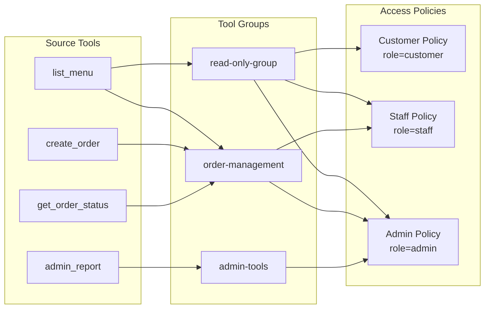
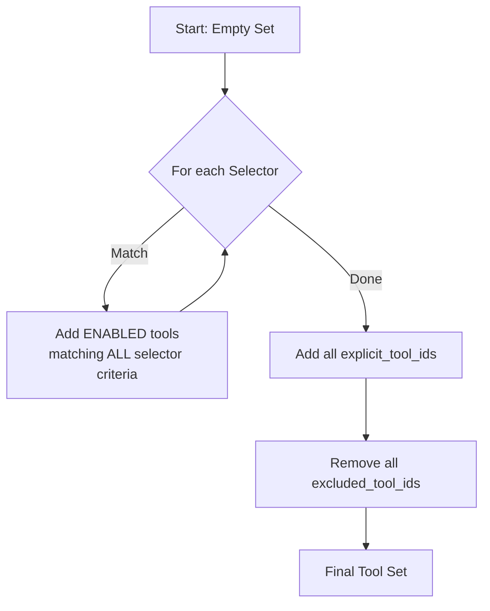
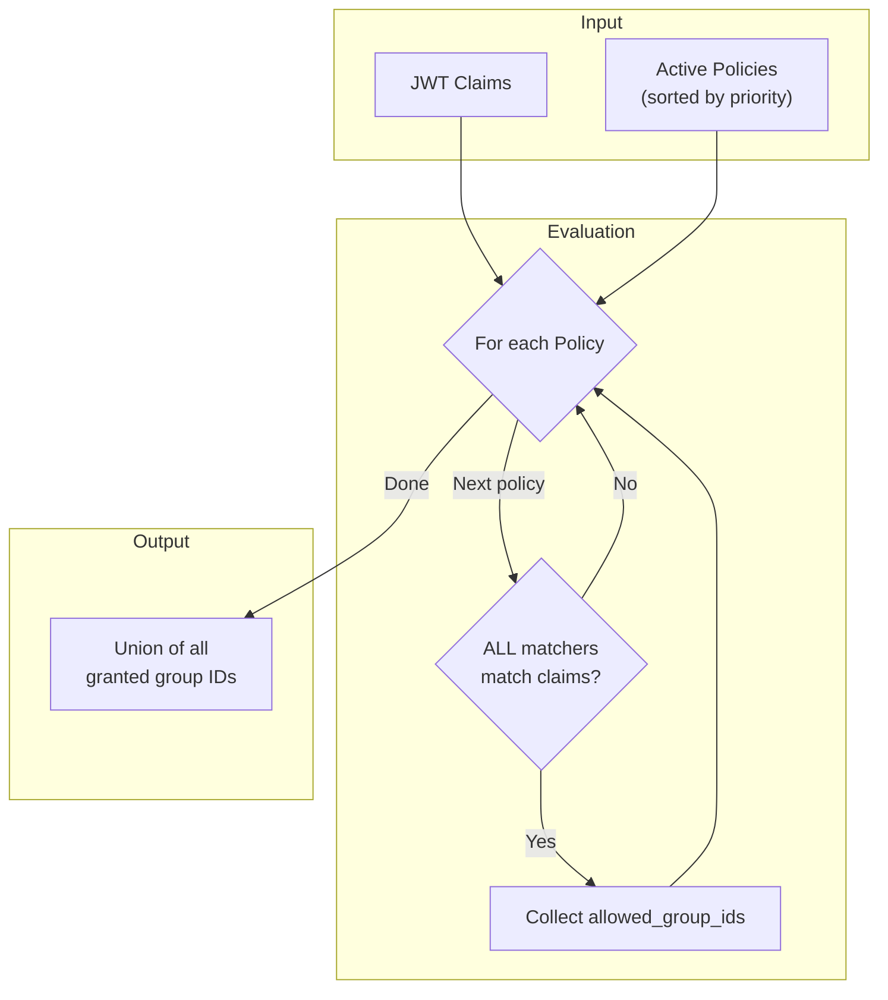
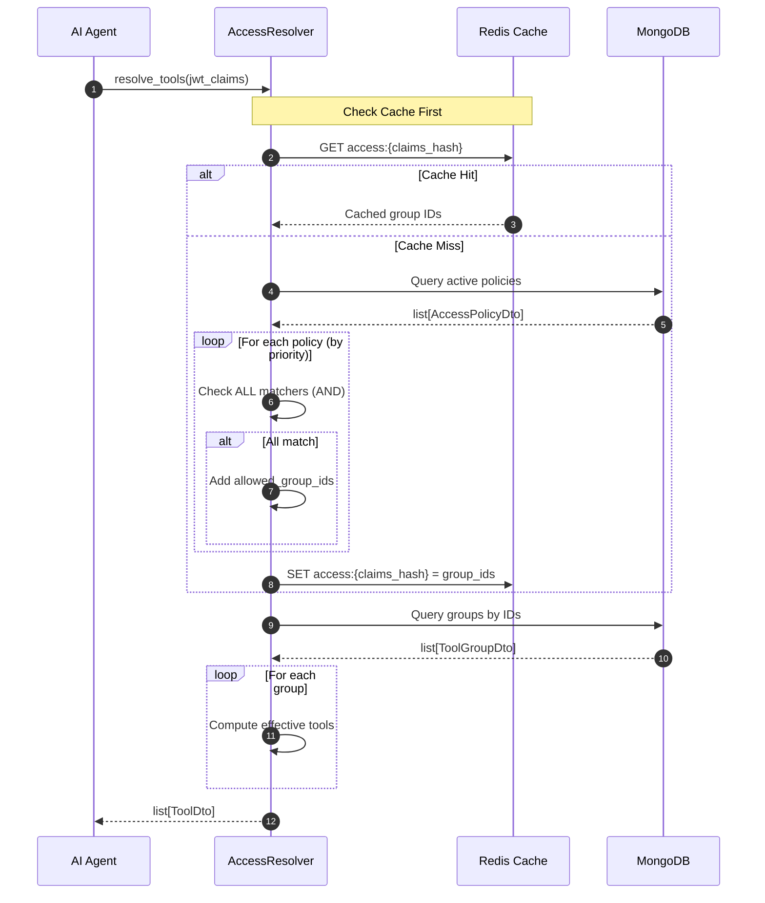

# Groups and Policies

This document explains how tools are organized into groups and how access policies control which tools are available to AI agents based on their JWT claims.

## Overview

Tool access is controlled through a two-tier system:

1. **ToolGroups**: Curate tools via selectors and explicit references
2. **AccessPolicies**: Map JWT claims to allowed tool groups



## Logic Summary

!!! warning "Critical: AND vs OR Logic"

    | Level | Logic | Description |
    |-------|-------|-------------|
    | **ClaimMatchers within a Policy** | **AND** | ALL matchers must match for policy to apply |
    | **Selectors within a Group** | **AND** | ALL selector criteria must match for tool inclusion |
    | **Multiple Policies** | **OR** | ANY matching policy grants access to its groups |
    | **Multiple Selectors in Group** | **OR** | Tool matches if ANY selector matches |

---

## Part 1: Tool Groups

### Aggregate Definition

**File**: `src/domain/entities/tool_group.py`

```python
"""ToolGroup aggregate curates tools into logical groups using:

1. Pattern-based selectors (dynamic matching)
2. Explicit tool references (direct membership)
3. Exclusion lists (override selector matches)

Tool Resolution Order:
1. Start with empty set
2. Add all ENABLED tools matching selectors
3. Add all explicit_tool_ids
4. Remove all excluded_tool_ids
"""
```

### ToolGroupState

```python
class ToolGroupState(AggregateState[str]):
    """State for the ToolGroup aggregate."""

    # Identity
    id: str
    name: str
    description: str

    # Pattern-based selection
    selectors: list[ToolSelector]

    # Explicit tool management
    explicit_tool_ids: list[ToolGroupMembership]  # Directly included tools
    excluded_tool_ids: list[ToolExclusion]  # Explicitly excluded tools

    # Lifecycle
    is_active: bool
    created_at: datetime
    updated_at: datetime
    created_by: str | None
```

### Tool Resolution Algorithm



**Code**: Implemented in `GetAgentToolsQuery._compute_group_tools()`

```python
def _compute_group_tools(
    self,
    group: ToolGroupDto,
    all_tools: list[ToolDto],
) -> list[ToolDto]:
    """Compute the effective tools for a group."""
    result_tools = []
    result_ids = set()

    # Phase 1: Add tools matching selectors
    for tool in all_tools:
        if not tool.is_enabled:
            continue

        # Check if tool matches ANY selector
        for selector in group.selectors:
            # Within a selector, ALL criteria must match (AND logic)
            if all(selector.matches(
                source_name=tool.source_name,
                tool_name=tool.name,
                source_path=tool.manifest.path,
                tags=tool.tags,
                method=tool.manifest.method,
                label_ids=tool.label_ids,
            ) for selector in [selector]):  # Each selector evaluated independently
                if tool.id not in result_ids:
                    result_tools.append(tool)
                    result_ids.add(tool.id)
                break  # Tool matched at least one selector (OR between selectors)

    # Phase 2: Add explicit tools
    for membership in group.explicit_tool_ids:
        tool = next((t for t in all_tools if t.id == membership.tool_id), None)
        if tool and tool.id not in result_ids:
            result_tools.append(tool)
            result_ids.add(tool.id)

    # Phase 3: Remove excluded tools
    excluded_ids = {excl.tool_id for excl in group.excluded_tool_ids}
    result_tools = [t for t in result_tools if t.id not in excluded_ids]

    return result_tools
```

### ToolSelector Value Object

**File**: `src/domain/models/tool_selector.py`

```python
@dataclass(frozen=True)
class ToolSelector:
    """Rules for including tools via pattern matching.

    All criteria are AND'd together (all must match for tool to be included).
    Use multiple selectors in a ToolGroup for OR logic.

    Pattern syntax:
    - Standard glob patterns: * (any chars), ? (single char)
    - Regex patterns: prefix with "regex:" (e.g., "regex:^create_.*")
    """

    id: str
    source_pattern: str = "*"  # Pattern for source name
    name_pattern: str = "*"    # Pattern for tool name
    path_pattern: str | None = None  # Pattern for API path
    method_pattern: str | None = None  # HTTP method (GET, POST, etc.)

    # Tag filtering
    required_tags: list[str]  # ALL must be present
    excluded_tags: list[str]  # NONE must be present

    # Label filtering
    required_label_ids: list[str]  # ALL must be present
```

!!! tip "Selector Matching Logic"
    Within a **single selector**, all specified criteria use **AND logic**:

    - `source_pattern` AND
    - `name_pattern` AND
    - `path_pattern` (if specified) AND
    - `method_pattern` (if specified) AND
    - ALL `required_tags` present AND
    - NONE of `excluded_tags` present AND
    - ALL `required_label_ids` present

### Example: Creating a Tool Group

```json
// POST /api/groups
{
  "name": "order-management",
  "description": "Tools for managing customer orders",
  "selectors": [
    {
      "source_pattern": "pizzeria-*",
      "name_pattern": "*order*",
      "required_tags": ["orders"],
      "excluded_tags": ["admin", "internal"]
    },
    {
      "source_pattern": "*",
      "path_pattern": "/orders/*",
      "method_pattern": "GET"
    }
  ],
  "explicit_tool_ids": ["pizzeria:cancel_order"],
  "excluded_tool_ids": ["pizzeria:delete_all_orders"]
}
```

This group includes tools that:

- Match **selector 1**: source name starts with "pizzeria-", tool name contains "order", has "orders" tag, doesn't have "admin" or "internal" tags
- **OR** match **selector 2**: any source, path starts with "/orders/", method is GET
- **PLUS** explicitly includes `pizzeria:cancel_order`
- **MINUS** explicitly excludes `pizzeria:delete_all_orders`

---

## Part 2: Access Policies

### Aggregate Definition

**File**: `src/domain/entities/access_policy.py`

```python
"""AccessPolicy aggregate maps JWT claims to allowed tool groups.

Key Design Decisions:
1. Multiple ClaimMatchers are evaluated with AND logic (all must match)
2. Multiple AccessPolicies are evaluated with OR logic (any can grant access)
3. Priority determines evaluation order (higher = earlier)
4. Only active policies participate in access resolution
"""
```

### AccessPolicyState

```python
class AccessPolicyState(AggregateState[str]):
    """State for the AccessPolicy aggregate."""

    # Identity
    id: str
    name: str
    description: str | None

    # Access rules
    claim_matchers: list[ClaimMatcher]  # ALL must match (AND logic)
    allowed_group_ids: list[str]  # Groups granted if policy matches

    # Evaluation control
    priority: int  # Higher = evaluated first
    is_active: bool  # Only active policies participate

    # Audit
    created_at: datetime
    updated_at: datetime
    created_by: str | None
```

### ClaimMatcher Value Object

**File**: `src/domain/models/claim_matcher.py`

```python
@dataclass(frozen=True)
class ClaimMatcher:
    """Rules for matching JWT claims.

    Uses JSONPath-like expressions to extract claim values
    and applies operators for matching.

    All ClaimMatchers in an AccessPolicy use AND logic (all must match).
    """

    json_path: str  # Path expression (e.g., "realm_access.roles")
    operator: ClaimOperator  # How to compare
    value: str  # Expected value or pattern
```

### Supported Operators

| Operator | Description | Example |
|----------|-------------|---------|
| `EQUALS` | Exact string match | `email` EQUALS `admin@example.com` |
| `NOT_EQUALS` | String inequality | `status` NOT_EQUALS `disabled` |
| `CONTAINS` | Substring or list membership | `realm_access.roles` CONTAINS `customer` |
| `NOT_CONTAINS` | Not in string/list | `roles` NOT_CONTAINS `blocked` |
| `MATCHES` | Regex pattern match | `email` MATCHES `.*@company\.com$` |
| `EXISTS` | Claim path exists | `premium_tier` EXISTS |
| `IN` | Value in comma-separated list | `tenant` IN `acme,globex,initech` |
| `NOT_IN` | Value not in list | `status` NOT_IN `banned,suspended` |

### Policy Evaluation Flow



**Code**: From `AccessResolver._resolve_groups_for_claims()`

```python
def _resolve_groups_for_claims(
    self,
    claims: dict[str, Any],
    policies: list[AccessPolicyDto],
) -> set[str]:
    """Resolve which group IDs are accessible for the given claims."""
    granted_groups: set[str] = set()

    # Evaluate policies in priority order (highest first)
    sorted_policies = sorted(policies, key=lambda p: p.priority, reverse=True)

    for policy in sorted_policies:
        if not policy.is_active:
            continue

        # ALL matchers must match (AND logic)
        if all(matcher.matches(claims) for matcher in policy.claim_matchers):
            # Policy matches - add its groups (OR logic between policies)
            granted_groups.update(policy.allowed_group_ids)

    return granted_groups
```

### Example: Creating an Access Policy

```json
// POST /api/policies
{
  "name": "staff-order-access",
  "description": "Grants order management access to staff members",
  "priority": 100,
  "claim_matchers": [
    {
      "json_path": "realm_access.roles",
      "operator": "CONTAINS",
      "value": "staff"
    },
    {
      "json_path": "tenant_id",
      "operator": "EXISTS",
      "value": ""
    }
  ],
  "allowed_group_ids": ["read-only-group", "order-management"]
}
```

This policy grants access to `read-only-group` and `order-management` when:

- `realm_access.roles` contains "staff" **AND**
- `tenant_id` claim exists

---

## Sequence Diagram: Policy Resolution



---

## Domain Events

### ToolGroup Events

| Event | Trigger | Description |
|-------|---------|-------------|
| `ToolGroupCreatedDomainEvent` | `ToolGroup.create()` | Group created |
| `ToolGroupUpdatedDomainEvent` | `update()` | Name/description changed |
| `SelectorAddedDomainEvent` | `add_selector()` | New selector added |
| `SelectorRemovedDomainEvent` | `remove_selector()` | Selector removed |
| `ExplicitToolAddedDomainEvent` | `add_explicit_tool()` | Tool explicitly added |
| `ExplicitToolRemovedDomainEvent` | `remove_explicit_tool()` | Explicit tool removed |
| `ToolExcludedDomainEvent` | `exclude_tool()` | Tool excluded |
| `ToolIncludedDomainEvent` | `include_tool()` | Exclusion removed |

### AccessPolicy Events

| Event | Trigger | Description |
|-------|---------|-------------|
| `AccessPolicyDefinedDomainEvent` | `AccessPolicy.define()` | Policy created |
| `AccessPolicyUpdatedDomainEvent` | `update()` | Name/description changed |
| `AccessPolicyMatchersUpdatedDomainEvent` | `update_matchers()` | Claim matchers changed |
| `AccessPolicyGroupsUpdatedDomainEvent` | `update_groups()` | Allowed groups changed |
| `AccessPolicyPriorityUpdatedDomainEvent` | `update_priority()` | Priority changed |
| `AccessPolicyActivatedDomainEvent` | `activate()` | Policy enabled |
| `AccessPolicyDeactivatedDomainEvent` | `deactivate()` | Policy disabled |

---

## File Reference

| Component | File Path |
|-----------|-----------|
| ToolGroup Aggregate | `src/domain/entities/tool_group.py` |
| ToolSelector Value Object | `src/domain/models/tool_selector.py` |
| ToolGroup Events | `src/domain/events/tool_group.py` |
| ToolGroup Projection | `src/application/events/domain/tool_group_projection_handlers.py` |
| AccessPolicy Aggregate | `src/domain/entities/access_policy.py` |
| ClaimMatcher Value Object | `src/domain/models/claim_matcher.py` |
| AccessPolicy Events | `src/domain/events/access_policy.py` |
| AccessPolicy Projection | `src/application/events/domain/access_policy_projection_handlers.py` |
| AccessResolver | `src/application/services/access_resolver.py` |

---

## Next Step

With groups and policies configured, agents can query their available tools. See [Agent Tools Query](agent-tools-query.md) for the full resolution flow.
