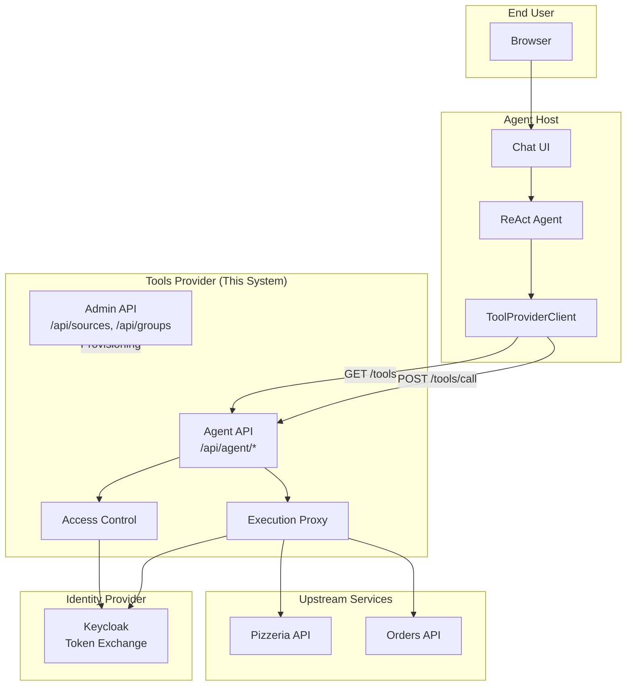
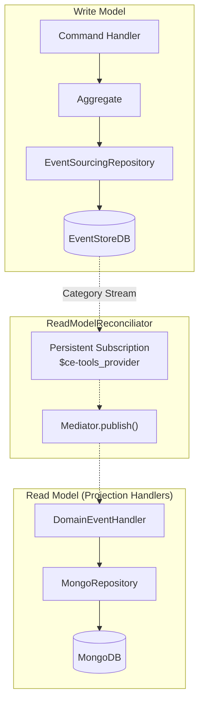
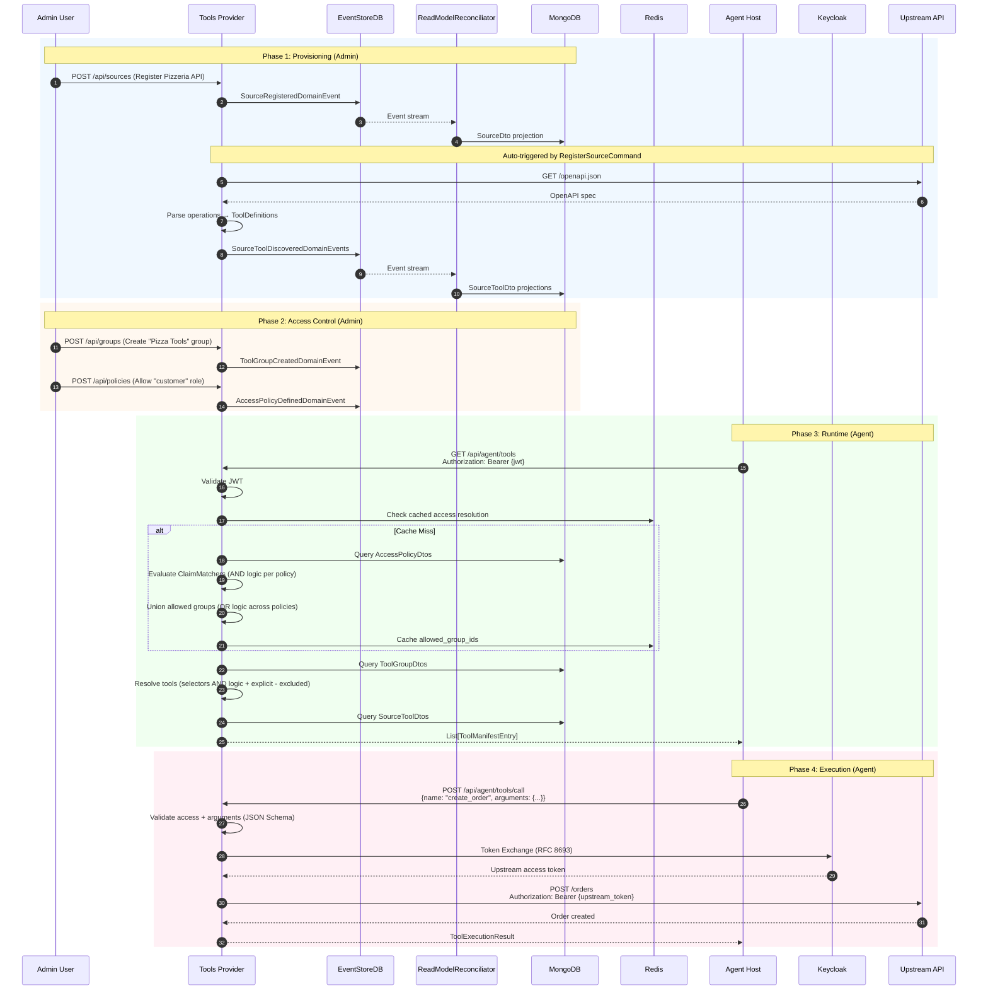

# Implementation Guide

This section provides detailed documentation of the MCP Tools Provider's end-to-end data flows. It serves as a **source-of-truth reference** for both AI Agent coding assistants and human developers/architects working with the codebase.

!!! tip "Audience"
    - **AI Coding Assistants**: Use this to understand domain concepts, locate implementation files, and navigate the CQRS/Event Sourcing patterns
    - **Human Developers**: Use this as a reference when implementing new features or debugging data flow issues
    - **Architects**: Use this to understand system boundaries, integration points, and extension patterns

## System Context

The MCP Tools Provider operates as a **tool registry and execution proxy** in a larger AI Agent ecosystem:



## Neuroglia Data Access Layer Architecture

!!! warning "Critical Architecture Pattern"
    This project uses the **Neuroglia Framework** which implements CQRS with Event Sourcing via a **Data Access Layer (DAL)**:

    - **Write Model**: `EventSourcingRepository` persists aggregates to **EventStoreDB**
    - **Read Model**: `ReadModelReconciliator` subscribes to EventStoreDB's category stream and projects events to **MongoDB**
    - **Projection Handlers**: `DomainEventHandler` implementations receive events via `Mediator.publish()` (NOT directly from command handlers)



## Data Flow Overview

The system handles five primary flows:

| Flow | Trigger | Key Handlers | Key Design Decisions |
|------|---------|--------------|----------------------|
| [Source Registration](source-registration.md) | Admin creates upstream source | `RegisterSourceCommand` | Auto-triggers inventory refresh |
| [Tool Discovery](tool-discovery.md) | Admin triggers inventory sync | `RefreshInventoryCommand` | Uses adapters via `get_adapter_for_type()` |
| [Groups & Policies](groups-and-policies.md) | Admin defines access rules | `CreateToolGroupCommand`, `CreateAccessPolicyCommand` | Selectors use **AND** logic within a group |
| [Agent Tools Query](agent-tools-query.md) | Agent requests available tools | `GetAgentToolsQuery` | Policies use **OR** logic, matchers use **AND** |
| [Tool Execution](tool-execution.md) | Agent executes a tool | `ExecuteToolCommand` | Token exchange via RFC 8693 |

## High-Level Sequence: Complete Flow



## Domain Model Quick Reference

### Core Aggregates

| Aggregate | File | Key State | Purpose |
|-----------|------|-----------|---------|
| `UpstreamSource` | `domain/entities/upstream_source.py` | name, url, openapi_url, health_status, inventory_count | External API registration |
| `SourceTool` | `domain/entities/source_tool.py` | source_id, operation_id, definition, is_enabled, status | Individual tool from a source |
| `ToolGroup` | `domain/entities/tool_group.py` | name, selectors, explicit_tool_ids, excluded_tool_ids | Curated tool collection |
| `AccessPolicy` | `domain/entities/access_policy.py` | name, claim_matchers, allowed_group_ids, priority | JWT claims → groups mapping |

### Key Application Services

| Service | File | Responsibility |
|---------|------|----------------|
| `OpenAPISourceAdapter` | `application/services/openapi_source_adapter.py` | Parse OpenAPI specs into ToolDefinitions |
| `AccessResolver` | `application/services/access_resolver.py` | Evaluate JWT claims against policies |
| `ToolExecutor` | `application/services/tool_executor.py` | Execute tools via HTTP with token exchange |
| `KeycloakTokenExchanger` | `infrastructure/adapters/keycloak_token_exchanger.py` | RFC 8693 token exchange |

### Tool ID Convention

Tools use a composite identifier:

```
{source_id}:{operation_id}
```

| Component | Source | Example |
|-----------|--------|---------|
| `source_id` | UUID from UpstreamSource aggregate | `a1b2c3d4-...` |
| `operation_id` | `operationId` from OpenAPI spec | `create_order` |
| **Full ID** | Concatenated with `:` | `a1b2c3d4-...:create_order` |

## Key Design Decisions

### Selector Logic (AND within group)

When a ToolGroup has multiple selectors, a tool must match **ALL** selectors to be included (AND logic):

```python
# From get_agent_tools_query.py
for tool in all_tools:
    # Tool matches if it matches ALL selectors (AND logic)
    if all(
        selector.matches(source_name=tool.source_name, tool_name=tool.tool_name, ...)
        for selector in selectors
    ):
        matched_tools.add(tool.id)
```

### Policy Logic (AND within policy, OR across policies)

- **Within a policy**: All `ClaimMatcher` rules must match (AND logic)
- **Across policies**: Any matching policy grants its groups (OR logic)

```python
# From access_resolver.py
def _policy_matches_claims(self, policy, claims) -> bool:
    # AND logic: all matchers must match
    for matcher_dict in policy.claim_matchers:
        matcher = ClaimMatcher.from_dict(matcher_dict)
        if not matcher.matches(claims):
            return False
    return True
```

### Projection Handler Architecture

Projection handlers do **NOT** persist directly from command handlers. They receive events via the Neuroglia `ReadModelReconciliator`:

```python
# From source_projection_handlers.py docstring
"""
These handlers listen to domain events streamed by the ReadModelReconciliator
and update the MongoDB read model accordingly.

The ReadModelReconciliator subscribes to EventStoreDB's category stream ($ce-tools_provider)
and publishes each event through the Mediator.
"""
```

## Navigation

- [Source Registration](source-registration.md) - How upstream services are registered
- [Tool Discovery](tool-discovery.md) - How tools are discovered from OpenAPI specs
- [Groups & Policies](groups-and-policies.md) - How access control is configured
- [Agent Tools Query](agent-tools-query.md) - How agents discover available tools at runtime
- [Tool Execution](tool-execution.md) - How tools are executed with identity delegation
