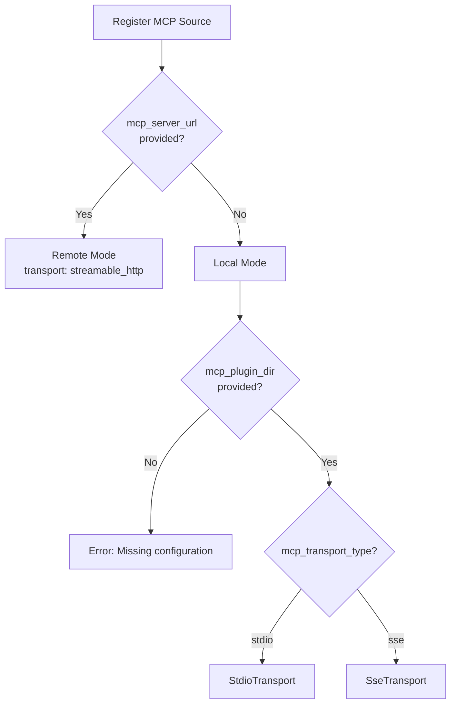
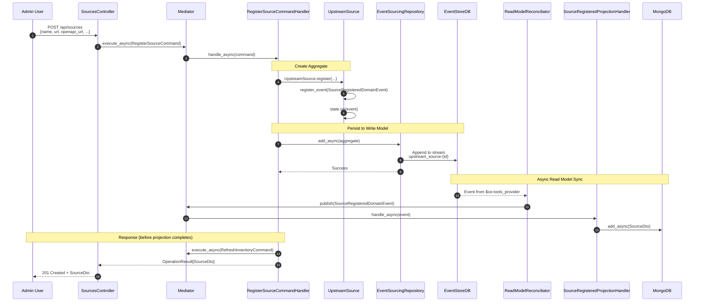

# Source Registration

This document details how upstream services are registered as tool sources in the MCP Tools Provider. The system supports multiple source types: **OpenAPI APIs**, **MCP Servers** (local plugins and remote), and **Built-in Tools**.

## Overview

Source registration is the first step in making tools available to AI agents. An administrator registers an external service by providing its connection details and optional authentication configuration.

!!! info "Key Design Decision"
    The `RegisterSourceCommand` automatically triggers a `RefreshInventoryCommand` after successful registration, discovering tools in a single operation.

```mermaid
flowchart LR
    subgraph Admin["Admin Action"]
        REQ["POST /api/sources"]
    end

    subgraph TP["Tools Provider"]
        CMD["RegisterSourceCommand"]
        AGG["UpstreamSource Aggregate"]
        EVT["SourceRegisteredDomainEvent"]
    end

    subgraph DAL["Neuroglia Data Access Layer"]
        ES["EventStoreDB<br/>(Write Model)"]
        RMR["ReadModelReconciliator<br/>(Persistent Subscription)"]
        PH["SourceRegisteredProjectionHandler"]
        MG["MongoDB<br/>(Read Model)"]
    end

    REQ --> CMD
    CMD --> AGG
    AGG --> EVT
    EVT --> ES
    ES -.->|"Category Stream<br/>$ce-tools_provider"| RMR
    RMR -.->|"Mediator.publish"| PH
    PH --> MG
```



## Source Types

The system supports four source types:

| Source Type | Description | Discovery Method |
|-------------|-------------|------------------|
| `openapi` | REST APIs with OpenAPI 3.x specification | Parse OpenAPI spec |
| `mcp` | Model Context Protocol servers | MCP `tools/list` request |
| `workflow` | Workflow engines (future) | Workflow API |
| `builtin` | Built-in utility tools | Static registration |

```python
class SourceType(str, Enum):
    OPENAPI = "openapi"   # OpenAPI 3.x specification
    WORKFLOW = "workflow" # Workflow engine (future)
    BUILTIN = "builtin"   # Built-in utility tools
    MCP = "mcp"           # Model Context Protocol server
```

## Read Model Reconciliation Architecture

!!! warning "Critical Architecture Detail"
    Projection handlers do **NOT** persist to MongoDB directly from command handlers. The Neuroglia DAL's `ReadModelReconciliator` manages this:

    1. Events are persisted to EventStoreDB by the `EventSourcingRepository`
    2. The `ReadModelReconciliator` subscribes to EventStoreDB's category stream (`$ce-tools_provider`)
    3. As events arrive, they are published via the `Mediator` to registered `DomainEventHandler` implementations
    4. Projection handlers receive events and update MongoDB accordingly

This architecture ensures **eventual consistency** between Write Model (EventStoreDB) and Read Model (MongoDB), with automatic replay capability on service restart.

---

## OpenAPI Source Registration

### API Endpoint

**Endpoint**: `POST /api/sources`

**Request Body**:

```json
{
  "name": "Pizzeria API",
  "url": "http://pizzeria-service:8080",
  "openapi_url": "http://pizzeria-service:8080/openapi.json",
  "source_type": "openapi",
  "default_audience": "pizzeria-api",
  "description": "Pizza ordering service",
  "auth_mode": "token_exchange",
  "required_scopes": ["pizzeria:read", "pizzeria:write"]
}
```

| Field | Required | Description |
|-------|----------|-------------|
| `name` | Yes | Human-readable name for the source |
| `url` | Yes | Base URL of the upstream service |
| `openapi_url` | No | URL to OpenAPI spec (defaults to `url` if not provided) |
| `source_type` | No | `"openapi"` (default), `"mcp"`, `"workflow"`, or `"builtin"` |
| `default_audience` | No | Target audience for token exchange (Keycloak client_id) |
| `description` | No | Human-readable description |
| `auth_mode` | No | `"none"`, `"api_key"`, `"http_basic"`, `"client_credentials"`, `"token_exchange"` |
| `required_scopes` | No | Scopes required for all tools from this source |

---

## MCP Source Registration

MCP sources come in two flavors: **local plugins** (subprocess) and **remote servers** (HTTP).

### MCP Plugin (Local)

Register a local MCP plugin that runs as a subprocess:

```json
{
  "name": "GitHub MCP",
  "url": "mcp://github-plugin",
  "source_type": "mcp",
  "description": "GitHub operations via MCP",
  "mcp_plugin_dir": "/opt/mcp-plugins/github",
  "mcp_transport_type": "stdio",
  "mcp_runtime_hint": "uvx",
  "mcp_lifecycle_mode": "transient",
  "mcp_env_vars": {
    "GITHUB_TOKEN": "ghp_xxx..."
  }
}
```

| Field | Required | Description |
|-------|----------|-------------|
| `mcp_plugin_dir` | Yes* | Directory containing the plugin manifest |
| `mcp_transport_type` | No | `"stdio"` (default) or `"sse"` |
| `mcp_runtime_hint` | No | Runtime: `"uvx"`, `"npx"`, `"python"`, `"node"` |
| `mcp_lifecycle_mode` | No | `"transient"` (default) or `"singleton"` |
| `mcp_command` | No | Custom command (overrides manifest) |
| `mcp_args` | No | Additional command arguments |
| `mcp_env_vars` | No | Environment variables for the subprocess |

*Required for local plugins (when `mcp_server_url` is not provided)

### MCP Remote Server

Register an externally-managed MCP server:

```json
{
  "name": "CML MCP Server",
  "url": "http://cml-mcp:9000",
  "source_type": "mcp",
  "description": "Cloudera Machine Learning tools",
  "mcp_server_url": "http://cml-mcp:9000",
  "mcp_env_vars": {
    "API_KEY": "optional-header-value"  // pragma: allowlist secret
  }
}
```

| Field | Required | Description |
|-------|----------|-------------|
| `mcp_server_url` | Yes* | URL of the remote MCP server |
| `mcp_env_vars` | No | Headers/auth for HTTP connection |

*Required for remote servers

### MCP Transport Selection



!!! tip "When to use each mode"
    - **Plugin (Local)**: Use for NPM/PyPI MCP packages, single-tenant scenarios, development
    - **Remote**: Use for shared infrastructure, stateful tools, externally-managed servers

---

## Authentication Modes

The `auth_mode` field determines how tools are executed against upstream services:

| Mode | Description | Use Case |
|------|-------------|----------|
| `none` | No authentication | Public endpoints |
| `api_key` | Static API key in header/query | Simple API authentication |
| `http_basic` | HTTP Basic authentication (RFC 7617) | Legacy systems |
| `client_credentials` | OAuth2 client credentials grant | Service-to-service |
| `token_exchange` | RFC 8693 token exchange | User identity delegation (default) |

```python
class AuthMode(str, Enum):
    NONE = "none"
    API_KEY = "api_key"  # pragma: allowlist secret
    HTTP_BASIC = "http_basic"
    CLIENT_CREDENTIALS = "client_credentials"
    TOKEN_EXCHANGE = "token_exchange"
```

## Command Definition

**File**: `src/application/commands/register_source_command.py`

```python
@dataclass
class RegisterSourceCommand(Command[OperationResult[SourceDto]]):
    """Command to register a new upstream source.

    The command will:
    1. Validate the URL is accessible and contains a valid specification
    2. Create the UpstreamSource aggregate
    3. Automatically refresh the inventory to discover tools
    4. Return the created source DTO with inventory count
    """

    name: str
    """Human-readable name for the source."""

    url: str
    """Base URL of the upstream service (e.g., https://api.example.com)."""

    openapi_url: str | None = None
    """URL to the OpenAPI specification (if different from url)."""

    description: str | None = None
    source_type: str = "openapi"

    # Authentication configuration
    auth_type: str | None = None
    bearer_token: str | None = None
    api_key_name: str | None = None
    api_key_value: str | None = None
    api_key_in: str | None = None
    oauth2_client_id: str | None = None
    oauth2_client_secret: str | None = None
    oauth2_token_url: str | None = None
    oauth2_scopes: list[str] | None = None

    # Token exchange configuration
    default_audience: str | None = None
    """Target audience for token exchange (client_id of upstream service in Keycloak)."""

    # Scope-based access control
    required_scopes: list[str] | None = None
    """Scopes required for all tools from this source.

    When set, overrides any scopes auto-discovered from the OpenAPI spec.
    Users must have ALL listed scopes in their token to execute any tool
    from this source. Empty list or None means no source-level scope
    requirements (fail-open).

    See: docs/architecture/scope-based-access-control.md
    """

    validate_url: bool = True
    user_info: dict[str, Any] | None = None
```

## Command Handler

**File**: `src/application/commands/register_source_command.py`

The handler creates the aggregate and automatically triggers inventory refresh:

```python
class RegisterSourceCommandHandler(
    CommandHandlerBase,
    CommandHandler[RegisterSourceCommand, OperationResult[SourceDto]],
):
    """Handler for registering new upstream sources.

    This handler:
    1. Validates the source URL (if enabled)
    2. Creates the UpstreamSource aggregate
    3. Persists to EventStoreDB via EventSourcingRepository
    4. Returns the source DTO (read model will be updated by projection handler)
    """

    def __init__(
        self,
        mediator: Mediator,
        mapper: Mapper,
        cloud_event_bus: CloudEventBus,
        cloud_event_publishing_options: CloudEventPublishingOptions,
        source_repository: Repository[UpstreamSource, str],
    ):
        super().__init__(mediator, mapper, cloud_event_bus, cloud_event_publishing_options)
        self.source_repository = source_repository
```

!!! note "Dependency Injection"
    The handler receives `source_repository: Repository[UpstreamSource, str]` which is the `EventSourcingRepository` configured by `DataAccessLayer.WriteModel()` in `main.py`. It does **NOT** have a direct MongoDB repository.

### Handler Flow

```python
async def handle_async(self, request: RegisterSourceCommand) -> OperationResult[SourceDto]:
    # 1. Determine spec URL (openapi_url or url)
    spec_url = command.openapi_url or command.url

    # 2. Optionally validate URL is accessible
    if command.validate_url:
        adapter = get_adapter_for_type(source_type)
        is_valid = await adapter.validate_url(spec_url, auth_config)
        if not is_valid:
            return self.bad_request(f"Could not validate URL: {spec_url}")

    # 3. Create aggregate (emits SourceRegisteredDomainEvent)
    source = UpstreamSource.register(
        name=command.name,
        url=command.url,
        openapi_url=command.openapi_url,
        source_type=source_type,
        auth_config=auth_config,
        default_audience=command.default_audience,
        description=command.description,
        created_by=triggered_by,
    )

    # 4. Persist to EventStoreDB
    await self.source_repository.add_async(source)

    # 5. Auto-trigger inventory refresh
    refresh_result = await self.mediator.execute_async(
        RefreshInventoryCommand(
            source_id=source.state.id,
            user_info=command.user_info,
        )
    )

    # 6. Map aggregate state to DTO for response
    source_dto = self.mapper.map(source.state, SourceDto)
    return self.ok(source_dto)
```

## Domain Aggregate

**File**: `src/domain/entities/upstream_source.py`

```python
"""UpstreamSource aggregate definition using the AggregateState pattern.

This aggregate manages the connection to an external system (OpenAPI or Workflow)
and tracks the lifecycle of its tool inventory.

Following the Task aggregate pattern:
- DomainEvents are registered via register_event()
- State is updated via @dispatch handlers
- Repository publishes events after persistence
"""

class UpstreamSourceState(AggregateState[str]):
    """Encapsulates the persisted state for the UpstreamSource aggregate."""

    # Identity
    id: str
    name: str
    description: str | None
    url: str  # Service base URL
    openapi_url: str | None  # URL to the OpenAPI specification
    source_type: SourceType

    # Authentication
    auth_config: AuthConfig | None
    default_audience: str | None  # Target audience for token exchange

    # Health tracking
    health_status: HealthStatus
    last_sync_at: datetime | None
    last_sync_error: str | None
    consecutive_failures: int

    # Inventory
    inventory_hash: str
    inventory_count: int

    # Lifecycle
    is_enabled: bool
    created_at: datetime
    updated_at: datetime
    created_by: str | None

    @dispatch(SourceRegisteredDomainEvent)
    def on(self, event: SourceRegisteredDomainEvent) -> None:
        """Apply the registration event to the state."""
        self.id = event.aggregate_id
        self.name = event.name
        self.description = event.description
        self.url = event.url
        self.openapi_url = event.openapi_url
        self.source_type = event.source_type
        self.created_at = event.created_at
        self.updated_at = event.created_at
        self.created_by = event.created_by
        self.default_audience = event.default_audience
```

### State Mutations via Events

| Method | Event Emitted | State Change |
|--------|---------------|--------------|
| `register(...)` | `SourceRegisteredDomainEvent` | Initialize all fields |
| `mark_sync_started()` | `SourceSyncStartedDomainEvent` | Update `updated_at` |
| `update_inventory()` | `InventoryIngestedDomainEvent` | `inventory_hash`, `inventory_count`, `health_status=HEALTHY` |
| `mark_sync_failed()` | `SourceSyncFailedDomainEvent` | `last_sync_error`, `consecutive_failures`, update health |
| `enable()`/`disable()` | `SourceEnabledDomainEvent`/`SourceDisabledDomainEvent` | `is_enabled` |

## Projection Handler

**File**: `src/application/events/domain/source_projection_handlers.py`

```python
"""
Read Model Projection Handlers for UpstreamSource Aggregate.

These handlers listen to domain events streamed by the ReadModelReconciliator
and update the MongoDB read model accordingly.

The ReadModelReconciliator subscribes to EventStoreDB's category stream ($ce-tools_provider)
and publishes each event through the Mediator. These handlers receive those events
and project them to MongoDB, keeping the Read Model in sync with the Write Model.
"""

class SourceRegisteredProjectionHandler(DomainEventHandler[SourceRegisteredDomainEvent]):
    """Projects SourceRegisteredDomainEvent to MongoDB Read Model."""

    def __init__(self, repository: Repository[SourceDto, str]):
        super().__init__()
        self._repository = repository

    async def handle_async(self, event: SourceRegisteredDomainEvent) -> None:
        """Create SourceDto in Read Model."""
        logger.info(f"📥 Projecting SourceRegistered: {event.aggregate_id}")

        # Idempotency check - skip if already exists
        existing = await self._repository.get_async(event.aggregate_id)
        if existing:
            logger.info(f"⏭️ Source already exists in Read Model, skipping")
            return

        # Map domain event to DTO
        source_dto = SourceDto(
            id=event.aggregate_id,
            name=event.name,
            url=event.url,
            source_type=event.source_type,
            health_status=HealthStatus.UNKNOWN,
            is_enabled=True,
            inventory_count=0,
            # ... other fields ...
        )

        await self._repository.add_async(source_dto)
```

!!! info "Idempotency"
    Projection handlers include idempotency checks because events may be replayed during service restarts or catch-up subscriptions.

## Sequence Diagram



## Error Handling

| Error Condition | HTTP Status | Error Code |
|-----------------|-------------|------------|
| Invalid URL format | 400 Bad Request | `INVALID_URL` |
| URL validation failed | 400 Bad Request | `URL_VALIDATION_FAILED` |
| OpenAPI spec fetch failed | 400 Bad Request | `SPEC_FETCH_FAILED` |
| Missing required fields | 422 Unprocessable Entity | `VALIDATION_ERROR` |
| EventStoreDB unavailable | 503 Service Unavailable | `PERSISTENCE_ERROR` |

## File Reference

| Component | File Path |
|-----------|-----------|
| Controller | `src/api/controllers/sources_controller.py` |
| Command | `src/application/commands/register_source_command.py` |
| Aggregate | `src/domain/entities/upstream_source.py` |
| Domain Events | `src/domain/events/upstream_source.py` |
| Projection Handler | `src/application/events/domain/source_projection_handlers.py` |
| Read Model DTO | `src/integration/models/source_dto.py` |

## Next Step

After registration, the source inventory is automatically refreshed. See [Tool Discovery](tool-discovery.md) for details on how tools are parsed from OpenAPI specifications.
