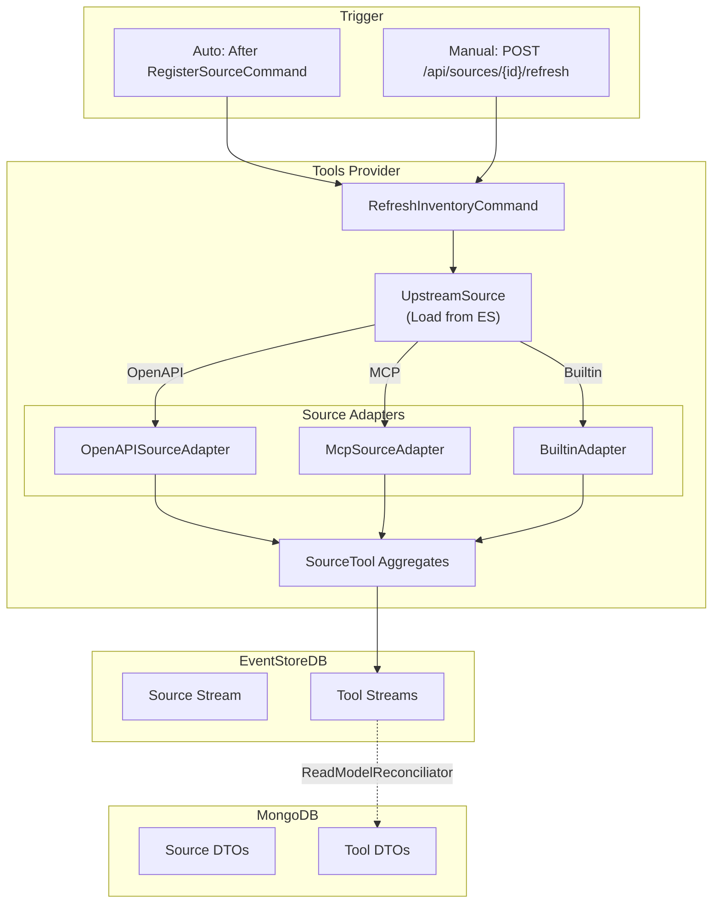
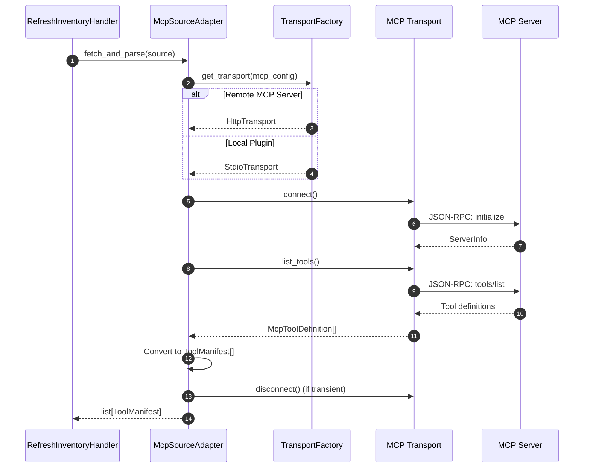
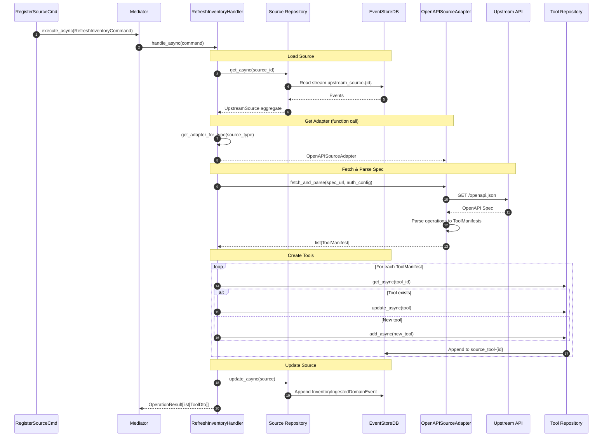

# Tool Discovery

This document explains how tools are discovered from upstream services after source registration. The system supports multiple source types: **OpenAPI specifications**, **MCP servers**, and **built-in tools**.

## Overview

Tool discovery happens automatically after source registration and can be triggered manually thereafter. The system uses source-specific adapters to fetch and parse tool definitions, creating individual `SourceTool` aggregates for each discovered tool.



## Source-Specific Discovery

| Source Type | Adapter | Discovery Method |
|-------------|---------|------------------|
| `openapi` | `OpenAPISourceAdapter` | Parse OpenAPI 3.x specification |
| `mcp` | `McpSourceAdapter` | MCP `tools/list` JSON-RPC request |
| `builtin` | `BuiltinAdapter` | Static tool definitions |

## Command Definition

**File**: `src/application/commands/source/refresh_inventory_command.py`

```python
@dataclass
class RefreshInventoryCommand(Command[OperationResult[RefreshInventoryResult]]):
    """Command to refresh the tool inventory for an upstream source.

    This command will:
    1. Load the source aggregate from EventStoreDB
    2. Fetch tools using the appropriate adapter
    3. Create or update SourceTool aggregates for each tool
    4. Deprecate tools no longer present upstream
    5. Update the source with inventory metadata
    """

    source_id: str
    """ID of the source to refresh inventory for."""

    force: bool = False
    """Force refresh even if inventory hash unchanged."""

    user_info: dict[str, Any] | None = None
```

## Command Handler

**File**: `src/application/commands/refresh_inventory_command.py`

!!! warning "Critical Implementation Detail"
    The handler uses `get_adapter_for_type()` **function** to obtain the source adapter. It is **NOT** a constructor dependency - the adapter is obtained dynamically based on the source type.

```python
class RefreshInventoryCommandHandler(
    CommandHandlerBase,
    CommandHandler[RefreshInventoryCommand, OperationResult[list[ToolDto]]],
):
    """Handler for refreshing source tool inventory.

    Handles the complete flow:
    1. Fetch specification from upstream (via adapter)
    2. Parse operations into tool manifests
    3. Create/update/disable SourceTool aggregates
    4. Update UpstreamSource with inventory hash

    Dependencies:
    - source_repository: Repository[UpstreamSource, str] - EventSourcingRepository for sources
    - tool_repository: Repository[SourceTool, str] - EventSourcingRepository for tools
    """

    def __init__(
        self,
        mediator: Mediator,
        mapper: Mapper,
        cloud_event_bus: CloudEventBus,
        cloud_event_publishing_options: CloudEventPublishingOptions,
        source_repository: Repository[UpstreamSource, str],
        tool_repository: Repository[SourceTool, str],
    ):
        super().__init__(mediator, mapper, cloud_event_bus, cloud_event_publishing_options)
        self.source_repository = source_repository
        self.tool_repository = tool_repository
```

!!! note "Dependency Summary"
    - `source_repository: Repository[UpstreamSource, str]` - For loading/updating UpstreamSource aggregate
    - `tool_repository: Repository[SourceTool, str]` - For creating/updating SourceTool aggregates
    - Adapter is **NOT** injected - obtained via `get_adapter_for_type()` function call

### Handler Flow

```python
async def handle_async(self, command: RefreshInventoryCommand) -> OperationResult[list[ToolDto]]:
    # 1. Load source aggregate from EventStoreDB
    source = await self.source_repository.get_async(command.source_id)
    if not source:
        return self.not_found(f"Source {command.source_id} not found")

    # 2. Get adapter for source type (FUNCTION CALL, NOT DEPENDENCY)
    adapter = get_adapter_for_type(source.state.source_type)

    # 3. Mark sync started (emits SourceSyncStartedDomainEvent)
    source.mark_sync_started()
    await self.source_repository.update_async(source)

    try:
        # 4. Fetch and parse specification via adapter
        spec_url = source.state.openapi_url or source.state.url
        tool_manifests = await adapter.fetch_and_parse(
            spec_url=spec_url,
            auth_config=source.state.auth_config,
        )

        # 5. Process each discovered tool
        tools_processed = []
        for manifest in tool_manifests:
            tool = await self._process_tool_manifest(
                source=source,
                manifest=manifest,
            )
            tools_processed.append(tool)

        # 6. Disable tools no longer in spec
        await self._disable_removed_tools(
            source_id=source.state.id,
            current_tool_ids=[t.state.id for t in tools_processed],
        )

        # 7. Update source inventory metadata
        inventory_hash = self._compute_inventory_hash(tool_manifests)
        source.update_inventory(
            inventory_hash=inventory_hash,
            inventory_count=len(tool_manifests),
        )
        await self.source_repository.update_async(source)

        # 8. Map to DTOs and return
        tool_dtos = [self.mapper.map(t.state, ToolDto) for t in tools_processed]
        return self.ok(tool_dtos)

    except Exception as e:
        # Mark sync failed on any error
        source.mark_sync_failed(str(e))
        await self.source_repository.update_async(source)
        return self.internal_error(f"Inventory refresh failed: {e}")
```

## Adapter Architecture

**File**: `src/infrastructure/adapters/__init__.py`

```python
"""
Source Adapter Factory.

Adapters are responsible for fetching and parsing specifications from upstream services.
They are NOT injected as dependencies - they are obtained dynamically based on source type.
"""

def get_adapter_for_type(source_type: SourceType) -> SourceAdapter:
    """Get the appropriate adapter for a source type.

    Args:
        source_type: The type of source (openapi, mcp, workflow, builtin)

    Returns:
        An adapter instance for the source type

    Raises:
        ValueError: If source type is not supported
    """
    adapters = {
        SourceType.OPENAPI: OpenAPISourceAdapter(),
        SourceType.MCP: McpSourceAdapter(),
        SourceType.WORKFLOW: WorkflowSourceAdapter(),
        SourceType.BUILTIN: BuiltinAdapter(),
    }
    adapter = adapters.get(source_type)
    if not adapter:
        raise ValueError(f"Unsupported source type: {source_type}")
    return adapter
```

---

## OpenAPI Tool Discovery

### OpenAPISourceAdapter

**File**: `src/infrastructure/adapters/openapi_source_adapter.py`

```python
class OpenAPISourceAdapter(SourceAdapter):
    """Adapter for parsing OpenAPI 3.x specifications into tool manifests.

    Handles:
    - Fetching OpenAPI spec from URL (JSON or YAML)
    - Resolving $ref references
    - Extracting operations as tool manifests
    - Building parameter schemas and request body schemas
    """

    async def fetch_and_parse(
        self,
        spec_url: str,
        auth_config: AuthConfig | None = None,
    ) -> list[ToolManifest]:
        """Fetch OpenAPI spec and convert to tool manifests."""

        # 1. Fetch specification
        spec_content = await self._fetch_spec(spec_url, auth_config)

        # 2. Parse YAML/JSON
        spec_dict = self._parse_spec(spec_content)

        # 3. Resolve $ref references
        resolved_spec = self._resolve_refs(spec_dict)

        # 4. Extract operations
        tool_manifests = []
        for path, path_item in resolved_spec.get("paths", {}).items():
            for method, operation in path_item.items():
                if method.upper() not in ["GET", "POST", "PUT", "DELETE", "PATCH"]:
                    continue

                manifest = self._operation_to_manifest(
                    path=path,
                    method=method.upper(),
                    operation=operation,
                    spec=resolved_spec,
                )
                tool_manifests.append(manifest)

        return tool_manifests
```

---

## MCP Tool Discovery

### McpSourceAdapter

MCP sources use the MCP protocol to discover available tools via the `tools/list` method.



### MCP Tool Definition

MCP servers return tool definitions in the MCP format:

```json
{
  "tools": [
    {
      "name": "create_issue",
      "description": "Create a new GitHub issue",
      "inputSchema": {
        "type": "object",
        "properties": {
          "repo": {
            "type": "string",
            "description": "Repository name (owner/repo)"
          },
          "title": {
            "type": "string",
            "description": "Issue title"
          },
          "body": {
            "type": "string",
            "description": "Issue body in markdown"
          }
        },
        "required": ["repo", "title"]
      }
    }
  ]
}
```

### Conversion to ToolManifest

The adapter converts MCP tool definitions to internal `ToolManifest` format:

```python
def _mcp_tool_to_manifest(self, tool: McpToolDefinition) -> ToolManifest:
    """Convert MCP tool definition to internal ToolManifest."""
    return ToolManifest(
        name=tool.name,
        description=tool.description or f"MCP tool: {tool.name}",
        method="POST",  # MCP tools are always invoked as calls
        path=f"/mcp/{tool.name}",  # Virtual path for MCP tools
        parameters=tool.input_schema,  # Already JSON Schema
        # MCP-specific execution profile
        execution_mode=ExecutionMode.MCP_CALL,
        # No URL/header/body templates (MCP protocol handles this)
    )
```

### Execution Mode

MCP tools are marked with `ExecutionMode.MCP_CALL`:

```python
class ExecutionMode(str, Enum):
    SYNC_HTTP = "sync_http"    # Standard HTTP request/response
    ASYNC_POLL = "async_poll"  # Async trigger with polling
    MCP_CALL = "mcp_call"      # Execute via MCP protocol
```

This tells the `ExecuteToolCommandHandler` to route the call through the `McpToolExecutor` instead of the standard HTTP executor.

---

### Operation to Manifest Conversion

```python
def _operation_to_manifest(
    self,
    path: str,
    method: str,
    operation: dict,
    spec: dict,
) -> ToolManifest:
    """Convert an OpenAPI operation to a ToolManifest.

    Tool naming: {operationId} or {method}_{path_slug}
    Description: operation.summary or operation.description
    Parameters: Combined path, query, header parameters + requestBody
    """

    # Generate tool name from operationId or path
    tool_name = operation.get("operationId")
    if not tool_name:
        path_slug = path.replace("/", "_").replace("{", "").replace("}", "")
        tool_name = f"{method.lower()}{path_slug}"

    # Build parameter schema (JSON Schema)
    parameters_schema = self._build_parameters_schema(
        operation.get("parameters", []),
        operation.get("requestBody"),
    )

    return ToolManifest(
        name=tool_name,
        description=operation.get("summary") or operation.get("description") or f"{method} {path}",
        method=method,
        path=path,
        parameters=parameters_schema,
        # Execution templates
        url_template=self._build_url_template(path, operation),
        headers_template=self._build_headers_template(operation),
        body_template=self._build_body_template(operation),
        # Metadata
        tags=operation.get("tags", []),
        security=operation.get("security", []),
    )
```

## SourceTool Aggregate

**File**: `src/domain/entities/source_tool.py`

```python
"""SourceTool Aggregate - represents a single tool from an upstream source.

Each tool has:
- Identity linked to source (source_id)
- ToolManifest with execution details
- Enable/disable lifecycle
- Execution metrics (call count, errors)
"""

class SourceToolState(AggregateState[str]):
    """State for the SourceTool aggregate."""

    id: str  # Unique tool ID
    source_id: str  # Parent source ID
    name: str  # Tool name (from operationId)
    description: str
    manifest: ToolManifest  # Full execution manifest
    tags: list[str]

    # Lifecycle
    is_enabled: bool
    created_at: datetime
    updated_at: datetime

    # Metrics
    execution_count: int
    last_executed_at: datetime | None
    error_count: int
    last_error: str | None
```

### Tool Manifest Structure

```python
@dataclass
class ToolManifest:
    """Complete execution manifest for a tool.

    Contains all information needed to invoke the upstream API:
    - HTTP method and path
    - Parameter schema (for LLM tool calling)
    - Jinja2 templates for URL, headers, body construction
    """

    name: str
    description: str
    method: str  # GET, POST, PUT, DELETE, PATCH
    path: str  # /orders/{order_id}

    # JSON Schema for parameters (used by LLM)
    parameters: dict

    # Jinja2 templates for execution
    url_template: str  # Resolved path with path params
    headers_template: dict[str, str]  # Header name -> Jinja2 value template
    body_template: str | None  # Request body Jinja2 template

    # Metadata
    tags: list[str]
    security: list[dict]
```

## Processing Flow

The handler processes each manifest, creating new tools or updating existing ones:

```python
async def _process_tool_manifest(
    self,
    source: UpstreamSource,
    manifest: ToolManifest,
) -> SourceTool:
    """Create or update a SourceTool from a manifest."""

    # Generate deterministic tool ID
    tool_id = f"{source.state.id}:{manifest.name}"

    # Try to load existing tool
    existing = await self.tool_repository.get_async(tool_id)

    if existing:
        # Update if manifest changed
        if existing.state.manifest != manifest:
            existing.update_manifest(manifest)
            await self.tool_repository.update_async(existing)
        return existing
    else:
        # Create new tool
        tool = SourceTool.create(
            id=tool_id,
            source_id=source.state.id,
            manifest=manifest,
        )
        await self.tool_repository.add_async(tool)
        return tool
```

## Sequence Diagram



## Projection to Read Model

The `ReadModelReconciliator` subscribes to EventStoreDB and projects tool events to MongoDB:

**File**: `src/application/events/domain/tool_projection_handlers.py`

```python
class ToolRegisteredProjectionHandler(DomainEventHandler[ToolRegisteredDomainEvent]):
    """Projects ToolRegisteredDomainEvent to MongoDB Read Model."""

    def __init__(self, repository: Repository[ToolDto, str]):
        self._repository = repository

    async def handle_async(self, event: ToolRegisteredDomainEvent) -> None:
        """Create ToolDto in Read Model."""
        tool_dto = ToolDto(
            id=event.aggregate_id,
            source_id=event.source_id,
            name=event.name,
            description=event.description,
            manifest=event.manifest,
            tags=event.tags,
            is_enabled=True,
            # ...
        )
        await self._repository.add_async(tool_dto)
```

## Inventory Hash Computation

The handler computes a hash of all tool manifests to detect changes:

```python
def _compute_inventory_hash(self, manifests: list[ToolManifest]) -> str:
    """Compute a deterministic hash of the tool inventory.

    Used to detect when the upstream spec has changed.
    """
    manifest_data = sorted(
        [
            {
                "name": m.name,
                "method": m.method,
                "path": m.path,
                "parameters": json.dumps(m.parameters, sort_keys=True),
            }
            for m in manifests
        ],
        key=lambda x: x["name"],
    )
    content = json.dumps(manifest_data, sort_keys=True)
    return hashlib.sha256(content.encode()).hexdigest()[:16]
```

## Error Handling

| Error Condition | Result | Recovery |
|-----------------|--------|----------|
| Source not found | 404 Not Found | Verify source_id |
| Spec fetch failed | 500 Internal Error | Source marked with `last_sync_error` |
| Parse error | 500 Internal Error | Source marked with `last_sync_error` |
| Tool save failed | 500 Internal Error | Partial inventory may exist |

## File Reference

| Component | File Path |
|-----------|-----------|
| Command & Handler | `src/application/commands/refresh_inventory_command.py` |
| OpenAPI Adapter | `src/infrastructure/adapters/openapi_source_adapter.py` |
| Adapter Factory | `src/infrastructure/adapters/__init__.py` |
| SourceTool Aggregate | `src/domain/entities/source_tool.py` |
| Tool Domain Events | `src/domain/events/source_tool.py` |
| Tool Projection Handlers | `src/application/events/domain/tool_projection_handlers.py` |
| Tool DTO | `src/integration/models/tool_dto.py` |
| ToolManifest Model | `src/domain/models/tool_manifest.py` |

## Next Step

After tools are discovered, they must be organized into groups and protected by policies. See [Groups and Policies](groups-and-policies.md) for how tools are curated and access is controlled.
