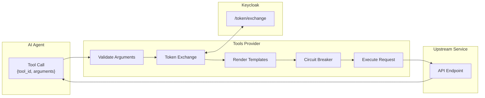
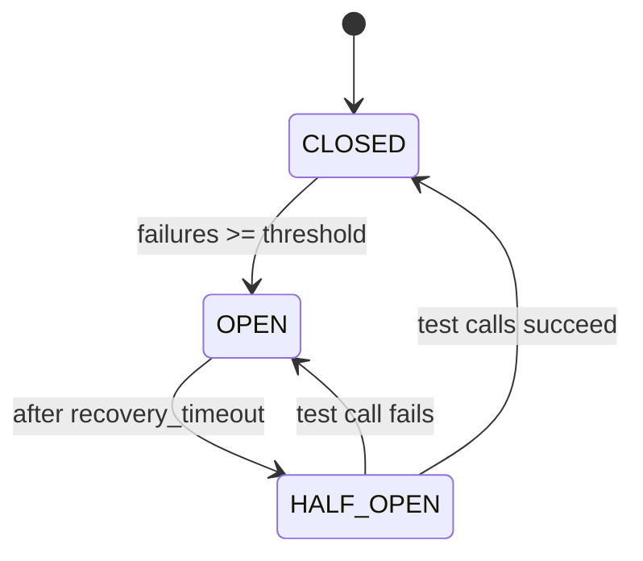
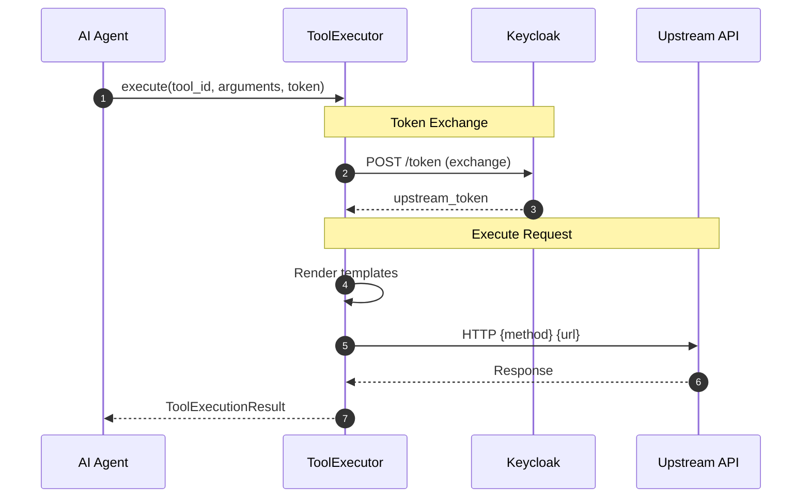
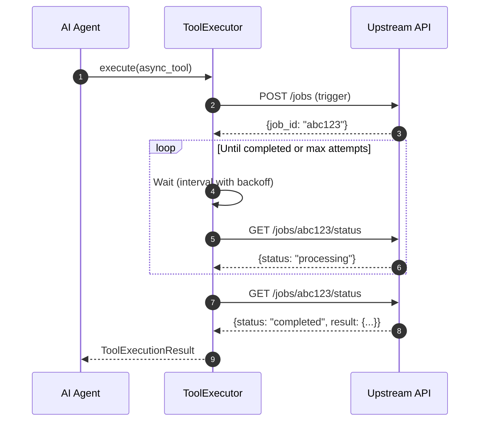
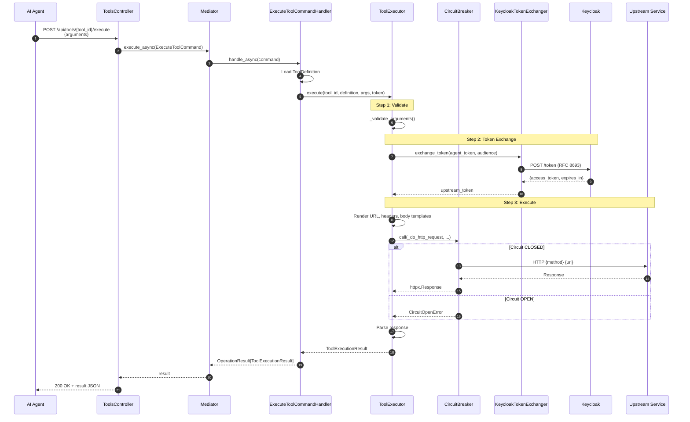

# Tool Execution

This document explains how tool calls from AI agents are executed against upstream services, including token exchange, request templating, and resilience patterns.

## Overview

When an agent invokes a tool, the MCP Tools Provider acts as a secure proxy:

1. Validates input arguments against JSON Schema
2. Exchanges the agent's token for an upstream service token (RFC 8693)
3. Renders Jinja2 templates to construct the HTTP request
4. Executes the request with circuit breaker protection
5. Returns the response to the agent



## ToolExecutor Service

**File**: `src/application/services/tool_executor.py`

```python
"""Tool Executor service for proxying tool execution to upstream services.

This service handles:
1. Validates input arguments against the tool's JSON schema
2. Renders request templates using Jinja2
3. Exchanges agent token for upstream service token
4. Executes the HTTP request with circuit breaker protection
5. Handles both synchronous and asynchronous (polling) execution modes

Key Features:
- Jinja2 template rendering for URL, headers, and body
- JSON Schema validation (configurable per tool)
- Circuit breaker per upstream source
- Comprehensive tracing and metrics
"""
```

### Initialization

```python
class ToolExecutor:
    """Executes tools by proxying requests to upstream services."""

    def __init__(
        self,
        token_exchanger: KeycloakTokenExchanger,
        default_timeout: float = 30.0,
        max_poll_attempts: int = 60,
        enable_schema_validation: bool = True,
        on_circuit_state_change: Callable[[Any], Awaitable[None]] | None = None,
    ):
        self._token_exchanger = token_exchanger
        self._default_timeout = default_timeout
        self._max_poll_attempts = max_poll_attempts
        self._enable_schema_validation = enable_schema_validation
        self._on_circuit_state_change = on_circuit_state_change

        # Jinja2 environment for template rendering
        self._jinja_env = Environment(
            loader=BaseLoader(),
            autoescape=select_autoescape(default_for_string=False, default=False),
        )

        # Circuit breakers per source
        self._circuit_breakers: dict[str, CircuitBreaker] = {}
```

## Execution Flow

### Main Execute Method

```python
async def execute(
    self,
    tool_id: str,
    definition: ToolDefinition,
    arguments: dict[str, Any],
    agent_token: str,
    source_id: str | None = None,
    validate_schema: bool | None = None,
) -> ToolExecutionResult:
    """Execute a tool with the given arguments."""

    with tracer.start_as_current_span("execute_tool") as span:
        span.set_attribute("tool.id", tool_id)
        span.set_attribute("tool.name", definition.name)

        # Step 1: Validate arguments
        if should_validate:
            self._validate_arguments(tool_id, definition.input_schema, arguments)

        # Step 2: Exchange token for upstream access
        upstream_token = await self._exchange_token(
            agent_token=agent_token,
            execution_profile=definition.execution_profile,
        )

        # Step 3: Execute based on mode
        if profile.mode == ExecutionMode.SYNC_HTTP:
            result = await self._execute_sync(...)
        elif profile.mode == ExecutionMode.ASYNC_POLL:
            result = await self._execute_async_poll(...)

        return result
```

### Step 1: Argument Validation

```python
def _validate_arguments(
    self,
    tool_id: str,
    schema: dict[str, Any],
    arguments: dict[str, Any],
) -> None:
    """Validate arguments against JSON schema."""
    if not schema:
        return

    validator = Draft7Validator(schema)
    errors = list(validator.iter_errors(arguments))

    if errors:
        error_messages = []
        for error in errors[:5]:  # Limit to first 5 errors
            path = ".".join(str(p) for p in error.absolute_path) or "root"
            error_messages.append(f"{path}: {error.message}")

        raise ToolExecutionError(
            message=f"Argument validation failed: {'; '.join(error_messages)}",
            error_code="validation_error",
            tool_id=tool_id,
        )
```

### Step 2: Token Exchange

**File**: `src/infrastructure/adapters/keycloak_token_exchanger.py`

The token exchanger implements RFC 8693 Token Exchange to obtain tokens scoped for the upstream service:

```python
async def _exchange_token(
    self,
    agent_token: str,
    execution_profile: ExecutionProfile,
) -> str:
    """Exchange agent token for upstream service token."""

    audience = execution_profile.required_audience
    if not audience:
        # No token exchange needed - use agent token directly
        return agent_token

    scopes = execution_profile.required_scopes
    result = await self._token_exchanger.exchange_token(
        subject_token=agent_token,
        audience=audience,
        requested_scopes=scopes,
    )
    return result.access_token
```

#### KeycloakTokenExchanger

```python
"""Keycloak Token Exchanger implementing RFC 8693 Token Exchange.

Key Features:
- RFC 8693 compliant token exchange
- Token caching with configurable TTL
- Circuit breaker for resilience
- CloudEvent emission for circuit breaker state changes

Security Considerations:
- Uses a dedicated confidential client for token exchange operations
- Caches tokens with TTL less than actual expiry for safety
- Never logs token values, only metadata
"""

@dataclass
class TokenExchangeResult:
    """Result of a token exchange operation."""

    access_token: str
    token_type: str = "Bearer"
    expires_in: int = 300
    expires_at: datetime | None = None
    scope: str | None = None
    issued_token_type: str = "urn:ietf:params:oauth:token-type:access_token"
```

Token exchange request to Keycloak:

```http
POST /realms/{realm}/protocol/openid-connect/token
Content-Type: application/x-www-form-urlencoded

grant_type=urn:ietf:params:oauth:grant-type:token-exchange
subject_token={agent_access_token}
subject_token_type=urn:ietf:params:oauth:token-type:access_token
audience={upstream_client_id}
scope={requested_scopes}
client_id={exchanger_client_id}
client_secret={exchanger_client_secret}
```

### Step 3: Template Rendering

Tool execution uses Jinja2 templates stored in the `ToolManifest`:

```python
async def _execute_sync(
    self,
    tool_id: str,
    profile: ExecutionProfile,
    arguments: dict[str, Any],
    upstream_token: str,
    source_id: str | None = None,
) -> ToolExecutionResult:
    """Execute a synchronous HTTP request."""

    # Render request components from Jinja2 templates
    url = self._render_template(profile.url_template, arguments, "url")
    headers = self._render_headers(profile.headers_template, arguments, upstream_token)
    body = self._render_body(profile.body_template, arguments)

    # Execute with circuit breaker
    response = await circuit.call(
        self._do_http_request,
        method=profile.method,
        url=url,
        headers=headers,
        body=body,
    )

    return ToolExecutionResult(
        tool_id=tool_id,
        status="completed" if 200 <= response.status_code < 300 else "failed",
        result=response.json(),
        upstream_status=response.status_code,
    )
```

#### Template Examples

**URL Template** (path parameter substitution):

```
https://api.pizzeria.com/orders/{{ order_id }}
```

**Headers Template**:

```json
{
  "Content-Type": "application/json",
  "X-Request-ID": "{{ request_id | default(uuid()) }}",
  "Authorization": "Bearer {{ upstream_token }}"
}
```

**Body Template** (for POST/PUT/PATCH):

```json
{
  "pizza_type": "{{ pizza_type }}",
  "size": "{{ size }}",
  
  "toppings": {{ toppings | tojson }},
  
  "quantity": {{ quantity | default(1) }}
}
```

### Step 4: Circuit Breaker

Each upstream source has its own circuit breaker to prevent cascading failures:

```python
@dataclass
class CircuitBreaker:
    """Simple circuit breaker for external service calls."""

    failure_threshold: int = 5      # Failures before opening
    recovery_timeout: float = 30.0  # Seconds before half-open
    half_open_max_calls: int = 3    # Test calls in half-open state

    state: CircuitState = CircuitState.CLOSED
```

**States**:

| State | Behavior |
|-------|----------|
| `CLOSED` | Normal operation, requests pass through |
| `OPEN` | Rejecting requests, waiting for recovery timeout |
| `HALF_OPEN` | Testing with limited requests |



## Execution Modes

### Synchronous HTTP (Default)

Standard request/response pattern:



### Asynchronous Polling

For long-running operations that return a job ID:

```python
async def _execute_async_poll(
    self,
    tool_id: str,
    profile: ExecutionProfile,
    arguments: dict[str, Any],
    upstream_token: str,
    source_id: str | None = None,
) -> ToolExecutionResult:
    """Execute an async request with polling for completion."""

    # Step 1: Trigger the async operation
    trigger_result = await self._execute_sync(...)

    # Step 2: Poll for completion
    return await self._poll_for_completion(
        poll_config=profile.poll_config,
        trigger_result=trigger_result.result,
        ...
    )
```

**Poll Configuration**:

```python
@dataclass
class PollConfig:
    """Configuration for async polling execution."""

    status_url_template: str      # URL to check job status
    status_field_path: str        # JSONPath to status field
    completed_values: list[str]   # Values indicating completion
    failed_values: list[str]      # Values indicating failure
    result_field_path: str        # JSONPath to result data

    poll_interval_seconds: float = 1.0
    max_interval_seconds: float = 30.0
    backoff_multiplier: float = 1.5
    max_poll_attempts: int = 60
```



## Result Types

### ToolExecutionResult

```python
@dataclass
class ToolExecutionResult:
    """Result of a successful tool execution."""

    tool_id: str
    status: str  # "completed", "pending", "failed"
    result: Any  # Response data from upstream
    execution_time_ms: float
    upstream_status: int | None = None
    metadata: dict[str, Any] = field(default_factory=dict)
```

### ToolExecutionError

```python
class ToolExecutionError(Exception):
    """Error during tool execution."""

    message: str
    error_code: str  # "validation_error", "token_exchange_failed", etc.
    tool_id: str | None
    upstream_status: int | None
    upstream_body: str | None
    is_retryable: bool
    details: dict[str, Any]
```

**Error Codes**:

| Code | Description | Retryable |
|------|-------------|-----------|
| `validation_error` | Arguments failed JSON Schema validation | No |
| `token_exchange_failed` | Keycloak token exchange failed | Maybe |
| `upstream_timeout` | Upstream request timed out | Yes |
| `upstream_connection_error` | Could not connect to upstream | Yes |
| `circuit_open` | Circuit breaker is open | Yes |
| `poll_timeout` | Async operation didn't complete | Yes |
| `internal_error` | Unexpected error | No |

## Sequence Diagram: Full Execution Flow



## Observability

### OpenTelemetry Tracing

Each execution creates a span with attributes:

- `tool.id` - Tool identifier
- `tool.name` - Tool name
- `tool.source_path` - Original API path
- `tool.execution_mode` - sync or async_poll
- `tool.execution_time_ms` - Total execution time
- `tool.status` - completed/failed/pending

### Metrics

| Metric | Type | Description |
|--------|------|-------------|
| `tool_executions_total` | Counter | Total tool execution attempts |
| `tool_execution_duration_ms` | Histogram | Execution time distribution |
| `tool_execution_errors` | Counter | Errors by error_code |
| `circuit_breaker_state` | Gauge | Current circuit state |
| `token_exchange_duration_ms` | Histogram | Token exchange latency |

### Logging

Request/response logging at DEBUG level with truncation:

```python
MAX_LOG_BODY_LENGTH = 500

def _log_request(self, method: str, url: str, headers: dict, body: str | None):
    """Log outgoing request (DEBUG level, truncated)."""
    logger.debug(f"→ {method} {url}")
    if body:
        truncated = body[:MAX_LOG_BODY_LENGTH] + "..." if len(body) > MAX_LOG_BODY_LENGTH else body
        logger.debug(f"→ Body: {truncated}")
```

## File Reference

| Component | File Path |
|-----------|-----------|
| ToolExecutor | `src/application/services/tool_executor.py` |
| KeycloakTokenExchanger | `src/infrastructure/adapters/keycloak_token_exchanger.py` |
| CircuitBreaker | `src/infrastructure/adapters/keycloak_token_exchanger.py` |
| ToolDefinition Model | `src/domain/models/tool_definition.py` |
| ExecutionProfile Model | `src/domain/models/execution_profile.py` |
| PollConfig Model | `src/domain/models/poll_config.py` |
| Tools Controller | `src/api/controllers/tools_controller.py` |
| Execute Tool Command | `src/application/commands/execute_tool_command.py` |

## Security Considerations

1. **Token Exchange**: Agent tokens are never sent directly to upstream services. The token exchanger obtains purpose-specific tokens with appropriate audience and scopes.

2. **Token Caching**: Exchanged tokens are cached with TTL less than actual expiry (leeway) to prevent using expired tokens.

3. **Secret Protection**: Client secrets for token exchange are stored securely and never logged.

4. **Input Validation**: JSON Schema validation prevents malformed requests from reaching upstream services.

5. **Circuit Breakers**: Prevent cascading failures and protect both the Tools Provider and upstream services.
