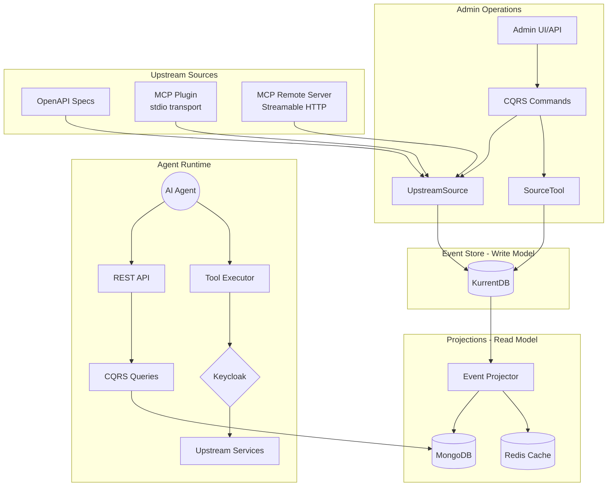

# MCP Tools Provider

> ⚠️ **Work in Progress** - This project is under active development. APIs and features may change without notice.

## What Is This?

**MCP Tools Provider** is a platform that enables organizations to safely connect their AI assistants to existing business systems. Instead of building custom integrations for each AI tool, administrators register their APIs once, and the platform handles discovery, authorization, and secure execution.

### Two Applications, One Solution

| Application | Purpose | Who Uses It |
|-------------|---------|-------------|
| **🔧 Tools Provider** | Backend service where administrators register APIs, organize tools into groups, and define who can access what | IT Admins, Platform Engineers |
| **🤖 Agent Host** | Chat interface where end users interact with AI assistants that can safely invoke the authorized tools | Business Users, Customers |

### Why Use This?

- **🔐 Enterprise-Grade Security**: Users only see tools they're authorized to use. The AI assistant acts on behalf of the logged-in user, never with elevated privileges.
- **📋 Complete Audit Trail**: Every action is recorded as an immutable event—who did what, when, and through which tool. Perfect for compliance and troubleshooting.
- **🔧 Zero-Code Integration**: Point the platform at any OpenAPI-documented service, and tools are automatically discovered and made available.
- **👥 Flexible Access Control**: Group tools by department, project, or function. Assign access based on user roles or custom claims from your identity provider.
- **📡 Full Observability**: Built-in tracing, metrics, and structured logging for production monitoring and debugging.

### Key Features

| Feature | Description |
|---------|-------------|
| **Multi-Source Integration** | Integrate tools from OpenAPI specs, [MCP servers](architecture/mcp-tools.md), and workflows |
| **MCP Plugin Mode** | Run MCP servers as local subprocesses with stdio transport |
| **MCP Remote Mode** | Connect to remote MCP servers via Streamable HTTP transport |
| **Tool Discovery** | Automatically ingests and normalizes tools from all source types |
| **Tool Curation** | Group tools with pattern-based selectors, explicit membership, and exclusion lists |
| **Dual Authentication** | OAuth2/OIDC for web sessions + JWT Bearer tokens for programmatic access |
| **Identity Delegation** | Tools execute with the end user's identity via RFC 8693 Token Exchange |
| **Event Sourcing** | All changes stored as events—rebuild state, replay history, never lose data |
| **Real-time Updates** | Server-Sent Events notify connected clients when tools or policies change |

> Read **Full Documentation** at <https://bvandewe.github.io/tools-provider>

## 🏗️ Architecture

The MCP Tools Provider acts as a **dynamic projection engine** that:

1. **Discovers** capabilities from OpenAPI endpoints (and future Workflow Engines)
2. **Normalizes** them into standard MCP Tool definitions
3. **Curates** them into logical Tool Groups with fine-grained endpoint selection
4. **Secures** access via Keycloak with JWT claim-based policies

## Key features

- 🔍 **Source Registration**: Admin ingests and normalizes OpenAPI v3 specifications
- 🔍 **Tool Discovery**: Automatically ingests and normalizes ["MCP-like" tools](architecture/mcp-protocol-decision.md) from multiple source types
- 🔌 **MCP Integration**: Native support for [MCP servers](architecture/mcp-tools.md) via Plugin mode (stdio) and Remote mode (Streamable HTTP)
- 🎯 **Tool Curation**: Group tools with pattern-based selectors and explicit membership
- 🎯 **Tool Execution**: Invoke tool on behalf of logged-in user (JWT Token Exchange - [RFC 8693](https://www.rfc-editor.org/rfc/rfc8693.html))
- 🔐 **Dual Authentication**: OAuth2/OIDC (session) + JWT Bearer tokens via Keycloak
- 📋 **CQRS + Event Sourcing**: Write model (KurrentDB) + Read model (MongoDB)
- 🛡️ **RBAC**: Role-based access control with admin-only operations
- 📡 **Full Observability**: OpenTelemetry tracing, metrics, and structured logging

## Screenshots

=== "Agent Chat"
    

    *AI agent chat interface with personalized tools based on user authorization*

=== "Registered Source"
    

    *Admin view showing a registered upstream OpenAPI source with discovered tools*

=== "Access Policy"
    

    *Role-based access policy configuration for tool authorization*

=== "Upstream Service"
    

    *Example upstream OpenAPI service that provides tools to the system*

=== "Local LLM"
    

    *Configuration for running with a local LLM backend*

**[GitHub Repository](https://github.com/bvandewe/tools-provider)**

## Getting Started

To get started with the application, please refer to the **[Getting Started](getting-started/installation.md)** guide, which will walk you through the installation and setup process.

## Key Sections

- **[Architecture](architecture/overview.md)**: Learn about the core concepts of the application's architecture and the `neuroglia-python` framework.
- **[Security](security/authentication-flows.md)**: Understand the dual authentication system, including session-based and JWT bearer token flows, plus authorization with OAuth2/OIDC.
- **[Development](development/makefile-reference.md)**: Find information on the development workflow, including the `Makefile` commands and documentation setup.
- **[Deployment](deployment/docker-environment.md)**: Learn how to deploy the application using Docker and other related technologies.

## System Architecture

The MCP Tools Provider acts as a **dynamic projection engine** that:

1. **Discovers** capabilities from OpenAPI endpoints, MCP servers, and workflow engines
2. **Normalizes** them into standard MCP Tool definitions
3. **Curates** them into logical Tool Groups with fine-grained endpoint selection
4. **Secures** access via Keycloak with JWT claim-based policies

### Database Architecture

| Layer | Technology | Purpose |
|-------|------------|---------|
| **Write Model** | KurrentDB (EventStoreDB) | Event persistence, audit trail, aggregate streams |
| **Read Model** | MongoDB | Complex queries, full-text search, queryable projections |
| **Cache Layer** | Redis | Sessions, resolved manifests, pub/sub notifications |

## 🛠️ Technology Stack

### Backend

- **Framework**: [Neuroglia Python](https://bvandewe.github.io/pyneuro)
- **Web**: [FastAPI](https://fastapi.tiangolo.com/)
- **Event Store**: [KurrentDB](https://www.kurrent.io/) (EventStoreDB)
- **Read Model**: [MongoDB](https://www.mongodb.com/) with [Motor](https://motor.readthedocs.io/)
- **Cache**: [Redis](https://redis.io/)
- **Auth**: [Keycloak](https://www.keycloak.org/)

### Frontend

- **Bundler**: [Parcel](https://parceljs.org/)
- **Templates**: [Nunjucks](https://mozilla.github.io/nunjucks/)
- **Styles**: [Bootstrap 5](https://getbootstrap.com/) + [SCSS](https://sass-lang.com/)
- **JavaScript**: ES6 Modules

### Infrastructure

- **Containers**: [Docker](https://www.docker.com/) + [Docker Compose](https://docs.docker.com/compose/)
- **Observability**: [OpenTelemetry](https://opentelemetry.io/)
- **Documentation**: [MkDocs Material](https://squidfunk.github.io/mkdocs-material/)

## 🤝 Contributing

Contributions are welcome! Please follow these guidelines:

### Development Workflow

- ✅ Follow the CQRS + Event Sourcing patterns
- ✅ Write tests for new commands and queries
- ✅ Use Black formatting and Ruff linting
- ✅ Update documentation for new features

### Domain Entities

- **UpstreamSource**: OpenAPI service connections with health monitoring
- **SourceTool**: Individual tool/endpoint management with enable/disable controls
- **ToolGroup**: Tool curation with pattern selectors, explicit membership, and exclusion lists
- **AccessPolicy**: JWT claim-based authorization with priority-based policy resolution
- **Label**: Categorization metadata for tools

## 📚 Additional Resources

### Documentation

- [GitHub Repository](https://github.com/bvandewe/tools-provider)
- [API Documentation](http://localhost:8040/api/docs) (when running)
- [Deployment Guide](deployment/github-pages-setup.md)

### External Links

- [Neuroglia Framework](https://bvandewe.github.io/pyneuro)
- [FastAPI Docs](https://fastapi.tiangolo.com/)
- [MkDocs Material](https://squidfunk.github.io/mkdocs-material/)
- [Model Context Protocol](https://modelcontextprotocol.io/)

## 🆘 Getting Help

1. Check [Common Issues](troubleshooting/common-issues.md)
2. Review relevant documentation section
3. Search [GitHub Issues](https://github.com/bvandewe/tools-provider/issues)
4. Create a new issue with details

---

**Ready to start?** Head to the [Getting Started](getting-started/installation.md) guide to set up your development environment!
