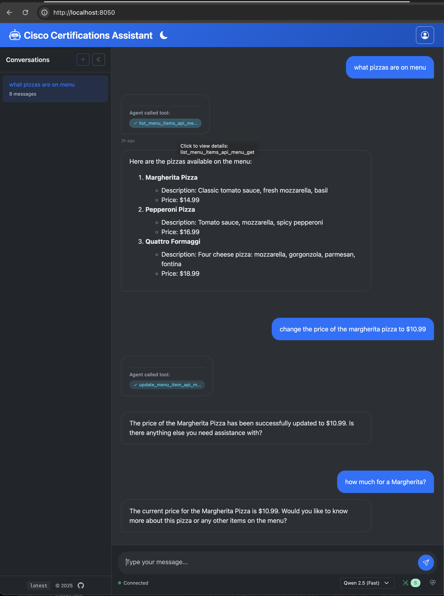
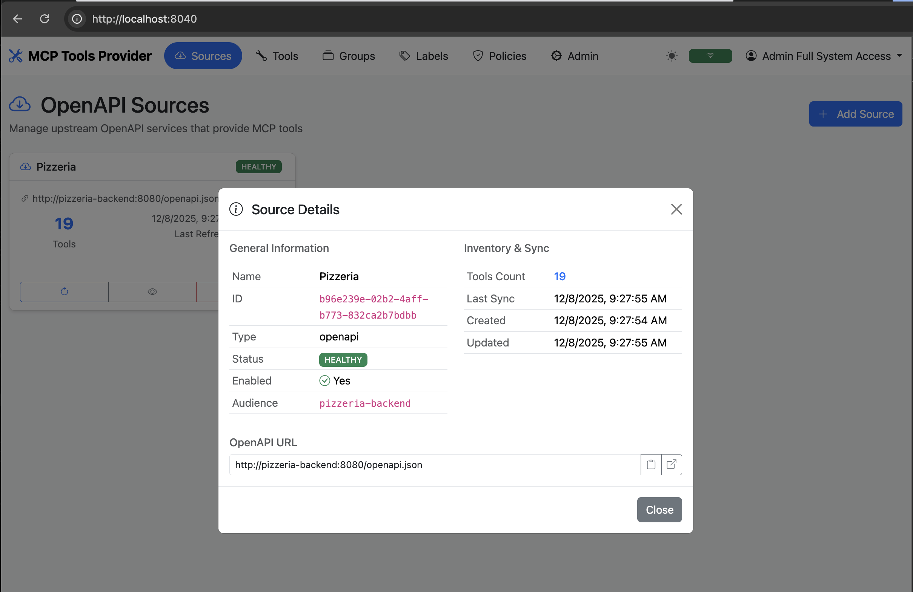
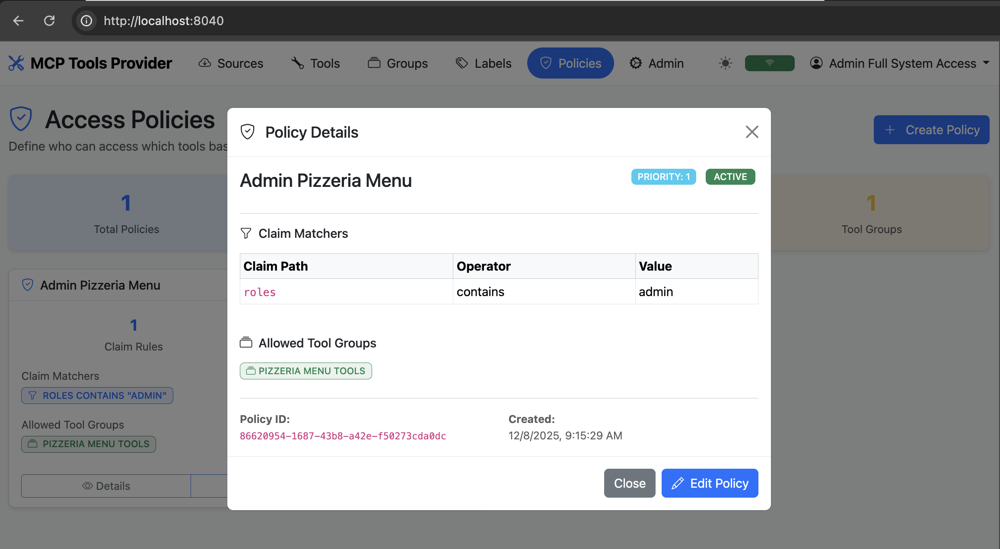
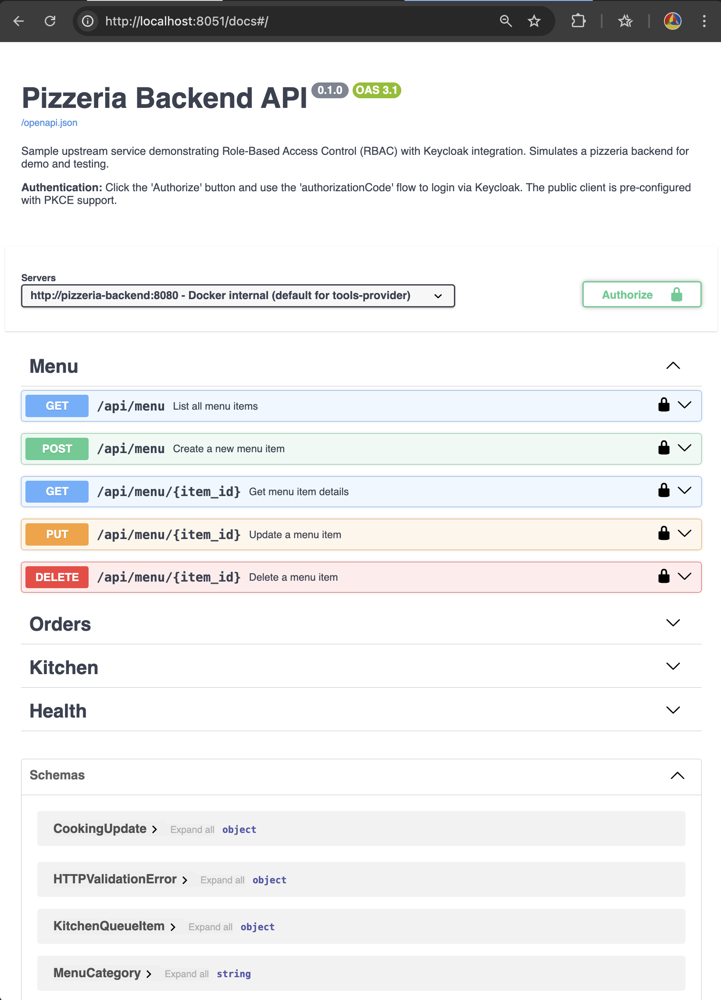
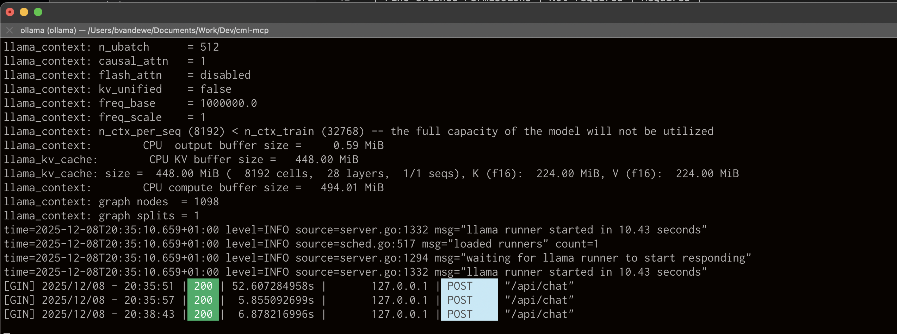
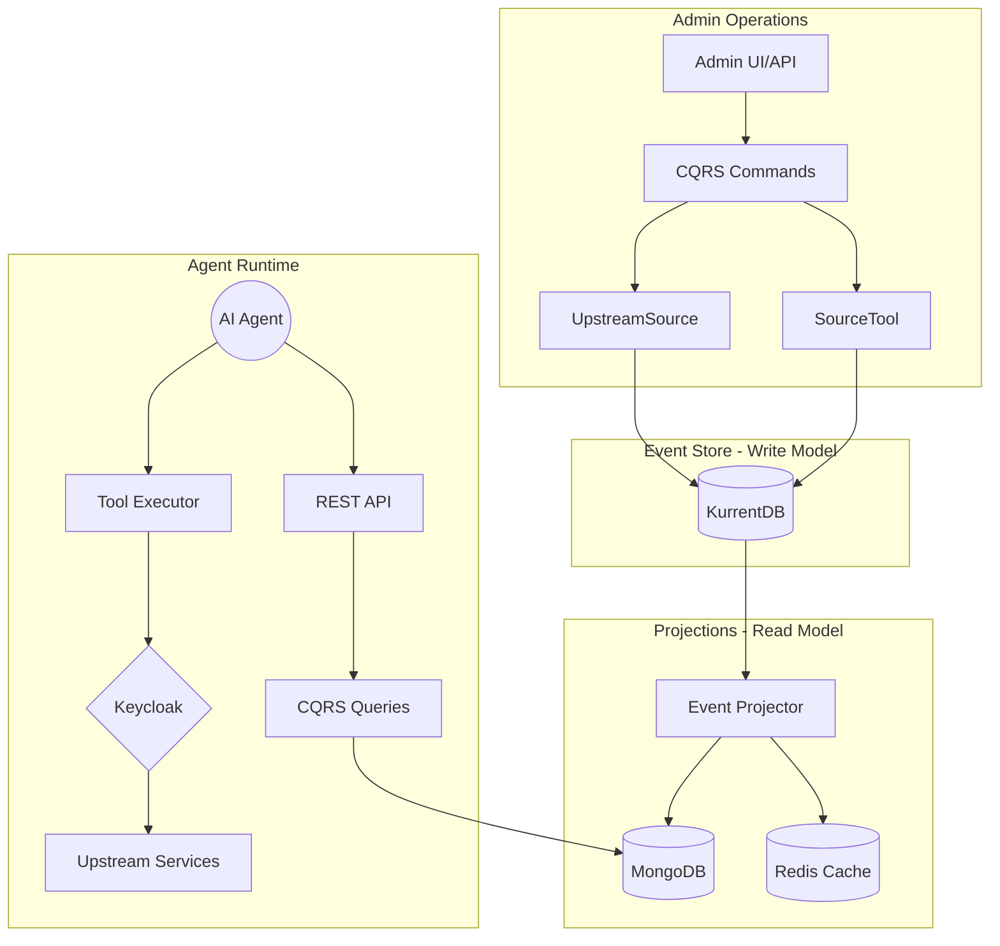

# MCP Tools Provider

!!! warning "Work in Progress"
    This project is under active development. APIs and features may change without notice.

An intelligent infrastructure layer that **discovers**, **normalizes**, and **serves** MCP (Model Context Protocol) tools from upstream OpenAPI services to AI Agents. Built with **Event Sourcing**, **CQRS**, and **Domain-Driven Design** using the Neuroglia Python Framework.

![MCP Tools]

- 🔍 **Tool Discovery**: Automatically ingests and normalizes tools from OpenAPI specifications
- 🎯 **Tool Curation**: Group tools with pattern-based selectors and explicit membership
- 🔐 **Dual Authentication**: OAuth2/OIDC (session) + JWT Bearer tokens via Keycloak
- 📋 **CQRS + Event Sourcing**: Write model (KurrentDB) + Read model (MongoDB)
- 🛡️ **RBAC**: Role-based access control with admin-only operations
- 📡 **Full Observability**: OpenTelemetry tracing, metrics, and structured logging

## Screenshots

=== "Agent Chat"
    

    *AI agent chat interface with personalized tools based on user authorization*

=== "Registered Source"
    

    *Admin view showing a registered upstream OpenAPI source with discovered tools*

=== "Access Policy"
    

    *Role-based access policy configuration for tool authorization*

=== "Upstream Service"
    

    *Example upstream OpenAPI service that provides tools to the system*

=== "Local LLM"
    

    *Configuration for running with a local LLM backend*

**[GitHub Repository](https://github.com/bvandewe/tools-provider)**

## Getting Started

To get started with the application, please refer to the **[Getting Started](getting-started/installation.md)** guide, which will walk you through the installation and setup process.

## Key Sections

- **[Architecture](architecture/overview.md)**: Learn about the core concepts of the application's architecture and the `neuroglia-python` framework.
- **[Security](security/authentication-flows.md)**: Understand the dual authentication system, including session-based and JWT bearer token flows, plus authorization with OAuth2/OIDC.
- **[Development](development/makefile-reference.md)**: Find information on the development workflow, including the `Makefile` commands and documentation setup.
- **[Deployment](deployment/docker-environment.md)**: Learn how to deploy the application using Docker and other related technologies.

## System Architecture

The MCP Tools Provider acts as a **dynamic projection engine** that:

1. **Discovers** capabilities from OpenAPI endpoints (and future Workflow Engines)
2. **Normalizes** them into standard MCP Tool definitions
3. **Curates** them into logical Tool Groups with fine-grained endpoint selection
4. **Secures** access via Keycloak with JWT claim-based policies

### Database Architecture

| Layer | Technology | Purpose |
|-------|------------|---------|
| **Write Model** | KurrentDB (EventStoreDB) | Event persistence, audit trail, aggregate streams |
| **Read Model** | MongoDB | Complex queries, full-text search, queryable projections |
| **Cache Layer** | Redis | Sessions, resolved manifests, pub/sub notifications |

## 🛠️ Technology Stack

### Backend

- **Framework**: [Neuroglia Python](https://github.com/neuroglia-io/python-framework)
- **Web**: [FastAPI](https://fastapi.tiangolo.com/)
- **Event Store**: [KurrentDB](https://www.kurrent.io/) (EventStoreDB)
- **Read Model**: [MongoDB](https://www.mongodb.com/) with [Motor](https://motor.readthedocs.io/)
- **Cache**: [Redis](https://redis.io/)
- **Auth**: [Keycloak](https://www.keycloak.org/)

### Frontend

- **Bundler**: [Parcel](https://parceljs.org/)
- **Templates**: [Nunjucks](https://mozilla.github.io/nunjucks/)
- **Styles**: [Bootstrap 5](https://getbootstrap.com/) + [SCSS](https://sass-lang.com/)
- **JavaScript**: ES6 Modules

### Infrastructure

- **Containers**: [Docker](https://www.docker.com/) + [Docker Compose](https://docs.docker.com/compose/)
- **Observability**: [OpenTelemetry](https://opentelemetry.io/)
- **Documentation**: [MkDocs Material](https://squidfunk.github.io/mkdocs-material/)

## 🤝 Contributing

Contributions are welcome! Please follow these guidelines:

### Development Workflow

- ✅ Follow the CQRS + Event Sourcing patterns
- ✅ Write tests for new commands and queries
- ✅ Use Black formatting and Ruff linting
- ✅ Update documentation for new features

### Domain Entities

- **UpstreamSource**: OpenAPI service connections with health monitoring
- **SourceTool**: Individual tool/endpoint management
- **ToolGroup** _(planned)_: Tool curation with pattern selectors

## 📚 Additional Resources

### Documentation

- [GitHub Repository](https://github.com/bvandewe/tools-provider)
- [API Documentation](http://localhost:8040/api/docs) (when running)
- [Deployment Guide](deployment/github-pages-setup.md)

### External Links

- [Neuroglia Framework](https://github.com/neuroglia-io/python-framework)
- [FastAPI Docs](https://fastapi.tiangolo.com/)
- [MkDocs Material](https://squidfunk.github.io/mkdocs-material/)
- [Model Context Protocol](https://modelcontextprotocol.io/)

## 🆘 Getting Help

1. Check [Common Issues](troubleshooting/common-issues.md)
2. Review relevant documentation section
3. Search [GitHub Issues](https://github.com/bvandewe/tools-provider/issues)
4. Create a new issue with details

---

**Ready to start?** Head to the [Getting Started](getting-started/installation.md) guide to set up your development environment!
