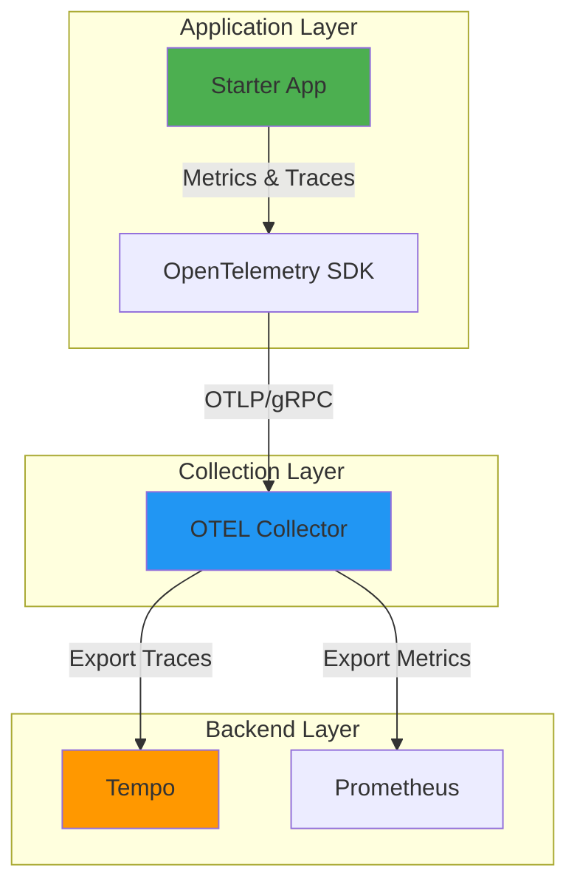
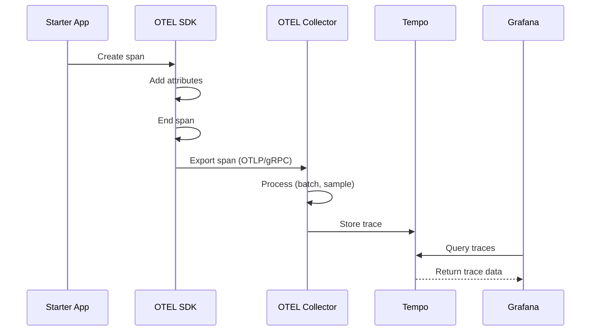
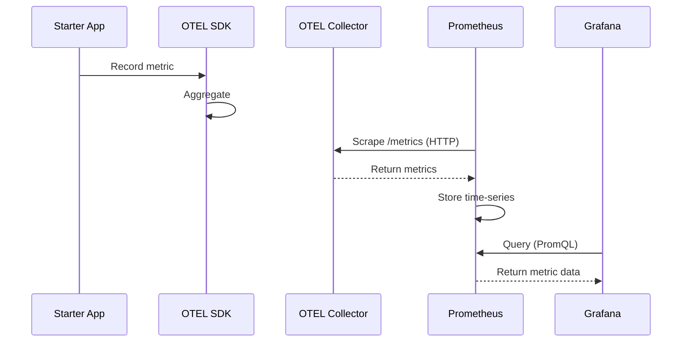

# Observability Architecture

This guide covers the technical architecture and components of the observability stack in the Starter App.

## Table of Contents

- [Architecture Overview](#architecture-overview)
- [Components](#components)
- [Technology Stack](#technology-stack)
- [Data Flow](#data-flow)

## Architecture Overview

The Starter App uses **OpenTelemetry** for observability instrumentation with the following architecture:



## Components

### 1. Application (Starter App)

**Responsibilities**:

- Generate metrics, traces, and logs
- Instrument code with OpenTelemetry APIs
- Configure telemetry exporters

**Libraries**:

- `opentelemetry-api` - Core API for instrumentation
- `opentelemetry-sdk` - SDK implementation
- `opentelemetry-instrumentation-fastapi` - Auto-instrumentation for FastAPI
- `neuroglia.observability` - Framework integration

**Code Location**: `src/observability/`, `src/main.py`

### 2. OpenTelemetry Collector

**Responsibilities**:

- Receive telemetry data from applications
- Process and transform data (sampling, filtering, enrichment)
- Export to multiple backends (Tempo, Prometheus, etc.)

**Benefits**:

- Decouples application from backend
- Centralized configuration
- Protocol translation
- Performance buffering

**Configuration**: `deployment/otel-collector-config.yaml`

**Ports**:

- `4317` - OTLP gRPC receiver
- `4318` - OTLP HTTP receiver
- `8889` - Prometheus exporter

### 3. Tempo

**Responsibilities**:

- Store and query distributed traces
- Visualize request flows
- Analyze performance

**Access**: http://localhost:3000 (via Grafana)

**Integration**: OTLP protocol over gRPC (port 4317)

**Features**:

- Long-term trace storage
- TraceQL query language
- Grafana integration for visualization
- Efficient columnar storage

### 4. Prometheus

**Responsibilities**:

- Store and query time-series metrics
- Power dashboards and alerts
- Aggregate metrics data

**Access**: http://localhost:9090

**Integration**: Scrapes metrics from OTEL Collector (port 8889)

**Features**:

- PromQL query language
- Built-in alerting
- Grafana integration
- Time-series database

### 5. Grafana

**Responsibilities**:

- Unified visualization for traces and metrics
- Query both Tempo and Prometheus
- Create dashboards and alerts

**Access**: http://localhost:3000

**Data Sources**:

- Tempo (traces)
- Prometheus (metrics)

## Technology Stack

### OpenTelemetry

**Why OpenTelemetry?**

- ✅ **Vendor-Neutral**: Not tied to specific backends (Datadog, New Relic, etc.)
- ✅ **Industry Standard**: CNCF project, widely adopted
- ✅ **Comprehensive**: Metrics, traces, and logs in one SDK
- ✅ **Auto-Instrumentation**: Automatic instrumentation for FastAPI, MongoDB, Redis
- ✅ **Extensible**: Easy to add custom instrumentation

**Documentation**: https://opentelemetry.io/docs/

### Neuroglia Observability

The `neuroglia.observability` module provides:

- Automatic OpenTelemetry SDK configuration
- Service name and version management
- Auto-instrumentation setup
- Exporter configuration from environment variables

**Usage**:

```python
from neuroglia.observability import Observability
from neuroglia.hosting.web import WebApplicationBuilder

builder = WebApplicationBuilder(app_settings=app_settings)
Observability.configure(builder)
```

**What it does**:

- Sets up OpenTelemetry SDK with service name/version
- Configures OTLP exporter from `OTEL_EXPORTER_OTLP_ENDPOINT`
- Enables auto-instrumentation for FastAPI, MongoDB, Redis
- Sets up metrics and tracing exporters

### Instrumentation Libraries

| Library | Purpose | Auto/Manual |
|---------|---------|-------------|
| `opentelemetry-instrumentation-fastapi` | HTTP requests, responses | Auto |
| `opentelemetry-instrumentation-pymongo` | MongoDB queries | Auto |
| `opentelemetry-instrumentation-redis` | Redis operations | Auto |
| `opentelemetry-api` | Custom spans, metrics | Manual |

**Auto-Instrumentation**: Enabled automatically by `Neuroglia.Observability.configure()`

**Manual Instrumentation**: Used for custom business logic spans and metrics (see [Metrics Guide](./metrics.md) and [Tracing Guide](./tracing.md))

## Data Flow

### Trace Flow



### Metrics Flow



## Deployment Architecture

### Development Environment

```yaml
services:
  app:
    environment:
      OTEL_EXPORTER_OTLP_ENDPOINT: http://otel-collector:4317
      OTEL_SERVICE_NAME: starter-app

  otel-collector:
    ports:
      - "4317:4317"  # OTLP gRPC
      - "4318:4318"  # OTLP HTTP
      - "8889:8889"  # Prometheus exporter

  tempo:
    ports:
      - "4317"  # Receives from collector

  prometheus:
    ports:
      - "9090:9090"

  grafana:
    ports:
      - "3000:3000"
```

### Production Considerations

**Scalability**:

- Run multiple OTEL Collector instances
- Load balance with Kubernetes/Docker Swarm
- Use dedicated storage backends (S3 for Tempo, remote storage for Prometheus)

**Reliability**:

- Configure OTEL Collector with retry policies
- Set up Collector high availability
- Implement sampling strategies

**Security**:

- Enable TLS for OTLP connections
- Secure backend endpoints
- Implement authentication for Grafana

## Related Documentation

- [Observability Overview](./overview.md) - Concepts and introduction
- [Configuration Guide](./configuration.md) - Detailed configuration
- [Getting Started](./getting-started.md) - Quick start guide
- [Metrics Guide](./metrics.md) - Metrics instrumentation
- [Tracing Guide](./tracing.md) - Tracing instrumentation

## Additional Resources

- [OpenTelemetry Collector Documentation](https://opentelemetry.io/docs/collector/)
- [Grafana Tempo Documentation](https://grafana.com/docs/tempo/)
- [Prometheus Documentation](https://prometheus.io/docs/)
- [Neuroglia Observability Module](https://github.com/neuroglia-io/python-framework)
