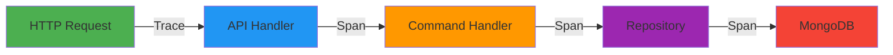
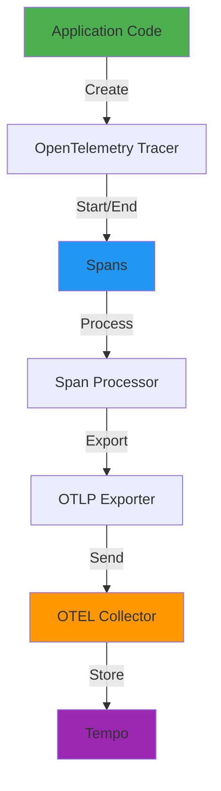

# Distributed Tracing Instrumentation Guide

This guide covers how to implement distributed tracing in the Starter App using OpenTelemetry.

## Table of Contents

- [Overview](#overview)
- [Concepts](#concepts)
- [Implementation](#implementation)
- [Best Practices](#best-practices)
- [Examples](#examples)
- [Troubleshooting](#troubleshooting)

## Overview

**Distributed tracing** tracks requests as they flow through your system, showing the path, timing, and relationships between operations.

### When to Use Traces

Use traces for:

- ✅ **Debugging slow requests**: Find which operation is taking too long
- ✅ **Understanding dependencies**: See how services interact
- ✅ **Root cause analysis**: Track errors through the system
- ✅ **Performance optimization**: Identify bottlenecks
- ✅ **Troubleshooting failures**: See what happened before an error

Don't use traces for:

- ❌ Aggregate metrics (use metrics)
- ❌ Storing logs (use structured logging)
- ❌ Business analytics (use dedicated analytics tools)

### Key Benefits



**Without tracing**: "The API is slow" 🤷

**With tracing**: "The API is slow because MongoDB query takes 2 seconds due to missing index on `department` field" 🎯

## Concepts

### Trace

A **trace** represents the entire journey of a request through your system.

**Example**: Creating a task

```
Trace ID: 4bf92f3577b34da6a3ce929d0e0e4736
Duration: 250ms
Spans: 5
```

### Span

A **span** represents a single operation within a trace.

**Example**: Database query

```
Span ID: 7d2ea792e2df6a01
Parent Span ID: f3e7a0b2c1d4e5f6
Operation: motor_task_repository.insert_one
Duration: 140ms
Attributes:
  - db.system: mongodb
  - db.collection: tasks
  - task.priority: high
```

### Span Hierarchy

Spans form a parent-child tree:

```
POST /api/tasks (250ms) ← Root span
├─ create_task_entity (15ms)
│  ├─ validate_input (5ms)
│  └─ create_domain_object (10ms)
├─ motor_task_repository.add (200ms)
│  ├─ serialize_task (10ms)
│  ├─ pymongo.insert_one (180ms) ← Slow!
│  └─ publish_domain_events (10ms)
└─ record_metrics (5ms)
```

### Attributes

**Attributes** add context to spans:

```python
span.set_attribute("task.id", "uuid-1234")
span.set_attribute("task.priority", "high")
span.set_attribute("user.id", "user-5678")
```

### Trace Context

**Trace context** propagates trace information across process boundaries:

```
HTTP Headers:
  traceparent: 00-4bf92f3577b34da6a3ce929d0e0e4736-7d2ea792e2df6a01-01
  tracestate: ...
```

## Implementation

### Architecture



### Step 1: Get a Tracer

Create a tracer for your module:

```python
from opentelemetry import trace

# One tracer per module
tracer = trace.get_tracer(__name__)
```

**Best Practice**: Use `__name__` to identify the source of spans.

### Step 2: Create Spans

#### Context Manager (Recommended)

```python
from opentelemetry import trace

tracer = trace.get_tracer(__name__)

async def create_task(command: CreateTaskCommand) -> Task:
    # Create a span
    with tracer.start_as_current_span("create_task_entity") as span:
        # Add context
        span.set_attribute("task.title", command.title)
        span.set_attribute("task.priority", command.priority)

        # Business logic
        task = Task(
            title=command.title,
            priority=TaskPriority(command.priority),
            status=TaskStatus.PENDING,
        )

        span.set_attribute("task.id", task.aggregate_id)

        return task
```

**Benefits**:

- Automatic span end
- Exception recording
- Context management

#### Manual Span Management

```python
span = tracer.start_span("create_task_entity")
try:
    span.set_attribute("task.title", command.title)
    task = create_task_logic()
    span.set_status(Status(StatusCode.OK))
    return task
except Exception as e:
    span.record_exception(e)
    span.set_status(Status(StatusCode.ERROR, str(e)))
    raise
finally:
    span.end()
```

**Use when**: You need fine-grained control (rare).

### Step 3: Add Attributes

Add context to spans with attributes:

```python
with tracer.start_as_current_span("update_task") as span:
    # Entity identifiers
    span.set_attribute("task.id", task.id)
    span.set_attribute("user.id", user_id)

    # Operation details
    span.set_attribute("task.status", task.status.value)
    span.set_attribute("task.priority", task.priority.value)

    # Business context
    span.set_attribute("operation.type", "update")
    span.set_attribute("task.assignee_changed", old_assignee != new_assignee)

    # Perform update
    updated_task = await self.repository.update(task)
```

### Step 4: Record Events

Add timestamped events to spans:

```python
with tracer.start_as_current_span("process_task") as span:
    span.add_event("validation_started")

    validate_task(task)

    span.add_event("validation_completed", {
        "validation.duration_ms": 50,
        "validation.rules_checked": 5,
    })

    span.add_event("Processing started", attributes={"priority": task.priority})

    await process_task(task)

    span.add_event("processing_completed")

```

**Events appear as markers** on the span timeline in Jaeger.

### Step 5: Handle Errors

Record exceptions in spans:

```python
with tracer.start_as_current_span("create_task") as span:
    try:
        task = await create_task_logic()
        span.set_status(Status(StatusCode.OK))
        return task
    except ValidationError as e:
        # Record exception with full traceback
        span.record_exception(e)

        # Set error status
        span.set_status(Status(StatusCode.ERROR, "Validation failed"))

        # Add error attributes
        span.set_attribute("error.type", "validation")
        span.set_attribute("error.message", str(e))

        raise
```

### Step 6: Auto-Instrumentation

Many libraries are automatically instrumented:

**FastAPI** (HTTP requests):

```python
# Automatically creates spans for:
# - HTTP requests: POST /api/tasks
# - Route handlers
# - Middleware
```

**MongoDB** (database queries):

```python
# Automatically creates spans for:
# - insert_one, find_one, update_one, delete_one
# - Includes query details, collection name
```

**Redis** (cache operations):

```python
# Automatically creates spans for:
# - get, set, delete
# - Includes key names, operations
```

**Configuration**:

```python
# src/main.py
from neuroglia.observability import Observability

# This enables all auto-instrumentation
Observability.configure(builder)
```

## Best Practices

### 1. Span Naming

Use descriptive, consistent names:

```python
# Good examples
"create_task_entity"          # What it does
"validate_user_input"
"fetch_tasks_from_database"
"publish_domain_events"

# Bad examples
"task"                        # Too vague
"function1"                   # Not descriptive
"CreateTaskEntity"            # Don't capitalize
"create-task-entity"          # Use underscores
```

**Convention**: `{verb}_{noun}` or `{component}.{operation}`

### 2. Span Granularity

**When to create spans**:

```python
# ✅ Good: Meaningful operations (>10ms typically)
with tracer.start_as_current_span("validate_task_data"):
    # Complex validation logic
    ...

with tracer.start_as_current_span("query_database"):
    # Database operation
    ...

# ❌ Bad: Trivial operations (<1ms)
with tracer.start_as_current_span("get_priority"):
    priority = task.priority  # Just a property access

with tracer.start_as_current_span("increment_counter"):
    counter += 1
```

**Balance**:

- Too many spans → Overhead and noise
- Too few spans → Hard to debug

**Rule of thumb**: Create spans for I/O operations, complex logic, and operation boundaries.

### 3. Attribute Guidelines

**Use semantic conventions**:

```python
# HTTP
span.set_attribute("http.method", "POST")
span.set_attribute("http.route", "/api/tasks")
span.set_attribute("http.status_code", 201)

# Database
span.set_attribute("db.system", "mongodb")
span.set_attribute("db.operation", "insert")
span.set_attribute("db.collection", "tasks")

# Custom domain
span.set_attribute("task.id", task_id)
span.set_attribute("task.priority", "high")
span.set_attribute("user.id", user_id)
```

**Avoid high cardinality** (like with metrics):

```python
# ❌ Bad: Unique values
span.set_attribute("task.title", "User's custom title 12345")

# ✅ Good: Categorical or ID
span.set_attribute("task.id", task_id)
span.set_attribute("task.priority", priority.value)
```

### 4. Context Propagation

Spans automatically propagate context:

```python
# Parent span
with tracer.start_as_current_span("process_request") as parent:
    parent.set_attribute("request.id", request_id)

    # Child span (automatically linked)
    with tracer.start_as_current_span("validate_input") as child:
        # child.parent_span_id == parent.span_id
        validate(data)

    # Another child
    with tracer.start_as_current_span("save_to_db") as child2:
        await save(data)
```

**Async operations**: Context is preserved across async boundaries.

### 5. Sampling

For high-traffic applications, sample traces:

```bash
# Environment variables
OTEL_TRACES_SAMPLER=traceidratio
OTEL_TRACES_SAMPLER_ARG=0.1  # Sample 10%

# Or always sample errors
OTEL_TRACES_SAMPLER=parentbased_traceidratio
```

**Production strategy**:

- Sample normal requests (10-20%)
- Always sample errors (100%)
- Always sample slow requests (100%)

### 6. Performance

**Tracing is lightweight**, but:

- Don't create spans for very fast operations (<1ms)
- Use async operations (don't block)
- Batch exports (OTEL Collector handles this)
- Sample in production (see above)

**Benchmark**:

```
Span creation + end: ~10-50 microseconds
Adding attributes: ~1-5 microseconds each
```

### 7. Span Status

Always set span status:

```python
from opentelemetry.trace import Status, StatusCode

with tracer.start_as_current_span("operation") as span:
    try:
        result = await perform_operation()

        # Success
        span.set_status(Status(StatusCode.OK))
        return result

    except ValidationError as e:
        # Error with description
        span.set_status(Status(StatusCode.ERROR, "Validation failed"))
        span.record_exception(e)
        raise
```

**Status codes**:

- `StatusCode.UNSET` - Default (not set)
- `StatusCode.OK` - Success
- `StatusCode.ERROR` - Failure

## Examples

### Example 1: Command Handler Tracing

Full instrumentation of a command handler:

```python
# src/application/commands/create_task_command.py
from opentelemetry import trace
from opentelemetry.trace import Status, StatusCode

tracer = trace.get_tracer(__name__)

class CreateTaskCommandHandler:
    def __init__(self, task_repository: TaskRepository):
        self.task_repository = task_repository

    async def handle_async(
        self,
        command: CreateTaskCommand
    ) -> OperationResult[Task]:
        # Parent span (auto-created by FastAPI for HTTP request)
        # This creates a child span
        with tracer.start_as_current_span("create_task_entity") as span:
            # Add command context
            span.set_attribute("task.title", command.title)
            span.set_attribute("task.priority", command.priority)
            span.set_attribute("task.assignee_id", command.assignee_id or "unassigned")

            try:
                # Convert to enum
                priority = TaskPriority(command.priority)
                status = TaskStatus(command.status)

                # Create entity
                span.add_event("creating_task_entity")
                task = Task(
                    title=command.title,
                    description=command.description,
                    priority=priority,
                    status=status,
                    assignee_id=command.assignee_id,
                )

                # Add result attributes
                span.set_attribute("task.id", task.aggregate_id)
                span.set_attribute("task.created_at", task.state.created_at.isoformat())

                span.add_event("task_entity_created", {
                    "task.id": task.aggregate_id
                })

                span.set_status(Status(StatusCode.OK))

            except ValueError as e:
                # Handle validation error
                span.record_exception(e)
                span.set_status(Status(StatusCode.ERROR, "Invalid input"))
                span.set_attribute("error.type", "validation")
                raise ValidationError(f"Invalid task data: {e}")

        # Repository save (auto-traced by MongoDB instrumentation)
        saved_task = await self.task_repository.add_async(task)

        return OperationResult.success(saved_task)
```

**Result in Grafana/Tempo**:

```
POST /api/tasks (250ms)
├─ create_task_entity (20ms)
│  Events:
│  ├─ creating_task_entity (t=0ms)
│  └─ task_entity_created (t=15ms)
│  Attributes:
│  ├─ task.title: "Implement feature X"
│  ├─ task.priority: "high"
│  ├─ task.id: "uuid-1234"
│  └─ task.created_at: "2024-01-15T10:30:00Z"
└─ motor_task_repository.insert_one (180ms)
   Attributes:
   ├─ db.system: "mongodb"
   ├─ db.operation: "insert"
   └─ db.collection: "tasks"
```

### Example 2: Nested Spans

Create hierarchical spans:

```python
from opentelemetry import trace

tracer = trace.get_tracer(__name__)

async def update_task(task_id: str, updates: dict) -> Task:
    # Parent span
    with tracer.start_as_current_span("update_task") as parent_span:
        parent_span.set_attribute("task.id", task_id)
        parent_span.set_attribute("updates.count", len(updates))

        # Child span 1: Fetch task
        with tracer.start_as_current_span("fetch_task") as fetch_span:
            fetch_span.set_attribute("task.id", task_id)
            task = await repository.get_by_id(task_id)

            if not task:
                fetch_span.set_status(Status(StatusCode.ERROR, "Not found"))
                raise TaskNotFoundError(task_id)

            fetch_span.set_status(Status(StatusCode.OK))

        # Child span 2: Validate updates
        with tracer.start_as_current_span("validate_updates") as validate_span:
            validate_span.set_attribute("updates.fields", list(updates.keys()))

            try:
                validate_task_updates(task, updates)
                validate_span.set_status(Status(StatusCode.OK))
            except ValidationError as e:
                validate_span.record_exception(e)
                validate_span.set_status(Status(StatusCode.ERROR))
                raise

        # Child span 3: Apply updates
        with tracer.start_as_current_span("apply_updates") as apply_span:
            for field, value in updates.items():
                setattr(task, field, value)
                apply_span.add_event(f"updated_{field}", {"value": str(value)})

            apply_span.set_status(Status(StatusCode.OK))

        # Child span 4: Save (auto-traced by repository)
        updated_task = await repository.update(task)

        parent_span.set_attribute("task.updated_fields", len(updates))
        parent_span.set_status(Status(StatusCode.OK))

        return updated_task
```

### Example 3: Cross-Service Tracing

Propagate traces across HTTP boundaries:

```python
import httpx
from opentelemetry import trace
from opentelemetry.instrumentation.httpx import HTTPXClientInstrumentor

# Auto-instrument httpx
HTTPXClientInstrumentor().instrument()

tracer = trace.get_tracer(__name__)

async def notify_external_service(task: Task):
    with tracer.start_as_current_span("notify_external_service") as span:
        span.set_attribute("task.id", task.aggregate_id)
        span.set_attribute("service.name", "notification-service")

        # Context automatically propagated via HTTP headers
        async with httpx.AsyncClient() as client:
            response = await client.post(
                "http://notification-service/api/notify",
                json={
                    "task_id": task.aggregate_id,
                    "priority": task.state.priority.value,
                }
            )

        span.set_attribute("http.status_code", response.status_code)

        if response.status_code >= 400:
            span.set_status(Status(StatusCode.ERROR, "Notification failed"))
        else:
            span.set_status(Status(StatusCode.OK))
```

**Trace propagation** (automatic):

```
Service A: POST /api/tasks
  Headers sent:
    traceparent: 00-{trace-id}-{span-id}-01

Service B: POST /api/notify
  Headers received:
    traceparent: 00-{same-trace-id}-{new-span-id}-01

Both services share the same trace ID!
```

### Example 4: Error Handling and Debugging

Comprehensive error tracing:

```python
from opentelemetry import trace
from opentelemetry.trace import Status, StatusCode

tracer = trace.get_tracer(__name__)

async def delete_task(task_id: str, user: dict) -> None:
    with tracer.start_as_current_span("delete_task") as span:
        span.set_attribute("task.id", task_id)
        span.set_attribute("user.id", user.get("sub"))

        try:
            # Check authorization
            with tracer.start_as_current_span("check_authorization") as auth_span:
                auth_span.set_attribute("user.roles", user.get("roles"))

                if "admin" not in user.get("roles", []):
                    auth_span.set_status(Status(StatusCode.ERROR, "Forbidden"))
                    raise PermissionError("User lacks admin role")

                auth_span.set_status(Status(StatusCode.OK))

            # Fetch task
            with tracer.start_as_current_span("fetch_task") as fetch_span:
                task = await repository.get_by_id(task_id)

                if not task:
                    fetch_span.set_status(Status(StatusCode.ERROR, "Not found"))
                    fetch_span.set_attribute("error.type", "not_found")
                    raise TaskNotFoundError(task_id)

                fetch_span.set_attribute("task.status", task.state.status.value)
                fetch_span.set_status(Status(StatusCode.OK))

            # Delete task
            with tracer.start_as_current_span("delete_from_repository") as delete_span:
                await repository.delete(task_id)
                delete_span.set_status(Status(StatusCode.OK))

            span.set_status(Status(StatusCode.OK))
            span.add_event("task_deleted_successfully")

        except PermissionError as e:
            # Record permission error
            span.record_exception(e)
            span.set_status(Status(StatusCode.ERROR, "Permission denied"))
            span.set_attribute("error.type", "permission")
            span.set_attribute("error.user_roles", user.get("roles"))
            raise

        except TaskNotFoundError as e:
            # Record not found error
            span.record_exception(e)
            span.set_status(Status(StatusCode.ERROR, "Task not found"))
            span.set_attribute("error.type", "not_found")
            raise

        except Exception as e:
            # Record unexpected error
            span.record_exception(e)
            span.set_status(Status(StatusCode.ERROR, str(e)))
            span.set_attribute("error.type", "unexpected")
            raise
```

**Benefits in Grafana/Tempo**:

- See exact failure point
- View error message and stack trace
- Check attributes leading to error
- Identify which user/task caused issue

### Example 5: Async Operations

Tracing async/await code:

```python
import asyncio
from opentelemetry import trace

tracer = trace.get_tracer(__name__)

async def process_multiple_tasks(task_ids: list[str]):
    with tracer.start_as_current_span("process_multiple_tasks") as span:
        span.set_attribute("tasks.count", len(task_ids))

        # Process tasks concurrently
        results = await asyncio.gather(
            *[process_single_task(task_id) for task_id in task_ids],
            return_exceptions=True
        )

        # Count successes and failures
        successes = sum(1 for r in results if not isinstance(r, Exception))
        failures = len(results) - successes

        span.set_attribute("tasks.successful", successes)
        span.set_attribute("tasks.failed", failures)

        if failures > 0:
            span.set_status(Status(StatusCode.ERROR, f"{failures} tasks failed"))
        else:
            span.set_status(Status(StatusCode.OK))

        return results


async def process_single_task(task_id: str):
    # Each task gets its own span
    with tracer.start_as_current_span("process_single_task") as span:
        span.set_attribute("task.id", task_id)

        try:
            task = await repository.get_by_id(task_id)
            result = await perform_processing(task)

            span.set_status(Status(StatusCode.OK))
            return result

        except Exception as e:
            span.record_exception(e)
            span.set_status(Status(StatusCode.ERROR))
            raise
```

**Result**: All concurrent operations show as parallel spans in Grafana/Tempo.

## Troubleshooting

### Traces Not Appearing in Tempo

**1. Check OTEL Collector**:

```bash
# Is it running?
docker-compose ps otel-collector

# Check logs
docker-compose logs otel-collector | grep -i trace
```

**2. Check environment variables**:

```bash
docker-compose exec app env | grep OTEL

# Should see:
OTEL_TRACES_EXPORTER=otlp
OTEL_EXPORTER_OTLP_ENDPOINT=http://otel-collector:4317
```

**3. Check tracer is initialized**:

```python
from opentelemetry import trace

tracer = trace.get_tracer(__name__)
print(f"Tracer: {tracer}")  # Should not be None
```

**4. Verify span creation**:

```python
with tracer.start_as_current_span("test_span") as span:
    print(f"Span ID: {span.get_span_context().span_id}")
    print(f"Trace ID: {span.get_span_context().trace_id}")
```

### Broken Trace Context

**Problem**: Spans appear as separate traces instead of one trace.

**Causes**:

1. **Context not propagated**:

```python
# ❌ Bad: Starting new trace
span = tracer.start_span("operation")  # No parent context!

# ✅ Good: Using current context
with tracer.start_as_current_span("operation") as span:
    ...
```

1. **Async context lost**:

```python
# ❌ Bad: Context lost in background task
async def handler():
    span = tracer.start_as_current_span("parent")
    asyncio.create_task(background_work())  # Context lost!

# ✅ Good: Pass context explicitly
async def handler():
    with tracer.start_as_current_span("parent"):
        ctx = trace.get_current_span().get_span_context()
        asyncio.create_task(background_work(ctx))
```

### Span Not Ending

**Problem**: Span shows very long duration or never completes.

**Cause**: Exception before span.end() or missing finally block.

**Solution**:

```python
# ❌ Bad: Span might not end
span = tracer.start_span("operation")
result = do_work()  # If this raises, span never ends!
span.end()

# ✅ Good: Context manager ensures end
with tracer.start_as_current_span("operation"):
    result = do_work()  # Span always ends, even on exception
```

### High Memory Usage

**Problem**: Application memory grows over time.

**Causes**:

- Too many spans created
- Large span attributes
- Batch processor buffer too large

**Solutions**:

1. **Reduce span granularity**:

  ```python
  # Before: Too many spans
  for item in items:  # 10,000 items
      with tracer.start_as_current_span("process_item"):
          process(item)

  # After: One span for batch
  with tracer.start_as_current_span("process_items") as span:
      span.set_attribute("items.count", len(items))
      for item in items:
          process(item)
  ```

1. **Limit attribute size**:

  ```python
  # ❌ Bad: Large attribute
  span.set_attribute("task.description", task.description)  # Could be 10KB!

  # ✅ Good: Truncate or omit
  description = task.description[:100] if task.description else ""
  span.set_attribute("task.description_preview", description)
  ```

1. **Enable sampling**:

  ```bash
  # Sample 10% of traces
  OTEL_TRACES_SAMPLER=traceidratio
  OTEL_TRACES_SAMPLER_ARG=0.1
  ```

### Missing Attributes

**Problem**: Span attributes not showing in Grafana/Tempo.

**Cause**: Attributes set after span ends.

**Solution**:

```python
# ❌ Bad: Attributes set after span ends
with tracer.start_as_current_span("operation") as span:
    result = do_work()
# Span ended here!

span.set_attribute("result", result)  # Too late!

# ✅ Good: Attributes set before span ends
with tracer.start_as_current_span("operation") as span:
    result = do_work()
    span.set_attribute("result", result)  # Within span scope
```

## Related Documentation

- [Observability Overview](./overview.md) - Observability architecture
- [Metrics Guide](./metrics.md) - Metrics instrumentation
- [Architecture Overview](../architecture/overview.md) - System architecture

## Additional Resources

- [OpenTelemetry Tracing Specification](https://opentelemetry.io/docs/specs/otel/trace/)
- [Tracing API Reference](https://opentelemetry-python.readthedocs.io/en/latest/api/trace.html)
- [Grafana Tempo Documentation](https://grafana.com/docs/tempo/)
- [Semantic Conventions](https://opentelemetry.io/docs/specs/semconv/)
