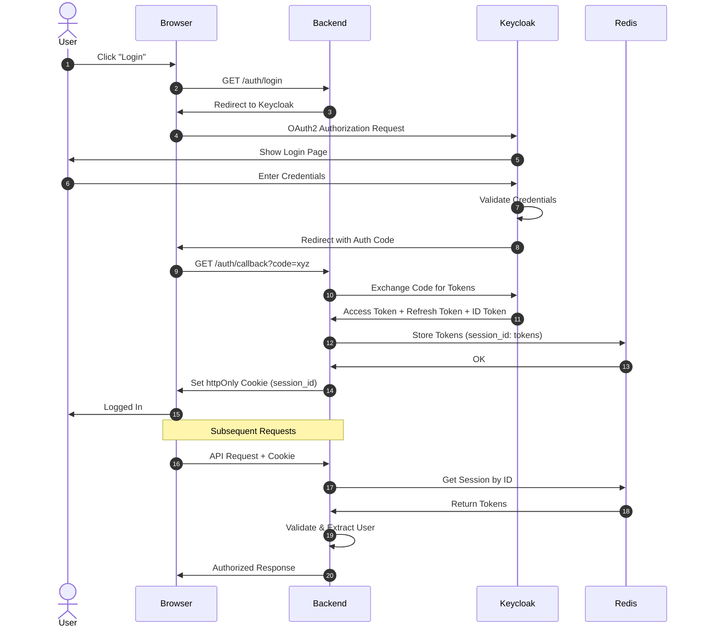
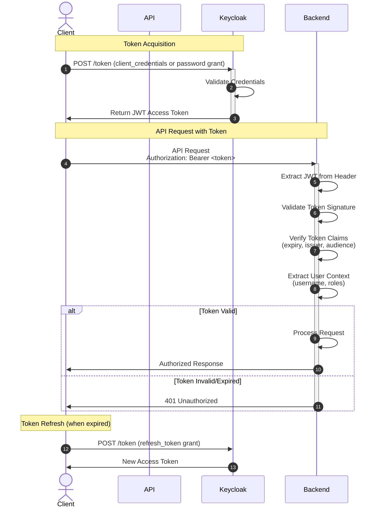

# Authentication

This starter app implements a comprehensive dual authentication system supporting both browser-based session cookies and JWT Bearer tokens, enabling secure access for both UI and programmatic API clients.

## Authentication Methods

### 1. Session Cookie Authentication (Primary for UI)

Browser-based authentication using httpOnly cookies for security.

**Flow:**

**Security Features:**

- httpOnly cookies prevent XSS attacks
- SameSite attribute prevents CSRF
- Secure flag enforces HTTPS
- Tokens never exposed to JavaScript

For more details on how the session store is implemented, see [Session Management](session-management.md).

### 2. JWT Bearer Token Authentication (For API Clients)

Token-based authentication for programmatic access, testing, and API clients.

**Flow:**

## Token Details

### RS256 vs HS256

- Keycloak issues **RS256** signed tokens (asymmetric). We verify using the public key from the JWKS endpoint.
- A deprecated **HS256** path remains for legacy tokens created internally; this is only used if the token header explicitly declares the HS256 algorithm.

### JWKS Handling

- The JWKS endpoint is fetched from `<KEYCLOAK_URL>/realms/<realm>/protocol/openid-connect/certs`.
- The keys are cached in-memory for 1 hour to reduce latency.
- The cache is pre-warmed on application startup.

### Token Claim Validation

The application can be configured to validate the following token claims:

- `iss` (issuer): `VERIFY_ISSUER` / `EXPECTED_ISSUER`
- `aud` (audience): `VERIFY_AUDIENCE` / `EXPECTED_AUDIENCE`

### Role Mapping

Roles are extracted from the `realm_access.roles` claim in the JWT.

## FastAPI Integration

- The `get_current_user` dependency handles both session cookies and bearer tokens.
- Role-based access control is provided by the `require_roles` dependency.
- The `/api/auth/refresh` endpoint allows for token rotation.
- Expired bearer tokens will result in a `401 Unauthorized` response.

## OpenAPI Configuration

The OpenAPI documentation (Swagger UI) is configured with two security schemes to support both authentication methods:

- `OAuth2AuthorizationCode`
- `HTTPBearer`
