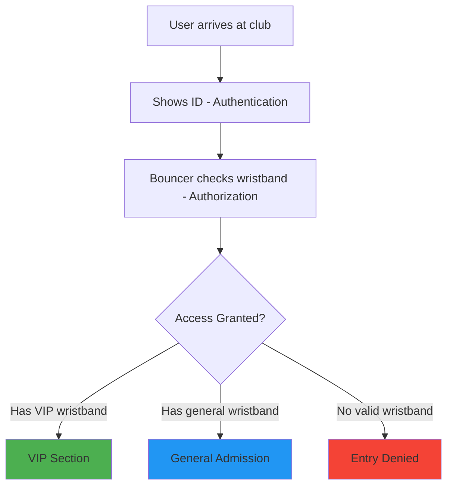
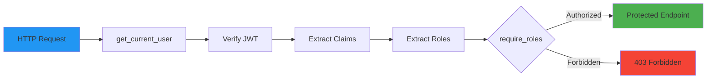
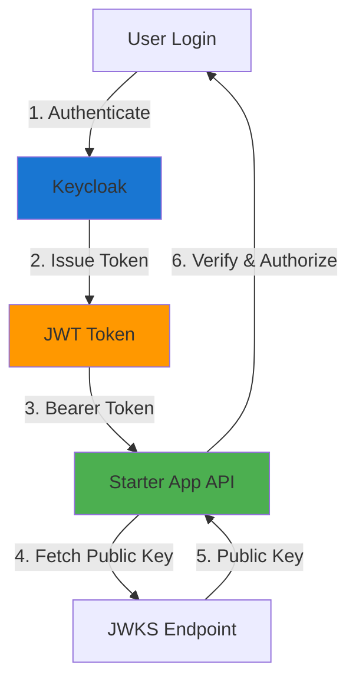
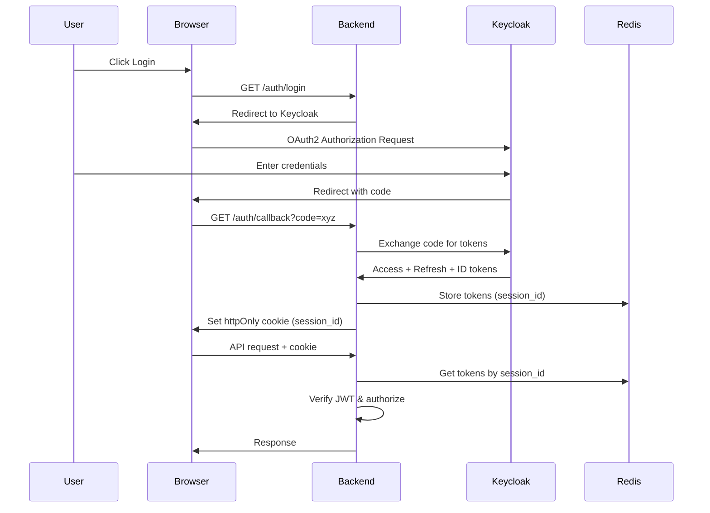
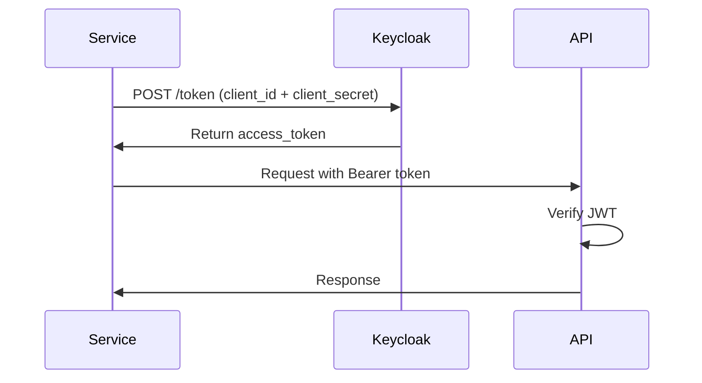

# Authorization

This guide explains the authorization concepts and implementation in the Starter App, covering OAuth2/OIDC fundamentals and practical implementation using Keycloak.

## Table of Contents

- [Core Concepts](#core-concepts)
- [OAuth2 Bouncer Analogy](#oauth2-bouncer-analogy)
- [Implementation Guide](#implementation-guide)
- [Keycloak Configuration](#keycloak-configuration)
- [Best Practices](#best-practices)
- [Troubleshooting](#troubleshooting)

## Core Concepts

Authorization determines **what** an authenticated user is allowed to do. While authentication verifies identity ("who are you?"), authorization controls access ("what can you do?").

The Starter App implements **Role-Based Access Control (RBAC)** using OAuth2/OIDC standards with Keycloak as the identity provider.

### Key Authorization Components

| Component | Purpose | Example |
|-----------|---------|---------|
| **Claims** | User attributes in JWT | `sub`, `email`, `name` |
| **Scope** | Permission boundaries | `openid`, `profile`, `email` |
| **Audience** | Intended recipient of token | `starter-app-api` |
| **Roles** | User permissions/groups | `admin`, `user`, `guest` |

## OAuth2 Bouncer Analogy

Think of OAuth2 authorization like a nightclub security system:



### The Bouncer Checks Four Things

#### 1. Claims (The Wristband Itself)

**What it is:** Basic information about who you are.

**Club Analogy:** Your name, photo, and member ID printed on the wristband.

**In OAuth2:** Standard JWT claims like `sub` (subject/user ID), `email`, `name`.

```json
{
  "sub": "123e4567-e89b-12d3-a456-426614174000",
  "email": "user@example.com",
  "name": "John Doe"
}
```

#### 2. Scope (What You're Allowed to See)

**What it is:** The general areas of the club you can access.

**Club Analogy:** Your wristband says you can access "dance floor" and "bar" but not "backstage" or "DJ booth."

**In OAuth2:** Permissions like `openid` (basic identity), `profile` (user details), `email` (email access).

```json
{
  "scope": "openid profile email"
}
```

**Important:** Scope defines _what information_ the token can access, not _what actions_ you can perform.

#### 3. Audience (Which Club This Wristband Is For)

**What it is:** Confirmation that your wristband is for _this specific club_.

**Club Analogy:** You can't use a wristband from "Club Awesome" to enter "Club Fantastic." The bouncer checks if your wristband is for _this_ club.

**In OAuth2:** The `aud` (audience) claim specifies which API or application the token is intended for.

```json
{
  "aud": "starter-app-api"
}
```

**Security Note:** This prevents token reuse attacks where a token meant for one service is used on another.

#### 4. Role (Your Access Level)

**What it is:** Your specific privileges within the club.

**Club Analogy:** Different colored wristbands grant different access:

- 🟢 **Green (Guest)**: Dance floor only
- 🔵 **Blue (Member)**: Dance floor + bar + lounge
- 🟣 **Purple (VIP)**: Full access including VIP section
- 🔴 **Red (Staff)**: Backstage, DJ booth, security areas

**In OAuth2:** Roles extracted from JWT claims (often in `realm_access.roles` for Keycloak).

```json
{
  "realm_access": {
    "roles": ["admin", "user"]
  }
}
```

### Summary Table

| Security Check | Club Bouncer | OAuth2/OIDC | Purpose |
|---------------|--------------|-------------|---------|
| **Claims** | "Who is this person?" | `sub`, `email`, `name` | Identity information |
| **Scope** | "What areas can they see?" | `openid profile email` | Information access boundaries |
| **Audience** | "Is this wristband for THIS club?" | `aud: "starter-app-api"` | Token validity for specific API |
| **Role** | "What color wristband do they have?" | `realm_access.roles: ["admin"]` | Permission level |

## Implementation Guide

### Overview

The Starter App implements authorization through:

1. **JWT Verification**: Validates token signature, expiry, audience, and issuer
2. **Role Extraction**: Extracts roles from `realm_access.roles` claim
3. **Role-Based Access Control**: Protects endpoints with role requirements
4. **Dependency Injection**: Uses FastAPI dependencies for clean, reusable authorization

### Architecture



### Step 1: JWT Verification

The `DualAuthService` verifies JWT tokens using RS256 public key cryptography:

```python
# src/api/services/auth.py

def get_user_from_jwt(self, token: str) -> dict | None:
    """Verify JWT and extract user information.

    Verifies:
    1. Signature using RS256 public key from JWKS endpoint
    2. Token expiry (exp claim)
    3. Audience (aud claim) if configured
    4. Issuer (iss claim) if configured
    """
    if not token:
        return None

    # Get public key from JWKS endpoint
    public_key = self._get_public_key_for_token(token)

    if public_key:
        try:
            # Configure audience verification
            verify_aud = app_settings.verify_audience and bool(
                app_settings.expected_audience
            )
            options = {"verify_aud": verify_aud}

            # Decode and verify JWT
            payload = jwt.decode(
                token,
                public_key,
                algorithms=["RS256"],
                audience=app_settings.expected_audience if verify_aud else None,
                options=options,
            )

            # Verify issuer
            if app_settings.verify_issuer and app_settings.expected_issuer:
                iss = payload.get("iss")
                if iss != app_settings.expected_issuer:
                    return None

            # Extract user info and roles
            return self._map_claims(payload)

        except jwt.ExpiredSignatureError:
            self._log.info("Token expired")
        except jwt.InvalidTokenError as e:
            self._log.info(f"Token invalid: {e}")

    return None
```

**Configuration:**

```python
# Environment variables
VERIFY_AUDIENCE=true
EXPECTED_AUDIENCE=starter-app-api
VERIFY_ISSUER=true
EXPECTED_ISSUER=http://localhost:8180/realms/starter-app
```

### Step 2: Role Extraction

Roles are extracted from the `realm_access.roles` claim in the JWT:

```python
# src/api/services/auth.py

def _map_claims(self, payload: dict) -> dict:
    """Map JWT claims to user info dictionary.

    Extracts:
    - sub (subject/user ID)
    - email, email_verified
    - preferred_username, name, given_name, family_name
    - realm_access.roles (user roles)
    """
    return {
        "sub": payload.get("sub"),
        "email": payload.get("email"),
        "email_verified": payload.get("email_verified", False),
        "username": payload.get("preferred_username"),
        "name": payload.get("name"),
        "given_name": payload.get("given_name"),
        "family_name": payload.get("family_name"),
        "roles": payload.get("realm_access", {}).get("roles", []),
    }
```

**Example JWT Claims:**

```json
{
  "sub": "123e4567-e89b-12d3-a456-426614174000",
  "email": "admin@example.com",
  "preferred_username": "admin",
  "name": "Admin User",
  "realm_access": {
    "roles": ["admin", "user", "offline_access"]
  },
  "aud": "starter-app-api",
  "iss": "http://localhost:8180/realms/starter-app",
  "exp": 1735689600,
  "iat": 1735686000
}
```

### Step 3: Protecting Endpoints

Use the `get_current_user` and `require_roles` dependencies to protect endpoints:

#### Basic Authentication (Any Authenticated User)

```python
from src.api.dependencies import get_current_user

class TasksController(ControllerBase):
    """Controller for task management endpoints with dual authentication."""

    def __init__(self, service_provider: ServiceProviderBase, mapper: Mapper, mediator: Mediator):
        super().__init__(service_provider, mapper, mediator)

    @get("/")
    async def get_tasks(
        self,
        user: dict = Depends(get_current_user)
    ):
        """Get tasks with role-based filtering.

        Supports authentication via:
        - Session cookie (from OAuth2 login)
        - JWT Bearer token (for API clients)
        """
        query = GetTasksQuery(user_info=user)
        result = await self.mediator.execute_async(query)
        return self.process(result)
```

#### Role-Based Authorization

```python
from src.api.dependencies import get_current_user, require_roles

...

    @delete("/{task_id}")
    async def delete_task(
        self,
        task_id: str,
        user: dict = Depends(require_roles("admin", "manager"))
    ):
        """Delete an existing task.

        **RBAC Protected**: Only users with 'admin' or 'manager' roles can delete tasks.

        Supports authentication via:
        - Session cookie (from OAuth2 login)
        - JWT Bearer token (for API clients)
        """
        command = DeleteTaskCommand(
            task_id=task_id,
            user_info=user
        )

        result = await self.mediator.execute_async(command)
        return self.process(result)
```

### Step 4: Role Checking Logic

The `require_roles` dependency factory creates a role checker:

```python
# src/api/dependencies.py

def require_roles(*required_roles: str):
    """Dependency factory that creates a role checker.

    Args:
        *required_roles: Role names required for access (OR logic)

    Returns:
        Dependency function that checks user roles

    Raises:
        HTTPException: 403 Forbidden if user lacks required roles

    Example:
        @router.delete("/admin/users/{user_id}")
        async def delete_user(
            user_id: str,
            current_user: dict = Depends(get_current_user),
            _: None = Depends(require_roles("admin")),
        ):
            ...
    """
    async def role_checker(
        current_user: dict = Depends(get_current_user),
        auth_service: DualAuthService = Depends(get_auth_service),
    ) -> None:
        if not auth_service.check_roles(current_user, list(required_roles)):
            raise HTTPException(
                status_code=403,
                detail=f"Forbidden: Requires one of roles: {', '.join(required_roles)}",
            )

    return role_checker
```

The actual role checking is performed by `DualAuthService.check_roles()`:

```python
# src/api/services/auth.py

def check_roles(self, user: dict, required_roles: list[str]) -> bool:
    """Check if user has any of the required roles.

    Args:
        user: User info dictionary (from JWT or session)
        required_roles: List of required role names

    Returns:
        True if user has at least one required role, False otherwise
    """
    user_roles = user.get("roles", [])
    return any(role in user_roles for role in required_roles)
```

**Logic:** Returns `True` if the user has **any** of the required roles (OR logic).

### Complete Example

```python

    @delete("/{task_id}")
    async def delete_task(
        self,
        task_id: str,
        user: dict = Depends(require_roles("admin", "manager"))
    ):
        """Delete an existing task.

        **RBAC Protected**: Only users with 'admin' or 'manager' roles can delete tasks.

        Supports authentication via:
        - Session cookie (from OAuth2 login)
        - JWT Bearer token (for API clients)
        """
        command = DeleteTaskCommand(
            task_id=task_id,
            user_info=user
        )

        result = await self.mediator.execute_async(command)
        return self.process(result)
```

**Request Flow:**

1. **Authentication**: `get_current_user` verifies JWT/session and extracts user info
2. **Authorization**: `require_roles("admin")` checks if user has "admin" role
3. **Business Logic**: Command bus processes deletion
4. **Response**: Returns confirmation or error

**Error Responses:**

```python
# 401 Unauthorized (no/invalid token)
{
  "detail": "Not authenticated"
}

# 403 Forbidden (authenticated but lacks role)
{
  "detail": "Forbidden: Requires one of roles: admin"
}
```

## Keycloak Configuration

### Overview

Keycloak is the identity provider that issues JWT tokens containing user identity and roles. Proper configuration ensures secure authorization.

### Architecture



### Step 1: Configure Audience Verification

**Why:** Prevents token reuse attacks by ensuring tokens are intended for your API.

#### In Application Code

```python
# Environment variables
VERIFY_AUDIENCE=true
EXPECTED_AUDIENCE=starter-app-api
```

This configures the JWT verification to check the `aud` claim:

```python
# src/api/services/auth.py
verify_aud = app_settings.verify_audience and bool(app_settings.expected_audience)
payload = jwt.decode(
    token,
    public_key,
    algorithms=["RS256"],
    audience=app_settings.expected_audience if verify_aud else None,
    options={"verify_aud": verify_aud}
)
```

#### In Keycloak

Configure the audience mapper to add `aud` claim to tokens:

1. **Navigate to Client Scopes**:
   - Keycloak Admin Console → Realm (e.g., `starter-app`) → Client Scopes

2. **Create Audience Mapper**:
   - Select/create client scope (e.g., `starter-app-api-scope`)
   - Click **Add mapper** → **By configuration** → **Audience**

3. **Configure Mapper**:

   ```yaml
   Name: audience-mapper
   Included Client Audience: starter-app-api  # Must match EXPECTED_AUDIENCE
   Add to ID token: OFF
   Add to access token: ON
   ```

4. **Assign to Client**:
   - Clients → `starter-app-client` → Client Scopes
   - Add `starter-app-api-scope` to **Assigned Default Client Scopes**

**Result:** JWT tokens will contain:

```json
{
  "aud": "starter-app-api"
}
```

### Step 2: Configure Client (Public vs Confidential)

#### Public Client (Frontend/SPA)

**Use Case:** Browser-based applications (React, Vue, Angular) where client secret cannot be secured.

**Configuration:**

1. **Create Client**:
   - Clients → Create → Client ID: `starter-app-frontend`

2. **Settings**:

   ```yaml
   Client ID: starter-app-frontend
   Name: Starter App Frontend
   Enabled: ON
   Client authentication: OFF  # Public client
   Standard flow: ENABLED       # Authorization Code Flow
   Direct access grants: DISABLED  # No Resource Owner Password Credentials
   Valid redirect URIs:
     - http://localhost:3000/*
     - https://app.example.com/*
   Web origins:
     - http://localhost:3000
     - https://app.example.com
   ```

3. **Client Scopes**:
   - Assign `openid`, `profile`, `email`, `starter-app-api-scope`

**Flow:** Backend-for-Frontend (BFF) Pattern with Authorization Code Flow

The starter-app uses a **Backend-for-Frontend (BFF)** pattern where the backend handles the OAuth2 flow and manages tokens server-side. The browser only receives an httpOnly session cookie.



**Benefits:**

- Tokens never exposed to browser (XSS protection)
- Backend handles token refresh automatically
- httpOnly cookies prevent JavaScript access
- Simplified frontend (no token management)

**See**: [Authentication Flows](./authentication-flows.md) for detailed session flow documentation.

#### Confidential Client (Backend Service)

**Use Case:** Server-to-server communication where client secret can be securely stored.

**Configuration:**

1. **Create Client**:
   - Clients → Create → Client ID: `starter-app-service`

2. **Settings**:

   ```yaml
   Client ID: starter-app-service
   Name: Starter App Backend Service
   Enabled: ON
   Client authentication: ON  # Confidential client
   Standard flow: DISABLED
   Direct access grants: ENABLED  # Client Credentials Flow
   Service accounts roles: ENABLED
   ```

3. **Credentials**:
   - Credentials tab → Copy **Client Secret**
   - Store securely (environment variable, secrets manager)

4. **Service Account Roles**:
   - Service Account Roles tab → Assign realm roles needed for API access

**Flow:** Client Credentials Flow



**Usage:**

```python
import requests

# Request token
response = requests.post(
    "http://localhost:8180/realms/starter-app/protocol/openid-connect/token",
    data={
        "grant_type": "client_credentials",
        "client_id": "starter-app-service",
        "client_secret": "your-client-secret",
    }
)
access_token = response.json()["access_token"]

# Use token
headers = {"Authorization": f"Bearer {access_token}"}
response = requests.get("http://localhost:8000/api/tasks", headers=headers)
```

### Step 3: Configure Roles and Mappers

#### Create Realm Roles

1. **Navigate to Roles**:
   - Keycloak Admin Console → Realm (e.g., `starter-app`) → Realm roles

2. **Create Roles**:
   - Click **Create role**
   - Add common roles: `admin`, `user`, `manager`, `guest`

3. **Configure Each Role**:

   ```yaml
   Role name: admin
   Description: Administrator with full access
   ```

#### Add Roles Mapper to Token

By default, Keycloak includes `realm_access.roles` in tokens. Verify this:

1. **Check Client Scope**:
   - Client Scopes → `roles` → Mappers tab

2. **Verify Realm Roles Mapper**:

   ```yaml
   Name: realm roles
   Mapper Type: User Realm Role
   Token Claim Name: realm_access.roles
   Claim JSON Type: String
   Add to ID token: ON
   Add to access token: ON
   Add to userinfo: ON
   ```

**Result:** JWT tokens will contain:

```json
{
  "realm_access": {
    "roles": ["admin", "user", "offline_access", "uma_authorization"]
  }
}
```

### Step 4: Assign Roles to Users

#### Method 1: Direct Assignment

1. **Navigate to User**:
   - Users → Select user → Role mapping tab

2. **Assign Realm Roles**:
   - Click **Assign role**
   - Filter by realm roles
   - Select roles (e.g., `admin`, `user`)
   - Click **Assign**

#### Method 2: Default Roles (All New Users)

1. **Navigate to Realm Settings**:
   - Realm settings → User registration tab

2. **Set Default Roles**:
   - Default roles → Add `user` role to all new users

#### Method 3: Group-Based Roles

1. **Create Group**:
   - Groups → Create group → Name: `Administrators`

2. **Assign Roles to Group**:
   - Select group → Role mapping → Assign `admin` role

3. **Add Users to Group**:
   - Users → Select user → Groups → Join group `Administrators`

**Benefit:** Easier role management at scale.

### Step 5: Test Token Claims

#### Using Keycloak Admin Console

1. **Navigate to Client**:
   - Clients → `starter-app-client` → Client scopes tab

2. **Evaluate Token**:
   - Click **Evaluate** → Select user
   - View **Generated Access Token** JSON

#### Using API Request

```bash
# Get token
TOKEN=$(curl -s -X POST \
  "http://localhost:8180/realms/starter-app/protocol/openid-connect/token" \
  -d "grant_type=password" \
  -d "client_id=starter-app-client" \
  -d "username=admin@example.com" \
  -d "password=admin123" \
  | jq -r '.access_token')

# Decode token (paste at https://jwt.io)
echo $TOKEN

# Test API
curl -H "Authorization: Bearer $TOKEN" http://localhost:8000/api/tasks
```

## Best Practices

### 1. Principle of Least Privilege

Assign users the minimum roles required for their tasks:

```python
# ❌ Don't give everyone admin
_: None = Depends(require_roles("admin", "user", "guest"))

# ✅ Be specific
_: None = Depends(require_roles("admin"))  # Only admins
```

### 2. Use Role Hierarchies

Define role hierarchies in Keycloak (Roles → Composite roles):

```yaml
admin:
  - Includes: manager, user
manager:
  - Includes: user
user:
  - Base role
```

**Benefit:** Admins automatically get manager and user permissions.

### 3. Separate Authentication from Authorization

```python
# ✅ Good: Two separate dependencies
@router.delete("/tasks/{task_id}")
async def delete_task(
    task_id: str,
    current_user: dict = Depends(get_current_user),      # Authentication
    _: None = Depends(require_roles("admin")),           # Authorization
):
    ...
```

**Benefits:**

- Clear separation of concerns
- Reusable components
- Easier testing
- Better error messages (401 vs 403)

### 4. Verify Audience Claims

Always verify audience to prevent token reuse:

```python
# Environment
VERIFY_AUDIENCE=true
EXPECTED_AUDIENCE=starter-app-api
```

### 5. Use Short-Lived Tokens

Configure token lifespans in Keycloak:

```yaml
Realm Settings → Tokens:
  Access Token Lifespan: 5 minutes
  SSO Session Idle: 30 minutes
  SSO Session Max: 10 hours
```

**Benefits:**

- Limits impact of stolen tokens
- Forces re-authentication periodically
- Reduces attack surface

### 6. Log Authorization Failures

```python
from src.observability.logging import get_logger

logger = get_logger(__name__)

async def role_checker(
    current_user: dict = Depends(get_current_user),
    auth_service: DualAuthService = Depends(get_auth_service),
) -> None:
    if not auth_service.check_roles(current_user, list(required_roles)):
        logger.warning(
            f"Authorization failed for user {current_user.get('sub')} "
            f"(roles: {current_user.get('roles')}) - "
            f"required: {required_roles}"
        )
        raise HTTPException(status_code=403, detail="Forbidden")
```

**Benefits:**

- Audit trail
- Security monitoring
- Troubleshooting

### 7. Test Authorization

```python
# tests/api/test_authorization.py
import pytest
from fastapi.testclient import TestClient

def test_admin_endpoint_requires_admin_role(client: TestClient, user_token: str):
    """Test that admin endpoints require admin role."""
    response = client.delete(
        "/api/tasks/123",
        headers={"Authorization": f"Bearer {user_token}"}
    )
    assert response.status_code == 403
    assert "admin" in response.json()["detail"]

def test_admin_endpoint_allows_admin(client: TestClient, admin_token: str):
    """Test that admin can access admin endpoints."""
    response = client.delete(
        "/api/tasks/123",
        headers={"Authorization": f"Bearer {admin_token}"}
    )
    assert response.status_code == 200
```

## Troubleshooting

### Issue: 403 Forbidden Despite Having Role

**Symptoms:**

```json
{
  "detail": "Forbidden: Requires one of roles: admin"
}
```

**Causes:**

1. **Role not in JWT token**

   **Check:** Decode JWT at [jwt.io](https://jwt.io) and verify `realm_access.roles` contains the role.

   **Solution:** Verify role mapper configuration in Keycloak (see [Step 3](#step-3-configure-roles-and-mappers)).

2. **Role name mismatch**

   **Check:** Ensure exact match between code and Keycloak:

   ```python
   # Code
   require_roles("admin")

   # JWT
   "realm_access": {"roles": ["Admin"]}  # ❌ Case mismatch
   ```

   **Solution:** Use consistent casing (typically lowercase).

3. **Token not refreshed**

   **Check:** Role was assigned _after_ token was issued.

   **Solution:** Log out and log back in to get new token with updated roles.

### Issue: Audience Verification Fails

**Symptoms:**

```
JWT token invalid: Audience doesn't match
```

**Causes:**

1. **Missing audience in token**

   **Check:** Decode JWT and verify `aud` claim exists.

   **Solution:** Configure audience mapper in Keycloak (see [Step 1](#step-1-configure-audience-verification)).

2. **Audience mismatch**

   **Check:** Compare `EXPECTED_AUDIENCE` in code with `aud` in JWT.

   **Solution:** Ensure they match exactly:

   ```python
   # Code
   EXPECTED_AUDIENCE=starter-app-api

   # JWT
   "aud": "starter-app-api"  # ✅ Match
   ```

### Issue: User Has Unexpected Roles

**Symptoms:** User can access endpoints they shouldn't.

**Causes:**

1. **Default roles assigned to all users**

   **Check:** Realm settings → User registration → Default roles

   **Solution:** Remove unnecessary default roles.

2. **Group membership**

   **Check:** Users → Select user → Groups tab

   **Solution:** Remove user from groups or adjust group role mappings.

3. **Composite roles**

   **Check:** Roles → Select role → Composite roles tab

   **Solution:** Adjust composite role assignments.

### Issue: Roles Not Appearing in Token

**Symptoms:** `realm_access.roles` is empty or missing.

**Causes:**

1. **Roles mapper not configured**

   **Check:** Client Scopes → `roles` → Mappers → `realm roles`

   **Solution:** Ensure realm roles mapper is present and enabled.

2. **Client scope not assigned**

   **Check:** Clients → `starter-app-client` → Client scopes

   **Solution:** Ensure `roles` is in **Assigned Default Client Scopes**.

3. **Roles not assigned to user**

   **Check:** Users → Select user → Role mapping

   **Solution:** Assign realm roles to user.

### Debug Checklist

When authorization fails, check in this order:

1. ✅ **Token is valid** (not expired, proper signature)
2. ✅ **Audience matches** (`aud` claim = `EXPECTED_AUDIENCE`)
3. ✅ **Issuer matches** (`iss` claim = `EXPECTED_ISSUER`)
4. ✅ **Roles present in token** (`realm_access.roles` not empty)
5. ✅ **Role name matches** (exact case-sensitive match)
6. ✅ **User has required role** (check Keycloak user's role mapping)
7. ✅ **Endpoint dependency configured** (`require_roles(...)` present)

### Debugging Tools

#### 1. Decode JWT Token

```bash
# Get token
TOKEN="<your-jwt-token>"

# Decode header and payload (Base64)
echo $TOKEN | cut -d'.' -f1 | base64 -d | jq
echo $TOKEN | cut -d'.' -f2 | base64 -d | jq
```

Or use [jwt.io](https://jwt.io) web debugger.

#### 2. Test Token with cURL

```bash
# Test authentication
curl -H "Authorization: Bearer $TOKEN" \
  http://localhost:8000/api/tasks

# Test authorization
curl -X DELETE \
  -H "Authorization: Bearer $TOKEN" \
  http://localhost:8000/api/tasks/123
```

#### 3. Enable Debug Logging

```python
# src/api/services/auth.py
import logging

logging.getLogger("src.api.services.auth").setLevel(logging.DEBUG)
```

**Output:**

```
DEBUG: Verifying JWT token
DEBUG: Public key retrieved from JWKS
DEBUG: Token decoded successfully
DEBUG: User roles: ['admin', 'user']
DEBUG: Role check: required=['admin'], user_roles=['admin', 'user'], result=True
```

## Related Documentation

- [Authentication Flows](authentication-flows.md) - Dual authentication system (session + JWT)
- [Session Management](session-management.md) - Redis-based session handling
- [Security Best Practices](security.md) - General security guidelines
- [CQRS Pattern](../architecture/cqrs-pattern.md) - Command/Query separation
- [Dependency Injection](../architecture/dependency-injection.md) - DI container configuration

## Additional Resources

- [OAuth 2.0 RFC 6749](https://datatracker.ietf.org/doc/html/rfc6749) - OAuth 2.0 specification
- [OpenID Connect Core 1.0](https://openid.net/specs/openid-connect-core-1_0.html) - OIDC specification
- [RFC 7519 - JWT](https://datatracker.ietf.org/doc/html/rfc7519) - JSON Web Token specification
- [Keycloak Documentation](https://www.keycloak.org/documentation) - Official Keycloak docs
- [FastAPI Security](https://fastapi.tiangolo.com/tutorial/security/) - FastAPI security guide
