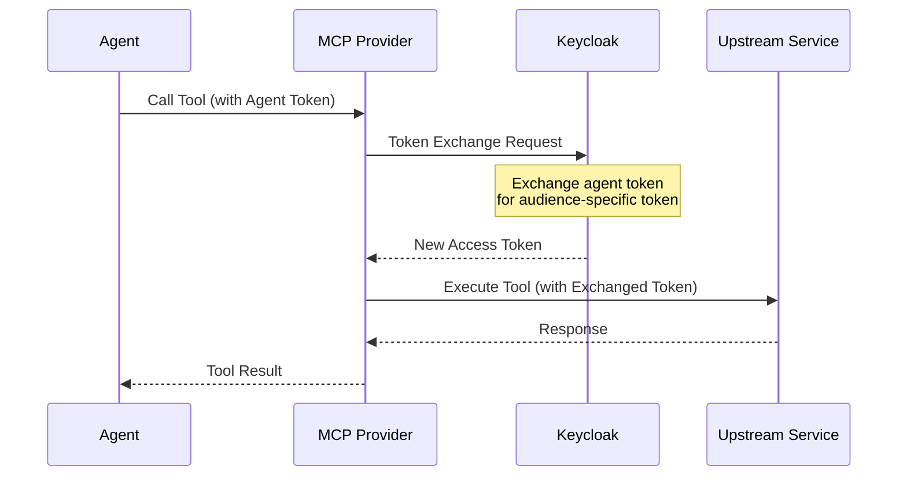

# Keycloak Token Exchange Configuration Guide

This document describes how to configure Keycloak for RFC 8693 Token Exchange, enabling the MCP Tools Provider to securely delegate agent identities to upstream services.

!!! info "Keycloak Version"
    This guide is written for **Keycloak 26.x+**. Starting from Keycloak 26.2.0, the standard token exchange (V2) is enabled by default and **Fine-Grained Admin Permissions are no longer required** for internal-to-internal token exchange.

## Overview

Token Exchange allows the MCP Tools Provider to exchange an agent's access token for a new token scoped to a specific upstream service. This implements secure identity delegation without exposing the agent's original credentials to upstream services.

### What is Token Exchange?

Token Exchange (RFC 8693) is an OAuth 2.0 extension that enables a client to exchange one token for another. In the context of the MCP Tools Provider:

1. **Agent authenticates** → Receives access token scoped to the MCP Provider
2. **Agent calls a tool** → MCP Provider exchanges the agent's token for a new token
3. **New token** → Scoped specifically to the upstream service (e.g., `pizzeria-backend`)
4. **Upstream service** → Receives token with correct audience, validates identity



### Standard vs Legacy Token Exchange

| Feature | Standard V2 (Default) | Legacy V1 (Preview) |
|---------|----------------------|---------------------|
| Internal ↔ Internal | ✅ Supported | ✅ Supported |
| Fine-Grained Permissions | Not required | Required |
| External Token Exchange | ❌ Not yet | ✅ Supported |
| User Impersonation | ❌ Not yet | ✅ Supported |
| Recommendation | **Use this** | For advanced scenarios only |

## Prerequisites

- **Keycloak 26.x+** (Standard token exchange V2 is default)
- Admin access to the Keycloak realm
- The MCP Tools Provider realm already configured (default: `tools-provider`)
- Upstream services configured as Keycloak clients

## Configuration Steps

### Step 1: Verify Token Exchange is Enabled (Default in Keycloak 26+)

Standard token exchange V2 (`token-exchange-standard:v2`) is **enabled by default** in Keycloak 26.x+. You can verify this:

```bash
# Check enabled features
bin/kc.sh show-config | grep token-exchange
```

!!! note "Docker Configuration"
    If running Keycloak in Docker, no special feature flags are needed for standard token exchange:

    ```yaml
    services:
      keycloak:
        image: quay.io/keycloak/keycloak:26.2
        command: start-dev
        # No KC_FEATURES needed for standard token exchange!
    ```

### Step 2: Create the Token Exchange Client

This confidential client is used by the MCP Tools Provider to perform token exchange operations.

1. Navigate to **Clients** → **Create client**
2. Configure the client:
   - **Client ID**: `tools-provider-token-exchange`
   - **Client Protocol**: `openid-connect`
   - **Client authentication**: `ON` (confidential client)
   - **Authorization**: `OFF`
   - **Standard flow**: `OFF`
   - **Direct access grants**: `OFF`
   - **Service accounts roles**: `ON` (required for token exchange)

3. Go to the **Capability config** tab:
   - **Standard Token Exchange**: `ON` ✅ (Critical!)

4. Save and go to **Credentials** tab
5. Copy the **Client Secret** for your `.env` file:

   ```env
   TOKEN_EXCHANGE_CLIENT_ID=tools-provider-token-exchange
   TOKEN_EXCHANGE_CLIENT_SECRET=<copied-secret>
   ```


### Step 3: Configure Upstream Service Clients (Audiences)

For each upstream service that tools can call, create or configure a client in Keycloak:

#### 3a. Create the Upstream Service Client

1. Navigate to **Clients** → **Create client**
2. Configure:
   - **Client ID**: `pizzeria-backend` (example - use your service name)
   - **Client Protocol**: `openid-connect`
   - **Client authentication**: `ON` or `OFF` depending on service type
   - **Standard flow**: Configure as needed for the service

#### 3b. Enable Standard Token Exchange on Audience Client

For Keycloak 26+ V2 token exchange, the audience client must have standard token exchange enabled:

1. Navigate to **Clients** → `pizzeria-backend`
2. Go to **Capability config** tab
3. Enable **Standard Token Exchange**: `ON` ✅

This is required because in V2 token exchange, the target audience client must explicitly allow being used as a token exchange audience.

#### 3c. Create an Audience Client Scope (Critical for V2!)

!!! warning "Keycloak 26+ V2 Requirement"
    In V2 token exchange, the requested audience must be "available" to the requester client. This is typically done via a **client scope with an audience mapper**.

Create a client scope that includes the target audience:

1. Navigate to **Client scopes** → **Create client scope**
2. Configure:
   - **Name**: `pizzeria-audience`
   - **Description**: `Client scope to allow token exchange to pizzeria-backend`
   - **Protocol**: `openid-connect`
3. Go to **Mappers** → **Add mapper** → **By configuration** → **Audience**
4. Configure:
   - **Name**: `pizzeria-backend-audience`
   - **Included Client Audience**: `pizzeria-backend`
   - **Add to ID token**: `OFF`
   - **Add to access token**: `ON`
5. Save

Then add this scope to the token exchange client:

1. Navigate to **Clients** → `tools-provider-token-exchange`
2. Go to **Client scopes** tab
3. Click **Add client scope**
4. Select `pizzeria-audience` and add as **Default**

This ensures the token exchange client can request tokens with `pizzeria-backend` as the audience.

#### 3d. Add Audience Mapper (Alternative Approach)

The upstream service client must have an **audience mapper** so tokens exchanged for this audience include the correct `aud` claim.

1. Navigate to **Clients** → `pizzeria-backend` → **Client scopes** tab
2. Click on `pizzeria-backend-dedicated`
3. Click **Add mapper** → **By configuration**
4. Select **Audience**
5. Configure:
   - **Name**: `audience-pizzeria-backend`
   - **Included Client Audience**: `pizzeria-backend`
   - **Add to ID token**: `ON`
   - **Add to access token**: `ON`


This ensures that when a token is exchanged with `audience=pizzeria-backend`, the resulting token's `aud` claim includes `pizzeria-backend`.

### Step 4: Ensure Token Exchange Client is in Subject Token Audience

!!! warning "Critical Requirement"
    The `subject_token` sent to the token exchange endpoint **must have the requester client (`tools-provider-token-exchange`) in its `aud` claim**. Otherwise, the request will be rejected.

To ensure this, add the token exchange client as an audience to tokens issued to agents:

1. Navigate to **Clients** → `tools-provider-frontend` (your agent-facing client)
2. Go to **Client scopes** → `tools-provider-frontend-dedicated`
3. Add an **Audience** mapper:
   - **Name**: `audience-token-exchange`
   - **Included Client Audience**: `tools-provider-token-exchange`
   - **Add to access token**: `ON`

Alternatively, add `tools-provider-token-exchange` to the default audience via client scopes at the realm level.

### Step 5: Register Source with Default Audience

When registering an upstream source in the MCP Tools Provider, specify the `default_audience`:

```bash
curl -X POST http://localhost:8040/api/v1/sources \
  -H "Authorization: Bearer $TOKEN" \
  -H "Content-Type: application/json" \
  -d '{
    "name": "Pizzeria Backend API",
    "url": "http://pizzeria:8000/openapi.json",
    "source_type": "openapi",
    "default_audience": "pizzeria-backend"
  }'
```

The `default_audience` is the Keycloak client ID of the upstream service. When tools from this source are executed:

- If `default_audience` is set → Token exchange occurs with this audience
- If `default_audience` is empty/null → Agent token is passed through directly (no exchange)

## Environment Variables

Add these to your `.env` file:

```env
# Keycloak Server Configuration
KEYCLOAK_URL=http://localhost:8041
KEYCLOAK_REALM=tools-provider

# Token Exchange Client (created in Step 2)
TOKEN_EXCHANGE_CLIENT_ID=tools-provider-token-exchange
TOKEN_EXCHANGE_CLIENT_SECRET=your-secret-here

# Token Exchange Tuning
TOKEN_EXCHANGE_CACHE_TTL_BUFFER=60    # Seconds before expiry to refresh
TOKEN_EXCHANGE_TIMEOUT=10.0            # Request timeout in seconds

# Circuit Breaker (protects against Keycloak outages)
CIRCUIT_BREAKER_FAILURE_THRESHOLD=5    # Failures before opening
CIRCUIT_BREAKER_RECOVERY_TIMEOUT=30.0  # Seconds before retry
```

## Understanding the Token Exchange Flow

### Request Parameters (RFC 8693)

| Parameter | Required | Value |
|-----------|----------|-------|
| `grant_type` | Yes | `urn:ietf:params:oauth:grant-type:token-exchange` |
| `client_id` | Yes | Token exchange client ID |
| `client_secret` | Yes | Token exchange client secret |
| `subject_token` | Yes | Agent's access token |
| `subject_token_type` | Yes | `urn:ietf:params:oauth:token-type:access_token` |
| `audience` | Yes | Target client ID (e.g., `pizzeria-backend`) |
| `requested_token_type` | No | `urn:ietf:params:oauth:token-type:access_token` (default) |
| `scope` | No | Space-delimited scopes to request |

### Response

```json
{
  "access_token": "eyJhbGciOiJSUzI1NiIsIn...",
  "expires_in": 300,
  "token_type": "Bearer",
  "issued_token_type": "urn:ietf:params:oauth:token-type:access_token",
  "scope": "openid profile"
}
```

## Testing Token Exchange

### Manual Test with curl

```bash
# 1. Get an agent token
AGENT_TOKEN=$(curl -s -X POST \
  "http://localhost:8041/realms/tools-provider/protocol/openid-connect/token" \
  -d "grant_type=password" \
  -d "client_id=tools-provider-frontend" \
  -d "username=johndoe" \
  -d "password=password" \
  | jq -r '.access_token')

# 2. Verify the token has token-exchange client in audience
echo $AGENT_TOKEN | cut -d. -f2 | base64 -d 2>/dev/null | jq '.aud'
# Should include "tools-provider-token-exchange"

# 3. Exchange for an upstream service token
curl -X POST \
  "http://localhost:8041/realms/tools-provider/protocol/openid-connect/token" \
  -d "grant_type=urn:ietf:params:oauth:grant-type:token-exchange" \
  -d "client_id=tools-provider-token-exchange" \
  -d "client_secret=your-secret-here" \
  -d "subject_token=$AGENT_TOKEN" \
  -d "subject_token_type=urn:ietf:params:oauth:token-type:access_token" \
  -d "audience=pizzeria-backend" \
  -d "requested_token_type=urn:ietf:params:oauth:token-type:access_token"

# 4. Verify exchanged token has correct audience
EXCHANGED_TOKEN="<token from response>"
echo $EXCHANGED_TOKEN | cut -d. -f2 | base64 -d 2>/dev/null | jq '.aud'
# Should include "pizzeria-backend"
```

### Testing via MCP Tools Provider

```bash
# Execute a tool - token exchange happens automatically
curl -X POST http://localhost:8040/api/v1/tools/execute \
  -H "Authorization: Bearer $AGENT_TOKEN" \
  -H "Content-Type: application/json" \
  -d '{
    "tool_id": "pizzeria-backend/get_menu_items",
    "arguments": {}
  }'
```

Check the logs for token exchange activity:

```bash
docker logs tools-provider 2>&1 | grep -i "token exchange"
```

## Upstream Service Configuration

### Configuring Audience Verification

Upstream services should verify the `aud` claim in received tokens. Example for a FastAPI service:

```python
# auth/dependencies.py
import os
from jose import jwt, JWTError

VERIFY_AUDIENCE = os.getenv("VERIFY_AUDIENCE", "true").lower() == "true"
EXPECTED_AUDIENCE = os.getenv("EXPECTED_AUDIENCE", "")

async def verify_token(token: str) -> dict:
    """Verify JWT token with optional audience checking."""
    try:
        # Decode without verification first to get claims
        unverified = jwt.get_unverified_claims(token)

        # Verify audience if enabled
        if VERIFY_AUDIENCE and EXPECTED_AUDIENCE:
            aud = unverified.get("aud", [])
            if isinstance(aud, str):
                aud = [aud]
            if EXPECTED_AUDIENCE not in aud:
                raise HTTPException(
                    status_code=401,
                    detail=f"Token audience mismatch. Expected: {EXPECTED_AUDIENCE}"
                )

        # Full verification with JWKS...
        return verified_claims
    except JWTError as e:
        raise HTTPException(status_code=401, detail=str(e))
```

### Docker Compose Configuration

```yaml
services:
  pizzeria:
    image: pizzeria-backend:latest
    environment:
      # Enable strict audience verification
      VERIFY_AUDIENCE: "true"
      EXPECTED_AUDIENCE: "pizzeria-backend"

      # Keycloak JWKS endpoint for token verification
      JWKS_URI: "http://keycloak:8080/realms/tools-provider/protocol/openid-connect/certs"
```

## Source Registration with Default Audience

When registering a source, the `default_audience` field controls token exchange behavior:

### API Request

```http
POST /api/v1/sources
Content-Type: application/json
Authorization: Bearer {admin_token}

{
  "name": "Pizzeria Backend API",
  "url": "http://pizzeria:8000/openapi.json",
  "source_type": "openapi",
  "default_audience": "pizzeria-backend"
}
```

### Behavior Matrix

| `default_audience` Value | Token Exchange | Notes |
|-------------------------|----------------|-------|
| `"pizzeria-backend"` | ✅ Performed | Token exchanged for this audience |
| `""` (empty string) | ❌ Skipped | Agent token passed through |
| `null` / not set | ❌ Skipped | Agent token passed through |

### Updating Existing Sources

To enable/disable token exchange for an existing source:

```bash
# Enable token exchange
curl -X PATCH "http://localhost:8040/api/v1/sources/{source_id}" \
  -H "Authorization: Bearer $TOKEN" \
  -H "Content-Type: application/json" \
  -d '{"default_audience": "pizzeria-backend"}'

# Disable token exchange (pass-through mode)
curl -X PATCH "http://localhost:8040/api/v1/sources/{source_id}" \
  -H "Authorization: Bearer $TOKEN" \
  -H "Content-Type: application/json" \
  -d '{"default_audience": ""}'
```

## Security Best Practices

### 1. Minimal Token Lifetimes

Configure short lifetimes for exchanged tokens:

```
Realm Settings → Tokens → Access Token Lifespan: 5 minutes
```

### 2. Audience Restriction

Always specify the exact audience - never use wildcard patterns:

```python
# Good: Specific audience
result = await token_exchanger.exchange_token(
    subject_token=agent_token,
    audience="pizzeria-backend"
)

# Bad: No audience (defeats purpose of token exchange)
result = await token_exchanger.exchange_token(
    subject_token=agent_token,
    audience=""  # Don't do this!
)
```

### 3. Scope Limiting

Request only necessary scopes for upstream operations:

```python
result = await token_exchanger.exchange_token(
    subject_token=agent_token,
    audience="pizzeria-backend",
    requested_scopes=["read:menu", "read:orders"]  # Minimal scopes
)
```

### 4. Audit Logging

Enable Keycloak event logging for token exchanges:

1. Navigate to **Realm Settings** → **Events** → **Event listeners**
2. Add `jboss-logging`
3. Under **Login events settings**, enable:
   - `TOKEN_EXCHANGE`
   - `TOKEN_EXCHANGE_ERROR`

### 5. Client Secret Rotation

Regularly rotate the token exchange client secret:

```bash
# Generate new secret via Admin API
curl -X POST \
  "http://localhost:8041/admin/realms/tools-provider/clients/{client-uuid}/client-secret" \
  -H "Authorization: Bearer $ADMIN_TOKEN"
```

Update your `.env` file and restart the MCP Tools Provider.

### 6. Network Segmentation

In production, ensure:

- Token exchange client credentials are only accessible to MCP Provider
- Keycloak admin interface is not exposed publicly
- Use TLS for all Keycloak communications

## Troubleshooting

### Error: "Client not allowed to exchange"

The token exchange client doesn't have the "Standard Token Exchange" capability enabled:

1. Navigate to **Clients** → `tools-provider-token-exchange`
2. Go to **Settings** → **Capability config**
3. Ensure **Standard Token Exchange** is `ON`

### Error: "Invalid token" or "Invalid subject token"

The subject token doesn't have the requester client in its audience:

1. Decode the agent token: `echo $TOKEN | cut -d. -f2 | base64 -d | jq '.aud'`
2. Verify `tools-provider-token-exchange` is in the `aud` claim
3. If missing, add an audience mapper to the agent-facing client (Step 4)

### Error: "Requested audience not in token audience"

The exchanged token request specifies an audience that's not available:

1. Verify the target client exists (e.g., `pizzeria-backend`)
2. Ensure the target client has an audience mapper configured
3. Check that the user has appropriate role mappings

### Error: "Token has insufficient permissions"

The agent token doesn't have the required scopes:

1. Check the token's `scope` claim
2. Verify client scopes are correctly configured
3. Ensure the user has appropriate role assignments

### Token Exchange Returns Agent Token Unchanged

This happens when `default_audience` is empty/null:

```bash
# Check source configuration
curl http://localhost:8040/api/v1/sources/{source_id} | jq '.default_audience'
```

If empty, either:

- Update the source with a valid audience
- This may be intentional for services that don't require specific audiences

### Circuit Breaker Opens

The circuit breaker protects against Keycloak outages:

```bash
# Check Keycloak health
curl http://localhost:8041/health

# Check Keycloak logs
docker logs keycloak 2>&1 | tail -50
```

Recovery steps:

1. Wait for `CIRCUIT_BREAKER_RECOVERY_TIMEOUT` seconds
2. Verify Keycloak is responsive
3. Check network connectivity between MCP Provider and Keycloak

### Debugging Token Exchange

Enable debug logging:

```env
LOG_LEVEL=DEBUG
```

Look for log entries:

```
Token exchange successful for audience 'pizzeria-backend', expires in 300s
Token exchange cache hit for audience 'pizzeria-backend'
No audience specified, using agent token directly
```

### Common Keycloak Configuration Mistakes

| Issue | Solution |
|-------|----------|
| Token exchange client not confidential | Enable "Client authentication" |
| Missing audience mapper | Add `oidc-audience-mapper` to target client |
| Subject token missing requester audience | Add audience mapper to agent-facing client |
| Token exchange not enabled on client | Enable "Standard Token Exchange" capability |

## Monitoring

The MCP Tools Provider exposes metrics for token exchange:

| Metric | Description |
|--------|-------------|
| `tools_provider.token_exchange.count` | Total exchange operations |
| `tools_provider.token_exchange.duration` | Exchange latency histogram |
| `tools_provider.token_exchange.errors` | Exchange failures by type |
| `tools_provider.token_exchange.cache_hits` | Cache hit rate |
| `tools_provider.circuit_breaker.state` | Circuit breaker state (0=closed, 1=open) |
| `tools_provider.circuit_breaker.opens` | Circuit breaker activations |

### OpenTelemetry Tracing

Token exchange operations are traced with spans:

- `exchange_token` - Parent span for exchange operation
  - Attributes: `token_exchange.audience`, `token_exchange.cache_hit`
  - Events: "Performing token exchange"

Enable tracing in your environment:

```env
OTEL_EXPORTER_OTLP_ENDPOINT=http://jaeger:4317
OTEL_SERVICE_NAME=tools-provider
```

## Keycloak Realm Export

For reproducible deployments, include token exchange configuration in your realm export:

```json
{
  "clients": [
    {
      "clientId": "tools-provider-token-exchange",
      "enabled": true,
      "clientAuthenticatorType": "client-secret",
      "secret": "your-secret-here",  // pragma: allowlist secret
      "standardFlowEnabled": false,
      "directAccessGrantsEnabled": false,
      "serviceAccountsEnabled": true,
      "publicClient": false,
      "attributes": {
        "oauth2.token.exchange.grant.enabled": "true"
      }
    },
    {
      "clientId": "pizzeria-backend",
      "enabled": true,
      "protocolMappers": [
        {
          "name": "audience-pizzeria-backend",
          "protocol": "openid-connect",
          "protocolMapper": "oidc-audience-mapper",
          "config": {
            "included.client.audience": "pizzeria-backend",
            "id.token.claim": "true",
            "access.token.claim": "true"
          }
        }
      ]
    }
  ]
}
```

## Legacy Token Exchange (V1)

!!! warning "Preview Feature"
    Legacy token exchange (V1) is a **preview feature** and requires additional configuration.

If you need features not available in standard token exchange V2 (external token exchange, user impersonation), you can enable V1:

```yaml
services:
  keycloak:
    environment:
      KC_FEATURES: token-exchange,admin-fine-grained-authz
```

Legacy V1 requires:

- Fine-Grained Admin Permissions enabled
- Token exchange permissions configured per client
- Service account roles for impersonation

See [Keycloak Legacy Token Exchange Documentation](https://www.keycloak.org/securing-apps/token-exchange#_legacy_token_exchange) for details.

## References

- [RFC 8693 - OAuth 2.0 Token Exchange](https://datatracker.ietf.org/doc/html/rfc8693)
- [Keycloak Token Exchange Documentation](https://www.keycloak.org/securing-apps/token-exchange)
- [Keycloak Server Features - Enabling Token Exchange](https://www.keycloak.org/server/features)
- [Keycloak 26.2.0 Release Notes - Standard Token Exchange V2](https://www.keycloak.org/docs/latest/upgrading)
