# Session Management Architecture

This document describes the **critical** session management architecture for multi-application deployments sharing a single Keycloak SSO instance. Understanding this architecture is essential for developers working with the Tools Provider and Agent Host applications.

## Overview

Both applications use a **Redis-backed server-side session store** with **httpOnly cookies**. When multiple applications share the same domain (e.g., `localhost` during development), they **MUST** use different:

1. **Cookie names** - Prevents browser cookie collision
2. **Redis databases** - Provides logical isolation of session data

!!! danger "Critical: Cross-App Session Collision"
    If two applications use the same cookie name on the same domain, logging into one app **will log you out of the other**. This is because the browser overwrites the cookie, and the other app cannot find its session.

## Multi-Application Session Architecture

```mermaid
flowchart TB
    subgraph Browser["Browser (localhost)"]
        C1["🍪 tools_session cookie"]
        C2["🍪 agent_session cookie"]
    end

    subgraph Keycloak["Keycloak SSO (port 8041)"]
        KC["Single Sign-On\ntools-provider realm"]
    end

    subgraph Redis["Redis Server (port 6379)"]
        DB0["Database 0\nprefix: session:\nTools Provider Sessions"]
        DB2["Database 2\nprefix: agent-host:session:\nAgent Host Sessions"]
    end

    subgraph Apps["Applications"]
        TP["Tools Provider\nport 8040"]
        AH["Agent Host\nport 8050"]
    end

    C1 -->|"session_id"| TP
    C2 -->|"session_id"| AH
    TP -->|"redis://redis:6379/0"| DB0
    AH -->|"redis://redis:6379/2"| DB2
    TP <-->|"OAuth2 PKCE"| KC
    AH <-->|"OAuth2 PKCE"| KC
```



## Configuration Reference

### Environment Variables

| Variable | Application | Default | Description |
|----------|-------------|---------|-------------|
| `SESSION_COOKIE_NAME` | Tools Provider | `tools_session` | Cookie name for Tools Provider sessions |
| `AGENT_HOST_SESSION_COOKIE_NAME` | Agent Host | `agent_session` | Cookie name for Agent Host sessions |
| `REDIS_URL` | Tools Provider | `redis://redis:6379/0` | Redis connection (database 0) |
| `AGENT_HOST_REDIS_URL` | Agent Host | `redis://redis:6379/2` | Redis connection (database 2) |
| `REDIS_KEY_PREFIX` | Tools Provider | `session:` | Redis key prefix |
| `AGENT_HOST_REDIS_KEY_PREFIX` | Agent Host | `agent-host:session:` | Redis key prefix |

### Redis Database Allocation

| Database | Application | Key Prefix | Purpose |
|----------|-------------|------------|---------|
| 0 | Tools Provider | `session:` | User sessions (OAuth tokens, user info) |
| 1 | Tools Provider | `cache:` | Performance cache (tool definitions, manifests, token exchange) |
| 2 | Agent Host | `agent-host:session:` | User sessions + conversation state |

!!! note "Database Isolation"
    Using separate Redis databases ensures that `FLUSHDB` operations on one application's database do not affect another. Database 1 (cache) can be safely flushed without affecting sessions.

## Why Redis?

- **Security**: Tokens never exposed to browser JavaScript
- **Performance**: Sub-millisecond session lookups
- **Scalability**: Shared session store for multiple app instances
- **Expiration**: Built-in TTL for automatic cleanup
- **Atomic Operations**: Thread-safe session updates
- **Isolation**: Separate databases per application

## Session Lifecycle

### 1. Login (Session Creation)

When a user authenticates via Keycloak:

```python
# OAuth2 callback handler
@get("/api/auth/callback")
async def callback(code: str, state: str, response: Response):
    # 1. Exchange authorization code for tokens
    tokens = await auth_service.exchange_code(code, state)

    # 2. Decode ID token for user info
    user_info = decode_id_token(tokens['id_token'])

    # 3. Create session in Redis
    session_id = session_store.create_session(
        tokens=tokens,
        user_info={
            "sub": user_info['sub'],
            "username": user_info['preferred_username'],
            "email": user_info.get('email'),
            "roles": user_info.get('realm_access', {}).get('roles', [])
        }
    )

    # 4. Set httpOnly cookie with APP-SPECIFIC name
    response.set_cookie(
        key=app_settings.session_cookie_name,  # "tools_session" or "agent_session"
        value=session_id,
        httponly=True,      # JavaScript cannot access
        secure=False,       # Set True in production (HTTPS)
        samesite="lax",     # CSRF protection
        max_age=28800       # 8 hours
    )
```

### 2. Authenticated Requests

```python
# Dependency injection retrieves session from correct cookie
async def get_current_user(request: Request) -> dict:
    # Get session ID from app-specific cookie
    session_id = request.cookies.get(app_settings.session_cookie_name)
    if not session_id:
        raise HTTPException(401, "Not authenticated")

    # Retrieve session from Redis
    session = auth_service.session_store.get_session(session_id)
    if not session:
        raise HTTPException(401, "Session expired")

    return session["user_info"]
```

### 3. Logout (Session Deletion)

```python
@post("/api/auth/logout")
async def logout(request: Request, response: Response):
    session_id = request.cookies.get(app_settings.session_cookie_name)
    if session_id:
        # Delete from Redis
        session_store.delete_session(session_id)

    # Clear the app-specific cookie
    response.delete_cookie(key=app_settings.session_cookie_name)

    # Optionally redirect to Keycloak logout for full SSO logout
    return RedirectResponse(keycloak_logout_url)
```

## Session Data Structure

### Redis Key Format

```
{key_prefix}{session_id}

# Examples:
session:abc123...                    # Tools Provider
agent-host:session:xyz789...         # Agent Host
```

### Session Data (JSON)

```json
{
  "tokens": {
    "access_token": "eyJhbGciOiJSUzI1NiIs...",
    "refresh_token": "eyJhbGciOiJIUzI1NiIs...",
    "id_token": "eyJhbGciOiJSUzI1NiIs...",
    "expires_in": 3600,
    "refresh_expires_in": 1800,
    "token_type": "Bearer"
  },
  "user_info": {
    "sub": "550e8400-e29b-41d4-a716-446655440000",
    "username": "admin",
    "email": "admin@example.com",
    "roles": ["admin", "manager"]
  },
  "created_at": "2024-01-15T10:30:00Z",
  "expires_at": "2024-01-15T18:30:00Z",
  "conversation_id": "conv_123..."
}
```

## Docker Setup

The application includes Redis in `docker-compose.yml`:

```yaml
redis:
  image: redis:7-alpine
  ports:
    - "${REDIS_PORT:-6379}:6379"
```

Start with:

```bash
make up
```

## Adding a New Application

When adding a new application that shares the Keycloak SSO:

### 1. Choose Unique Identifiers

```python
# new_app/src/application/settings.py
class Settings(ApplicationSettings):
    # Use unique cookie name
    session_cookie_name: str = "new_app_session"

    # Use unique Redis database (3, 4, 5, etc.)
    redis_url: str = "redis://redis:6379/3"

    # Use unique key prefix
    redis_key_prefix: str = "new-app:session:"
```

### 2. Configure Environment Variables

```bash
# .env
NEW_APP_SESSION_COOKIE_NAME=new_app_session
NEW_APP_REDIS_URL=redis://redis:6379/3
NEW_APP_REDIS_KEY_PREFIX=new-app:session:
```

### 3. Register Keycloak Client

Add a new public client in Keycloak for the application:

1. Navigate to Keycloak Admin Console
2. Select `tools-provider` realm
3. Go to Clients → Create client
4. Set Client ID (e.g., `new-app`)
5. Configure redirect URIs: `http://localhost:{port}/*`

## Testing Session Store

Unit tests in `tests/test_session_store.py`:

```python
def test_create_and_get_session():
    session_id = session_store.create_session(
        tokens={"access_token": "test_token"},
        user_info={"username": "testuser"}
    )

    session = session_store.get_session(session_id)
    assert session["user_info"]["username"] == "testuser"
    assert session["tokens"]["access_token"] == "test_token"

def test_session_expiration():
    session_id = session_store.create_session(
        tokens={},
        user_info={},
        ttl=1  # 1 second
    )

    time.sleep(2)
    session = session_store.get_session(session_id)
    assert session is None
```

## Monitoring & Debugging

### Redis CLI Commands

```bash
# Connect to Redis
docker exec -it tools-provider-redis redis-cli

# List all Tools Provider sessions (database 0)
SELECT 0
KEYS session:*

# List all Agent Host sessions (database 2)
SELECT 2
KEYS agent-host:session:*

# Inspect a specific session
GET session:<session_id>

# Check session TTL
TTL session:<session_id>

# Count active sessions per app
SELECT 0
EVAL "return #redis.call('keys', 'session:*')" 0
SELECT 2
EVAL "return #redis.call('keys', 'agent-host:session:*')" 0
```

### Browser DevTools

1. Open DevTools → Application → Cookies
2. Verify both cookies exist for `localhost`:
   - `tools_session` - Tools Provider
   - `agent_session` - Agent Host
3. Both should have `HttpOnly` flag set

### Observability

The application includes OpenTelemetry tracing:

- Session creation spans
- Session lookup timing
- Redis connection metrics
- Error tracking

## Security Considerations

| Feature | Implementation | Notes |
|---------|----------------|-------|
| **Session ID Generation** | `secrets.token_urlsafe(32)` | 256-bit cryptographically secure |
| **httpOnly Cookies** | `httponly=True` | Prevents XSS access to session ID |
| **Secure Flag** | `secure=True` (production) | HTTPS-only transmission |
| **SameSite Attribute** | `samesite="lax"` | CSRF protection |
| **Session TTL** | Redis `SETEX` with 8-hour TTL | Automatic cleanup |
| **Token Encryption** | Not implemented | Consider for sensitive environments |

!!! warning "Production Security"
    In production deployments:

    - Set `secure=True` on cookies (requires HTTPS)
    - Use Redis AUTH (password protection)
    - Enable Redis TLS for encrypted connections
    - Consider encrypting token data at rest

## Troubleshooting

### Both apps log out when logging into one

**Cause**: Same cookie name used by both applications

**Solution**: Ensure unique `SESSION_COOKIE_NAME` in each app's settings

```bash
# Check current configuration
grep SESSION_COOKIE_NAME .env
# Should show:
# SESSION_COOKIE_NAME=tools_session
# AGENT_HOST_SESSION_COOKIE_NAME=agent_session
```

### Session not found after restart

**Cause**: Using in-memory session store instead of Redis

**Solution**: Ensure `REDIS_ENABLED=true` and Redis service is running

```bash
# Verify Redis is running
docker compose ps redis

# Check Redis connection in logs
docker compose logs app | grep -i redis
```

### Sessions not isolated between apps

**Cause**: Both apps using same Redis database

**Solution**: Verify different database numbers in Redis URLs

```bash
# Tools Provider should use database 0
REDIS_URL=redis://redis:6379/0

# Agent Host should use database 2
AGENT_HOST_REDIS_URL=redis://redis:6379/2
```

### Redis Connection Error

**Symptom**: "Error connecting to Redis"

**Checks**:

- Redis service running: `docker compose ps redis`
- Connection settings in `.env`
- Network connectivity
- Redis logs: `docker compose logs redis`

### Session Leaks

**Symptom**: Growing Redis memory usage

**Causes**:

- Sessions not deleted on logout
- TTL not set correctly
- Abandoned sessions

**Solution**:

- Verify TTL configuration
- Implement session cleanup job
- Monitor active session count

## Related Documentation

- [Authentication Flows](./authentication-flows.md) - OAuth2 PKCE flow details
- [Authorization](./authorization.md) - Role-based access control
- [Security Best Practices](./security.md) - Production security checklist
- [Docker Environment](../deployment/docker-environment.md) - Infrastructure setup
