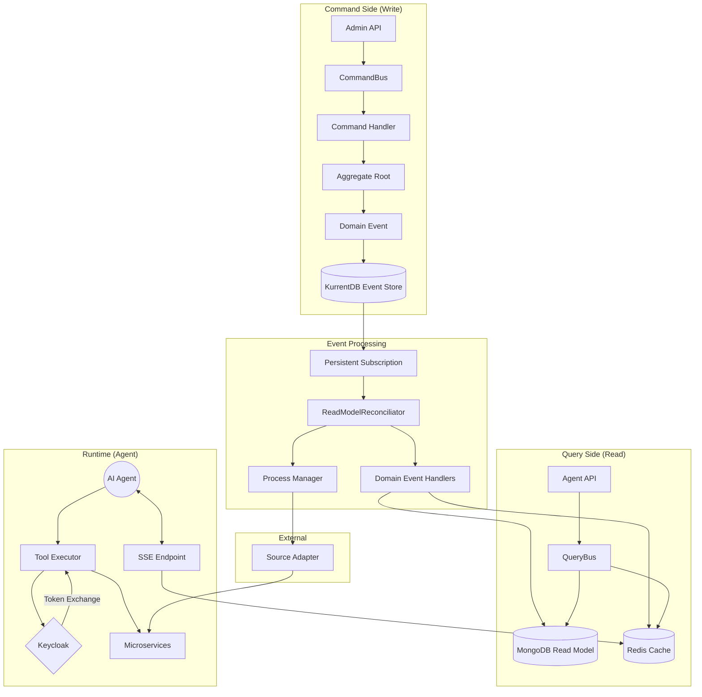

# MCP Tools Provider - Implementation Plan

- **Version:** 2.0
- **Date:** December 4, 2025
- **Status:** Ready for Implementation
- **Related:** See `design-review.md` for detailed architecture recommendations

## 1. Introduction

This document outlines the detailed implementation plan for the **MCP Tools Provider**, a system designed to bridge AI Agents with internal microservices. It expands on the initial design specification by providing concrete module definitions, architectural decisions, and a step-by-step roadmap.

The system follows a **DDD/CQRS/Event-Sourcing** architecture using the **python-neuroglia** framework, utilizing:

- **KurrentDB** (EventStoreDB) as the Event Store (Write Model)
- **MongoDB** as the Read Model (Projections) - using async Motor driver
- **Redis** as the Cache Layer for hot data and real-time notifications

## 2. Architecture Overview

The system is divided into three main concerns: the **Write Side (Command)**, the **Read Side (Query)**, and the **Runtime (Agent Interaction)**.

### 2.1. Database Architecture

| Layer | Technology | Purpose |
|-------|------------|---------|
| **Write Model** | KurrentDB | Event persistence, audit trail, aggregate streams, replay capability |
| **Read Model** | MongoDB | Complex queries, full-text search, aggregations, queryable projections |
| **Cache Layer** | Redis | Resolved tool manifests, session data, SSE pub/sub notifications |

### 2.2. High-Level Diagram



### 2.3. Data Flow

1. **Admin creates UpstreamSource** → Command → Aggregate → `SourceRegisteredEvent` → KurrentDB
2. **ReadModelReconciliator** subscribes to `$ce-tools_provider` → receives events
3. **Projection Handlers** update MongoDB Read Model + Redis Cache
4. **Process Manager** triggers inventory sync → `InventoryIngestedEvent`
5. **Agent connects via SSE** → AccessPolicy evaluation → Tool list from Redis
6. **Agent calls tool** → Token Exchange → Proxy to Upstream

## 3. Technology Stack

| Category | Technology | Notes |
|----------|------------|-------|
| **Language** | Python 3.11+ | Type hints required |
| **Web Framework** | FastAPI | With `classy-fastapi` controllers |
| **DDD/CQRS Framework** | `neuroglia-python` | Already integrated in starter app |
| **Event Store** | KurrentDB | Via `kurrentdbclient` (esdbclient fork) |
| **Read Model** | MongoDB | Via async `motor` driver |
| **Cache** | Redis | For hot data and pub/sub |
| **Authentication** | Keycloak | OIDC + RFC 8693 Token Exchange |
| **HTTP Client** | `httpx` | Async HTTP for upstream calls |
| **Observability** | OpenTelemetry | Traces, metrics via OTLP |

### 3.1. Neuroglia Framework Integration

The project leverages these Neuroglia components (already configured in `main.py`):

```python
# Write Model - Event Sourcing to KurrentDB
ESEventStore.configure(builder, EventStoreOptions("tools_provider", "tools_provider_group"))
DataAccessLayer.WriteModel(
    options=EventSourcingRepositoryOptions(delete_mode=DeleteMode.HARD),
).configure(builder, ["domain.entities"])

# Read Model - MongoDB via Motor
DataAccessLayer.ReadModel(
    database_name="tools_provider",
    repository_type="motor",
    repository_mappings={...},
).configure(builder, ["integration.models", "application.events.domain"])
```

## 4. Module Design

### 4.1. Domain Layer (`src/domain`)

This layer contains the business logic, isolated from infrastructure. **Follows existing Task aggregate patterns.**

#### 4.1.1. Aggregates

Each aggregate follows the `AggregateRoot[TState, TKey]` + `AggregateState[TKey]` pattern from Task:

**`UpstreamSource`** - Manages external system connections and tool inventory

```python
# src/domain/entities/upstream_source.py
class UpstreamSourceState(AggregateState[str]):
    id: str
    name: str
    url: str
    source_type: SourceType  # OPENAPI, WORKFLOW
    auth_config: Optional[AuthConfig]

    # Health tracking
    health_status: HealthStatus  # HEALTHY, DEGRADED, UNHEALTHY
    last_sync_at: Optional[datetime]
    last_sync_error: Optional[str]
    consecutive_failures: int

    # Inventory
    inventory_hash: str
    inventory_count: int

    # Lifecycle
    is_enabled: bool
    created_at: datetime
    updated_at: datetime

class UpstreamSource(AggregateRoot[UpstreamSourceState, str]):
    def register(self, name: str, url: str, source_type: SourceType, auth_config: AuthConfig) -> None
    def update_inventory(self, tools: List[ToolDefinition], new_hash: str) -> None
    def mark_sync_failed(self, error: str) -> None
    def enable(self) -> None
    def disable(self) -> None
```

**`SourceTool`** - Manages individual endpoints/tools from a source (NEW)

```python
# src/domain/entities/source_tool.py
class SourceToolState(AggregateState[str]):
    """State for an individual tool discovered from an upstream source."""
    id: str                          # Stable ID: "{source_id}:{operation_id}" or hash
    source_id: str                   # Reference to parent UpstreamSource
    operation_id: Optional[str]      # OpenAPI operationId (if available)
    name: str                        # Tool name
    path: str                        # API path (e.g., "/api/v1/users")
    method: str                      # HTTP method
    definition: ToolDefinition       # Full normalized definition

    # Lifecycle
    is_enabled: bool                 # Admin can enable/disable individual tools
    is_deprecated: bool              # True if tool no longer in upstream spec
    discovered_at: datetime
    enabled_at: Optional[datetime]
    disabled_at: Optional[datetime]
    updated_at: datetime

class SourceTool(AggregateRoot[SourceToolState, str]):
    """Represents an individual endpoint/tool from an upstream source.

    Lifecycle:
    1. discover() - When tool is found in upstream spec
    2. enable()/disable() - Admin controls availability
    3. deprecate() - When tool no longer exists in spec
    4. update_definition() - When spec changes but tool still exists
    """
    def discover(self, source_id: str, definition: ToolDefinition, operation_id: str) -> None
    def enable(self, enabled_by: str) -> bool
    def disable(self, disabled_by: str, reason: str) -> bool
    def deprecate(self) -> None
    def update_definition(self, definition: ToolDefinition) -> bool
```

**`ToolGroup`** - Curates tools using selectors AND explicit references

```python
# src/domain/entities/tool_group.py
@dataclass(frozen=True)
class ToolGroupMembership:
    """Tracks explicit tool membership in a group."""
    tool_id: str
    added_at: datetime
    added_by: Optional[str]

class ToolGroupState(AggregateState[str]):
    id: str
    name: str
    description: str

    # Pattern-based selection
    selectors: List[ToolSelector]

    # Explicit tool management (NEW)
    explicit_tool_ids: List[ToolGroupMembership]  # Tools explicitly added
    excluded_tool_ids: List[str]                   # Tools excluded even if matched by selector

    is_active: bool
    created_at: datetime
    updated_at: datetime

class ToolGroup(AggregateRoot[ToolGroupState, str]):
    """Curates tools using both patterns and explicit references.

    Tool Resolution Order:
    1. Start with empty set
    2. Add all ENABLED tools matching selectors
    3. Add all explicit_tool_ids
    4. Remove all excluded_tool_ids
    """
    def create(self, name: str, description: str) -> None
    def add_selector(self, selector: ToolSelector) -> None
    def remove_selector(self, selector_id: str) -> None

    # NEW: Explicit tool management
    def add_tool(self, tool_id: str, added_by: str) -> bool
    def remove_tool(self, tool_id: str) -> bool
    def exclude_tool(self, tool_id: str) -> bool
    def include_tool(self, tool_id: str) -> bool  # Remove from exclusions

    def activate(self) -> None
    def deactivate(self) -> None
```

**`AccessPolicy`** - Maps JWT claims to allowed tool groups

```python
# src/domain/entities/access_policy.py
class AccessPolicyState(AggregateState[str]):
    id: str
    name: str
    claim_matcher: ClaimMatcher
    allowed_group_ids: List[str]
    priority: int  # Higher priority policies evaluated first
    is_active: bool
    created_at: datetime
    updated_at: datetime

class AccessPolicy(AggregateRoot[AccessPolicyState, str]):
    def define(self, name: str, matcher: ClaimMatcher, group_ids: List[str]) -> None
    def update_groups(self, group_ids: List[str]) -> None
    def update_matcher(self, matcher: ClaimMatcher) -> None
```

#### 4.1.2. Value Objects (`src/domain/models/`)

```python
# src/domain/models/tool_definition.py
@dataclass(frozen=True)
class ToolDefinition:
    """The normalized recipe for a tool - immutable value object."""
    name: str
    description: str
    input_schema: dict
    execution_profile: ExecutionProfile
    source_path: str  # Original path from OpenAPI
    tags: List[str]
    version: Optional[str]

@dataclass(frozen=True)
class ExecutionProfile:
    """How to execute a tool."""
    mode: ExecutionMode  # SYNC_HTTP, ASYNC_POLL
    method: str
    url_template: str
    headers_template: dict
    body_template: Optional[str]
    required_audience: str
    timeout_seconds: int = 30
    poll_config: Optional[PollConfig] = None

@dataclass(frozen=True)
class ToolSelector:
    """Rules for including tools in a group via pattern matching."""
    id: str
    source_pattern: str = "*"
    name_pattern: str = "*"
    path_pattern: Optional[str] = None
    required_tags: List[str] = field(default_factory=list)

@dataclass(frozen=True)
class ToolGroupMembership:
    """Tracks when/who added a tool explicitly to a group."""
    tool_id: str
    added_at: datetime
    added_by: Optional[str] = None

@dataclass(frozen=True)
class ClaimMatcher:
    """Rules for matching JWT claims."""
    json_path: str  # e.g., "realm_access.roles"
    operator: str   # CONTAINS, EQUALS, MATCHES
    value: str
```

#### 4.1.3. Domain Events (`src/domain/events/`)

Following the `@cloudevent` decorator pattern from Task:

```python
# src/domain/events/upstream_source.py
@cloudevent("source.registered.v1")
@dataclass
class SourceRegisteredDomainEvent(DomainEvent):
    aggregate_id: str
    name: str
    url: str
    source_type: SourceType
    created_at: datetime

@cloudevent("source.inventory.ingested.v1")
@dataclass
class InventoryIngestedDomainEvent(DomainEvent):
    aggregate_id: str
    tools: List[dict]  # Serialized ToolDefinitions
    inventory_hash: str
    tool_count: int
    ingested_at: datetime

@cloudevent("source.sync.failed.v1")
@dataclass
class SourceSyncFailedDomainEvent(DomainEvent):
    aggregate_id: str
    error: str
    attempt: int
    failed_at: datetime

# src/domain/events/source_tool.py
@cloudevent("tool.discovered.v1")
@dataclass
class SourceToolDiscoveredDomainEvent(DomainEvent):
    """Emitted when a tool is discovered during inventory sync."""
    aggregate_id: str  # tool_id = f"{source_id}:{tool_name}"
    source_id: str
    tool_name: str
    definition: dict  # Serialized ToolDefinition
    discovered_at: datetime

@cloudevent("tool.enabled.v1")
@dataclass
class SourceToolEnabledDomainEvent(DomainEvent):
    """Admin enables a tool for potential inclusion in groups."""
    aggregate_id: str
    enabled_by: Optional[str]
    enabled_at: datetime

@cloudevent("tool.disabled.v1")
@dataclass
class SourceToolDisabledDomainEvent(DomainEvent):
    """Admin disables a tool - removes from all groups."""
    aggregate_id: str
    disabled_by: Optional[str]
    reason: Optional[str]
    disabled_at: datetime

@cloudevent("tool.definition.updated.v1")
@dataclass
class SourceToolDefinitionUpdatedDomainEvent(DomainEvent):
    """Tool definition changed during inventory refresh."""
    aggregate_id: str
    old_definition_hash: str
    new_definition: dict
    updated_at: datetime

@cloudevent("tool.deprecated.v1")
@dataclass
class SourceToolDeprecatedDomainEvent(DomainEvent):
    """Tool no longer present in source inventory."""
    aggregate_id: str
    deprecated_at: datetime

# src/domain/events/tool_group.py
@cloudevent("group.created.v1")
@dataclass
class ToolGroupCreatedDomainEvent(DomainEvent):
    aggregate_id: str
    name: str
    description: Optional[str]
    created_at: datetime

@cloudevent("group.tool.added.v1")
@dataclass
class ExplicitToolAddedDomainEvent(DomainEvent):
    """Admin explicitly adds a specific tool to group."""
    aggregate_id: str
    tool_id: str
    added_by: Optional[str]
    added_at: datetime

@cloudevent("group.tool.removed.v1")
@dataclass
class ExplicitToolRemovedDomainEvent(DomainEvent):
    """Admin removes a specific tool from group."""
    aggregate_id: str
    tool_id: str
    removed_by: Optional[str]
    removed_at: datetime

@cloudevent("group.selector.added.v1")
@dataclass
class SelectorAddedDomainEvent(DomainEvent):
    """Pattern-based selector added to group."""
    aggregate_id: str
    selector: dict  # Serialized ToolSelector
    added_at: datetime

# src/domain/events/access_policy.py
@cloudevent("policy.defined.v1")
@dataclass
class AccessPolicyDefinedDomainEvent(DomainEvent):
    aggregate_id: str
    name: str
    matcher: dict  # Serialized ClaimMatcher
    group_ids: List[str]
    defined_at: datetime
```

#### 4.1.4. Enums (`src/domain/enums.py`)

```python
class SourceType(str, Enum):
    OPENAPI = "openapi"
    WORKFLOW = "workflow"

class ExecutionMode(str, Enum):
    SYNC_HTTP = "sync_http"
    ASYNC_POLL = "async_poll"

class HealthStatus(str, Enum):
    UNKNOWN = "unknown"
    HEALTHY = "healthy"
    DEGRADED = "degraded"
    UNHEALTHY = "unhealthy"

class ClaimOperator(str, Enum):
    EQUALS = "equals"
    CONTAINS = "contains"
    MATCHES = "matches"  # Regex
```

### 4.2. Application Layer (`src/application`)

Orchestrates the domain logic and handles use cases. **Follows existing Task command/query patterns.**

#### 4.2.1. Commands & Handlers (`src/application/commands/`)

Each command follows the `CommandHandler[TCommand, OperationResult[TDto]]` pattern:

```python
# src/application/commands/register_source_command.py
@dataclass
class RegisterSourceCommand(Command[OperationResult[SourceDto]]):
    name: str
    url: str
    source_type: str  # "openapi" or "workflow"
    auth_config: Optional[dict] = None
    user_info: Optional[dict] = None

class RegisterSourceCommandHandler(
    CommandHandlerBase,
    CommandHandler[RegisterSourceCommand, OperationResult[SourceDto]]
):
    def __init__(
        self,
        mediator: Mediator,
        mapper: Mapper,
        cloud_event_bus: CloudEventBus,
        cloud_event_publishing_options: CloudEventPublishingOptions,
        source_repository: Repository[UpstreamSource, str],
    ):
        ...

    async def handle_async(self, request: RegisterSourceCommand) -> OperationResult[SourceDto]:
        # Create aggregate, save via repository
        ...
```

**Commands:**

- `RegisterSourceCommand` → Creates UpstreamSource aggregate
- `RefreshInventoryCommand` → Triggers async inventory fetch via SourceAdapter
- `UpdateSourceAuthCommand` → Updates authentication configuration

**SourceTool Commands (NEW):**

- `EnableSourceToolCommand` → Enables a specific tool for inclusion in groups
- `DisableSourceToolCommand` → Disables a tool (removes from all groups)
- `BulkEnableToolsCommand` → Enable multiple tools at once (by source, pattern, or explicit list)
- `BulkDisableToolsCommand` → Disable multiple tools at once

**ToolGroup Commands:**

- `CreateToolGroupCommand` → Creates ToolGroup aggregate
- `AddGroupSelectorCommand` → Adds pattern-based selector to group
- `RemoveGroupSelectorCommand` → Removes selector from group
- `AddExplicitToolCommand` → Adds specific tool_id to group (NEW)
- `RemoveExplicitToolCommand` → Removes specific tool_id from group (NEW)
- `ExcludeToolFromGroupCommand` → Excludes tool even if matched by selector (NEW)

**AccessPolicy Commands:**

- `DefineAccessPolicyCommand` → Creates AccessPolicy aggregate
- `UpdateAccessPolicyCommand` → Modifies policy rules

#### 4.2.2. Queries & Handlers (`src/application/queries/`)

Each query follows the `QueryHandler[TQuery, OperationResult[TResult]]` pattern:

```python
# src/application/queries/get_sources_query.py
@dataclass
class GetSourcesQuery(Query[OperationResult[List[SourceDto]]]):
    include_disabled: bool = False
    user_info: Optional[dict] = None

class GetSourcesQueryHandler(QueryHandler[GetSourcesQuery, OperationResult[List[SourceDto]]]):
    def __init__(self, repository: SourceDtoRepository):
        self._repository = repository

    async def handle_async(self, request: GetSourcesQuery) -> OperationResult[List[SourceDto]]:
        if request.include_disabled:
            sources = await self._repository.get_all_async()
        else:
            sources = await self._repository.get_enabled_async()
        return OperationResult.ok(sources)
```

**Queries:**

- `GetSourcesQuery` → List all sources with health status
- `GetSourceByIdQuery` → Source details with inventory summary

**SourceTool Queries (NEW):**

- `GetSourceToolsQuery` → List all tools for a source (with filters for enabled/disabled)
- `GetToolByIdQuery` → Get specific tool details by tool_id
- `SearchToolsQuery` → Search tools by name, tags, description across all sources

**ToolGroup Queries:**

- `GetToolGroupsQuery` → List all groups with tool counts
- `GetGroupToolsQuery` → Resolved tools for a specific group (pattern + explicit - excluded)
- `GetAgentToolsQuery` → **Critical** - Resolved tools for authenticated agent (uses AccessPolicy)

**AccessPolicy Queries:**

- `GetAccessPoliciesQuery` → List all policies

#### 4.2.3. Domain Event Handlers / Projectors (`src/application/events/domain/`)

Following the Task projection handler pattern for Read Model synchronization:

```python
# src/application/events/domain/source_projection_handlers.py
class SourceRegisteredProjectionHandler(DomainEventHandler[SourceRegisteredDomainEvent]):
    """Projects SourceRegisteredDomainEvent to MongoDB Read Model."""

    def __init__(self, repository: Repository[SourceDto, str]):
        super().__init__()
        self._repository = repository

    async def handle_async(self, event: SourceRegisteredDomainEvent) -> None:
        # Idempotency check
        existing = await self._repository.get_async(event.aggregate_id)
        if existing:
            return

        source_dto = SourceDto(
            id=event.aggregate_id,
            name=event.name,
            url=event.url,
            source_type=event.source_type,
            health_status=HealthStatus.UNKNOWN,
            created_at=event.created_at,
        )
        await self._repository.add_async(source_dto)

class InventoryIngestedProjectionHandler(DomainEventHandler[InventoryIngestedDomainEvent]):
    """Projects inventory to MongoDB and updates Redis cache."""

    def __init__(
        self,
        source_repository: Repository[SourceDto, str],
        tool_repository: Repository[ToolDefinitionDto, str],
        redis: Redis,
    ):
        ...

    async def handle_async(self, event: InventoryIngestedDomainEvent) -> None:
        # 1. Update source status in MongoDB
        source = await self.source_repository.get_async(event.aggregate_id)
        source.health_status = HealthStatus.HEALTHY
        source.last_sync_at = event.ingested_at
        source.inventory_count = event.tool_count
        await self.source_repository.update_async(source)

        # 2. Upsert tools in MongoDB
        for tool_data in event.tools:
            tool = ToolDefinitionDto.from_dict(tool_data)
            tool.source_id = event.aggregate_id
            await self.tool_repository.upsert_async(tool)

        # 3. Recalculate affected group manifests
        await self._recalculate_group_manifests(event.aggregate_id)

        # 4. Publish SSE notification
        await self.redis.publish("events:inventory_updated", event.aggregate_id)
```

#### 4.2.4. Application Services (`src/application/services/`)

**SourceAdapter** - Polymorphic ingestion from external specs:

```python
# src/application/services/source_adapter.py
class SourceAdapter(ABC):
    @abstractmethod
    async def fetch_and_normalize(self, url: str, auth_config: AuthConfig) -> List[ToolDefinition]:
        pass

class OpenAPISourceAdapter(SourceAdapter):
    """Parses OpenAPI 3.x specs into ToolDefinitions."""

    async def fetch_and_normalize(self, url: str, auth_config: AuthConfig) -> List[ToolDefinition]:
        async with httpx.AsyncClient() as client:
            response = await client.get(url, headers=self._build_headers(auth_config))
            spec = response.json()

        tools = []
        for path, methods in spec.get("paths", {}).items():
            for method, operation in methods.items():
                if method in ("get", "post", "put", "delete", "patch"):
                    tools.append(self._operation_to_tool(path, method, operation, spec))
        return tools

class WorkflowSourceAdapter(SourceAdapter):
    """Parses workflow engine definitions (Temporal, n8n, etc.)."""
    ...
```

**CatalogProjector** - Resolves tools to groups using inverted index:

```python
# src/application/services/catalog_projector.py
class CatalogProjector:
    """
    Maintains the group → tools mapping using an inverted index strategy.
    Optimized for incremental updates rather than full recalculation.
    """

    async def recalculate_group_manifest(self, group_id: str) -> None:
        """Recalculate which tools belong to a specific group."""
        group = await self.group_repository.get_async(group_id)
        all_tools = await self.tool_repository.get_all_async()

        matched_tools = []
        for tool in all_tools:
            source = await self.source_repository.get_async(tool.source_id)
            for selector in group.selectors:
                if self._matches(tool, source, selector):
                    matched_tools.append(tool.id)
                    break

        # Store in Redis for fast access
        await self.redis.set(
            f"manifest:group:{group_id}",
            json.dumps(matched_tools),
            ex=3600  # 1 hour TTL, refreshed on events
        )

        # Publish notification
        await self.redis.publish(f"events:group_updated:{group_id}", "REFRESH")
```

### 4.3. Infrastructure Layer (`src/infrastructure`)

Implements interfaces and handles I/O.

#### 4.3.1. Event Store (KurrentDB - Already Configured)

The existing `ESEventStore` from Neuroglia handles event persistence:

```python
# Already configured in main.py
ESEventStore.configure(builder, EventStoreOptions("tools_provider", "tools_provider_group"))
```

Aggregates are automatically persisted via `EventSourcingRepository`.

#### 4.3.2. Read Model Repositories (`src/integration/repositories/`)

Following the existing `MotorTaskDtoRepository` pattern:

```python
# src/integration/repositories/motor_source_dto_repository.py
class MotorSourceDtoRepository(MotorRepository[SourceDto, str], SourceDtoRepository):
    """MongoDB repository for SourceDto read model."""

    async def get_enabled_async(self) -> List[SourceDto]:
        queryable = await self.query_async()
        return await queryable \
            .where(lambda s: s.is_enabled == True) \
            .order_by(lambda s: s.name) \
            .to_list_async()

    async def get_by_health_status_async(self, status: HealthStatus) -> List[SourceDto]:
        queryable = await self.query_async()
        return await queryable \
            .where(lambda s: s.health_status == status) \
            .to_list_async()

# src/integration/repositories/motor_tool_definition_repository.py
class MotorToolDefinitionRepository(MotorRepository[ToolDefinitionDto, str], ToolDefinitionRepository):
    """MongoDB repository for ToolDefinitionDto read model."""

    async def get_by_source_async(self, source_id: str) -> List[ToolDefinitionDto]:
        queryable = await self.query_async()
        return await queryable \
            .where(lambda t: t.source_id == source_id) \
            .to_list_async()

    async def search_by_name_async(self, pattern: str) -> List[ToolDefinitionDto]:
        # Uses MongoDB regex for pattern matching
        return await self.find_async({"name": {"$regex": pattern, "$options": "i"}})
```

#### 4.3.3. Redis Cache (`src/infrastructure/cache/`)

```python
# src/infrastructure/cache/redis_cache.py
class RedisCacheService:
    """Redis operations for caching and pub/sub."""

    def __init__(self, redis_client: Redis):
        self._redis = redis_client

    async def get_group_manifest(self, group_id: str) -> Optional[List[str]]:
        """Get cached tool IDs for a group."""
        data = await self._redis.get(f"manifest:group:{group_id}")
        return json.loads(data) if data else None

    async def set_group_manifest(self, group_id: str, tool_ids: List[str], ttl: int = 3600) -> None:
        """Cache tool IDs for a group."""
        await self._redis.set(f"manifest:group:{group_id}", json.dumps(tool_ids), ex=ttl)

    async def get_agent_access_cache(self, claims_hash: str) -> Optional[Set[str]]:
        """Get cached group IDs for agent claims."""
        data = await self._redis.get(f"access:{claims_hash}")
        return set(json.loads(data)) if data else None

    async def subscribe_to_updates(self, pattern: str):
        """Subscribe to SSE update notifications."""
        pubsub = self._redis.pubsub()
        await pubsub.psubscribe(pattern)
        return pubsub
```

#### 4.3.4. External Adapters (`src/infrastructure/adapters/`)

```python
# src/infrastructure/adapters/keycloak_token_exchanger.py
class KeycloakTokenExchanger:
    """Implements RFC 8693 Token Exchange for upstream authentication."""

    def __init__(self, settings: KeycloakSettings):
        self._token_url = f"{settings.server_url}/realms/{settings.realm}/protocol/openid-connect/token"
        self._client_id = settings.client_id
        self._client_secret = settings.client_secret

    async def exchange_token(self, subject_token: str, target_audience: str) -> str:
        """Exchange agent token for upstream service token."""
        async with httpx.AsyncClient() as client:
            response = await client.post(
                self._token_url,
                data={
                    "grant_type": "urn:ietf:params:oauth:grant-type:token-exchange",
                    "client_id": self._client_id,
                    "client_secret": self._client_secret,
                    "subject_token": subject_token,
                    "subject_token_type": "urn:ietf:params:oauth:token-type:access_token",
                    "audience": target_audience,
                    "requested_token_type": "urn:ietf:params:oauth:token-type:access_token",
                },
            )
            response.raise_for_status()
            return response.json()["access_token"]
```

### 4.4. API Layer (`src/api`)

Exposes functionality via HTTP. **Follows existing controller patterns with `classy-fastapi`.**

#### 4.4.1. Admin Controllers (`src/api/controllers/`)

```python
# src/api/controllers/sources_controller.py
class SourcesController(ControllerBase):
    """Admin API for managing upstream sources."""

    @post("/")
    async def register_source(
        self,
        request: RegisterSourceRequest,
        user: dict = Depends(get_current_user),
    ) -> SourceDto:
        """Register a new upstream source."""
        command = RegisterSourceCommand(
            name=request.name,
            url=request.url,
            source_type=request.source_type,
            auth_config=request.auth_config,
            user_info=user,
        )
        result = await self.mediator.execute_async(command)
        return self.process(result)

    @post("/{source_id}/sync")
    async def trigger_sync(
        self,
        source_id: str,
        force: bool = Query(default=False),
        user: dict = Depends(get_current_user),
    ) -> SyncStatusDto:
        """Trigger inventory sync for a source."""
        command = RefreshInventoryCommand(
            source_id=source_id,
            force=force,
            user_info=user,
        )
        result = await self.mediator.execute_async(command)
        return self.process(result)

    @get("/")
    async def list_sources(
        self,
        include_disabled: bool = Query(default=False),
        user: dict = Depends(get_current_user),
    ) -> List[SourceDto]:
        """List all registered sources."""
        query = GetSourcesQuery(include_disabled=include_disabled, user_info=user)
        result = await self.mediator.execute_async(query)
        return self.process(result)

# Similar controllers for ToolGroupsController and AccessPoliciesController
```

#### 4.4.2. Agent API (`src/api/controllers/`)

```python
# src/api/controllers/agent_controller.py
class AgentController(ControllerBase):
    """API for AI Agents to discover and execute tools."""

    @get("/sse")
    async def sse_endpoint(
        self,
        request: Request,
        token: str = Depends(get_bearer_token),
    ) -> EventSourceResponse:
        """
        Server-Sent Events endpoint for real-time tool discovery.

        Authenticates the agent via JWT, resolves accessible groups,
        and pushes tool_list events when projections change.
        """
        # Validate token and extract claims
        claims = await self.auth_service.validate_token(token)

        # Resolve allowed groups
        allowed_groups = await self.access_resolver.resolve_agent_access(claims)

        async def event_generator():
            # Initial tool list
            tools = await self._get_tools_for_groups(allowed_groups)
            yield {"event": "tool_list", "data": json.dumps(tools)}

            # Subscribe to updates
            pubsub = await self.redis.subscribe_to_updates("events:group_updated:*")
            async for message in pubsub.listen():
                if message["type"] == "pmessage":
                    group_id = message["channel"].split(":")[-1]
                    if group_id in allowed_groups:
                        tools = await self._get_tools_for_groups(allowed_groups)
                        yield {"event": "tool_list", "data": json.dumps(tools)}

            # Heartbeat every 30 seconds
            while True:
                yield {"event": "heartbeat", "data": "{}"}
                await asyncio.sleep(30)

        return EventSourceResponse(event_generator())

    @post("/tools/call")
    async def execute_tool(
        self,
        request: ToolCallRequest,
        token: str = Depends(get_bearer_token),
    ) -> ToolCallResponse:
        """
        Execute a tool on behalf of the agent.

        1. Validates agent has access to the tool
        2. Exchanges agent token for upstream token
        3. Executes the tool (sync or async)
        4. Returns result
        """
        claims = await self.auth_service.validate_token(token)

        # Verify access
        tool = await self.tool_repository.get_async(request.tool_id)
        if not await self._agent_can_access_tool(claims, tool):
            raise HTTPException(status_code=403, detail="Access denied to tool")

        # Token exchange
        upstream_token = await self.token_exchanger.exchange_token(
            token,
            tool.execution_profile.required_audience
        )

        # Execute
        result = await self.tool_executor.execute(
            tool.execution_profile,
            request.arguments,
            upstream_token,
        )

        return ToolCallResponse(
            tool_id=request.tool_id,
            status="completed",
            result=result,
        )
```

#### 4.4.3. Controller Registration

Update `main.py` SubApp configuration:

```python
# In main.py
builder.add_sub_app(
    SubAppConfig(
        path="/api",
        name="api",
        title=f"{app_settings.app_name} API",
        controllers=[
            "api.controllers.tasks_controller",      # Existing
            "api.controllers.sources_controller",    # New
            "api.controllers.groups_controller",     # New
            "api.controllers.policies_controller",   # New
            "api.controllers.agent_controller",      # New
        ],
        docs_url="/docs",
    )
)
```

### 4.5. Integration Layer (`src/integration/models/`)

DTOs for the Read Model, following existing `TaskDto` pattern:

```python
# src/integration/models/source_dto.py
@queryable
@dataclass
class SourceDto(Identifiable[str]):
    id: str
    name: str
    url: str
    source_type: SourceType
    health_status: HealthStatus
    is_enabled: bool
    inventory_count: int = 0
    last_sync_at: Optional[datetime] = None
    last_sync_error: Optional[str] = None
    created_at: Optional[datetime] = None
    updated_at: Optional[datetime] = None

# src/integration/models/tool_definition_dto.py
@queryable
@dataclass
class ToolDefinitionDto(Identifiable[str]):
    id: str
    source_id: str
    name: str
    description: str
    input_schema: dict
    execution_profile: dict  # Serialized ExecutionProfile
    source_path: str
    tags: List[str] = field(default_factory=list)
    version: Optional[str] = None

# src/integration/models/tool_group_dto.py
@queryable
@dataclass
class ToolGroupDto(Identifiable[str]):
    id: str
    name: str
    description: str
    selector_count: int
    tool_count: int  # Denormalized for fast queries
    is_active: bool
    created_at: Optional[datetime] = None
    updated_at: Optional[datetime] = None

# src/integration/models/access_policy_dto.py
@queryable
@dataclass
class AccessPolicyDto(Identifiable[str]):
    id: str
    name: str
    claim_json_path: str
    claim_operator: str
    claim_value: str
    allowed_group_ids: List[str]
    priority: int
    is_active: bool
    created_at: Optional[datetime] = None
```

## 5. Implementation Roadmap

### Phase 1: Domain Foundation (Week 1)

**Goal:** Core aggregates and events working with existing infrastructure.

| Task | Description | Effort |
|------|-------------|--------|
| 1.1 | Create `UpstreamSource` aggregate following Task pattern | 4h |
| 1.2 | Create domain events with `@cloudevent` decorators | 2h |
| 1.3 | Create enums and value objects | 2h |
| 1.4 | Create `SourceDto` and repository interface | 2h |
| 1.5 | Create `MotorSourceDtoRepository` implementation | 2h |
| 1.6 | Create projection handlers for Read Model sync | 3h |
| 1.7 | Register new entities in `main.py` DataAccessLayer | 1h |
| 1.8 | Write unit tests for aggregate behavior | 4h |

**Deliverables:**

- `UpstreamSource` can be created and persisted to KurrentDB
- Events flow through ReadModelReconciliator to MongoDB
- Basic CRUD via commands/queries

### Phase 2: Ingestion & Normalization (Week 2)

**Goal:** Fetch and normalize OpenAPI specs into ToolDefinitions.

| Task | Description | Effort |
|------|-------------|--------|
| 2.1 | Create `ToolDefinition` value object and DTO | 2h |
| 2.2 | Implement `OpenAPISourceAdapter` | 6h |
| 2.3 | Create `RefreshInventoryCommand` and handler | 4h |
| 2.4 | Create `InventoryIngestedProjectionHandler` | 4h |
| 2.5 | Implement `MotorToolDefinitionRepository` | 2h |
| 2.6 | Add Redis caching for tool definitions | 3h |
| 2.7 | Write integration tests with mock OpenAPI spec | 4h |

**Deliverables:**

- Can register a source pointing to an OpenAPI URL
- Inventory sync fetches, parses, and stores tools
- Tools queryable from MongoDB

### Phase 3: Curation & Grouping (Week 3)

**Goal:** ToolGroup aggregate with dynamic selector matching.

| Task | Description | Effort |
|------|-------------|--------|
| 3.1 | Create `ToolGroup` aggregate and events | 4h |
| 3.2 | Create `ToolSelector` value object with matching logic | 4h |
| 3.3 | Implement group commands and handlers | 4h |
| 3.4 | Implement `CatalogProjector` with inverted index | 6h |
| 3.5 | Create group manifest caching in Redis | 3h |
| 3.6 | Create Admin API for sources and groups | 4h |
| 3.7 | Write tests for selector matching | 4h |

**Deliverables:**

- Can create groups with regex selectors
- Group manifests pre-calculated and cached
- Admin UI can manage sources and groups

### Phase 4: Access Control & SSE (Week 4-5)

**Goal:** AccessPolicy aggregate and real-time agent discovery.

| Task | Description | Effort |
|------|-------------|--------|
| 4.1 | Create `AccessPolicy` aggregate and events | 4h |
| 4.2 | Create `ClaimMatcher` with JSONPath evaluation | 4h |
| 4.3 | Implement access resolution with caching | 4h |
| 4.4 | Build SSE endpoint with Redis pub/sub | 8h |
| 4.5 | Implement `GetAgentToolsQuery` | 4h |
| 4.6 | Add connection management and heartbeat | 3h |
| 4.7 | Write E2E tests for SSE flow | 6h |

**Deliverables:**

- Agents can connect via SSE
- Real-time tool list updates on projection changes
- Access policies filter tools per agent

### Phase 5: Tool Execution Proxy (Week 5-6)

**Goal:** Token Exchange and generic tool executor.

| Task | Description | Effort |
|------|-------------|--------|
| 5.1 | Configure Keycloak for Token Exchange | 4h |
| 5.2 | Implement `KeycloakTokenExchanger` | 4h |
| 5.3 | Create `ToolExecutor` for SYNC_HTTP mode | 6h |
| 5.4 | Add ASYNC_POLL mode with exponential backoff | 6h |
| 5.5 | Build `/tools/call` endpoint | 4h |
| 5.6 | Add observability (tracing, metrics) | 4h |
| 5.7 | Write integration tests with mock upstream | 6h |

**Deliverables:**

- Agents can execute tools via proxy
- Token exchange working with Keycloak
- Both sync and async execution modes

### Phase 6: Observability & Hardening (Week 6)

**Goal:** Production readiness.

| Task | Description | Effort |
|------|-------------|--------|
| 6.1 | Add OpenTelemetry traces for proxy calls | 4h |
| 6.2 | Add custom metrics (tool executions, latency) | 3h |
| 6.3 | Implement circuit breaker for upstream calls | 4h |
| 6.4 | Add rate limiting per agent | 4h |
| 6.5 | Load testing with realistic scenarios | 6h |
| 6.6 | Documentation and API reference | 4h |

**Deliverables:**

- Full observability in Grafana/Jaeger
- Resilient to upstream failures
- Performance validated

## 6. File Structure Summary

```
src/
├── domain/
│   ├── entities/
│   │   ├── upstream_source.py     # NEW
│   │   ├── tool_group.py          # NEW
│   │   ├── access_policy.py       # NEW
│   │   └── task.py                # EXISTING
│   ├── events/
│   │   ├── upstream_source.py     # NEW
│   │   ├── tool_group.py          # NEW
│   │   ├── access_policy.py       # NEW
│   │   └── task.py                # EXISTING
│   ├── models/
│   │   ├── tool_definition.py     # NEW (value objects)
│   │   ├── execution_profile.py   # NEW
│   │   ├── tool_selector.py       # NEW
│   │   └── claim_matcher.py       # NEW
│   ├── repositories/
│   │   ├── source_dto_repository.py    # NEW (interface)
│   │   ├── tool_definition_repository.py  # NEW
│   │   └── task_dto_repository.py      # EXISTING
│   └── enums.py                   # UPDATED
│
├── application/
│   ├── commands/
│   │   ├── register_source_command.py      # NEW
│   │   ├── refresh_inventory_command.py    # NEW
│   │   ├── create_tool_group_command.py    # NEW
│   │   ├── define_access_policy_command.py # NEW
│   │   └── ...existing...
│   ├── queries/
│   │   ├── get_sources_query.py       # NEW
│   │   ├── get_agent_tools_query.py   # NEW
│   │   └── ...existing...
│   ├── events/domain/
│   │   ├── source_projection_handlers.py  # NEW
│   │   ├── group_projection_handlers.py   # NEW
│   │   └── ...existing...
│   └── services/
│       ├── source_adapter.py        # NEW
│       ├── catalog_projector.py     # NEW
│       └── ...existing...
│
├── integration/
│   ├── models/
│   │   ├── source_dto.py            # NEW
│   │   ├── tool_definition_dto.py   # NEW
│   │   ├── tool_group_dto.py        # NEW
│   │   ├── access_policy_dto.py     # NEW
│   │   └── task_dto.py              # EXISTING
│   └── repositories/
│       ├── motor_source_dto_repository.py       # NEW
│       ├── motor_tool_definition_repository.py  # NEW
│       └── motor_task_dto_repository.py         # EXISTING
│
├── infrastructure/
│   ├── cache/
│   │   └── redis_cache.py           # NEW
│   └── adapters/
│       └── keycloak_token_exchanger.py  # NEW
│
├── api/controllers/
│   ├── sources_controller.py        # NEW
│   ├── groups_controller.py         # NEW
│   ├── policies_controller.py       # NEW
│   ├── agent_controller.py          # NEW
│   └── tasks_controller.py          # EXISTING
│
└── main.py                          # UPDATED (register new entities)
```

## 7. Risk Mitigation

| Risk | Mitigation |
|------|------------|
| KurrentDB connection issues | Circuit breaker, connection pooling, health checks |
| MongoDB slow queries | Create indexes upfront, use explain() during development |
| Redis cache stampede | Probabilistic early expiration, request coalescing |
| Token exchange timeout | Cache tokens with TTL < expiry, implement fallback |
| SSE connection leaks | Heartbeat timeout, explicit connection cleanup |
| OpenAPI parsing failures | Validate spec version, graceful degradation |

## 8. Success Criteria

- [ ] Can register an OpenAPI source and sync its inventory
- [ ] Can create tool groups with pattern-based selectors
- [ ] Can define access policies mapping claims to groups
- [ ] Agent can connect via SSE and receive tool lists
- [ ] Agent can execute tools with automatic token exchange
- [ ] All operations traced in OpenTelemetry
- [ ] 95th percentile latency < 100ms for tool discovery
- [ ] System handles 1000 concurrent SSE connections

---

_Document updated December 4, 2025 with corrected database architecture and detailed implementation patterns._
