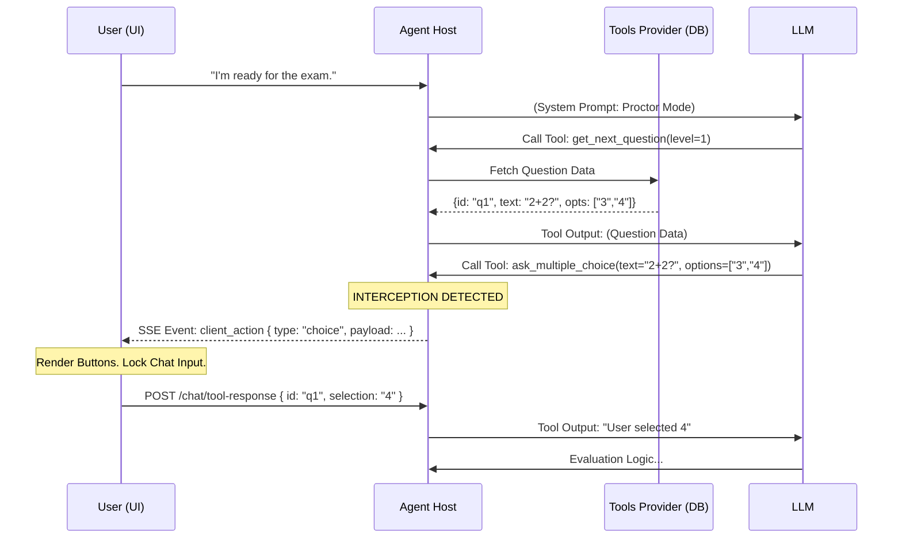

# Design Specification: Proactive Agent & Adaptive Testing Flow

**Status:** `PROPOSED`
**Context:** Shifting from Reactive (User-Driven) to Proactive (Agent-Driven) Architectures.

## 1\. Executive Summary

This design introduces a **"Client Action"** pattern to the `agent-host` and `ui`. This allows the AI Agent to pause the conversation generation loop and command the Frontend to render specific interactive UI components (e.g., Multiple Choice options) while locking standard free-text input.

This capability underpins the **Adaptive Testing** feature, where an Agent acts as a Proctor, iterating through "Learning" (open-ended) and "Validation" (strict choice) phases based on the user's performance.

## 2\. Architecture Overview

### 2.1. The "Client Action" Protocol

Traditionally, Agents execute tools on the _Server_. We introduce a new category of tools that execute on the _Client_.

1. **Agent (LLM)** calls a tool defined with `type: client_action`.
2. **Backend** intercepts this call, suspends the `Task`, and pushes a specific **Server-Sent Event (SSE)** to the client.
3. **Frontend** intercepts the event, renders the UI component, and locks the chat bar.
4. **User** interacts (clicks a button).
5. **Frontend** sends the result back as a specific `ToolOutput` message.
6. **Backend** resumes the Agent's execution loop.

### 2.2. Sequence Diagram (Validation Mode)



-----

## 3\. Backend Specifications (`agent-host`)

### 3.1. Tool Definition Enhancements

We will leverage the existing `tools-provider` to store metadata indicating where a tool executes.

- **Service:** `src/tools-provider`
- **Entity:** `ToolDefinition`
- **Change:** Add `execution_context` field.

<!-- end list -->

```python
# src/tools-provider/domain/models/tool_definition.py

class ToolExecutionContext(str, Enum):
    SERVER = "server"
    CLIENT = "client"

class ToolDefinition(BaseModel):
    # ... existing fields
    execution_context: ToolExecutionContext = ToolExecutionContext.SERVER
    client_component_id: Optional[str] = None # e.g., "radio_group", "rating_scale"
```

### 3.2. SSE Stream Handling

We will introduce a distinct event type to separate text generation from control signals.

- **Service:** `src/agent-host`
- **Controller:** `ChatController` (Streaming Logic)

**Current Stream:**
`data: {"content": "Hello", "type": "content"}`

**New Event Type:**
`event: client_action`
`data: {"component": "radio_group", "props": { ... }, "tool_call_id": "call_123"}`

### 3.3. Conversation State Persistence

To handle browser refreshes during a question, we must persist the "Pending Client Action" state.

- **Service:** `src/agent-host`
- **Entity:** `Conversation`

<!-- end list -->

```python
# src/agent-host/domain/entities/conversation.py

class ConversationState(str, Enum):
    IDLE = "idle"
    GENERATING = "generating"
    AWAITING_CLIENT_ACTION = "awaiting_client_action"

class Conversation(BaseModel):
    # ...
    state: ConversationState
    pending_action: Optional[Dict] = None # Stores the tool call details
```

**Logic:**
If a user loads a conversation where `state == AWAITING_CLIENT_ACTION`, the API must immediately re-emit the `client_action` SSE event upon connection.

-----

## 4\. Frontend Specifications (`ui`)

### 4.1. The "Interactive Card" Renderer

We need a factory to render components based on the `client_action` payload.

- **File:** `src/agent-host/ui/src/scripts/core/message-renderer.js`
- **New Component:** `ClientActionHandler.js`

**Responsibility:**

1. Listen for SSE event `client_action`.
2. Dispatch to specific component (`MultipleChoice`, `FreeTextPrompt`, `CodeEditor`).
3. **Lock** the global `ChatInput` component.

### 4.2. Validation Mode vs. Learning Mode UI

The payload will dictate the UI strictness.

**Payload A: Validation Mode (Strict)**

```json
{
  "component": "multiple_choice",
  "props": {
    "question": "Select the correct pattern.",
    "options": ["A", "B", "C"],
    "allow_bypass": false
  }
}
```

- _UI Behavior:_ Main chat input is **Disabled** (greyed out). User _must_ click a button to proceed.

**Payload B: Learning Mode (Hybrid)**

```json
{
  "component": "open_response_guidance",
  "props": {
    "question": "Explain why you chose A in the previous step?",
    "hints": ["Consider complexity", "Think about latency"],
    "allow_bypass": true
  }
}
```

- _UI Behavior:_ Main chat input is **Enabled**. The component appears above the input bar as a helper/reference card.

-----

## 5\. The "Adaptive Proctor" Logic

This logic resides in the prompts and tool orchestration, not hardcoded in the engine.

### 5.1. The Tools

We need to register these tools in `tools-provider`:

1. **`ask_multiple_choice`** (`client_side`): Presents strict options.
2. **`request_explanation`** (`client_side`): Asks for free text (Learning Mode).
3. **`get_exam_item`** (`server_side`): Fetches content from DB.
4. **`submit_evaluation`** (`server_side`): Saves the result and calculates next difficulty.

### 5.2. Agent System Prompt Strategy

The Agent configuration will look like this:

> **Role:** Adaptive Proctor
> **Instructions:**
>
> 1. Start in **Learning Mode**. Ask the user to explain concepts using `request_explanation`.
> 2. Analyze their understanding. If high confidence, switch to **Validation Mode**.
> 3. In Validation Mode, loop through items using `get_exam_item` and `ask_multiple_choice`.
> 4. **CRITICAL:** You CANNOT accept free text answers during Validation Mode. If the user tries to bypass (via hack), reject it and present the options again.

-----

## 6\. Implementation Plan

### Phase 1: Foundation (Protocol & DB)

1. Modify `tools-provider` model to include `execution_context`.
2. Update `agent-host` to recognize `execution_context=CLIENT`.
3. Implement the `client_action` SSE event emitter in `agent-host`.

### Phase 2: Frontend Mechanics

1. Update `ui` stream handler to parse `event: client_action`.
2. Implement `InputLock` mechanism in `ui-manager.js`.
3. Create the `ChoiceButton` component.

### Phase 3: The Proctor Agent (Content)

1. Seed `tools-provider` with a "Python Basics" Question Bank (MongoDB).
2. Register the `ask_multiple_choice` tool definition.
3. Create the `ProctorAgent` profile with the specific system prompt.

### Phase 4: Hybrid Mode (AI Generation)

1. Update the Agent to use LLM generation for questions when `get_exam_item` returns a "Generate" flag.
2. Implement the "Learning Mode" flow where the input bar is unlocked.
