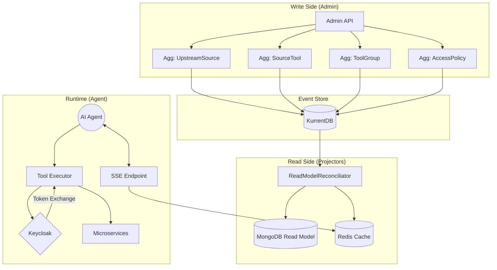

# Project Specification: MCP Tools Provider

**Version:** 2.0 (Aligned with Implementation Plan)
**Date:** December 4, 2025
**Architecture:** Event-Sourced, DDD, CQRS, Async/Reactive
**Identity Provider:** Keycloak (RFC 8693 Token Exchange)

## 1\. Executive Summary

The **MCP Tools Provider** is an intelligent infrastructure layer that sits between AI Agents (Consumers) and the internal Microservices Ecosystem (Upstreams). It does not contain business logic itself; rather, it acts as a dynamic projection engine that:

1. **Discovers** capabilities from OpenAPI endpoints and Workflow Engines.
2. **Normalizes** them into standard MCP Tool definitions.
3. **Curates** them into logical "Tool Groups" with fine-grained endpoint selection.
4. **Secures** execution by exchanging Agent identities for Upstream identities via Keycloak.

-----

## 2\. System Architecture

### 2.1. Database Architecture

| Layer | Technology | Purpose |
|-------|------------|---------|
| **Write Model** | KurrentDB (EventStoreDB) | Event persistence, audit trail, aggregate streams, replay capability |
| **Read Model** | MongoDB | Complex queries, full-text search, aggregations, queryable projections |
| **Cache Layer** | Redis | Resolved tool manifests, access cache, SSE pub/sub notifications |

### 2.2. High-Level Data Flow

1. **Ingestion:** `UpstreamSource` Aggregate → `SourceRegisteredEvent` → KurrentDB → Projectors → MongoDB.
2. **Tool Discovery:** `SourceTool` Aggregate created per endpoint → `ToolDiscoveredEvent` → MongoDB.
3. **Curation:** `ToolGroup` Aggregate → Selectors + Explicit Tools → Projector computes manifests → Redis Cache.
4. **Runtime:** Agent (JWT) → SSE Connection → `AccessPolicy` Check → Tool List from Cache.



-----

## 3\. Domain Design & Code Concepts

### 3.1. Aggregate: `UpstreamSource`

**Responsibility:** Manages the connection to an external system and the lifecycle of its tool inventory.

**Code Concept (Python/Neuroglia Pattern):**

```python
class SourceType(str, Enum):
    OPENAPI = "openapi"
    WORKFLOW = "workflow"

class HealthStatus(str, Enum):
    UNKNOWN = "unknown"
    HEALTHY = "healthy"
    DEGRADED = "degraded"
    UNHEALTHY = "unhealthy"

class UpstreamSourceState(AggregateState[str]):
    """Encapsulates the persisted state for the UpstreamSource aggregate."""
    id: str
    name: str
    url: str
    source_type: SourceType
    auth_config: Optional[AuthConfig]

    # Health tracking
    health_status: HealthStatus
    last_sync_at: Optional[datetime]
    last_sync_error: Optional[str]
    consecutive_failures: int

    # Inventory
    inventory_hash: str
    inventory_count: int

    # Lifecycle
    is_enabled: bool
    created_at: datetime
    updated_at: datetime

class UpstreamSource(AggregateRoot[UpstreamSourceState, str]):
    def __init__(self, name: str, url: str, source_type: SourceType, ...):
        super().__init__()
        self.state.on(
            self.register_event(
                SourceRegisteredDomainEvent(
                    aggregate_id=str(uuid4()),
                    name=name,
                    url=url,
                    source_type=source_type,
                    created_at=datetime.now(timezone.utc),
                )
            )
        )

    def update_inventory(self, tools: List[ToolDefinition], new_hash: str) -> bool:
        """Called after successful spec fetch. Returns True if inventory changed."""
        if self.state.inventory_hash == new_hash:
            return False

        self.state.on(
            self.register_event(
                InventoryIngestedDomainEvent(
                    aggregate_id=self.id(),
                    tools=[t.to_dict() for t in tools],
                    inventory_hash=new_hash,
                    tool_count=len(tools),
                    ingested_at=datetime.now(timezone.utc),
                )
            )
        )
        return True
```

### 3.2. Aggregate: `SourceTool` (Individual Endpoint)

**Responsibility:** Represents a single tool/endpoint discovered from an upstream source, enabling granular admin control.

**Code Concept:**

```python
class ToolStatus(str, Enum):
    ACTIVE = "active"
    DEPRECATED = "deprecated"

class SourceToolState(AggregateState[str]):
    """State for an individual tool discovered from an upstream source."""
    id: str                        # Format: "{source_id}:{operation_id}"
    source_id: str
    tool_name: str
    operation_id: str
    definition: Optional[ToolDefinition]
    definition_hash: str

    # Admin control
    is_enabled: bool               # Default True - admin can disable
    status: ToolStatus             # ACTIVE or DEPRECATED

    # Audit
    discovered_at: datetime
    last_seen_at: datetime
    updated_at: datetime

class SourceTool(AggregateRoot[SourceToolState, str]):
    """Enables admins to enable/disable individual endpoints."""

    def enable(self, enabled_by: str) -> bool: ...
    def disable(self, disabled_by: str, reason: str) -> bool: ...
    def deprecate(self) -> None: ...  # When removed from upstream spec
```

### 3.3. Aggregate: `ToolGroup`

**Responsibility:** Curates tools using BOTH dynamic selectors AND explicit tool references.

**Code Concept:**

```python
@dataclass(frozen=True)
class ToolSelector:
    """A rule to include tools in this group via pattern matching."""
    id: str
    source_pattern: str = "*"      # e.g., "billing-*"
    name_pattern: str = "*"        # e.g., "create_*"
    path_pattern: Optional[str] = None
    required_tags: List[str] = field(default_factory=list)
    excluded_tags: List[str] = field(default_factory=list)

@dataclass
class ToolGroupMembership:
    """Tracks explicit tool membership in a group."""
    tool_id: str
    added_at: datetime
    added_by: Optional[str]

class ToolGroupState(AggregateState[str]):
    id: str
    name: str
    description: str

    # Pattern-based selection
    selectors: List[ToolSelector]

    # Explicit tool management
    explicit_tool_ids: List[ToolGroupMembership]  # Directly added tools
    excluded_tool_ids: List[str]                   # Excluded even if matched by selector

    is_active: bool
    created_at: datetime
    updated_at: datetime

class ToolGroup(AggregateRoot[ToolGroupState, str]):
    """Curates tools using both patterns and explicit references.

    Tool Resolution Order:
    1. Start with empty set
    2. Add all ENABLED tools matching selectors
    3. Add all explicit_tool_ids
    4. Remove all excluded_tool_ids
    """
    def add_selector(self, selector: ToolSelector) -> None: ...
    def remove_selector(self, selector_id: str) -> None: ...
    def add_tool(self, tool_id: str, added_by: str) -> bool: ...
    def remove_tool(self, tool_id: str) -> bool: ...
    def exclude_tool(self, tool_id: str) -> bool: ...
```

### 3.4. Aggregate: `AccessPolicy`

**Responsibility:** Maps JWT Claims to allowed Tool Groups.

**Code Concept:**

```python
class ClaimOperator(str, Enum):
    EQUALS = "equals"
    CONTAINS = "contains"
    MATCHES = "matches"          # Regex
    NOT_EQUALS = "not_equals"
    NOT_CONTAINS = "not_contains"

@dataclass(frozen=True)
class ClaimMatcher:
    """Rule for matching JWT claims using JSONPath-like expressions."""
    claim_path: str              # e.g., "realm_access.roles"
    operator: ClaimOperator
    value: str                   # e.g., "finance_admin"
    case_sensitive: bool = True

class AccessPolicyState(AggregateState[str]):
    id: str
    name: str
    description: Optional[str]
    claim_matchers: List[ClaimMatcher]  # All must match (AND logic)
    allowed_group_ids: List[str]
    priority: int                # Higher = evaluated first
    is_active: bool
    created_at: datetime
    updated_at: datetime

class AccessPolicy(AggregateRoot[AccessPolicyState, str]):
    def define(self, name: str, matchers: List[ClaimMatcher], group_ids: List[str]) -> None:
        self.state.on(
            self.register_event(
                AccessPolicyDefinedDomainEvent(
                    aggregate_id=self.id(),
                    name=name,
                    matchers=[m.to_dict() for m in matchers],
                    group_ids=group_ids,
                    defined_at=datetime.now(timezone.utc),
                )
            )
        )
```

-----

## 4\. Value Objects

### 4.1. ToolDefinition

```python
@dataclass(frozen=True)
class ToolDefinition:
    """The normalized representation of a tool from an upstream source."""
    name: str
    description: str
    input_schema: dict               # JSON Schema for tool arguments
    execution_profile: ExecutionProfile
    source_path: str                 # Original path (e.g., "/api/v1/users")
    tags: List[str] = field(default_factory=list)
    version: Optional[str] = None
    deprecated: bool = False
```

### 4.2. ExecutionProfile

```python
class ExecutionMode(str, Enum):
    SYNC_HTTP = "sync_http"          # Direct request/response
    ASYNC_POLL = "async_poll"        # Trigger + poll for completion

@dataclass(frozen=True)
class ExecutionProfile:
    """How to execute a tool - the 'recipe' for invocation."""
    mode: ExecutionMode
    method: str                      # HTTP method
    url_template: str                # Jinja2 template with {arg} placeholders
    headers_template: Dict[str, str] = field(default_factory=dict)
    body_template: Optional[str] = None
    content_type: str = "application/json"

    # Security
    required_audience: str = ""      # Keycloak client_id for token exchange
    required_scopes: List[str] = field(default_factory=list)

    # Timeouts
    timeout_seconds: int = 30

    # Async polling (only if mode == ASYNC_POLL)
    poll_config: Optional[PollConfig] = None

@dataclass(frozen=True)
class PollConfig:
    """Configuration for async polling execution mode."""
    status_url_template: str
    status_field_path: str           # JSONPath to status field
    completed_values: List[str]
    failed_values: List[str]
    result_field_path: str
    max_poll_attempts: int = 60
    poll_interval_seconds: float = 1.0
    backoff_multiplier: float = 1.5
```

-----

## 5\. Service Layer Code Concepts

### 5.1. The `SourceAdapter` (Polymorphic Ingestion)

This service fetches external definitions and converts them into the `ToolDefinition` format.

```python
class SourceAdapter:
    async def fetch_and_normalize(self, source: UpstreamSourceState) -> List[ToolDefinition]:
        if source.source_type == SourceType.OPENAPI:
            return await self._process_openapi(source.url, source.auth_config)
        elif source.source_type == SourceType.WORKFLOW:
            return await self._process_workflow_engine(source.url, source.auth_config)
```

### 5.2. The `CatalogProjector` (Read Model Builder)

Listens to events and updates **MongoDB (read model)** and **Redis (cache)**.

```python
class CatalogProjector:
    """Projects domain events to MongoDB read model and Redis cache."""

    async def on_inventory_ingested(self, event: InventoryIngestedDomainEvent):
        # 1. Update MongoDB with tool definitions
        for tool_data in event.tools:
            tool = ToolDefinition.from_dict(tool_data)
            await self.mongo.upsert_tool(event.aggregate_id, tool)

        # 2. Recompute affected group manifests
        affected_groups = await self._get_groups_matching_source(event.aggregate_id)
        for group_id in affected_groups:
            manifest = await self._compute_group_manifest(group_id)
            await self.redis.set_group_manifest(group_id, manifest)
            await self.redis.publish(f"events:group_updated:{group_id}", "REFRESH")

    async def _compute_group_manifest(self, group_id: str) -> List[ToolManifestEntry]:
        """Compute tools for a group using selectors + explicit + exclusions."""
        group = await self.mongo.get_group(group_id)
        all_enabled_tools = await self.mongo.get_enabled_tools()

        matched_tools: Set[str] = set()

        # 1. Pattern matching via selectors
        for selector in group.selectors:
            for tool in all_enabled_tools:
                if self._matches_selector(tool, selector):
                    matched_tools.add(tool.id)

        # 2. Add explicit tools
        for membership in group.explicit_tool_ids:
            matched_tools.add(membership.tool_id)

        # 3. Remove exclusions
        for excluded_id in group.excluded_tool_ids:
            matched_tools.discard(excluded_id)

        return [await self._to_manifest_entry(tid) for tid in matched_tools]
```

-----

## 6\. Runtime Layer Code Concepts

### 6.1. Token Exchange (RFC 8693)

Before executing a tool, exchange the Agent's token for an upstream service token.

```python
class KeycloakTokenExchanger:
    """Implements RFC 8693 Token Exchange."""

    def __init__(self, settings: KeycloakSettings, redis_cache: RedisCacheService):
        self._token_url = (
            f"{settings.server_url}/realms/{settings.realm}"
            f"/protocol/openid-connect/token"
        )
        self._client_id = settings.client_id
        self._client_secret = settings.client_secret
        self._cache = redis_cache

    async def exchange_token(
        self,
        subject_token: str,
        target_audience: str,
    ) -> ExchangedToken:
        """Exchange user token for upstream service token with caching."""
        # Check cache first
        cache_key = f"token_exchange:{hash(subject_token)[:16]}:{target_audience}"
        cached = await self._cache.get(cache_key)
        if cached:
            return ExchangedToken.from_cache(cached)

        # Perform exchange
        async with httpx.AsyncClient() as client:
            response = await client.post(
                self._token_url,
                data={
                    "grant_type": "urn:ietf:params:oauth:grant-type:token-exchange",
                    "client_id": self._client_id,
                    "client_secret": self._client_secret,
                    "subject_token": subject_token,
                    "subject_token_type": "urn:ietf:params:oauth:token-type:access_token",
                    "audience": target_audience,
                    "requested_token_type": "urn:ietf:params:oauth:token-type:access_token",
                },
            )
            response.raise_for_status()
            token_data = response.json()

        # Cache with TTL
        exchanged = ExchangedToken(
            access_token=token_data["access_token"],
            expires_at=time.time() + token_data.get("expires_in", 300),
        )
        await self._cache.set(cache_key, exchanged.to_cache(), ttl=min(240, token_data.get("expires_in", 300) - 60))

        return exchanged
```

### 6.2. Tool Executor (The Proxy)

Executes tools on behalf of agents with token exchange and template rendering.

```python
class ToolExecutor:
    """Executes tools by proxying to upstream services."""

    async def execute(
        self,
        tool: ToolManifestEntry,
        arguments: dict,
        agent_token: str,
    ) -> ToolExecutionResult:
        profile = ExecutionProfile.from_dict(tool.execution_profile)

        # 1. Token Exchange
        upstream_token = await self._exchanger.exchange_token(
            agent_token,
            profile.required_audience,
        )

        # 2. Render request from templates
        url = self._render_template(profile.url_template, arguments)
        headers = {
            "Authorization": f"Bearer {upstream_token.access_token}",
            **{k: self._render_template(v, arguments) for k, v in profile.headers_template.items()}
        }
        body = self._render_template(profile.body_template, arguments) if profile.body_template else None

        # 3. Execute based on mode
        if profile.mode == ExecutionMode.SYNC_HTTP:
            response = await self._http.request(
                method=profile.method,
                url=url,
                headers=headers,
                content=body,
                timeout=profile.timeout_seconds,
            )
            return ToolExecutionResult(status="completed", result=response.json())

        elif profile.mode == ExecutionMode.ASYNC_POLL:
            return await self._execute_async_poll(profile, url, headers, body, upstream_token)
```

-----

## 7\. Infrastructure Configuration

### `docker-compose.yml`

```yaml
version: '3.8'
services:
  keycloak:
    image: quay.io/keycloak/keycloak:24.0
    command: start-dev --import-realm --features=token-exchange
    environment:
      - KC_DB=dev-file
      - KC_FEATURES=token-exchange
    volumes:
      - ./deployment/keycloak:/opt/keycloak/data/import
    ports: ["8041:8080"]

  eventstore:
    image: eventstore/eventstore:24.2
    environment:
      - EVENTSTORE_INSECURE=true
      - EVENTSTORE_RUN_PROJECTIONS=All
    ports: ["2113:2113"]

  mongodb:
    image: mongo:7
    ports: ["27017:27017"]

  redis:
    image: redis:alpine
    ports: ["6379:6379"]

  tools-provider:
    build: .
    environment:
      - KEYCLOAK_URL=http://keycloak:8080
      - KEYCLOAK_REALM=tools-provider
      - KEYCLOAK_CLIENT_ID=tools-provider
      - EVENTSTORE_URL=esdb://eventstore:2113?tls=false
      - MONGODB_URL=mongodb://mongodb:27017
      - REDIS_URL=redis://redis:6379
    depends_on: [keycloak, eventstore, mongodb, redis]
    ports: ["8040:8000"]
```

### Key Dependencies

```text
# Framework
neuroglia-python
fastapi
uvicorn
classy-fastapi

# Data Stores
kurrentdbclient      # EventStoreDB client
motor                # Async MongoDB
redis                # Cache & pub/sub

# Runtime
httpx                # Async HTTP client
jinja2               # Template rendering
jsonschema           # Argument validation
python-jose          # JWT handling

# Observability
opentelemetry-api
opentelemetry-sdk
```

-----

## 8\. Implementation Roadmap

1. **Phase 1: Domain Foundation** - UpstreamSource, SourceTool aggregates with events
2. **Phase 2: Ingestion & Normalization** - SourceAdapter, OpenAPI parsing
3. **Phase 3: Curation & Grouping** - ToolGroup aggregate, CatalogProjector
4. **Phase 4: Access Control & SSE** - AccessPolicy, SSE endpoint, real-time updates
5. **Phase 5: Tool Execution** - Token Exchange, ToolExecutor, circuit breakers
6. **Phase 6: Observability** - Tracing, metrics, health checks

See `implementation-plan.md` for detailed task breakdowns and `design-review.md` for architectural decisions.
