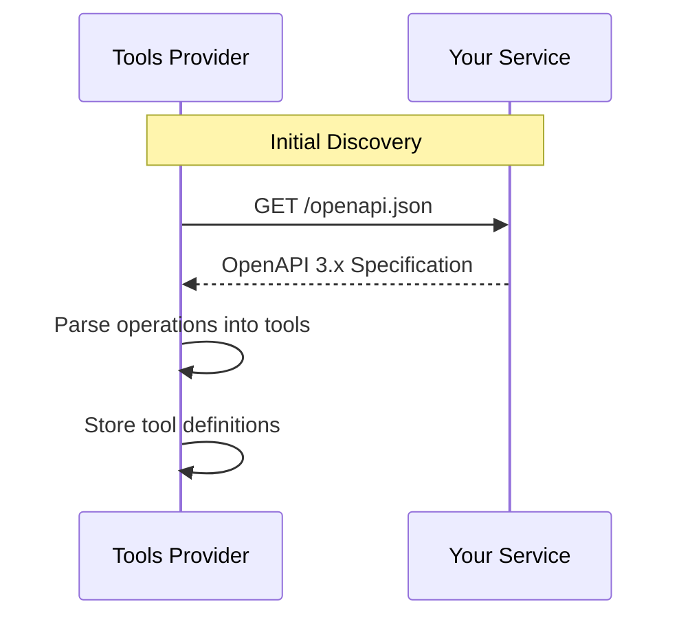
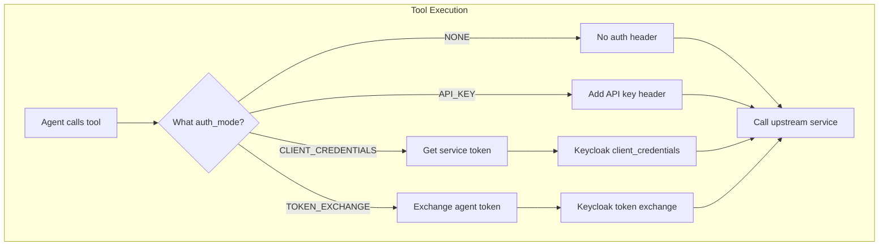
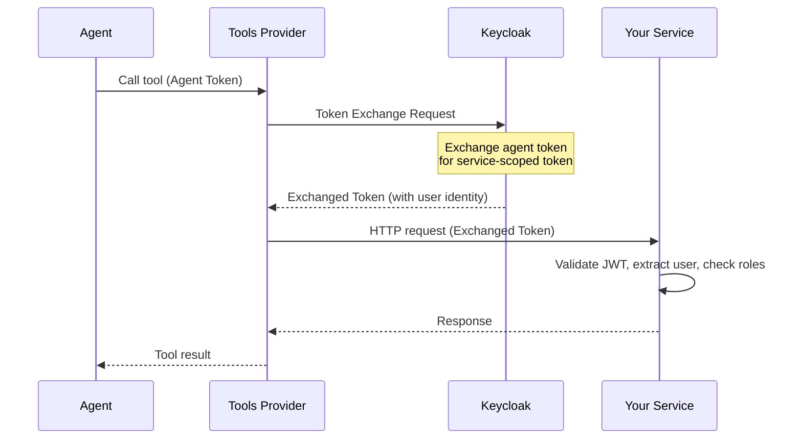

# Upstream Service Integration Specification

**Version:** 1.1.0
**Date:** December 2024
**Status:** Draft (Authentication modes pending implementation)

This specification defines the requirements for backend services to integrate with the MCP Tools Provider, enabling automatic discovery, documentation, and AI agent automation of their API endpoints.

---

## Table of Contents

1. [Overview](#overview)
2. [Architecture](#architecture)
3. [OpenAPI Specification Requirements](#openapi-specification-requirements)
4. [Authentication Modes](#authentication-modes)
   - [Level 0: No Authentication](#level-0-no-authentication)
   - [Level 1: API Key Authentication](#level-1-api-key-authentication)
   - [Level 2: Client Credentials (Service-to-Service)](#level-2-client-credentials-service-to-service)
   - [Level 3: Token Exchange (Identity Delegation)](#level-3-token-exchange-identity-delegation)
5. [Endpoint Documentation Requirements](#endpoint-documentation-requirements)
6. [Request/Response Schema Requirements](#requestresponse-schema-requirements)
7. [Registration Process](#registration-process)
8. [Reference Implementation](#reference-implementation)
9. [Validation Checklist](#validation-checklist)
10. [Troubleshooting](#troubleshooting)
11. [Implementation Status](#implementation-status)

---

## Overview

### Purpose

The MCP Tools Provider discovers and exposes backend service APIs as "tools" that AI agents can invoke on behalf of users. For a backend service to be fully integrated:

1. **Discoverable** - The service must expose a valid OpenAPI 3.x specification
2. **Documented** - Each endpoint must have complete descriptions for AI understanding
3. **Secured** - Authentication configured according to service requirements
4. **Executable** - All API operations must be invocable via standard HTTP methods

### Integration Flow

```
┌─────────────────────┐     ┌─────────────────────┐     ┌─────────────────────┐
│    AI Agent         │────▶│  MCP Tools Provider │────▶│  Your Backend       │
│                     │     │                     │     │    Service          │
│  - Discovers tools  │     │  - Parses OpenAPI   │     │  - Exposes /openapi │
│  - Calls tools      │     │  - Handles auth     │     │  - Validates auth   │
│  - Gets results     │     │  - Proxies requests │     │  - Executes logic   │
└─────────────────────┘     └─────────────────────┘     └─────────────────────┘
```

### Supported Standards

| Standard | Version | Notes |
|----------|---------|-------|
| OpenAPI | 3.0.x, 3.1.x | Swagger 2.0 **NOT** supported |
| OAuth 2.0 | RFC 6749 | Client credentials and authorization code flows |
| Token Exchange | RFC 8693 | For delegated identity (Level 3) |
| JSON Schema | Draft 7 | For parameter validation |

---

## Architecture

### Discovery Mechanism

The Tools Provider periodically fetches and parses your OpenAPI specification to discover available tools:



### Authentication Flow (varies by mode)

The authentication flow depends on the configured `auth_mode` for your source:



---

## OpenAPI Specification Requirements

### Minimum Required Structure

```yaml
openapi: "3.0.3"  # or 3.1.x

info:
  title: "Your Service API"
  version: "1.0.0"
  description: |
    A clear description of what your service does.
    This helps AI agents understand the service's purpose.

servers:
  - url: "http://your-internal-service:8080"
    description: "Internal Docker network (for Tools Provider)"
  - url: "https://api.yourcompany.com"
    description: "External access"

paths:
  # Your API endpoints (see Endpoint Requirements)

components:
  securitySchemes:
    # Security scheme matching your auth_mode (see Authentication Modes)
  schemas:
    # Your data models (see Schema Requirements)

security:
  # Global security requirement (or per-operation)
```

### Critical Requirements

| Requirement | Level | Description |
|-------------|-------|-------------|
| `openapi` version | **REQUIRED** | Must be `3.0.x` or `3.1.x` |
| `info.title` | **REQUIRED** | Service name for tool grouping |
| `info.version` | **REQUIRED** | Used for change detection |
| `info.description` | **REQUIRED** | Service purpose for AI context |
| `servers` | **REQUIRED** | At least one reachable server URL |
| `paths` | **REQUIRED** | At least one operation |
| `components.securitySchemes` | Conditional | Required unless using `auth_mode: none` |

### OpenAPI URL Endpoint

Your service MUST expose the OpenAPI specification at a predictable URL:

```
GET /openapi.json
```

**Requirements:**

- Return `Content-Type: application/json`
- No authentication required (public endpoint)
- Always return current, complete specification

**Alternative URLs (in order of preference):**

1. `/openapi.json` - Preferred
2. `/api/openapi.json`
3. `/swagger.json` - Legacy, not recommended
4. `/docs/openapi.yaml` - YAML format supported

---

## Authentication Modes

The Tools Provider supports **four authentication modes**, from simplest to most complex. Choose the mode that matches your service's security requirements.

### Quick Reference

| Mode | Use Case | User Identity | Complexity |
|------|----------|---------------|------------|
| **Level 0: None** | Public APIs, internal services | ❌ Not available | Simplest |
| **Level 1: API Key** | Third-party APIs, rate-limited services | ❌ Not available | Simple |
| **Level 2: Client Credentials** | Service-to-service, no user context needed | ❌ Not available | Moderate |
| **Level 3: Token Exchange** | User-aware services, RBAC | ✅ Full user identity | Complex |

---

### Level 0: No Authentication

**Use when:** Your service is public or only accessible within a trusted network (e.g., internal microservices behind a gateway).

#### Service Requirements

- No authentication validation required
- Optionally restrict by network/IP

#### OpenAPI Configuration

```yaml
# No security schemes needed
openapi: "3.0.3"
info:
  title: "Public Data API"
  version: "1.0.0"
  description: "Public API with no authentication required"

# No global security - endpoints are public
# security: []  # Explicitly empty or omitted

paths:
  /api/data:
    get:
      operationId: getData
      summary: Get public data
      # No security requirement
      responses:
        '200':
          description: Success
```

#### Registration

```bash
curl -X POST "http://tools-provider:8040/api/v1/sources" \
  -H "Authorization: Bearer $ADMIN_TOKEN" \
  -H "Content-Type: application/json" \
  -d '{
    "name": "Public Data Service",
    "url": "http://public-service:8080",
    "source_type": "openapi",
    "auth_mode": "none"
  }'
```

#### Tools Provider Behavior

- No `Authorization` header is added to requests
- Requests are made directly to the upstream service

---

### Level 1: API Key Authentication

**Use when:** Your service requires a static API key for authentication (common for third-party APIs, rate limiting, or basic access control).

#### Service Requirements

- Validate API key in header or query parameter
- Return 401 for missing/invalid API key

#### OpenAPI Configuration

```yaml
components:
  securitySchemes:
    apiKey:
      type: apiKey
      in: header  # or "query"
      name: X-API-Key  # Header/query parameter name
      description: "API key for service access"

security:
  - apiKey: []

paths:
  /api/data:
    get:
      operationId: getData
      summary: Get data
      # Inherits global security
      responses:
        '200':
          description: Success
        '401':
          description: Invalid or missing API key
```

#### Registration

```bash
curl -X POST "http://tools-provider:8040/api/v1/sources" \
  -H "Authorization: Bearer $ADMIN_TOKEN" \
  -H "Content-Type: application/json" \
  -d '{
    "name": "Third-Party API",
    "url": "https://api.example.com",
    "source_type": "openapi",
    "auth_mode": "api_key",
    "auth_config": {
      "api_key_name": "X-API-Key",  # pragma: allowlist secret
      "api_key_value": "your-secret-api-key",  # pragma: allowlist secret
      "api_key_in": "header"  # pragma: allowlist secret
    }
  }'
```

**Auth Config Fields:**

| Field | Required | Description |
|-------|----------|-------------|
| `api_key_name` | Yes | Name of the header or query parameter |
| `api_key_value` | Yes | The API key value (stored securely) |
| `api_key_in` | Yes | `"header"` or `"query"` |

#### Tools Provider Behavior

- Adds the configured API key to every request
- For `header`: `X-API-Key: your-secret-api-key`
- For `query`: `?X-API-Key=your-secret-api-key`

---

### Level 2: Client Credentials (Service-to-Service)

**Use when:** Your service requires OAuth2 authentication but doesn't need to know the end-user's identity. The Tools Provider authenticates as itself (service account).

There are two variants:

#### Variant A: Tools Provider's Own Credentials

The Tools Provider uses its own service account to authenticate. Your service accepts any valid token from the Keycloak realm.

#### Variant B: Source-Specific Credentials

Each upstream source has its own client credentials. Useful when different services have different access levels.

#### Service Requirements

- Validate JWT tokens from Keycloak
- Check token signature (RS256) via JWKS
- Validate `iss` (issuer) claim
- Optionally validate `aud` (audience) claim
- **No user identity expected** - token is a service account

#### OpenAPI Configuration

```yaml
components:
  securitySchemes:
    oauth2:
      type: oauth2
      flows:
        clientCredentials:
          tokenUrl: "http://keycloak:8080/realms/tools-provider/protocol/openid-connect/token"
          scopes: {}

    bearerAuth:
      type: http
      scheme: bearer
      bearerFormat: JWT
      description: "OAuth2 client credentials token"

security:
  - bearerAuth: []
```

#### Registration (Variant A - Tools Provider's Credentials)

```bash
curl -X POST "http://tools-provider:8040/api/v1/sources" \
  -H "Authorization: Bearer $ADMIN_TOKEN" \
  -H "Content-Type: application/json" \
  -d '{
    "name": "Internal Analytics Service",
    "url": "http://analytics-service:8080",
    "source_type": "openapi",
    "auth_mode": "client_credentials"
  }'
```

The Tools Provider uses its configured service account (`tools-provider-service`) to obtain tokens.

#### Registration (Variant B - Source-Specific Credentials)

```bash
curl -X POST "http://tools-provider:8040/api/v1/sources" \
  -H "Authorization: Bearer $ADMIN_TOKEN" \
  -H "Content-Type: application/json" \
  -d '{
    "name": "Premium Partner API",
    "url": "https://partner-api.example.com",
    "source_type": "openapi",
    "auth_mode": "client_credentials",
    "auth_config": {
      "oauth2_token_url": "http://keycloak:8080/realms/tools-provider/protocol/openid-connect/token",
      "oauth2_client_id": "partner-api-client",
      "oauth2_client_secret": "partner-secret",  # pragma: allowlist secret
      "oauth2_scopes": ["read", "write"]
    }
  }'
```

**Auth Config Fields (Variant B):**

| Field | Required | Description |
|-------|----------|-------------|
| `oauth2_token_url` | Yes | Keycloak token endpoint |
| `oauth2_client_id` | Yes | Client ID for this source |
| `oauth2_client_secret` | Yes | Client secret (stored securely) |
| `oauth2_scopes` | No | Scopes to request (default: none) |

#### Tools Provider Behavior

1. Obtains an access token using OAuth2 client credentials grant
2. Caches the token until near expiration
3. Adds `Authorization: Bearer <token>` to all requests

#### Service Implementation (Python/FastAPI)

```python
from fastapi import Depends, HTTPException, status
from fastapi.security import HTTPBearer, HTTPAuthorizationCredentials
from jose import jwt, JWTError

bearer_scheme = HTTPBearer()

async def validate_service_token(
    credentials: HTTPAuthorizationCredentials = Depends(bearer_scheme)
) -> dict:
    """Validate JWT token (service account - no user identity)."""
    token = credentials.credentials

    try:
        signing_key = get_signing_key(token)  # From JWKS cache

        payload = jwt.decode(
            token,
            signing_key,
            algorithms=["RS256"],
            issuer=f"{KEYCLOAK_URL}/realms/{REALM}",
            # Note: No audience validation required unless you want it
        )

        # This is a service account token - no user identity
        return {
            "client_id": payload.get("azp"),  # Authorized party (client)
            "scope": payload.get("scope", "").split(),
        }
    except JWTError:
        raise HTTPException(
            status_code=status.HTTP_401_UNAUTHORIZED,
            detail="Invalid token"
        )

# Usage - no user roles, just valid token required
@router.get("/api/analytics")
async def get_analytics(
    token_info: dict = Depends(validate_service_token)
):
    # Token is valid, but no user identity available
    return {"data": "..."}
```

---

### Level 3: Token Exchange (Identity Delegation)

**Use when:** Your service needs to know the end-user's identity and apply role-based access control (RBAC). This is the most secure and feature-rich option.

#### How It Works

1. Agent authenticates to Tools Provider with their own credentials
2. Agent calls a tool
3. Tools Provider exchanges the agent's token for a new token scoped to your service
4. Your service receives the exchanged token with full user identity
5. Your service can apply RBAC based on user roles



#### Service Requirements

- Validate JWT tokens from Keycloak
- Validate `aud` (audience) includes your service's client ID
- Extract user identity from token claims
- Implement RBAC based on `realm_access.roles`

#### Keycloak Setup

1. **Create Your Service Client:**
   - Client ID: `your-service-backend` (this becomes the `audience`)
   - Client Protocol: `openid-connect`
   - Client Authentication: `ON`

2. **Enable Token Exchange:**
   - Capability config → Standard Token Exchange: `ON`

3. **Add Audience Mapper:**
   - Client scopes → `your-service-backend-dedicated`
   - Add mapper → Audience
   - Included Client Audience: `your-service-backend`
   - Add to access token: `ON`

4. **Create Audience Client Scope** (for token exchange):
   - Client scopes → Create → `your-service-audience`
   - Add Audience mapper pointing to `your-service-backend`
   - Add this scope to `tools-provider-token-exchange` client

#### OpenAPI Configuration

```yaml
components:
  securitySchemes:
    oauth2:
      type: oauth2
      description: Keycloak OAuth2 with user identity
      flows:
        authorizationCode:
          authorizationUrl: "http://keycloak:8080/realms/tools-provider/protocol/openid-connect/auth"
          tokenUrl: "http://keycloak:8080/realms/tools-provider/protocol/openid-connect/token"
          scopes:
            openid: "OpenID Connect scope"
            profile: "User profile information"
            email: "User email address"

    bearerAuth:
      type: http
      scheme: bearer
      bearerFormat: JWT
      description: "JWT Bearer token with user identity"

security:
  - bearerAuth: []
```

#### Registration

```bash
curl -X POST "http://tools-provider:8040/api/v1/sources" \
  -H "Authorization: Bearer $ADMIN_TOKEN" \
  -H "Content-Type: application/json" \
  -d '{
    "name": "Pizzeria Backend",
    "url": "http://pizzeria:8080",
    "source_type": "openapi",
    "auth_mode": "token_exchange",
    "default_audience": "pizzeria-backend"
  }'
```

**Registration Fields:**

| Field | Required | Description |
|-------|----------|-------------|
| `auth_mode` | Yes | Must be `"token_exchange"` |
| `default_audience` | Yes | Keycloak client ID of your service |

#### Tools Provider Behavior

1. Receives agent's access token with tool call
2. Exchanges agent token for service-scoped token via Keycloak
3. Exchanged token contains:
   - Original user identity (`sub`, `preferred_username`, `email`)
   - User's roles (`realm_access.roles`)
   - Your service as audience (`aud`)
4. Adds `Authorization: Bearer <exchanged_token>` to request

#### Service Implementation (Python/FastAPI)

```python
from fastapi import Depends, HTTPException, status
from fastapi.security import HTTPBearer, HTTPAuthorizationCredentials
from jose import jwt, JWTError
from dataclasses import dataclass

bearer_scheme = HTTPBearer()

@dataclass
class UserInfo:
    """User information extracted from JWT token."""
    sub: str           # User's unique identifier
    username: str      # User's username
    email: str | None  # User's email
    roles: list[str]   # User's realm roles

    def has_role(self, role: str) -> bool:
        return role in self.roles

    def has_any_role(self, roles: list[str]) -> bool:
        return any(r in self.roles for r in roles)

async def get_current_user(
    credentials: HTTPAuthorizationCredentials = Depends(bearer_scheme)
) -> UserInfo:
    """Validate JWT and extract full user identity."""
    token = credentials.credentials

    try:
        signing_key = get_signing_key(token)

        payload = jwt.decode(
            token,
            signing_key,
            algorithms=["RS256"],
            audience="your-service-backend",  # IMPORTANT: Validate audience
            issuer=f"{KEYCLOAK_URL}/realms/{REALM}"
        )

        return UserInfo(
            sub=payload["sub"],
            username=payload.get("preferred_username", ""),
            email=payload.get("email"),
            roles=payload.get("realm_access", {}).get("roles", [])
        )
    except JWTError:
        raise HTTPException(
            status_code=status.HTTP_401_UNAUTHORIZED,
            detail="Invalid authentication token"
        )

def require_roles(*required_roles: str):
    """Dependency factory for role-based access control."""
    async def dependency(user: UserInfo = Depends(get_current_user)):
        if not user.has_any_role(list(required_roles)):
            raise HTTPException(
                status_code=status.HTTP_403_FORBIDDEN,
                detail=f"Requires one of roles: {required_roles}"
            )
        return user
    return dependency

# Usage with RBAC
@router.post("/api/menu")
async def create_menu_item(
    item: MenuItemCreate,
    user: UserInfo = Depends(require_roles("manager", "admin"))
):
    # Only managers and admins can create menu items
    # user.sub, user.username available for audit logging
    ...

@router.get("/api/orders/my")
async def get_my_orders(
    user: UserInfo = Depends(get_current_user)
):
    # Filter orders by user.sub to return only user's orders
    return await get_orders_for_user(user.sub)
```

#### Required Token Claims

| Claim | Type | Description |
|-------|------|-------------|
| `sub` | string | User's unique identifier |
| `preferred_username` | string | User's display name |
| `email` | string | User's email (if available) |
| `realm_access.roles` | array | User's realm-level roles |
| `aud` | string/array | **Must include your service's client ID** |
| `iss` | string | Keycloak realm issuer URL |
| `exp` | number | Token expiration timestamp |

#### Role Mapping Reference

| Keycloak Role | Typical Service Role | Permissions |
|---------------|---------------------|-------------|
| `user` | Customer | Read public data, manage own resources |
| `developer` | Staff/Operator | Process operations, view queues |
| `manager` | Manager | CRUD on managed resources |
| `admin` | Administrator | Full access |

---

## Endpoint Documentation Requirements

### Operation Requirements

Every endpoint MUST include:

```yaml
paths:
  /api/orders:
    post:
      operationId: "createOrder"  # REQUIRED: Unique identifier
      summary: "Create a new order"  # REQUIRED: Brief description
      description: |  # REQUIRED: Detailed description for AI
        Creates a new customer order with the specified items.

        The order will be created in 'pending' status and must be
        paid before it enters the kitchen queue.

        **Business Rules:**
        - At least one item is required
        - All menu items must be available
        - Customer role required
      tags:
        - Orders  # REQUIRED: For grouping tools
      security:
        - bearerAuth: []  # Security requirement (or inherit global)
      parameters:
        # Query/path parameters (see Parameter Requirements)
      requestBody:
        # Request body schema (see Request Body Requirements)
      responses:
        # Response schemas (see Response Requirements)
```

### Operation ID Requirements

The `operationId` becomes the tool name visible to AI agents.

**Format Requirements:**

- Use `camelCase` or `snake_case` consistently
- Be descriptive but concise
- Include the action verb

**Examples:**

| Good ✓ | Bad ✗ | Reason |
|--------|-------|--------|
| `createOrder` | `post_order` | Action verb first |
| `getMenuItems` | `menu` | Include action |
| `updateMenuItem` | `menuItemPut` | Natural language order |
| `startCookingOrder` | `orderCookStart` | Clear action description |

### Description Requirements

Descriptions are critical for AI agent understanding. Include:

1. **What the operation does** (first line)
2. **Business context** (when to use it)
3. **Preconditions** (what must be true before calling)
4. **Side effects** (what changes after calling)
5. **Error conditions** (when it might fail)
6. **Required roles** (if using Level 3 auth)

```yaml
description: |
  Marks an order as ready for pickup or delivery.

  This operation should be called by kitchen staff when food
  preparation is complete. The customer will be notified
  automatically.

  **Preconditions:**
  - Order must be in 'preparing' status
  - Caller must have 'chef' or 'admin' role

  **Side Effects:**
  - Order status changes to 'ready'
  - Customer notification is sent
  - Kitchen queue is updated

  **Error Conditions:**
  - 404: Order not found
  - 400: Order not in 'preparing' status
  - 403: Insufficient permissions
```

### Tags Requirements

Tags group related operations into logical categories:

```yaml
tags:
  - name: Menu
    description: Menu item management operations
  - name: Orders
    description: Customer order operations
  - name: Kitchen
    description: Kitchen staff operations

paths:
  /api/menu:
    get:
      tags: [Menu]  # MUST match a defined tag
```

---

## Request/Response Schema Requirements

### Parameter Requirements

#### Path Parameters

```yaml
parameters:
  - name: order_id
    in: path
    required: true
    description: "The unique identifier of the order"
    schema:
      type: string
      pattern: "^order_[a-f0-9]{8}$"
      example: "order_a1b2c3d4"
```

#### Query Parameters

```yaml
parameters:
  - name: status
    in: query
    required: false
    description: "Filter orders by status"
    schema:
      type: string
      enum: [pending, paid, preparing, ready, completed, cancelled]
      default: pending

  - name: limit
    in: query
    required: false
    description: "Maximum number of results to return"
    schema:
      type: integer
      minimum: 1
      maximum: 100
      default: 20
```

### Request Body Requirements

```yaml
requestBody:
  required: true
  description: "Order creation request"
  content:
    application/json:
      schema:
        $ref: '#/components/schemas/OrderCreate'
      examples:
        simple:
          summary: "Simple order"
          value:
            items:
              - menu_item_id: "menu_0001"
                quantity: 2
        withInstructions:
          summary: "Order with special instructions"
          value:
            items:
              - menu_item_id: "menu_0001"
                quantity: 1
                special_instructions: "No onions please"
            delivery_address: "123 Main St"
```

### Schema Definition Requirements

Define reusable schemas in `components/schemas`:

```yaml
components:
  schemas:
    OrderCreate:
      type: object
      required:
        - items
      properties:
        items:
          type: array
          minItems: 1
          description: "List of items to order"
          items:
            $ref: '#/components/schemas/OrderItemCreate'
        delivery_address:
          type: string
          maxLength: 500
          description: "Delivery address (if delivery order)"
        special_instructions:
          type: string
          maxLength: 1000
          description: "Special instructions for the entire order"

    OrderItemCreate:
      type: object
      required:
        - menu_item_id
        - quantity
      properties:
        menu_item_id:
          type: string
          description: "ID of the menu item to order"
        quantity:
          type: integer
          minimum: 1
          maximum: 99
          description: "Number of this item to order"
        special_instructions:
          type: string
          maxLength: 500
          description: "Special instructions for this item"
```

### Schema Type Requirements

| JSON Schema Type | Required Fields | Notes |
|------------------|-----------------|-------|
| `string` | `type`, `description` | Add `format`, `pattern`, `enum` when applicable |
| `integer` | `type`, `description` | Add `minimum`, `maximum` constraints |
| `number` | `type`, `description` | Add `minimum`, `maximum`, `format` (float/double) |
| `boolean` | `type`, `description` | - |
| `array` | `type`, `items`, `description` | **REQUIRED**: `items` schema |
| `object` | `type`, `properties`, `description` | Add `required` array for required fields |

### Response Requirements

```yaml
responses:
  '200':
    description: "Successful response"
    content:
      application/json:
        schema:
          $ref: '#/components/schemas/Order'
  '201':
    description: "Resource created"
    content:
      application/json:
        schema:
          $ref: '#/components/schemas/Order'
  '400':
    description: "Invalid request"
    content:
      application/json:
        schema:
          $ref: '#/components/schemas/ErrorResponse'
  '401':
    description: "Authentication required"
  '403':
    description: "Insufficient permissions"
  '404':
    description: "Resource not found"
    content:
      application/json:
        schema:
          $ref: '#/components/schemas/ErrorResponse'

components:
  schemas:
    ErrorResponse:
      type: object
      required:
        - detail
      properties:
        detail:
          type: string
          description: "Human-readable error message"
```

---

## Registration Process

### Step 1: Choose Your Authentication Mode

| Your Service Needs | Choose |
|--------------------|--------|
| No authentication | Level 0: `auth_mode: "none"` |
| Static API key | Level 1: `auth_mode: "api_key"` |
| Valid token (no user identity) | Level 2: `auth_mode: "client_credentials"` |
| User identity + RBAC | Level 3: `auth_mode: "token_exchange"` |

### Step 2: Configure Authentication (if needed)

#### For Level 1 (API Key)

- Have your API key ready

#### For Level 2 (Client Credentials)

- **Variant A**: No additional setup (uses Tools Provider's service account)
- **Variant B**: Create a Keycloak client with client credentials enabled

#### For Level 3 (Token Exchange)

1. Create your service client in Keycloak
2. Enable Standard Token Exchange
3. Create audience client scope and mapper
4. Add scope to the token exchange client

### Step 3: Deploy Your Service

Ensure your service:

1. Exposes `/openapi.json` without authentication
2. Implements authentication matching your chosen mode
3. Returns proper HTTP status codes

### Step 4: Register the Source

#### Level 0 (No Auth)

```bash
curl -X POST "http://tools-provider:8040/api/v1/sources" \
  -H "Authorization: Bearer $ADMIN_TOKEN" \
  -H "Content-Type: application/json" \
  -d '{
    "name": "Public Service",
    "url": "http://public-service:8080",
    "source_type": "openapi",
    "auth_mode": "none"
  }'
```

#### Level 1 (API Key)

```bash
curl -X POST "http://tools-provider:8040/api/v1/sources" \
  -H "Authorization: Bearer $ADMIN_TOKEN" \
  -H "Content-Type: application/json" \
  -d '{
    "name": "API Key Service",
    "url": "https://api.example.com",
    "source_type": "openapi",
    "auth_mode": "api_key",
    "auth_config": {
      "api_key_name": "X-API-Key",  # pragma: allowlist secret
      "api_key_value": "secret-key",  # pragma: allowlist secret
      "api_key_in": "header"  # pragma: allowlist secret
    }
  }'
```

#### Level 2 (Client Credentials - Variant A)

```bash
curl -X POST "http://tools-provider:8040/api/v1/sources" \
  -H "Authorization: Bearer $ADMIN_TOKEN" \
  -H "Content-Type: application/json" \
  -d '{
    "name": "Internal Service",
    "url": "http://internal-service:8080",
    "source_type": "openapi",
    "auth_mode": "client_credentials"
  }'
```

#### Level 2 (Client Credentials - Variant B)

```bash
curl -X POST "http://tools-provider:8040/api/v1/sources" \
  -H "Authorization: Bearer $ADMIN_TOKEN" \
  -H "Content-Type: application/json" \
  -d '{
    "name": "Partner Service",
    "url": "https://partner.example.com",
    "source_type": "openapi",
    "auth_mode": "client_credentials",
    "auth_config": {
      "oauth2_token_url": "http://keycloak:8080/realms/tools-provider/protocol/openid-connect/token",
      "oauth2_client_id": "partner-client",
      "oauth2_client_secret": "partner-secret"  # pragma: allowlist secret
    }
  }'
```

#### Level 3 (Token Exchange)

```bash
curl -X POST "http://tools-provider:8040/api/v1/sources" \
  -H "Authorization: Bearer $ADMIN_TOKEN" \
  -H "Content-Type: application/json" \
  -d '{
    "name": "RBAC Service",
    "url": "http://rbac-service:8080",
    "source_type": "openapi",
    "auth_mode": "token_exchange",
    "default_audience": "rbac-service-backend"
  }'
```

### Step 5: Verify Discovery

```bash
curl "http://tools-provider:8040/api/v1/sources/{source_id}/tools" \
  -H "Authorization: Bearer $ADMIN_TOKEN"
```

---

## Reference Implementation

The **Pizzeria Backend** (`upstream-sample`) serves as the reference implementation for **Level 3 (Token Exchange)** authentication with full RBAC.

### Repository Structure

```
upstream-sample/
├── app/
│   ├── main.py              # FastAPI app with OpenAPI config
│   ├── auth/
│   │   └── dependencies.py  # JWT validation and RBAC
│   ├── models/
│   │   └── schemas.py       # Pydantic models
│   └── routers/
│       ├── menu.py          # Menu CRUD operations
│       ├── orders.py        # Order management
│       └── kitchen.py       # Kitchen operations
├── Dockerfile
├── pyproject.toml
└── README.md
```

---

## Validation Checklist

### All Levels

#### OpenAPI Specification

- [ ] OpenAPI version is 3.0.x or 3.1.x
- [ ] `info.title` is set
- [ ] `info.version` is set
- [ ] `info.description` provides service context
- [ ] At least one server URL is defined
- [ ] `/openapi.json` endpoint is publicly accessible

#### Operations

- [ ] Every operation has a unique `operationId`
- [ ] Every operation has a `summary`
- [ ] Every operation has a detailed `description`
- [ ] Every operation has at least one `tag`

#### Parameters

- [ ] All parameters have `description`
- [ ] Required parameters are marked `required: true`
- [ ] Constraints (`minimum`, `maximum`, `pattern`, `enum`) are defined
- [ ] Array schemas include `items` definition

#### Testing

- [ ] Service responds to `GET /openapi.json`
- [ ] Tools Provider can discover all operations

### Level 1 (API Key) Additional

- [ ] API key validation is implemented
- [ ] Missing/invalid key returns 401

### Level 2 (Client Credentials) Additional

- [ ] JWT validation is implemented
- [ ] Token signature verification works
- [ ] Issuer validation is correct

### Level 3 (Token Exchange) Additional

- [ ] Security scheme is defined in OpenAPI
- [ ] Audience validation matches `default_audience`
- [ ] RBAC is enforced based on `realm_access.roles`
- [ ] Invalid tokens return 401
- [ ] Missing roles return 403

---

## Troubleshooting

### Tools Not Discovered

**Symptom:** Source registered but no tools appear

**Check:**

1. OpenAPI spec is accessible: `curl http://your-service/openapi.json`
2. Spec is valid JSON/YAML: Use [Swagger Editor](https://editor.swagger.io/)
3. Operations have supported HTTP methods: GET, POST, PUT, PATCH, DELETE
4. Check Tools Provider logs for parsing errors

### Level 1: API Key Issues

**Symptom:** 401 errors when executing tools

**Check:**

1. `auth_config.api_key_name` matches what your service expects
2. `auth_config.api_key_in` is correct (`header` vs `query`)
3. API key value is correct

### Level 2: Client Credentials Issues

**Symptom:** Token acquisition fails

**Check:**

1. Keycloak is reachable from Tools Provider
2. Client credentials are correct
3. Client has `Service accounts roles` enabled in Keycloak

### Level 3: Token Exchange Issues

**Symptom:** 401/403 errors when tools execute

**Check:**

1. Service client exists in Keycloak with correct Client ID
2. Standard Token Exchange is enabled on both:
   - Token exchange client (`tools-provider-token-exchange`)
   - Your service client (`your-service-backend`)
3. Audience client scope is configured
4. `default_audience` in registration matches client ID

### JWT Validation Fails

**Symptom:** Service returns 401 for valid requests

**Check:**

1. JWKS endpoint is reachable from service
2. Token audience includes your service client ID (Level 3)
3. Token issuer matches expected Keycloak realm URL
4. Token is not expired
5. RS256 algorithm is supported

### RBAC Fails (Level 3)

**Symptom:** Service returns 403 for authorized users

**Check:**

1. User has required role in Keycloak
2. Role is in `realm_access.roles` claim (not client roles)
3. Role name matches exactly (case-sensitive)
4. Token exchange preserves roles (check exchanged token claims)

---

## Implementation Status

> ⚠️ **This section documents required changes to the Tools Provider**

### Current Implementation (v1.0)

The current Tools Provider only supports **Level 3 (Token Exchange)**:

- Always performs token exchange if `default_audience` is set
- Uses agent's token directly if no audience
- Always adds `Authorization: Bearer <token>` header

### Required Changes for v1.1

#### 1. Add `AuthMode` Enum

**File:** `src/domain/enums/source.py`

```python
class AuthMode(str, Enum):
    """Authentication mode for upstream sources."""

    NONE = "none"                      # No authentication
    API_KEY = "api_key"                # Static API key  # pragma: allowlist secret
    CLIENT_CREDENTIALS = "client_credentials"  # Service-to-service OAuth2
    TOKEN_EXCHANGE = "token_exchange"  # Identity delegation (current behavior)  # pragma: allowlist secret
```

#### 2. Extend `UpstreamSourceState` with `auth_mode`

**File:** `src/domain/entities/upstream_source.py`

```python
class UpstreamSourceState(AggregateState[str]):
    # ... existing fields ...
    auth_mode: AuthMode  # NEW: Authentication mode for this source

    def __init__(self) -> None:
        super().__init__()
        # ... existing initialization ...
        self.auth_mode = AuthMode.TOKEN_EXCHANGE  # Default for backward compatibility
```

#### 3. Update `SourceRegisteredDomainEvent`

**File:** `src/domain/events/upstream_source.py`

```python
@cloudevent("source.registered.v1")
@dataclass
class SourceRegisteredDomainEvent(DomainEvent):
    # ... existing fields ...
    auth_mode: AuthMode = AuthMode.TOKEN_EXCHANGE  # NEW
```

#### 4. Add Client Credentials Token Service

**File:** `src/infrastructure/adapters/oauth2_client.py` (NEW FILE)

```python
"""OAuth2 Client Credentials Token Service.

Handles acquiring tokens using the client credentials grant for
service-to-service authentication (Level 2).
"""

import asyncio
import logging
from dataclasses import dataclass
from datetime import UTC, datetime, timedelta

import httpx

logger = logging.getLogger(__name__)


@dataclass
class ClientCredentialsToken:
    """Cached client credentials token."""
    access_token: str
    expires_at: datetime
    scope: str | None = None

    def is_expired(self, buffer_seconds: int = 60) -> bool:
        """Check if token is expired or will expire soon."""
        threshold = datetime.now(UTC) + timedelta(seconds=buffer_seconds)
        return self.expires_at <= threshold


class OAuth2ClientCredentialsService:
    """Service for acquiring OAuth2 client credentials tokens.

    Features:
    - Token caching with automatic refresh
    - Support for Tools Provider's service account (default)
    - Support for source-specific credentials
    """

    def __init__(
        self,
        default_token_url: str,
        default_client_id: str,
        default_client_secret: str,
        http_timeout: float = 10.0,
        cache_buffer_seconds: int = 60,
    ):
        self._default_token_url = default_token_url
        self._default_client_id = default_client_id
        self._default_client_secret = default_client_secret
        self._http_timeout = http_timeout
        self._cache_buffer = cache_buffer_seconds

        # Token cache: keyed by (token_url, client_id)
        self._cache: dict[tuple[str, str], ClientCredentialsToken] = {}
        self._lock = asyncio.Lock()

    async def get_token(
        self,
        token_url: str | None = None,
        client_id: str | None = None,
        client_secret: str | None = None,
        scopes: list[str] | None = None,
    ) -> str:
        """Get a client credentials token.

        If no credentials provided, uses the default (Tools Provider's service account).

        Args:
            token_url: OAuth2 token endpoint (default: configured default)
            client_id: Client ID (default: configured default)
            client_secret: Client secret (default: configured default)
            scopes: Scopes to request (default: none)

        Returns:
            Access token string
        """
        # Use defaults if not specified
        effective_url = token_url or self._default_token_url
        effective_client_id = client_id or self._default_client_id
        effective_client_secret = client_secret or self._default_client_secret

        cache_key = (effective_url, effective_client_id)

        async with self._lock:
            # Check cache
            cached = self._cache.get(cache_key)
            if cached and not cached.is_expired(self._cache_buffer):
                logger.debug(f"Client credentials cache hit for {effective_client_id}")
                return cached.access_token

            # Acquire new token
            logger.info(f"Acquiring client credentials token for {effective_client_id}")
            token = await self._acquire_token(
                token_url=effective_url,
                client_id=effective_client_id,
                client_secret=effective_client_secret,
                scopes=scopes,
            )

            # Cache it
            self._cache[cache_key] = token
            return token.access_token

    async def _acquire_token(
        self,
        token_url: str,
        client_id: str,
        client_secret: str,
        scopes: list[str] | None = None,
    ) -> ClientCredentialsToken:
        """Acquire a new token from the OAuth2 server."""
        data = {
            "grant_type": "client_credentials",
            "client_id": client_id,
            "client_secret": client_secret,
        }
        if scopes:
            data["scope"] = " ".join(scopes)

        async with httpx.AsyncClient(timeout=self._http_timeout) as client:
            response = await client.post(
                token_url,
                data=data,
                headers={"Content-Type": "application/x-www-form-urlencoded"},
            )

            if response.status_code != 200:
                error_data = response.json() if response.content else {}
                raise RuntimeError(
                    f"Client credentials token acquisition failed: "
                    f"{error_data.get('error', 'unknown')} - "
                    f"{error_data.get('error_description', response.text)}"
                )

            token_data = response.json()
            expires_in = token_data.get("expires_in", 300)

            return ClientCredentialsToken(
                access_token=token_data["access_token"],
                expires_at=datetime.now(UTC) + timedelta(seconds=expires_in),
                scope=token_data.get("scope"),
            )
```

#### 5. Modify `ToolExecutor` for Multi-Mode Auth

**File:** `src/application/services/tool_executor.py`

Key changes:

```python
class ToolExecutor:
    def __init__(
        self,
        token_exchanger: KeycloakTokenExchanger,
        client_credentials_service: OAuth2ClientCredentialsService,  # NEW
        # ... existing params ...
    ):
        self._token_exchanger = token_exchanger
        self._client_credentials_service = client_credentials_service  # NEW
        # ...

    async def execute(
        self,
        tool_id: str,
        definition: ToolDefinition,
        arguments: dict[str, Any],
        agent_token: str,
        source_id: str | None = None,
        auth_mode: AuthMode = AuthMode.TOKEN_EXCHANGE,  # NEW
        auth_config: AuthConfig | None = None,  # NEW
        default_audience: str | None = None,  # NEW (moved from profile)
        validate_schema: bool | None = None,
    ) -> ToolExecutionResult:
        # ... validation ...

        # Step 2: Get upstream token based on auth_mode
        upstream_token = await self._get_upstream_token(
            agent_token=agent_token,
            auth_mode=auth_mode,
            auth_config=auth_config,
            default_audience=default_audience,
        )

        # Step 3: Execute with appropriate headers
        # ... rest of execution ...

    async def _get_upstream_token(
        self,
        agent_token: str,
        auth_mode: AuthMode,
        auth_config: AuthConfig | None,
        default_audience: str | None,
    ) -> str | None:
        """Get token for upstream service based on auth_mode."""

        if auth_mode == AuthMode.NONE:
            return None

        elif auth_mode == AuthMode.API_KEY:
            return None  # API key handled in headers

        elif auth_mode == AuthMode.CLIENT_CREDENTIALS:
            if auth_config and auth_config.oauth2_client_id:
                # Source-specific credentials
                return await self._client_credentials_service.get_token(
                    token_url=auth_config.oauth2_token_url,
                    client_id=auth_config.oauth2_client_id,
                    client_secret=auth_config.oauth2_client_secret,
                    scopes=auth_config.oauth2_scopes,
                )
            else:
                # Tools Provider's service account
                return await self._client_credentials_service.get_token()

        elif auth_mode == AuthMode.TOKEN_EXCHANGE:
            if not default_audience:
                return agent_token  # Pass through
            result = await self._token_exchanger.exchange_token(
                subject_token=agent_token,
                audience=default_audience,
            )
            return result.access_token

        return None

    def _render_headers(
        self,
        headers_template: dict[str, str],
        arguments: dict[str, Any],
        upstream_token: str | None,
        auth_mode: AuthMode,
        auth_config: AuthConfig | None,
    ) -> dict[str, str]:
        """Render headers based on auth_mode."""
        headers: dict[str, str] = {}

        # Add authentication based on mode
        if auth_mode == AuthMode.NONE:
            pass  # No auth header

        elif auth_mode == AuthMode.API_KEY and auth_config:
            if auth_config.api_key_in == "header" and auth_config.api_key_name:  # pragma: allowlist secret
                headers[auth_config.api_key_name] = auth_config.api_key_value or ""  # pragma: allowlist secret
            # Query params handled in URL rendering

        elif upstream_token:  # CLIENT_CREDENTIALS or TOKEN_EXCHANGE
            headers["Authorization"] = f"Bearer {upstream_token}"

        # Render template headers (don't override auth headers)
        for key, template in headers_template.items():
            key_lower = key.lower()
            if key_lower == "authorization":
                continue
            if auth_config and auth_config.api_key_name and key_lower == auth_config.api_key_name.lower():  # pragma: allowlist secret
                continue
            headers[key] = self._render_template(template, arguments, f"header:{key}")

        return headers
```

#### 6. Update Registration API

**File:** `src/application/commands/register_source_command.py`

Accept `auth_mode` in the command and validate configuration:

```python
@dataclass
class RegisterSourceCommand(Command[OperationResult[SourceDto]]):
    name: str
    url: str
    source_type: SourceType
    auth_mode: AuthMode = AuthMode.TOKEN_EXCHANGE  # NEW
    auth_config: dict | None = None
    default_audience: str | None = None
    # ... other fields ...
```

#### 7. Update `ExecuteToolCommand` Handler

**File:** `src/application/commands/execute_tool_command.py`

Pass `auth_mode` and `auth_config` from source to executor:

```python
async def handle_async(self, command: ExecuteToolCommand) -> OperationResult[ToolExecutionResultDto]:
    # Load source to get auth_mode and auth_config
    source = await self.source_repository.get_async(tool.state.source_id)

    result = await self.tool_executor.execute(
        tool_id=command.tool_id,
        definition=tool.state.manifest,
        arguments=command.arguments,
        agent_token=command.agent_token,
        source_id=tool.state.source_id,
        auth_mode=source.state.auth_mode,  # NEW
        auth_config=source.state.auth_config,  # NEW
        default_audience=source.state.default_audience,  # NEW
    )
```

#### 8. Configuration for Tools Provider Service Account

**File:** `src/application/settings.py`

```python
class Settings(BaseSettings):
    # ... existing settings ...

    # Service account for client_credentials mode (Level 2 Variant A)
    SERVICE_ACCOUNT_TOKEN_URL: str = ""
    SERVICE_ACCOUNT_CLIENT_ID: str = "tools-provider-service"
    SERVICE_ACCOUNT_CLIENT_SECRET: str = ""
```

### Migration Path

For existing sources (without `auth_mode`):

1. If `default_audience` is set → `auth_mode = TOKEN_EXCHANGE`
2. If `default_audience` is empty → `auth_mode = TOKEN_EXCHANGE` (pass-through)

This ensures backward compatibility with existing deployments.

### Testing Checklist

- [ ] Level 0: Requests made without any auth header
- [ ] Level 1: API key added to header/query correctly
- [ ] Level 2A: Tools Provider service account token used
- [ ] Level 2B: Source-specific client credentials used
- [ ] Level 3: Token exchange works as before
- [ ] Migration: Existing sources continue to work

---

## Document History

| Version | Date | Changes |
|---------|------|---------|
| 1.0.0 | December 2024 | Initial release (Token Exchange only) |
| 1.1.0 | December 2024 | Added authentication modes (Levels 0-3), documented required implementation changes |

---

**Contact:** For questions about this specification, contact the Tools Provider team.
