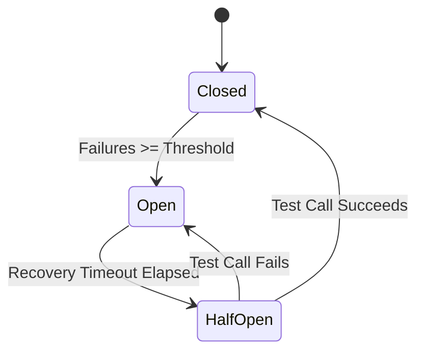

# Circuit Breaker Guide

This guide explains the circuit breaker pattern used in Tools Provider to protect against cascading failures when communicating with external services.

## Overview

Circuit breakers act as automatic safety switches that "trip" when a service is failing, preventing the system from repeatedly attempting operations that are likely to fail. This protects both the Tools Provider and the failing service from overload.



## Circuit Breaker Types

Tools Provider uses two types of circuit breakers:

### 1. Token Exchange Circuit Breaker

Protects Keycloak token exchange operations (RFC 8693). When Keycloak is unavailable or misconfigured, this circuit breaker prevents repeated failed token exchange attempts.

**Triggers:**

- Keycloak server unavailable
- Invalid token exchange configuration
- Network connectivity issues

### 2. Tool Execution Circuit Breakers

Per-source circuit breakers that protect upstream API calls. Each registered source has its own circuit breaker, allowing failures in one upstream service to not affect others.

**Triggers:**

- Upstream API unavailable
- Consistent HTTP 5xx errors
- Network timeouts

## Circuit Breaker States

| State | Description | Behavior |
|-------|-------------|----------|
| **Closed** | Normal operation | Requests flow through normally |
| **Open** | Circuit tripped | Requests rejected immediately with error |
| **Half-Open** | Recovery testing | Limited test requests allowed to check if service recovered |

## Configuration

Configure circuit breakers via environment variables:

```env
# Number of consecutive failures before circuit opens
CIRCUIT_BREAKER_FAILURE_THRESHOLD=5

# Seconds to wait before attempting recovery
CIRCUIT_BREAKER_RECOVERY_TIMEOUT=30.0
```

## Monitoring Circuit Breakers

### Via Admin API

Get current circuit breaker states:

```bash
curl -X GET "http://localhost:8040/api/admin/circuit-breakers" \
  -H "Authorization: Bearer $TOKEN"
```

Response:

```json
{
  "token_exchange": {
    "state": "closed",
    "failure_count": 0,
    "last_failure_time": null
  },
  "tool_execution": {
    "source-uuid-1": {
      "state": "open",
      "failure_count": 5,
      "last_failure_time": 1702044123.456
    }
  }
}
```

### Via Health Endpoint

Check token exchange health specifically:

```bash
curl -X GET "http://localhost:8040/api/admin/health/token-exchange" \
  -H "Authorization: Bearer $TOKEN"
```

### Via Metrics

OpenTelemetry metrics are emitted for circuit breaker events:

| Metric | Description |
|--------|-------------|
| `tools_provider.circuit_breaker.opens` | Counter of circuit breaker activations |
| `tools_provider.circuit_breaker.state` | Current state (0=closed, 1=open) |

### Via CloudEvents

Circuit breaker state changes emit CloudEvents that can be consumed for monitoring and alerting:

| Event Type | Description |
|------------|-------------|
| `circuit_breaker.opened.v1` | Circuit breaker opened (started rejecting requests) |
| `circuit_breaker.closed.v1` | Circuit breaker closed (normal operation resumed) |
| `circuit_breaker.half_opened.v1` | Circuit breaker entered half-open state for recovery testing |

**Event Payload Example (opened):**

```json
{
  "specversion": "1.0",
  "type": "tools-provider.circuit_breaker.opened.v1",
  "source": "tools-provider",
  "subject": "keycloak",
  "data": {
    "circuit_id": "keycloak",
    "circuit_type": "token_exchange",
    "source_id": null,
    "failure_count": 5,
    "failure_threshold": 5,
    "last_failure_time": "2024-12-08T10:30:00Z",
    "reason": "failure_threshold_reached"
  }
}
```

**Event Payload Example (closed - manual reset):**

```json
{
  "specversion": "1.0",
  "type": "tools-provider.circuit_breaker.closed.v1",
  "source": "tools-provider",
  "subject": "source:pizza-api",
  "data": {
    "circuit_id": "source:pizza-api",
    "circuit_type": "tool_execution",
    "source_id": "pizza-api",
    "reason": "manual_reset",
    "closed_at": "2024-12-08T10:35:00Z",
    "was_manual": true,
    "closed_by": "admin@example.com"
  }
}
```

**Transition Reasons:**

- `failure_threshold_reached` - Too many consecutive failures
- `test_call_failed` - Half-open test call failed, circuit reopened
- `test_call_succeeded` - Half-open test call succeeded, circuit closed automatically
- `manual_reset` - Admin manually reset the circuit

### Via Admin UI

Navigate to the **Admin** tab in the web interface to view circuit breaker states visually. The UI shows:

- Color-coded status badges (green=closed, red=open, yellow=half-open)
- Failure counts and last failure timestamps
- One-click reset buttons for open circuits
- Token exchange health information

## Resetting Circuit Breakers

!!! warning "Important"
    Only reset a circuit breaker after you've verified the underlying issue has been resolved. If the problem persists, the circuit will open again.

### Via Admin API

Reset token exchange circuit breaker:

```bash
curl -X POST "http://localhost:8040/api/admin/circuit-breakers/reset" \
  -H "Authorization: Bearer $TOKEN" \
  -H "Content-Type: application/json" \
  -d '{"type": "token_exchange"}'
```

Reset a specific tool execution circuit breaker:

```bash
curl -X POST "http://localhost:8040/api/admin/circuit-breakers/reset" \
  -H "Authorization: Bearer $TOKEN" \
  -H "Content-Type: application/json" \
  -d '{"type": "tool_execution", "key": "source-uuid-1"}'
```

Reset all tool execution circuit breakers:

```bash
curl -X POST "http://localhost:8040/api/admin/circuit-breakers/reset" \
  -H "Authorization: Bearer $TOKEN" \
  -H "Content-Type: application/json" \
  -d '{"type": "tool_execution", "key": "all"}'
```

### Via Service Restart

Restarting the Tools Provider service also resets all circuit breakers:

```bash
docker compose restart app
```

## Troubleshooting

### Token Exchange Circuit Breaker Opens

**Symptoms:**

- Tool calls fail with "circuit breaker is open"
- Logs show "Circuit breaker opened after N failures"

**Diagnosis:**

1. Check if Keycloak is healthy:

   ```bash
   curl http://localhost:8041/health/ready
   ```

2. Verify token exchange configuration:

   ```bash
   # Test token exchange manually
   curl -X POST "http://localhost:8041/realms/tools-provider/protocol/openid-connect/token" \
     -d "grant_type=urn:ietf:params:oauth:grant-type:token-exchange" \
     -d "client_id=tools-provider-token-exchange" \
     -d "client_secret=$CLIENT_SECRET" \
     -d "subject_token=$AGENT_TOKEN" \
     -d "subject_token_type=urn:ietf:params:oauth:token-type:access_token" \
     -d "audience=pizzeria-backend"
   ```

3. Check Keycloak logs for errors:

   ```bash
   docker logs tools-provider-keycloak 2>&1 | tail -50
   ```

**Resolution:**

1. Fix the underlying Keycloak issue
2. Wait for recovery timeout (default 30s) OR manually reset the circuit breaker
3. Verify the fix by testing token exchange again

### Tool Execution Circuit Breaker Opens

**Symptoms:**

- Specific tools fail with "circuit breaker is open"
- Other sources continue to work normally

**Diagnosis:**

1. Identify the affected source from the error message or API:

   ```bash
   curl -X GET "http://localhost:8040/api/admin/circuit-breakers" \
     -H "Authorization: Bearer $TOKEN"
   ```

2. Check the upstream service health:

   ```bash
   curl -I https://upstream-service.example.com/health
   ```

3. Review Tools Provider logs for the specific source

**Resolution:**

1. Verify the upstream service is healthy and responding
2. Check network connectivity from Tools Provider to the upstream
3. Reset the circuit breaker once the service is confirmed healthy

## Best Practices

1. **Don't immediately reset** - Wait for the recovery timeout to allow automatic recovery testing

2. **Investigate root cause** - Before resetting, understand why the circuit opened

3. **Monitor after reset** - Watch logs and metrics after resetting to ensure the issue is truly resolved

4. **Tune thresholds** - Adjust `CIRCUIT_BREAKER_FAILURE_THRESHOLD` and `CIRCUIT_BREAKER_RECOVERY_TIMEOUT` based on your service's reliability requirements

5. **Set up alerts** - Configure alerts on `tools_provider.circuit_breaker.opens` metric to be notified of circuit breaker activations

## For Developers

### Circuit Breaker Implementation

The circuit breaker is implemented in `src/infrastructure/adapters/keycloak_token_exchanger.py`:

```python
@dataclass
class CircuitBreaker:
    failure_threshold: int = 5
    recovery_timeout: float = 30.0
    half_open_max_calls: int = 3

    async def call(self, func, *args, **kwargs):
        # Check state and either execute or reject
        ...

    async def reset(self):
        # Manually reset to closed state
        ...
```

### Adding Circuit Breakers to New Services

When integrating a new external service:

1. Create a circuit breaker instance per service/endpoint
2. Wrap external calls with `circuit.call()`
3. Expose state via `get_state()` for monitoring
4. Implement `reset()` for admin control

```python
circuit = CircuitBreaker(
    failure_threshold=settings.circuit_breaker_failure_threshold,
    recovery_timeout=settings.circuit_breaker_recovery_timeout,
)

async def call_external_service():
    return await circuit.call(http_client.get, url)
```
