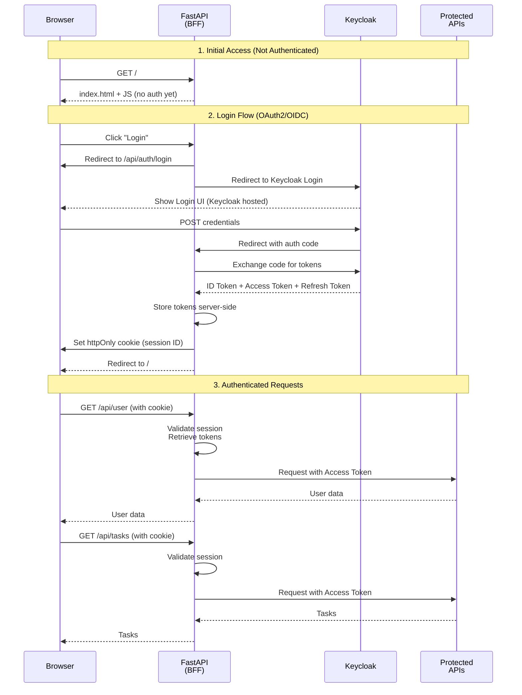

# Authentication Architecture: OAuth2/OIDC with Keycloak

**Date**: November 7, 2025
**Context**: Static SPA + FastAPI backend + Keycloak IDP
**Deployment**: Docker Compose (dev) + Kubernetes with Istio + OAuth2-Proxy (prod)

---

## 🎯 Your Question

> Should the static UI handle the OIDC flow or should the backend do it?
> I'd rather avoid having the JWT leak into the UI (and avoid XSRF right?) and use a cookie.

**Answer**: **Backend should handle OIDC flow with httpOnly cookies** ✅

This is the correct and secure approach for your use case.

---

## 🏗️ Recommended Architecture

### Option 1: Backend Proxy Pattern (BFF) ⭐ **RECOMMENDED**



**Key Points**:

- ✅ Tokens never exposed to browser JavaScript
- ✅ httpOnly cookies prevent XSS attacks
- ✅ CSRF protection via SameSite cookies + CSRF tokens
- ✅ Backend acts as BFF (Backend for Frontend)
- ✅ Works with both Keycloak and OAuth2-Proxy

---

## 📋 Detailed Comparison

### Current Approach (JWT in Browser) ❌

**How it works**:

```javascript
// Browser receives JWT
const response = await fetch('/api/auth/login', {
    method: 'POST',
    body: JSON.stringify({ username, password })
});
const { token } = await response.json();
localStorage.setItem('token', token);  // ❌ Vulnerable

// Use in requests
fetch('/api/tasks', {
    headers: { 'Authorization': `Bearer ${token}` }
});
```

**Problems**:

- ❌ JWT accessible to JavaScript (XSS risk)
- ❌ Stored in localStorage (persistent XSS)
- ❌ No protection if malicious script injected
- ❌ JWT in memory can be stolen
- ❌ Hard to rotate/revoke tokens
- ❌ Doesn't work with OAuth2-Proxy pattern

---

### Recommended Approach (httpOnly Cookies) ✅

**How it works**:

```python
# Backend (FastAPI)
@app.get("/api/auth/login")
async def login(request: Request):
    # Redirect to Keycloak
    return RedirectResponse(
        f"{KEYCLOAK_URL}/auth?"
        f"client_id={CLIENT_ID}&"
        f"redirect_uri={CALLBACK_URL}&"
        f"response_type=code"
    )

@app.get("/api/auth/callback")
async def callback(code: str, response: Response):
    # Exchange code for tokens
    tokens = await exchange_code_for_tokens(code)

    # Store in server-side session
    session_id = create_session(tokens)

    # Set httpOnly cookie
    response.set_cookie(
        key="session_id",
        value=session_id,
        httponly=True,      # ✅ Not accessible to JS
        secure=True,        # ✅ HTTPS only
        samesite="lax",     # ✅ CSRF protection
        max_age=3600
    )
    return RedirectResponse("/")

@app.get("/api/user")
async def get_user(session_id: str = Cookie()):
    # Validate session
    tokens = get_session_tokens(session_id)
    if not tokens:
        raise HTTPException(401)

    # Use access token
    user_info = await keycloak.get_user_info(tokens['access_token'])
    return user_info
```

**JavaScript** (Browser):

```javascript
// No token handling needed!
// Browser automatically sends cookie

async function getUser() {
    const response = await fetch('/api/user', {
        credentials: 'include'  // Send cookies
    });
    return response.json();
}

// Check if logged in
async function checkAuth() {
    try {
        const user = await fetch('/api/user', {
            credentials: 'include'
        });
        return user.ok;
    } catch {
        return false;
    }
}
```

**Benefits**:

- ✅ Tokens never exposed to JavaScript
- ✅ httpOnly prevents XSS attacks
- ✅ SameSite prevents CSRF
- ✅ Secure flag ensures HTTPS
- ✅ Session management on backend
- ✅ Easy token rotation/revocation
- ✅ Compatible with OAuth2-Proxy

---

## 🔐 Security Comparison

| Security Aspect | JWT in Browser | httpOnly Cookie |
|-----------------|----------------|-----------------|
| **XSS Protection** | ❌ Vulnerable | ✅ Protected |
| **CSRF Protection** | ✅ Not vulnerable | ✅ With SameSite + token |
| **Token Storage** | ❌ localStorage/sessionStorage | ✅ Server-side only |
| **Token Rotation** | ❌ Complex | ✅ Simple |
| **Revocation** | ❌ Hard | ✅ Easy |
| **Audit Trail** | ❌ Limited | ✅ Full server logs |
| **OWASP Compliance** | ❌ Discouraged | ✅ Recommended |

---

## 🚀 Implementation Plan

### Phase 1: Backend Session Management

**Add Dependencies**:

```toml
# pyproject.toml
[tool.poetry.dependencies]
python-keycloak = "^3.9.0"
itsdangerous = "^2.1.2"  # For secure session signing
redis = "^5.0.1"  # Optional: For distributed sessions
```

**Session Store**:

```python
# src/infrastructure/session_store.py
from typing import Dict, Optional
from datetime import datetime, timedelta
import secrets

class InMemorySessionStore:
    """Simple in-memory session store for development."""

    def __init__(self):
        self._sessions: Dict[str, Dict] = {}

    def create_session(self, tokens: Dict, user_info: Dict) -> str:
        session_id = secrets.token_urlsafe(32)
        self._sessions[session_id] = {
            'tokens': tokens,
            'user_info': user_info,
            'created_at': datetime.utcnow(),
            'expires_at': datetime.utcnow() + timedelta(hours=1)
        }
        return session_id

    def get_session(self, session_id: str) -> Optional[Dict]:
        session = self._sessions.get(session_id)
        if session and session['expires_at'] > datetime.utcnow():
            return session
        return None

    def delete_session(self, session_id: str):
        self._sessions.pop(session_id, None)

    def refresh_session(self, session_id: str, new_tokens: Dict):
        if session_id in self._sessions:
            self._sessions[session_id]['tokens'] = new_tokens
            self._sessions[session_id]['expires_at'] = datetime.utcnow() + timedelta(hours=1)
```

### Phase 2: OAuth2/OIDC Flow

**Auth Controller** (update existing):

```python
# src/api/controllers/auth_controller.py
from keycloak import KeycloakOpenID
from fastapi import Cookie, Response
from fastapi.responses import RedirectResponse

class AuthController(ControllerBase):
    def __init__(self, service_provider, mapper, mediator):
        super().__init__(service_provider, mapper, mediator)

        self.keycloak = KeycloakOpenID(
            server_url=settings.KEYCLOAK_URL,
            client_id=settings.KEYCLOAK_CLIENT_ID,
            realm_name=settings.KEYCLOAK_REALM,
            client_secret_key=settings.KEYCLOAK_CLIENT_SECRET
        )

        self.session_store = service_provider.get_required_service(SessionStore)

    @get("/login")
    async def login(self):
        """Initiate OAuth2 flow - redirect to Keycloak."""
        auth_url = self.keycloak.auth_url(
            redirect_uri=f"{settings.APP_URL}/api/auth/callback",
            scope="openid profile email",
            state=secrets.token_urlsafe(16)
        )
        return RedirectResponse(auth_url)

    @get("/callback")
    async def callback(
        self,
        code: str,
        state: str,
        response: Response
    ):
        """Handle OAuth2 callback from Keycloak."""
        # Exchange code for tokens
        tokens = self.keycloak.token(
            grant_type="authorization_code",
            code=code,
            redirect_uri=f"{settings.APP_URL}/api/auth/callback"
        )

        # Get user info
        user_info = self.keycloak.userinfo(tokens['access_token'])

        # Create session
        session_id = self.session_store.create_session(tokens, user_info)

        # Set httpOnly cookie
        response.set_cookie(
            key="session_id",
            value=session_id,
            httponly=True,
            secure=settings.ENVIRONMENT == "production",
            samesite="lax",
            max_age=3600,
            path="/"
        )

        # Redirect to app
        return RedirectResponse("/")

    @get("/logout")
    async def logout(
        self,
        response: Response,
        session_id: Optional[str] = Cookie(None)
    ):
        """Logout user and clear session."""
        if session_id:
            self.session_store.delete_session(session_id)

        response.delete_cookie("session_id")

        # Redirect to Keycloak logout
        logout_url = self.keycloak.logout_url(
            redirect_uri=f"{settings.APP_URL}/"
        )
        return RedirectResponse(logout_url)

    @get("/user")
    async def get_current_user(
        self,
        session_id: Optional[str] = Cookie(None)
    ):
        """Get current user info from session."""
        if not session_id:
            raise HTTPException(401, "Not authenticated")

        session = self.session_store.get_session(session_id)
        if not session:
            raise HTTPException(401, "Session expired")

        return session['user_info']
```

### Phase 3: Middleware for Token Management

**Auth Middleware**:

```python
# src/api/middleware/auth_middleware.py
from starlette.middleware.base import BaseHTTPMiddleware
from starlette.requests import Request

class AuthMiddleware(BaseHTTPMiddleware):
    def __init__(self, app, session_store: SessionStore):
        super().__init__(app)
        self.session_store = session_store

    async def dispatch(self, request: Request, call_next):
        # Skip auth for public routes
        if request.url.path in ["/", "/api/auth/login", "/api/auth/callback"]:
            return await call_next(request)

        # Get session from cookie
        session_id = request.cookies.get("session_id")
        if not session_id:
            return JSONResponse({"detail": "Not authenticated"}, status_code=401)

        # Validate session
        session = self.session_store.get_session(session_id)
        if not session:
            return JSONResponse({"detail": "Session expired"}, status_code=401)

        # Attach tokens to request state
        request.state.tokens = session['tokens']
        request.state.user = session['user_info']

        response = await call_next(request)
        return response
```

### Phase 4: Frontend Updates

**Remove JWT Handling**:

```javascript
// src/ui/src/scripts/auth.js

export async function checkAuth() {
    try {
        const response = await fetch('/api/auth/user', {
            credentials: 'include'  // Send cookies
        });
        if (response.ok) {
            return await response.json();
        }
        return null;
    } catch {
        return null;
    }
}

export function login() {
    // Just redirect to backend login
    window.location.href = '/api/auth/login';
}

export function logout() {
    // Redirect to backend logout
    window.location.href = '/api/auth/logout';
}

// On page load
window.addEventListener('DOMContentLoaded', async () => {
    const user = await checkAuth();
    if (user) {
        // Show authenticated UI
        document.getElementById('user-info').textContent = `Hello, ${user.name}`;
        document.getElementById('logout-btn').style.display = 'block';
        document.getElementById('login-form').style.display = 'none';
    } else {
        // Show login button
        document.getElementById('login-form').style.display = 'block';
    }
});
```

---

## 🎭 Login UI: Native vs Keycloak

### Option A: Keycloak Hosted Login ⭐ **RECOMMENDED**

**How it works**:

1. User clicks "Login" → Redirect to Keycloak
2. Keycloak shows its login UI
3. User enters credentials
4. Keycloak redirects back with auth code
5. Backend exchanges code for tokens

**Pros**:

- ✅ Centralized authentication UI
- ✅ Supports SSO across apps
- ✅ Built-in MFA, password reset, etc.
- ✅ Consistent branding across organization
- ✅ No credential handling in your app
- ✅ Supports social logins (Google, GitHub, etc.)

**Cons**:

- ⚠️ User leaves your app temporarily
- ⚠️ Need to customize Keycloak theme for branding

**Implementation**:

```html
<!-- Simple button in your app -->
<button onclick="window.location.href='/api/auth/login'">
    Login with Keycloak
</button>
```

---

### Option B: Native Login Form

**How it works**:

1. User enters credentials in your app
2. Backend calls Keycloak API with username/password
3. Backend gets tokens from Keycloak
4. Backend creates session + cookie

**Pros**:

- ✅ User stays in your app
- ✅ Full control over UI/UX
- ✅ Custom branding

**Cons**:

- ❌ Your app handles credentials (security responsibility)
- ❌ No SSO support
- ❌ No social logins
- ❌ Need to implement password reset, MFA, etc.
- ❌ Not recommended by OAuth2 specs

**Only use if**: You have specific UX requirements and understand the security implications.

---

## 🌐 Deployment Scenarios

### Scenario 1: Docker Compose (Development)

**docker-compose.yml**:

```yaml
services:
  app:
    environment:
      - KEYCLOAK_URL=http://keycloak:8080
      - KEYCLOAK_REALM=system-designer
      - KEYCLOAK_CLIENT_ID=system-designer-app
      - KEYCLOAK_CLIENT_SECRET=your-secret
      - APP_URL=http://localhost:8020
      - SESSION_SECRET=dev-secret-key
```

**Flow**: FastAPI handles OAuth2 flow directly with Keycloak.

---

### Scenario 2: Kubernetes + Istio + OAuth2-Proxy

**Architecture**:

```
Internet → Ingress → OAuth2-Proxy → FastAPI → Keycloak
                ↓
            Sets Cookie
```

**OAuth2-Proxy Config**:

```yaml
# oauth2-proxy.yaml
apiVersion: v1
kind: ConfigMap
metadata:
  name: oauth2-proxy
data:
  oauth2-proxy.cfg: |
    provider = "keycloak-oidc"
    oidc_issuer_url = "https://keycloak.example.com/realms/system-designer"
    redirect_url = "https://app.example.com/oauth2/callback"
    upstreams = ["http://fastapi-service:8000"]
    cookie_name = "_oauth2_proxy"
    cookie_secret = "your-cookie-secret"
    cookie_secure = true
    cookie_httponly = true
    pass_access_token = true
    pass_authorization_header = true
```

**FastAPI Middleware**:

```python
# Extract user from OAuth2-Proxy headers
class OAuth2ProxyMiddleware(BaseHTTPMiddleware):
    async def dispatch(self, request: Request, call_next):
        # OAuth2-Proxy sets these headers
        email = request.headers.get("X-Forwarded-Email")
        user = request.headers.get("X-Forwarded-User")
        access_token = request.headers.get("X-Forwarded-Access-Token")

        if email:
            request.state.user = {"email": email, "name": user}
            request.state.access_token = access_token

        return await call_next(request)
```

**Benefits**:

- OAuth2-Proxy handles authentication
- FastAPI just reads headers
- Works across multiple services
- Centralized auth at ingress level

---

## 📊 Recommendation Summary

### For Your Use Case

| Aspect | Recommendation |
|--------|---------------|
| **OAuth Flow** | Backend handles (BFF pattern) ✅ |
| **Token Storage** | Server-side session ✅ |
| **Browser Storage** | httpOnly cookie only ✅ |
| **Login UI** | Keycloak hosted ✅ |
| **CSRF Protection** | SameSite=Lax + CSRF token ✅ |
| **Token Rotation** | Backend handles automatically ✅ |
| **Docker Compose** | FastAPI → Keycloak direct ✅ |
| **Kubernetes** | OAuth2-Proxy → FastAPI ✅ |

---

## 🚦 Next Steps

1. **Implement session store** (in-memory for dev, Redis for prod)
2. **Update AuthController** for OAuth2/OIDC flow
3. **Add auth middleware** for token management
4. **Remove JWT handling from frontend**
5. **Configure Keycloak client** with redirect URIs
6. **Test OAuth flow** in Docker Compose
7. **Deploy with OAuth2-Proxy** in Kubernetes

---

## 📚 References

- [OWASP Token Storage Cheat Sheet](https://cheatsheetseries.owasp.org/cheatsheets/JSON_Web_Token_for_Java_Cheat_Sheet.html#token-storage-on-client-side)
- [OAuth 2.0 for Browser-Based Apps (RFC)](https://datatracker.ietf.org/doc/html/draft-ietf-oauth-browser-based-apps)
- [FastAPI Security Best Practices](https://fastapi.tiangolo.com/tutorial/security/)
- [Keycloak OAuth2 Documentation](https://www.keycloak.org/docs/latest/securing_apps/)
- [OAuth2-Proxy Documentation](https://oauth2-proxy.github.io/oauth2-proxy/)

---

Would you like me to implement this architecture step by step?
