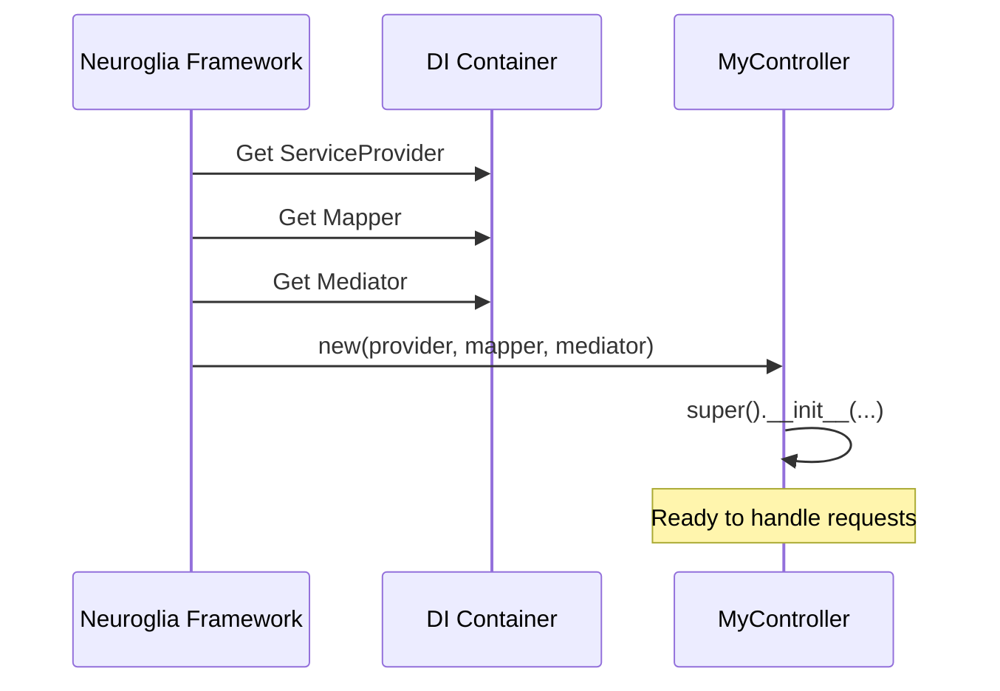
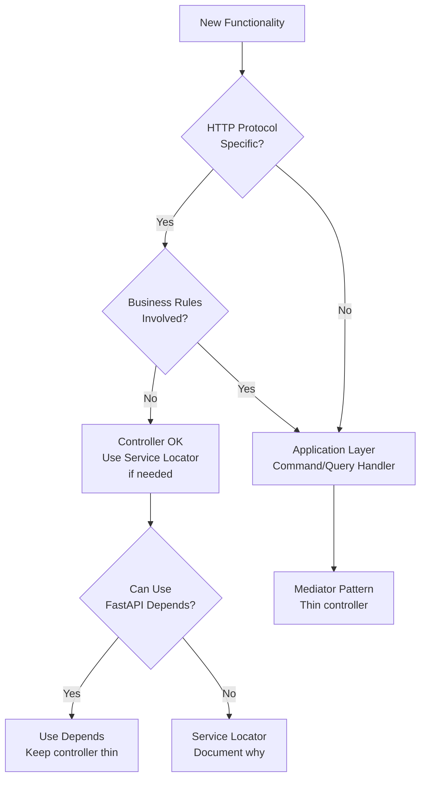

# Controller Dependencies in Neuroglia Framework

## Executive Summary

This document analyzes the proper handling of dependencies in Neuroglia framework controllers, examining the Service Locator pattern vs. thin controller design, and provides guidance on when each approach is appropriate.

**Key Finding**: Controllers in Neuroglia should generally remain thin and delegate business logic to the application layer. The Service Locator pattern (manually retrieving services from `service_provider`) should be used sparingly and primarily for infrastructure concerns that cannot be elegantly handled through the Mediator pattern.

---

## Table of Contents

1. [Neuroglia's Controller Philosophy](#neuroglias-controller-philosophy)
2. [The Three Standard Dependencies](#the-three-standard-dependencies)
3. [Service Locator Pattern](#service-locator-pattern)
4. [When to Use Service Locator](#when-to-use-service-locator)
5. [Case Study: AuthController](#case-study-authcontroller)
6. [Best Practices](#best-practices)
7. [Architecture Recommendations](#architecture-recommendations)

---

## Neuroglia's Controller Philosophy

### Clean Architecture & CQRS

Neuroglia is built on Clean Architecture and CQRS principles:

```
┌─────────────────────────────────────────────┐
│          Presentation Layer                  │
│  (Controllers - thin HTTP handlers)          │
├─────────────────────────────────────────────┤
│          Application Layer                   │
│  (Commands/Queries + Handlers)               │
│  (Business Logic & Orchestration)            │
├─────────────────────────────────────────────┤
│          Domain Layer                        │
│  (Entities, Value Objects, Rules)            │
├─────────────────────────────────────────────┤
│          Infrastructure Layer                │
│  (Repositories, External Services)           │
└─────────────────────────────────────────────┘
```

### Controllers Should Be Thin

Controllers in Neuroglia are designed to:

1. **Receive HTTP requests** - Parse input, validate structure
2. **Delegate to Mediator** - Send Commands/Queries to application layer
3. **Return HTTP responses** - Transform results into HTTP format

Controllers should **NOT**:

- ❌ Contain business logic
- ❌ Directly access repositories
- ❌ Perform complex orchestration
- ❌ Manage transactions

---

## The Three Standard Dependencies

### Framework-Provided Parameters

Neuroglia's controller instantiation mechanism provides exactly three dependencies:

```python
class MyController(ControllerBase):
    def __init__(
        self,
        service_provider: ServiceProviderBase,  # DI container
        mapper: Mapper,                         # Object mapping
        mediator: Mediator                      # CQRS mediator
    ):
        super().__init__(service_provider, mapper, mediator)
```

### Why Only Three?

This design is intentional:

1. **Uniformity**: All controllers have the same signature
2. **Simplicity**: Framework handles instantiation automatically
3. **Decoupling**: Controllers don't know about specific services
4. **Mediator Pattern**: Business logic accessed through `mediator`

### How It Works



---

## Service Locator Pattern

### What Is Service Locator?

The Service Locator pattern retrieves dependencies from a central registry (service provider) at runtime rather than receiving them through constructor injection.

### Implementation in Neuroglia

```python
class MyController(ControllerBase):
    def __init__(
        self,
        service_provider: ServiceProviderBase,
        mapper: Mapper,
        mediator: Mediator
    ):
        super().__init__(service_provider, mapper, mediator)

        # Service Locator: manually retrieve additional dependencies
        my_service = service_provider.get_service(MyService)
        if my_service is None:
            raise RuntimeError("MyService not found in service provider")
        self.my_service: MyService = my_service
```

### Why It's Used in Neuroglia

1. **Framework Limitation**: Controller constructor signature is fixed
2. **Optional Dependencies**: Not all controllers need all services
3. **Infrastructure Services**: For cross-cutting concerns like sessions, caching
4. **Flexibility**: Controllers can request what they need

### Advantages

✅ **Flexibility**: Controllers can access any registered service
✅ **No framework changes**: Works within Neuroglia's design
✅ **Explicit**: Clear what services a controller depends on
✅ **Optional**: Services can be conditionally retrieved

### Disadvantages

❌ **Hidden dependencies**: Not visible in constructor signature
❌ **Runtime errors**: Service might not be registered
❌ **Testing complexity**: Must mock service_provider.get_service()
❌ **Anti-pattern**: Generally considered less maintainable than constructor injection
❌ **Encourages fat controllers**: Makes it easy to add more dependencies

---

## When to Use Service Locator

### ✅ Appropriate Use Cases

#### 1. Infrastructure Cross-Cutting Concerns

Services that span multiple controllers and are infrastructure-related:

```python
class AuthController(ControllerBase):
    def __init__(self, service_provider, mapper, mediator):
        super().__init__(service_provider, mapper, mediator)

        # Session management is infrastructure concern
        session_store = service_provider.get_service(SessionStore)
        if session_store is None:
            raise RuntimeError("SessionStore not found")
        self.session_store: SessionStore = session_store
```

**Why acceptable**: SessionStore is infrastructure, not business logic. OAuth2 flow requires direct session manipulation that doesn't fit CQRS pattern.

#### 2. Third-Party Integration Services

External services that controllers need to interact with directly:

```python
class WebhookController(ControllerBase):
    def __init__(self, service_provider, mapper, mediator):
        super().__init__(service_provider, mapper, mediator)

        # Webhook signature verification
        webhook_validator = service_provider.get_service(WebhookValidator)
        if webhook_validator is None:
            raise RuntimeError("WebhookValidator not found")
        self.webhook_validator: WebhookValidator = webhook_validator
```

**Why acceptable**: Webhook validation happens at HTTP layer before any business logic.

#### 3. Protocol-Specific Handlers

Services tied to specific protocols (HTTP, WebSocket, gRPC):

```python
class WebSocketController(ControllerBase):
    def __init__(self, service_provider, mapper, mediator):
        super().__init__(service_provider, mapper, mediator)

        # WebSocket connection manager
        ws_manager = service_provider.get_service(ConnectionManager)
        if ws_manager is None:
            raise RuntimeError("ConnectionManager not found")
        self.ws_manager: ConnectionManager = ws_manager
```

**Why acceptable**: Connection management is presentation layer concern.

### ❌ Inappropriate Use Cases

#### 1. Business Logic Services

```python
# ❌ BAD - Business logic in controller
class TasksController(ControllerBase):
    def __init__(self, service_provider, mapper, mediator):
        super().__init__(service_provider, mapper, mediator)

        # ❌ Don't do this - use Mediator instead
        task_service = service_provider.get_service(TaskService)
        self.task_service: TaskService = task_service

    @post("/")
    async def create_task(self, request: CreateTaskRequest):
        # ❌ Direct business logic call
        result = await self.task_service.create_task(request)
        return result
```

**Why wrong**: Business logic should be in Command/Query handlers accessed through Mediator.

**Correct approach**:

```python
# ✅ GOOD - Delegate to application layer
class TasksController(ControllerBase):
    def __init__(self, service_provider, mapper, mediator):
        super().__init__(service_provider, mapper, mediator)

    @post("/")
    async def create_task(self, request: CreateTaskRequest):
        # ✅ Use Mediator to invoke handler
        command = CreateTaskCommand(
            title=request.title,
            description=request.description
        )
        result = await self.mediator.execute_async(command)
        return result
```

#### 2. Repository Access

```python
# ❌ BAD - Direct repository access
class UsersController(ControllerBase):
    def __init__(self, service_provider, mapper, mediator):
        super().__init__(service_provider, mapper, mediator)

        # ❌ Don't do this
        user_repo = service_provider.get_service(UserRepository)
        self.user_repo: UserRepository = user_repo

    @get("/{id}")
    async def get_user(self, id: str):
        # ❌ Direct repository call
        user = await self.user_repo.get_by_id_async(id)
        return user
```

**Why wrong**: Violates Clean Architecture - controllers shouldn't access data layer directly.

**Correct approach**:

```python
# ✅ GOOD - Use Query handler
class UsersController(ControllerBase):
    def __init__(self, service_provider, mapper, mediator):
        super().__init__(service_provider, mapper, mediator)

    @get("/{id}")
    async def get_user(self, id: str):
        # ✅ Use Mediator with Query
        query = GetUserQuery(user_id=id)
        result = await self.mediator.execute_async(query)
        return result
```

#### 3. Domain Services

```python
# ❌ BAD - Domain logic in controller
class OrdersController(ControllerBase):
    def __init__(self, service_provider, mapper, mediator):
        super().__init__(service_provider, mapper, mediator)

        # ❌ Don't do this
        pricing_service = service_provider.get_service(PricingService)
        self.pricing_service: PricingService = pricing_service
```

**Why wrong**: Domain services belong in domain layer, accessed through Command/Query handlers.

---

## Case Study: AuthController

### Current Implementation

```python
class AuthController(ControllerBase):
    def __init__(self, service_provider, mapper, mediator):
        super().__init__(service_provider, mapper, mediator)

        # Initialize Keycloak client
        self.keycloak = KeycloakOpenID(
            server_url=app_settings.KEYCLOAK_URL_INTERNAL,
            client_id=app_settings.KEYCLOAK_CLIENT_ID,
            realm_name=app_settings.KEYCLOAK_REALM,
            client_secret_key=app_settings.KEYCLOAK_CLIENT_SECRET
        )

        # Get session store from DI container
        session_store = service_provider.get_service(SessionStore)
        if session_store is None:
            raise RuntimeError("SessionStore not found")
        self.session_store: SessionStore = session_store

    @get("/login")
    async def login(self):
        # Generate state, redirect to Keycloak
        state = secrets.token_urlsafe(16)
        auth_url = self.keycloak.auth_url(
            redirect_uri=f"{app_settings.APP_URL}/api/auth/callback",
            scope="openid profile email",
            state=state
        )
        return RedirectResponse(url=auth_url)

    @get("/callback")
    async def callback(self, code: str, state: str):
        # Exchange code for tokens
        tokens = self.keycloak.token(
            grant_type="authorization_code",
            code=code,
            redirect_uri=f"{app_settings.APP_URL}/api/auth/callback"
        )

        # Get user info
        user_info = self.keycloak.userinfo(tokens['access_token'])

        # Create session
        session_id = self.session_store.create_session(tokens, user_info)

        # Return redirect with cookie
        redirect = RedirectResponse(url="/")
        redirect.set_cookie(key="session_id", value=session_id, httponly=True)
        return redirect
```

### Analysis

#### What It's Doing

1. **OAuth2/OIDC Flow**: Standard authentication protocol
2. **Session Management**: Creating server-side sessions
3. **Cookie Handling**: Setting HTTP-only cookies
4. **Redirect Orchestration**: Managing OAuth2 redirects

#### Is This Appropriate?

**Verdict**: ⚠️ **Partially Appropriate but Could Be Improved**

**Appropriate parts**:

- ✅ Using Service Locator for `SessionStore` (infrastructure concern)
- ✅ Handling HTTP redirects and cookies (presentation layer)
- ✅ Managing OAuth2 protocol flow (authentication protocol)

**Questionable parts**:

- ⚠️ Direct Keycloak client instantiation in constructor
- ⚠️ All authentication logic in controller
- ⚠️ No separation between protocol and business logic

### Alternative Architecture

#### Option 1: Auth Command/Query Handlers (Recommended)

Move authentication orchestration to application layer:

```python
# application/commands/authenticate_oauth_command.py
@dataclass
class AuthenticateOAuthCommand(Command[OperationResult]):
    """Command to authenticate user via OAuth2 code exchange."""
    code: str
    state: str
    redirect_uri: str


class AuthenticateOAuthCommandHandler(
    CommandHandler[AuthenticateOAuthCommand, OperationResult]
):
    """Handle OAuth2 authentication flow."""

    def __init__(
        self,
        keycloak_client: KeycloakOpenID,
        session_store: SessionStore
    ):
        self.keycloak = keycloak_client
        self.session_store = session_store

    async def handle_async(
        self,
        command: AuthenticateOAuthCommand,
        cancellation_token
    ) -> OperationResult:
        try:
            # Exchange code for tokens
            tokens = self.keycloak.token(
                grant_type="authorization_code",
                code=command.code,
                redirect_uri=command.redirect_uri
            )

            # Get user info
            user_info = self.keycloak.userinfo(tokens['access_token'])

            # Create session
            session_id = self.session_store.create_session(tokens, user_info)

            return OperationResult.success(content={"session_id": session_id})

        except Exception as e:
            return OperationResult.failure(error=str(e))


# api/controllers/auth_controller.py (thin controller)
class AuthController(ControllerBase):
    def __init__(self, service_provider, mapper, mediator):
        super().__init__(service_provider, mapper, mediator)
        # No additional dependencies!

    @get("/login")
    async def login(self):
        # Minimal logic - just redirect
        state = secrets.token_urlsafe(16)
        auth_url = (
            f"{app_settings.KEYCLOAK_URL_INTERNAL}/realms/"
            f"{app_settings.KEYCLOAK_REALM}/protocol/openid-connect/auth"
            f"?client_id={app_settings.KEYCLOAK_CLIENT_ID}"
            f"&redirect_uri={app_settings.APP_URL}/api/auth/callback"
            f"&response_type=code&scope=openid profile email"
            f"&state={state}"
        )
        return RedirectResponse(url=auth_url)

    @get("/callback")
    async def callback(self, code: str, state: str):
        # Delegate to application layer
        command = AuthenticateOAuthCommand(
            code=code,
            state=state,
            redirect_uri=f"{app_settings.APP_URL}/api/auth/callback"
        )

        result = await self.mediator.execute_async(command)

        if not result.succeeded:
            raise HTTPException(status_code=401, detail="Authentication failed")

        # Only handle HTTP concerns
        redirect = RedirectResponse(url="/")
        redirect.set_cookie(
            key="session_id",
            value=result.content["session_id"],
            httponly=True,
            secure=True,
            samesite="lax"
        )
        return redirect
```

**Benefits**:

- ✅ Controller is thin - only HTTP concerns
- ✅ Business logic in application layer
- ✅ Testable without HTTP infrastructure
- ✅ Can add observability in handler (tracing, metrics)
- ✅ Follows Neuroglia patterns consistently

#### Option 2: Keep Current Design

Keep authentication in controller if:

1. **Protocol is simple**: OAuth2 flow is straightforward
2. **No business rules**: Just protocol orchestration
3. **Consistent across apps**: No custom logic per application
4. **Pragmatic choice**: Don't over-engineer simple flows

**When current design is acceptable**:

- Small teams with clear understanding
- Authentication is truly infrastructure-level
- No complex business rules around authentication
- Rapid prototyping or MVP stage

---

## Best Practices

### 1. Prefer Mediator Over Service Locator

```python
# ❌ Avoid
class MyController(ControllerBase):
    def __init__(self, service_provider, mapper, mediator):
        super().__init__(service_provider, mapper, mediator)
        self.my_service = service_provider.get_service(MyService)

# ✅ Prefer
class MyController(ControllerBase):
    def __init__(self, service_provider, mapper, mediator):
        super().__init__(service_provider, mapper, mediator)

    @get("/")
    async def handle(self):
        command = MyCommand()
        result = await self.mediator.execute_async(command)
        return result
```

### 2. Document Why Service Locator Is Used

If you must use Service Locator, document the reasoning:

```python
class AuthController(ControllerBase):
    def __init__(self, service_provider, mapper, mediator):
        super().__init__(service_provider, mapper, mediator)

        # Using Service Locator for SessionStore because:
        # 1. OAuth2 protocol requires direct session manipulation
        # 2. Session lifecycle tied to HTTP protocol (cookies)
        # 3. Infrastructure concern, not business logic
        session_store = service_provider.get_service(SessionStore)
        if session_store is None:
            raise RuntimeError("SessionStore not found")
        self.session_store: SessionStore = session_store
```

### 3. Fail Fast with Clear Errors

Always check if service is available:

```python
# ✅ Good - Clear error message
service = service_provider.get_service(MyService)
if service is None:
    raise RuntimeError("MyService not found in service provider")
self.my_service: MyService = service

# ❌ Bad - Will fail later with confusing error
self.my_service = service_provider.get_service(MyService)
```

### 4. Keep Controllers Thin

Aim for this pattern:

```python
class MyController(ControllerBase):
    # ✅ Minimal constructor
    def __init__(self, service_provider, mapper, mediator):
        super().__init__(service_provider, mapper, mediator)

    # ✅ Thin endpoint methods
    @post("/")
    async def create(self, request: MyRequest):
        command = MyCommand(data=request.data)
        result = await self.mediator.execute_async(command)

        if not result.succeeded:
            raise HTTPException(status_code=400)

        return result.content
```

### 5. Use FastAPI Depends for Shared Logic

For authentication/authorization that's truly HTTP-layer:

```python
from fastapi import Depends

def get_current_user(
    credentials: HTTPAuthorizationCredentials = Depends(security)
) -> dict:
    """Extract user from JWT token."""
    token = credentials.credentials
    payload = jwt.decode(token, SECRET_KEY, algorithms=[ALGORITHM])
    return payload

class TasksController(ControllerBase):
    @get("/")
    async def get_tasks(
        self,
        current_user: dict = Depends(get_current_user)
    ):
        query = GetTasksQuery(user_id=current_user["id"])
        result = await self.mediator.execute_async(query)
        return result
```

---

## Architecture Recommendations

### Decision Tree: Where Should Logic Go?



### Layer Responsibilities

| Layer | Responsibilities | Examples |
|-------|-----------------|----------|
| **Controllers** | HTTP protocol, routing, serialization | Parse requests, return responses, set cookies |
| **Application** | Business logic, orchestration, validation | Create tasks, calculate totals, enforce rules |
| **Domain** | Core business rules, entities | Task entity, business invariants |
| **Infrastructure** | External systems, persistence | Repositories, API clients, caching |

### When to Refactor

**Red flags indicating controller needs refactoring**:

- 🚩 Controller has > 3 dependencies beyond standard trio
- 🚩 Controller methods > 20 lines
- 🚩 Business logic in controller
- 🚩 Direct repository access
- 🚩 Complex calculations or rules
- 🚩 Transaction management
- 🚩 Multiple external service calls orchestrated

**Example refactoring**:

```python
# Before: Fat controller with business logic
class OrdersController(ControllerBase):
    def __init__(self, service_provider, mapper, mediator):
        super().__init__(service_provider, mapper, mediator)
        self.order_repo = service_provider.get_service(OrderRepository)
        self.inventory = service_provider.get_service(InventoryService)
        self.pricing = service_provider.get_service(PricingService)
        self.payment = service_provider.get_service(PaymentService)

    @post("/")
    async def create_order(self, request):
        # 50 lines of business logic...
        order = Order(...)
        price = self.pricing.calculate(order)
        available = await self.inventory.check(order)
        if not available:
            raise HTTPException(400)
        payment = await self.payment.process(price)
        await self.order_repo.add_async(order)
        return order

# After: Thin controller
class OrdersController(ControllerBase):
    def __init__(self, service_provider, mapper, mediator):
        super().__init__(service_provider, mapper, mediator)

    @post("/")
    async def create_order(self, request: CreateOrderRequest):
        command = CreateOrderCommand(
            items=request.items,
            customer_id=request.customer_id
        )
        result = await self.mediator.execute_async(command)

        if not result.succeeded:
            raise HTTPException(status_code=400, detail=result.errors)

        return result.content
```

---

## Conclusion

### Key Takeaways

1. **Controllers should be thin** - Delegate business logic to application layer via Mediator
2. **Service Locator is a compromise** - Use only when Mediator pattern doesn't fit
3. **Appropriate use cases exist** - Infrastructure services, protocol handling, cross-cutting concerns
4. **Document your decisions** - Explain why Service Locator is used
5. **Refactor when needed** - Move logic to application layer as complexity grows

### The Spectrum

```
Pure Thin Controller ←----------------------→ Fat Controller
(Only Mediator)                               (Many dependencies)

Ideal for:                                    Avoid:
- Business logic                              - Business logic
- Data operations                             - Complex orchestration
- Most functionality                          - Multiple service dependencies

Acceptable for:                               Acceptable for:
- Infrastructure services                     - Simple infrastructure
- Protocol handling                           - Rapid prototyping
- Session management                          - MVP/POC stage
```

### Guiding Principle

**When in doubt, use Mediator.** If you find yourself reaching for `service_provider.get_service()`, ask: "Can this be a Command or Query instead?"

The Service Locator pattern in Neuroglia controllers is a pragmatic solution to framework constraints, but should be used judiciously and with clear understanding of the trade-offs.

---

## References

- [Clean Architecture by Robert C. Martin](https://blog.cleancoder.com/uncle-bob/2012/08/13/the-clean-architecture.html)
- [CQRS Pattern](https://martinfowler.com/bliki/CQRS.html)
- [Service Locator is an Anti-Pattern](https://blog.ploeh.dk/2010/02/03/ServiceLocatorisanAnti-Pattern/)
- [Neuroglia Framework Documentation](https://github.com/neuroglia-io/python-framework)

---

**Document Version**: 1.0
**Last Updated**: November 7, 2025
**Author**: Architecture Analysis
**Status**: Complete
