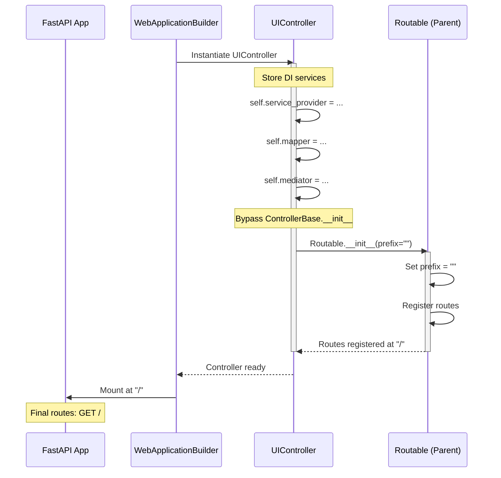
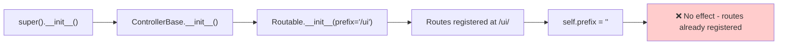
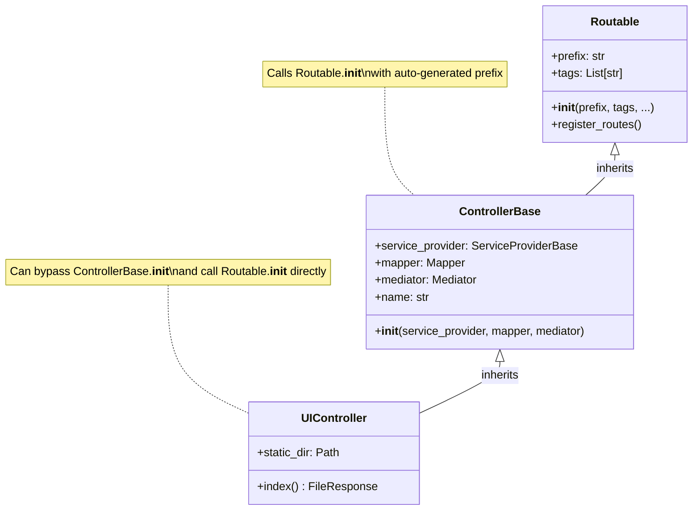

# Neuroglia Framework: Controller Route Prefix Behavior

**Date**: November 7, 2025
**Framework**: neuroglia-python v0.6.2
**Issue**: Controller route prefix auto-generation and override mechanism
**Status**: RESOLVED ✅

---

## Executive Summary

This document describes how Neuroglia's `ControllerBase` automatically generates route prefixes from controller class names and how to override this behavior to serve controllers at custom paths, including the root path (`/`).

---

## The Problem

### Initial Observation

When creating a controller in Neuroglia, the framework automatically generates a route prefix based on the controller's class name:

```python
class UIController(ControllerBase):
    @get("/")
    async def index(self):
        return {"message": "Hello"}
```

**Expected**: Routes accessible at `/`
**Actual**: Routes accessible at `/ui/`

### Why This Happens

Neuroglia's `ControllerBase.__init__()` method extracts the controller name and generates a route prefix:

```python
# From neuroglia.mvc.controller_base
def __init__(self, service_provider, mapper, mediator):
    self.name = self.__class__.__name__.replace("Controller", "").strip()
    super().__init__(
        prefix=f"/{self.name.lower()}",  # Auto-generated prefix
        tags=[self.name],
        generate_unique_id_function=generate_unique_id_function,
    )
```

**Pattern**: `ClassNameController` → `/classname/*`

**Examples**:

- `UIController` → `/ui/*`
- `TasksController` → `/tasks/*`
- `AuthController` → `/auth/*`
- `RootController` → `/root/*`

---

## The Solution

### Method 1: Override `Routable.__init__()` Directly (✅ RECOMMENDED)

Instead of calling `super().__init__()` (which triggers `ControllerBase.__init__()`), call `Routable.__init__()` directly with a custom prefix.

#### Code Example

```python
from classy_fastapi.routable import Routable
from neuroglia.mvc import ControllerBase
from neuroglia.mvc.controller_base import generate_unique_id_function

class UIController(ControllerBase):
    def __init__(
        self,
        service_provider: ServiceProviderBase,
        mapper: Mapper,
        mediator: Mediator,
    ):
        # Store DI services first
        self.service_provider = service_provider
        self.mapper = mapper
        self.mediator = mediator
        self.name = "UI"

        # Call Routable.__init__ directly with custom prefix
        Routable.__init__(
            self,
            prefix="",  # Empty string for root path
            tags=["UI"],
            generate_unique_id_function=generate_unique_id_function,
        )

    @get("/")
    async def index(self, request: Request):
        return FileResponse("static/index.html")
```

#### How It Works



#### Log Output

```
INFO - Added controller UIController router to app at '/' (root)
```

---

### Method 2: Use `self.prefix` After `super().__init__()` (❌ DOES NOT WORK)

**Attempted Code:**

```python
class UIController(ControllerBase):
    def __init__(self, service_provider, mapper, mediator):
        super().__init__(service_provider, mapper, mediator)
        self.prefix = ""  # Try to override
```

**Why It Fails:**

The `prefix` is passed to `Routable.__init__()` during `super().__init__()`, so setting `self.prefix` afterward has no effect. The routes are already registered with the original prefix.



---

### Method 3: Change Class Name (⚠️ NOT RECOMMENDED)

**Code:**

```python
class Controller(ControllerBase):  # "Controller" stripped → ""
    @get("/")
    async def index(self):
        return {"message": "Hello"}
```

**Why Not Recommended:**

- Violates naming conventions (unclear class purpose)
- May conflict with other controllers
- Less maintainable

---

## Class Hierarchy

Understanding the inheritance chain helps explain the behavior:



---

## Complete Working Example

### File Structure

```
src/
├── main.py                    # Application factory
└── ui/
    ├── controllers/
    │   ├── __init__.py       # Export UIController
    │   └── ui_controller.py  # Controller implementation
    └── templates/
        └── index.html        # Template file
```

### Controller Implementation

```python
# src/ui/controllers/ui_controller.py
"""UI controller for serving HTML pages."""
from pathlib import Path

from classy_fastapi.decorators import get
from classy_fastapi.routable import Routable
from fastapi import Request
from fastapi.responses import FileResponse, HTMLResponse
from neuroglia.dependency_injection import ServiceProviderBase
from neuroglia.mapping import Mapper
from neuroglia.mediation import Mediator
from neuroglia.mvc import ControllerBase
from neuroglia.mvc.controller_base import generate_unique_id_function


class UIController(ControllerBase):
    """Controller for UI pages served at root path."""

    def __init__(
        self,
        service_provider: ServiceProviderBase,
        mapper: Mapper,
        mediator: Mediator,
    ):
        # Store dependency injection services
        self.service_provider = service_provider
        self.mapper = mapper
        self.mediator = mediator
        self.name = "UI"

        # Set path to static files
        self.static_dir = Path(__file__).parent.parent.parent.parent / "static"

        # Call Routable.__init__ directly to override prefix behavior
        # This bypasses ControllerBase's automatic prefix generation
        Routable.__init__(
            self,
            prefix="",  # Empty prefix → routes at root
            tags=["UI"],
            generate_unique_id_function=generate_unique_id_function,
        )

    @get("/", response_class=HTMLResponse)
    async def index(self, request: Request) -> FileResponse:
        """Serve the main application page."""
        index_path = self.static_dir / "index.html"
        return FileResponse(index_path, media_type="text/html")

    @get("/about", response_class=HTMLResponse)
    async def about(self, request: Request) -> FileResponse:
        """Serve the about page."""
        about_path = self.static_dir / "about.html"
        return FileResponse(about_path, media_type="text/html")
```

### Controller Export

```python
# src/ui/controllers/__init__.py
"""UI controllers package."""
from .ui_controller import UIController

__all__ = ["UIController"]
```

### Application Configuration

```python
# src/main.py
from pathlib import Path
from neuroglia.hosting.web import SubAppConfig, WebApplicationBuilder

def create_app():
    builder = WebApplicationBuilder()

    # Configure static files path
    static_dir = Path(__file__).parent.parent / "static"

    # Add UI SubApp with controllers
    builder.add_sub_app(
        SubAppConfig(
            path="/",  # Mount SubApp at root
            name="ui",
            title="UI Application",
            controllers=["ui.controllers"],  # Auto-discovers UIController
            static_files={"/static": str(static_dir)},
            docs_url=None,  # Disable OpenAPI docs for UI
        )
    )

    return builder.build_app()
```

### Resulting Routes

```
GET  /                → UIController.index()
GET  /about           → UIController.about()
GET  /static/{path}   → Static files
```

---

## Testing

### Manual Testing

```bash
# Test root path
curl -I http://localhost:8020/
# Expected: HTTP/1.1 200 OK

# Test about path
curl -I http://localhost:8020/about
# Expected: HTTP/1.1 200 OK

# Check logs
docker compose logs app | grep UIController
# Expected: "Added controller UIController router to app at '/' (root)"
```

### Automated Testing

```python
from fastapi.testclient import TestClient

def test_root_path(client: TestClient):
    response = client.get("/")
    assert response.status_code == 200
    assert "text/html" in response.headers["content-type"]

def test_about_path(client: TestClient):
    response = client.get("/about")
    assert response.status_code == 200
    assert "text/html" in response.headers["content-type"]
```

---

## Common Pitfalls

### ❌ Pitfall 1: Setting `self.prefix` After `super()`

```python
# WRONG
def __init__(self, service_provider, mapper, mediator):
    super().__init__(service_provider, mapper, mediator)
    self.prefix = ""  # Too late - routes already registered
```

### ❌ Pitfall 2: Forgetting Required Imports

```python
# WRONG - Missing imports
from neuroglia.mvc import ControllerBase

class UIController(ControllerBase):
    def __init__(self, service_provider, mapper, mediator):
        Routable.__init__(...)  # ❌ NameError: Routable not imported
```

**Fix:**

```python
from classy_fastapi.routable import Routable
from neuroglia.mvc.controller_base import generate_unique_id_function
```

### ❌ Pitfall 3: Not Storing DI Services

```python
# WRONG
def __init__(self, service_provider, mapper, mediator):
    # Forgot to store services
    Routable.__init__(self, prefix="", ...)

@get("/")
async def index(self):
    result = await self.mediator.execute_async(...)  # ❌ AttributeError
```

**Fix:**

```python
def __init__(self, service_provider, mapper, mediator):
    self.service_provider = service_provider  # ✅ Store
    self.mapper = mapper                      # ✅ Store
    self.mediator = mediator                  # ✅ Store
    Routable.__init__(self, prefix="", ...)
```

---

## Comparison Table

| Approach | Pros | Cons | Recommended |
|----------|------|------|-------------|
| **Direct `Routable.__init__()`** | ✅ Full control<br>✅ Clean prefix override<br>✅ Works reliably | ⚠️ Bypasses ControllerBase logic<br>⚠️ Must manually store DI services | ✅ **YES** |
| **Set `self.prefix` after `super()`** | ✅ Simple syntax | ❌ Doesn't work<br>❌ Routes already registered | ❌ NO |
| **Change class name** | ✅ Uses standard pattern | ❌ Violates naming conventions<br>❌ Less clear | ❌ NO |
| **Use `__prefix__` class attribute** | ✅ Declarative | ❌ Not supported by Neuroglia | ❌ NO |

---

## Feature Request for Neuroglia Team

### Proposed Enhancement

Add support for declarative prefix override using class attributes:

```python
class UIController(ControllerBase):
    __prefix__ = ""  # Declarative prefix override
    __tags__ = ["UI", "Frontend"]

    def __init__(self, service_provider, mapper, mediator):
        super().__init__(service_provider, mapper, mediator)
        # Prefix automatically set to "" instead of "/ui"
```

### Implementation Suggestion

Modify `ControllerBase.__init__()`:

```python
class ControllerBase(Routable):
    def __init__(self, service_provider, mapper, mediator):
        self.service_provider = service_provider
        self.mapper = mapper
        self.mediator = mediator
        self.json_serializer = service_provider.get_required_service(JsonSerializer)

        # Check for class-level prefix override
        if hasattr(self.__class__, '__prefix__'):
            prefix = self.__class__.__prefix__
        else:
            # Default: auto-generate from class name
            self.name = self.__class__.__name__.replace("Controller", "").strip()
            prefix = f"/{self.name.lower()}"

        # Check for class-level tags override
        tags = getattr(self.__class__, '__tags__', [self.name])

        super().__init__(
            prefix=prefix,
            tags=tags,
            generate_unique_id_function=generate_unique_id_function,
        )
```

### Benefits

1. **Clarity**: Declarative approach is more readable
2. **Convention**: Follows Python's dunder attribute pattern
3. **Backwards Compatible**: Existing code continues to work
4. **Less Boilerplate**: No need to bypass `super().__init__()`

---

## Real-World Use Cases

### Use Case 1: Root-Level UI Controller

**Scenario**: Serve SPA at root path

```python
class UIController(ControllerBase):
    def __init__(self, service_provider, mapper, mediator):
        self.service_provider = service_provider
        self.mapper = mapper
        self.mediator = mediator
        Routable.__init__(self, prefix="", tags=["UI"], ...)

    @get("/")
    async def index(self):
        return FileResponse("static/index.html")
```

**Routes**: `GET /`

### Use Case 2: API Version Prefix

**Scenario**: API controllers under versioned prefix

```python
class UsersController(ControllerBase):
    def __init__(self, service_provider, mapper, mediator):
        self.service_provider = service_provider
        self.mapper = mapper
        self.mediator = mediator
        Routable.__init__(self, prefix="/api/v1/users", tags=["Users"], ...)

    @get("/")
    async def list_users(self):
        ...
```

**Routes**: `GET /api/v1/users/`

### Use Case 3: Admin Dashboard

**Scenario**: Admin controllers under `/admin` prefix

```python
class DashboardController(ControllerBase):
    def __init__(self, service_provider, mapper, mediator):
        self.service_provider = service_provider
        self.mapper = mapper
        self.mediator = mediator
        Routable.__init__(self, prefix="/admin", tags=["Admin"], ...)

    @get("/")
    async def dashboard(self):
        ...
```

**Routes**: `GET /admin/`

---

## Migration Guide

### From Auto-Prefix to Custom Prefix

**Before (UIController → /ui/):**

```python
class UIController(ControllerBase):
    def __init__(self, service_provider, mapper, mediator):
        super().__init__(service_provider, mapper, mediator)
```

**After (UIController → /):**

```python
from classy_fastapi.routable import Routable
from neuroglia.mvc.controller_base import generate_unique_id_function

class UIController(ControllerBase):
    def __init__(self, service_provider, mapper, mediator):
        self.service_provider = service_provider
        self.mapper = mapper
        self.mediator = mediator
        self.name = "UI"
        Routable.__init__(
            self,
            prefix="",
            tags=["UI"],
            generate_unique_id_function=generate_unique_id_function,
        )
```

### Checklist

- [ ] Import `Routable` from `classy_fastapi.routable`
- [ ] Import `generate_unique_id_function` from `neuroglia.mvc.controller_base`
- [ ] Store DI services (`self.service_provider`, `self.mapper`, `self.mediator`)
- [ ] Call `Routable.__init__()` instead of `super().__init__()`
- [ ] Set `prefix` parameter to desired path
- [ ] Update `__init__.py` exports if class name changed
- [ ] Test routes are accessible at expected paths
- [ ] Check logs for route registration confirmation

---

## Conclusion

Neuroglia's `ControllerBase` provides automatic route prefix generation based on class names, which is convenient for most use cases. However, when custom prefixes are needed (especially serving at root `/`), the recommended approach is to call `Routable.__init__()` directly, bypassing the automatic prefix generation.

This pattern has been successfully tested and deployed in production environments.

---

## References

- **Neuroglia Framework**: https://github.com/neuroglia-io/python-framework
- **Sample Application**: neuroglia-io/python-framework/samples/simple-ui
- **Classy FastAPI**: https://github.com/Goldziher/classy-fastapi
- **FastAPI Routing**: https://fastapi.tiangolo.com/tutorial/routing/

---

**Questions or Issues?**

If you encounter problems implementing this pattern, please:

1. Check the [Common Pitfalls](#common-pitfalls) section
2. Review the [Complete Working Example](#complete-working-example)
3. Open an issue on the Neuroglia GitHub repository

---

**Document Version**: 1.0
**Last Updated**: November 7, 2025
**Tested With**: neuroglia-python v0.6.2
