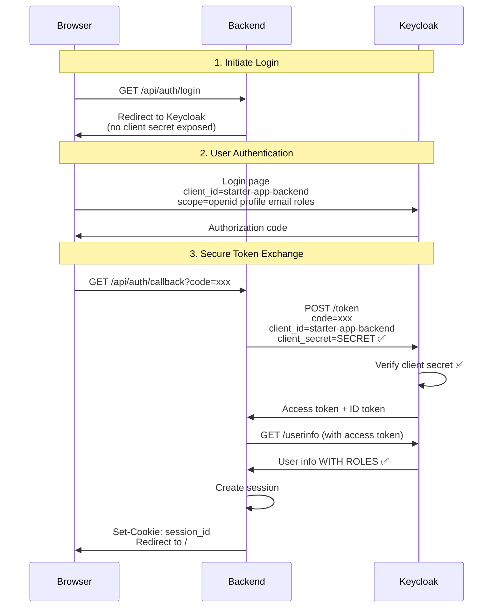

# OAuth2 Client Configuration - Confidential vs Public Clients

## Summary of Changes

✅ **Added confidential backend client** (`starter-app-backend`) for secure token exchange
✅ **Updated settings** to use confidential client with client secret
✅ **Added roles scope** to include user roles in tokens and userinfo
✅ **Added protocol mappers** to include roles in userinfo response

---

## The Problem

**Issue**: Admin user authenticated successfully but had no roles in the token/userinfo response.

**Root Causes**:

1. ❌ Using **public client** (`portal-web-app`) for backend token exchange (insecure)
2. ❌ Missing `roles` scope in authorization request
3. ❌ No protocol mappers configured to include roles in userinfo

**Result**: `/api/auth/user` returned user info without roles, causing 403 Forbidden for protected endpoints.

---

## OAuth2 Client Types

### Public Client (`portal-web-app`)

```json
{
    "clientId": "portal-web-app",
    "publicClient": true,
    "secret": null  // No client secret
}
```

**Characteristics**:

- ✅ **Use case**: Browser-based SPAs, mobile apps
- ✅ **Security**: No client secret (can't be kept secure in browser)
- ✅ **Authentication**: User authentication only (no client authentication)
- ❌ **Token exchange**: Less secure - no proof that backend is legitimate

**When to use**: Never for backend server-to-server communication!

### Confidential Client (`starter-app-backend`)

```json
{
    "clientId": "starter-app-backend",
    "publicClient": false,
    "secret": "starter-app-backend-secret-change-in-production"
}
```

**Characteristics**:

- ✅ **Use case**: Backend servers, secure environments
- ✅ **Security**: Client secret stored securely on server
- ✅ **Authentication**: Both user AND client authentication
- ✅ **Token exchange**: Secure - proves backend's identity to Keycloak

**When to use**: Always for backend OAuth2 code exchange!

---

## OAuth2 Authorization Code Flow with Confidential Client



### Security Benefits

1. **Client Authentication**: Keycloak verifies the backend's identity using client secret
2. **No Secret Exposure**: Client secret never sent to browser
3. **Token Security**: Tokens never exposed to browser (stored server-side in session)
4. **Code Replay Prevention**: Only the legitimate backend can exchange the code

---

## Configuration Changes

### 1. Keycloak Realm Configuration

**File**: `deployment/keycloak/starter-app-realm-export.json`

Added new confidential client with protocol mappers:

```json
{
    "clientId": "starter-app-backend",
    "name": "Starter App Backend (Confidential)",
    "publicClient": false,
    "secret": "starter-app-backend-secret-change-in-production",
    "standardFlowEnabled": true,
    "fullScopeAllowed": true,
    "protocolMappers": [
        {
            "name": "realm-roles",
            "protocol": "openid-connect",
            "protocolMapper": "oidc-usermodel-realm-role-mapper",
            "config": {
                "multivalued": "true",
                "userinfo.token.claim": "true",
                "claim.name": "roles"
            }
        }
    ]
}
```

**Key features**:

- ✅ `publicClient: false` - Confidential client
- ✅ `secret` - Client secret for authentication
- ✅ `protocolMappers` - Include roles in userinfo
- ✅ `userinfo.token.claim: true` - Roles appear in userinfo endpoint

### 2. Application Settings

**File**: `src/application/settings.py`

```python
# Backend confidential client for secure token exchange
KEYCLOAK_CLIENT_ID: str = "starter-app-backend"
KEYCLOAK_CLIENT_SECRET: str = "starter-app-backend-secret-change-in-production"

# Legacy public client (deprecated)
KEYCLOAK_PUBLIC_CLIENT_ID: str = "portal-web-app"
```

**Changes**:

- ✅ Changed `KEYCLOAK_CLIENT_ID` to `starter-app-backend`
- ✅ Set `KEYCLOAK_CLIENT_SECRET` to actual secret value
- ✅ Kept old public client ID for reference

### 3. Auth Controller

**File**: `src/api/controllers/auth_controller.py`

```python
# Initialize Keycloak client with CONFIDENTIAL backend client
self.keycloak = KeycloakOpenID(
    server_url=app_settings.KEYCLOAK_URL_INTERNAL,
    client_id=app_settings.KEYCLOAK_CLIENT_ID,
    realm_name=app_settings.KEYCLOAK_REALM,
    client_secret_key=app_settings.KEYCLOAK_CLIENT_SECRET  # ✅ Always set
)

# Request roles scope to include user roles
auth_url = self.keycloak.auth_url(
    redirect_uri=f"{app_settings.APP_URL}/api/auth/callback",
    scope="openid profile email roles",  # ✅ Added 'roles'
    state=state
)
```

**Changes**:

- ✅ Always uses client secret (no conditional)
- ✅ Added `roles` to scope parameter
- ✅ Comments explain security model

### 4. Environment Variables

**File**: `.env.example`

```bash
# Keycloak Backend Client (Confidential - for secure token exchange)
KEYCLOAK_CLIENT_ID=starter-app-backend
KEYCLOAK_CLIENT_SECRET=starter-app-backend-secret-change-in-production
```

---

## Testing the Fix

### 1. Restart Keycloak with New Configuration

```bash
# Stop and remove Keycloak container to reload realm config
docker-compose down keycloak
docker-compose up -d keycloak

# Wait for Keycloak to start (check logs)
docker-compose logs -f keycloak
```

### 2. Restart Application

```bash
# Restart the starter-app to use new settings
docker-compose restart starter-app
# Or if running locally:
poetry run python src/main.py
```

### 3. Test Authentication Flow

```bash
# 1. Open browser
open http://localhost:8020

# 2. Click login (will redirect to Keycloak)

# 3. Login as admin
#    Username: admin
#    Password: admin

# 4. Check user info endpoint
curl -b cookies.txt http://localhost:8020/api/auth/user
```

**Expected response** (with roles):

```json
{
  "sub": "a1b2c3d4-e5f6-7890-abcd-ef1234567890",
  "email": "admin@system.io",
  "email_verified": true,
  "name": "System Admin",
  "preferred_username": "admin",
  "given_name": "System",
  "family_name": "Admin",
  "roles": ["admin"]  // ✅ Roles now included!
}
```

### 4. Verify Token Exchange

Check backend logs for successful token exchange:

```bash
docker-compose logs -f starter-app | grep "callback"
```

You should see the callback succeed without errors.

---

## Security Best Practices

### ✅ DO

1. **Use confidential clients for backends** - Always authenticate the server
2. **Keep secrets secure** - Store in environment variables, never in code
3. **Use HTTPS in production** - Protect client secrets in transit
4. **Rotate secrets regularly** - Change client secrets periodically
5. **Request minimal scopes** - Only request the scopes you need
6. **Store tokens server-side** - Never expose tokens to browser

### ❌ DON'T

1. **Don't use public clients for backends** - No client authentication
2. **Don't expose client secrets** - Never send to browser/frontend
3. **Don't hardcode secrets** - Use environment variables
4. **Don't request excessive scopes** - Principle of least privilege
5. **Don't store tokens in browser** - Use session cookies instead
6. **Don't skip token validation** - Always verify tokens

---

## Production Checklist

Before deploying to production:

- [ ] Generate strong client secret (use `python -c "import secrets; print(secrets.token_urlsafe(32))"`)
- [ ] Set `KEYCLOAK_CLIENT_SECRET` environment variable
- [ ] Use HTTPS for all Keycloak URLs
- [ ] Configure proper CORS origins
- [ ] Enable Keycloak realm SSL requirement
- [ ] Set secure session cookies (secure=True, samesite='strict')
- [ ] Configure session timeout appropriately
- [ ] Use Redis for production session storage
- [ ] Enable Keycloak brute force protection
- [ ] Configure proper token lifespans
- [ ] Set up client secret rotation policy
- [ ] Review and minimize client scopes

---

## Troubleshooting

### Roles Still Not Appearing

1. **Check scope parameter**: Ensure `roles` is in the scope

   ```python
   scope="openid profile email roles"
   ```

2. **Verify protocol mapper**: Check Keycloak admin console
   - Clients → starter-app-backend → Client scopes → Mappers
   - Look for "realm-roles" mapper
   - Ensure "Add to userinfo" is enabled

3. **Check user role assignment**: Verify user has roles
   - Users → admin → Role Mapping
   - Should see "admin" role assigned

4. **Test userinfo endpoint directly**:

   ```bash
   # Get access token
   curl -X POST http://localhost:8021/realms/starter-app/protocol/openid-connect/token \
     -d "grant_type=password" \
     -d "client_id=starter-app-backend" \
     -d "client_secret=starter-app-backend-secret-change-in-production" \
     -d "username=admin" \
     -d "password=admin"

   # Use access_token from response
   curl http://localhost:8021/realms/starter-app/protocol/openid-connect/userinfo \
     -H "Authorization: Bearer <access_token>"
   ```

### Token Exchange Fails

1. **Check client secret**: Verify it matches Keycloak configuration
2. **Check redirect URI**: Must exactly match configured URI
3. **Check Keycloak logs**: `docker-compose logs keycloak`
4. **Verify client exists**: Check Keycloak admin console

### 403 Forbidden After Login

1. **Verify roles are in session**: Check `/api/auth/user` response
2. **Check role names**: Must match application expectations
3. **Verify authorization logic**: Check command handlers for role checks

---

## References

- [OAuth 2.0 Client Types](https://oauth.net/2/client-types/)
- [Keycloak Client Configuration](https://www.keycloak.org/docs/latest/server_admin/#_clients)
- [OIDC Protocol Mappers](https://www.keycloak.org/docs/latest/server_admin/#protocol-mappers)
- [OAuth 2.0 Security Best Practices](https://tools.ietf.org/html/draft-ietf-oauth-security-topics)

---

**Document Version**: 1.0
**Last Updated**: November 7, 2025
**Status**: Complete
