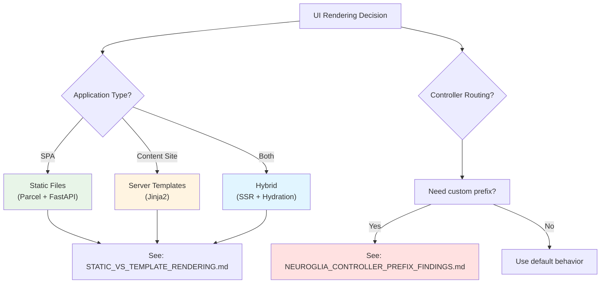

# Documentation: UI Rendering Strategies & Neuroglia Controller Configuration

This folder contains comprehensive documentation on UI rendering approaches and findings from working with the Neuroglia framework.

---

## 📚 Documents

### 1. [Static vs Template Rendering](./STATIC_VS_TEMPLATE_RENDERING.md)

**Audience**: Junior developers, architects, team leads

**Contents**:

- Comprehensive comparison of static files vs server-side templates
- Request flow diagrams with Mermaid
- Performance metrics and trade-offs
- When to use each approach
- Hybrid architecture patterns
- Real-world implementation examples

**Key Takeaways**:

- Static files (Parcel/Webpack) best for SPAs and high-traffic apps
- Server templates (Jinja2) best for SEO-critical and content-heavy sites
- Hybrid approach combines benefits of both

---

### 2. [Neuroglia Controller Prefix Findings](./NEUROGLIA_CONTROLLER_PREFIX_FINDINGS.md)

**Audience**: Neuroglia framework users, Python developers

**Contents**:

- How Neuroglia auto-generates route prefixes from class names
- Detailed explanation of `ControllerBase` behavior
- Working solution to serve controllers at custom paths (including root `/`)
- Complete code examples with tests
- Common pitfalls and how to avoid them
- Migration guide from auto-prefix to custom prefix

**Key Takeaways**:

- Neuroglia uses pattern: `ClassNameController` → `/classname/*`
- To override, call `Routable.__init__()` directly instead of `super().__init__()`
- Must manually store DI services when bypassing parent `__init__()`

---

### 3. [Neuroglia Feature Request](./NEUROGLIA_FEATURE_REQUEST.md)

**Audience**: Neuroglia framework team, contributors

**Contents**:

- Formal feature request for enhanced SubApp configuration
- Proposed `RenderMode` enum (STATIC, TEMPLATE, HYBRID)
- Declarative prefix override using `__prefix__` class attribute
- Build pipeline integration suggestions
- Backwards compatibility analysis
- Community impact assessment

**Key Proposals**:

```python
# Declarative prefix override
class UIController(ControllerBase):
    __prefix__ = ""  # Serve at root instead of /ui

# Enhanced SubAppConfig
SubAppConfig(
    render_mode=RenderMode.STATIC,
    static_index="static/index.html",
    build_command="npm run build"
)
```

---

## 🎯 Quick Reference

### Problem: Controller Routes at Wrong Path

**Issue**: `UIController` serves at `/ui/` but you want `/`

**Solution**:

```python
from classy_fastapi.routable import Routable
from neuroglia.mvc.controller_base import generate_unique_id_function

class UIController(ControllerBase):
    def __init__(self, service_provider, mapper, mediator):
        self.service_provider = service_provider
        self.mapper = mapper
        self.mediator = mediator
        self.name = "UI"

        Routable.__init__(
            self,
            prefix="",  # Empty = root path
            tags=["UI"],
            generate_unique_id_function=generate_unique_id_function,
        )
```

See [NEUROGLIA_CONTROLLER_PREFIX_FINDINGS.md](./NEUROGLIA_CONTROLLER_PREFIX_FINDINGS.md) for complete details.

---

### Question: Static Files or Templates?

**Use Static Files When**:

- 🎯 Building SPAs (React, Vue, Angular)
- 🚀 Need high performance (1-5ms response)
- 🌍 Serving global audience (CDN)
- 📱 Mobile-first applications

**Use Server Templates When**:

- 🔍 SEO is critical
- 📝 Content-heavy site
- 👥 Personalized user content
- 🏢 Internal tools (low traffic)

See [STATIC_VS_TEMPLATE_RENDERING.md](./STATIC_VS_TEMPLATE_RENDERING.md) for comprehensive comparison.

---

## 🗺️ Architecture Diagrams

All documents include detailed Mermaid diagrams:

- **Sequence diagrams**: Request/response flows
- **Flowcharts**: Build pipelines and decision trees
- **Class diagrams**: Framework inheritance hierarchy
- **Architecture diagrams**: Component relationships

---

## 📖 Learning Path

### For Junior Developers

1. Start with [STATIC_VS_TEMPLATE_RENDERING.md](./STATIC_VS_TEMPLATE_RENDERING.md)
   - Read "Architecture Overview" section
   - Study the Mermaid diagrams
   - Review "Request Flow Sequence" diagrams
   - Check "When to Use Each Approach"

2. Review implementation examples in main document

3. Refer to [NEUROGLIA_CONTROLLER_PREFIX_FINDINGS.md](./NEUROGLIA_CONTROLLER_PREFIX_FINDINGS.md) when working with controllers

### For Experienced Developers

1. Skim [STATIC_VS_TEMPLATE_RENDERING.md](./STATIC_VS_TEMPLATE_RENDERING.md) for architectural context

2. Deep dive into [NEUROGLIA_CONTROLLER_PREFIX_FINDINGS.md](./NEUROGLIA_CONTROLLER_PREFIX_FINDINGS.md)
   - Focus on "Complete Working Example"
   - Review "Common Pitfalls"
   - Check migration guide if updating existing code

3. Review [NEUROGLIA_FEATURE_REQUEST.md](./NEUROGLIA_FEATURE_REQUEST.md) for proposed improvements

### For Framework Contributors

1. Review all three documents

2. Focus on [NEUROGLIA_FEATURE_REQUEST.md](./NEUROGLIA_FEATURE_REQUEST.md)
   - Implementation suggestions
   - Backwards compatibility analysis
   - Community impact

3. Check reference implementation in `src/ui/controllers/`

---

## 🔗 Related Files

### Implementation

- `src/ui/controllers/ui_controller.py` - Working controller with custom prefix
- `src/ui/controllers/__init__.py` - Controller exports
- `src/main.py` - SubApp configuration

### Build System

- `src/ui/package.json` - Build scripts
- `src/ui/build-template.js` - Nunjucks template renderer
- `docker-compose.yml` - Development environment

### Templates & Assets

- `src/ui/src/templates/` - Nunjucks templates
- `src/ui/src/styles/` - SCSS stylesheets
- `src/ui/src/scripts/` - JavaScript files
- `static/` - Built static files

---

## 🤝 Contributing

If you find issues or have suggestions:

1. **For Neuroglia Framework**: Submit feature request referencing [NEUROGLIA_FEATURE_REQUEST.md](./NEUROGLIA_FEATURE_REQUEST.md)

2. **For This Documentation**: Create PR with improvements

3. **For Implementation Questions**: See "Common Pitfalls" sections in docs

---

## 📊 Visual Summary



---

## 🎓 Key Learnings

### Static Files Approach

**✅ Pros**:

- Lightning fast (1-5ms response)
- Scales to millions of requests
- CDN-ready
- Modern tooling (tree-shaking, code splitting)

**❌ Cons**:

- No server data injection
- Build step required
- Complex SEO setup

### Server Templates Approach

**✅ Pros**:

- Direct data injection
- SEO-friendly
- Simple for simple UIs
- No build pipeline

**❌ Cons**:

- Slower (50-200ms per request)
- Higher server load
- No modern bundler features

### Neuroglia Controller Routing

**✅ What Works**:

- Auto-prefix from class name is convenient
- Calling `Routable.__init__()` directly for custom prefix
- Storing DI services manually when bypassing parent `__init__()`

**⚠️ What Doesn't**:

- Setting `self.prefix` after `super().__init__()`
- Expecting routes at root without explicit configuration

---

## 📞 Support

**Questions about**:

- Static vs Template rendering → See [STATIC_VS_TEMPLATE_RENDERING.md](./STATIC_VS_TEMPLATE_RENDERING.md)
- Controller routing → See [NEUROGLIA_CONTROLLER_PREFIX_FINDINGS.md](./NEUROGLIA_CONTROLLER_PREFIX_FINDINGS.md)
- Feature requests → See [NEUROGLIA_FEATURE_REQUEST.md](./NEUROGLIA_FEATURE_REQUEST.md)

**Still stuck?**

- Check "Common Pitfalls" sections
- Review "Complete Working Example" sections
- Open an issue with detailed description

---

## 📝 Document Versions

| Document | Version | Last Updated | Status |
|----------|---------|--------------|--------|
| STATIC_VS_TEMPLATE_RENDERING.md | 1.0 | Nov 7, 2025 | ✅ Complete |
| NEUROGLIA_CONTROLLER_PREFIX_FINDINGS.md | 1.0 | Nov 7, 2025 | ✅ Complete |
| NEUROGLIA_FEATURE_REQUEST.md | 1.0 | Nov 7, 2025 | 📤 Submitted |

---

## 🙏 Acknowledgments

- **Neuroglia Team**: For the excellent Python framework
- **FastAPI**: For the web framework foundation
- **Community**: For sharing similar challenges and solutions

---

**Happy Coding! 🚀**
