# Static Files vs Server-Side Templates: A Comprehensive Guide

**Author**: System Designer Team
**Date**: November 7, 2025
**Target Audience**: Junior Developers & Neuroglia Framework Team

---

## Executive Summary

This document explains two different approaches to serving HTML content in web applications:

1. **Static Files** (pre-built HTML served as files)
2. **Server-Side Templates** (HTML rendered dynamically on each request)

Both approaches are valid, and the choice depends on your application's requirements.

---

## Table of Contents

1. [Architecture Overview](#architecture-overview)
2. [Approach 1: Static Files with Build Pipeline](#approach-1-static-files-with-build-pipeline)
3. [Approach 2: Server-Side Templates](#approach-2-server-side-templates)
4. [Side-by-Side Comparison](#side-by-side-comparison)
5. [Request Flow Diagrams](#request-flow-diagrams)
6. [Performance Considerations](#performance-considerations)
7. [When to Use Each Approach](#when-to-use-each-approach)
8. [Hybrid Approach](#hybrid-approach)
9. [Implementation Examples](#implementation-examples)

---

## Architecture Overview

### The Problem

When building a web application, you need to decide:

- **Where** should HTML be generated? (Client, server, or build time)
- **When** should HTML be generated? (On every request or once during build)
- **How** should data be injected? (Server-side rendering or client-side API calls)

### Visual Overview


---

## Approach 1: Static Files with Build Pipeline

### Overview

HTML is **pre-built** during a build step, then served as static files. This is the modern approach used by SPAs (Single Page Applications) and static site generators.

### Architecture Diagram


### Request Flow Sequence


### How It Works

1. **Development**: Developers write templates (Nunjucks, React, Vue, etc.) and styles (SCSS, CSS)
2. **Build**: A build tool (Parcel, Webpack, Vite) processes templates and creates optimized HTML/CSS/JS
3. **Deployment**: Static files are deployed to web server or CDN
4. **Request**: Browser requests HTML, server sends pre-built file (no processing)
5. **Data Loading**: JavaScript in browser makes API calls to load dynamic data

### Pros ✅

| Benefit | Description | Impact |
|---------|-------------|--------|
| **Performance** | HTML is pre-built, no rendering overhead on each request | ⚡ Fast response times (1-5ms) |
| **Scalability** | Can serve millions of requests from CDN | 🚀 Handles traffic spikes easily |
| **Caching** | Files can be cached indefinitely (content hashing) | 💾 Reduced server load |
| **Modern Tooling** | Access to modern bundlers (tree-shaking, code splitting) | 🛠️ Smaller bundle sizes |
| **Developer Experience** | Hot reload, fast feedback during development | 👨‍💻 Improved productivity |
| **CDN-Ready** | Static files can be served from edge locations | 🌍 Global performance |

### Cons ❌

| Limitation | Description | Impact |
|-----------|-------------|--------|
| **No Server Data Injection** | Cannot pass Python/server variables directly to HTML | 🔒 All data must come from API |
| **Build Step Required** | Changes require rebuild (though fast with watch mode) | ⏱️ Extra step in workflow |
| **SEO Complexity** | Requires client-side rendering or pre-rendering for SEO | 🔍 More complex SEO setup |
| **Initial Load** | All JavaScript loaded upfront (unless code-split) | 📦 Larger initial download |

### Code Example

**Template (Nunjucks):**

```html
<!-- ui/src/templates/index.jinja -->
<!DOCTYPE html>
<html>
<head>
    <title>{{ title | default('My App') }}</title>
    <link rel="stylesheet" href="./styles/main.scss">
</head>
<body>
    <div id="app"></div>
    <script src="./scripts/main.js" type="module"></script>
</body>
</html>
```

**Build Script:**

```javascript
// build-template.js
const nunjucks = require('nunjucks');
const fs = require('fs');

const env = nunjucks.configure('src/templates', { autoescape: true });
const html = env.render('index.jinja', { title: 'System Designer' });
fs.writeFileSync('src/index.html', html);
```

**Controller (FastAPI):**

```python
class UIController(ControllerBase):
    @get("/")
    async def index(self, request: Request) -> FileResponse:
        # Just serve the pre-built file
        return FileResponse("static/index.html", media_type="text/html")
```

---

## Approach 2: Server-Side Templates

### Overview

HTML is **rendered on each request** by the server, with data injected directly into templates before sending to the browser.

### Architecture Diagram


### Request Flow Sequence


### How It Works

1. **Request**: Browser requests a page (e.g., GET /)
2. **Data Fetching**: Controller fetches required data from database
3. **Template Rendering**: Server combines template with data to generate HTML
4. **Response**: Complete HTML (with data) sent to browser
5. **Display**: Browser displays page immediately (no additional API calls needed)

### Pros ✅

| Benefit | Description | Impact |
|---------|-------------|--------|
| **Server Data Injection** | Can pass Python variables directly to template | 💉 Direct data access |
| **SEO-Friendly** | Full HTML with content sent to browser | 🔍 Better search rankings |
| **Simple for Simple UIs** | No build pipeline or bundler needed | 🎯 Lower complexity |
| **Immediate Rendering** | Browser can display content immediately | 👁️ Faster perceived load |
| **Full Server Control** | Complete control over rendered output | 🎛️ Flexible rendering |

### Cons ❌

| Limitation | Description | Impact |
|-----------|-------------|--------|
| **Rendering Overhead** | Template rendered on every request | ⏱️ 50-200ms per request |
| **Scalability** | Server must render for every user | 📈 Higher server load |
| **No Modern Bundler** | Manual CSS/JS management | 📦 Larger asset sizes |
| **No Code Splitting** | All JavaScript loaded upfront | 🐌 Slower initial load |
| **Limited Interactivity** | Complex interactions require full page reload or AJAX | 🔄 Less smooth UX |

### Code Example

**Template (Jinja2):**

```html
<!-- ui/templates/index.html -->
<!DOCTYPE html>
<html>
<head>
    <title>{{ app_name }}</title>
    <link rel="stylesheet" href="/static/styles.css">
</head>
<body>
    <h1>Welcome, {{ user.name }}!</h1>

    <ul>
    
        <li>{{ task.title }} - {{ task.status }}</li>
    
    </ul>

    
        <a href="/admin">Admin Panel</a>
    

    <script src="/static/scripts.js"></script>
</body>
</html>
```

**Controller (FastAPI):**

```python
from fastapi.templating import Jinja2Templates

templates = Jinja2Templates(directory="ui/templates")

class UIController(ControllerBase):
    @get("/")
    async def index(self, request: Request) -> TemplateResponse:
        # Fetch data from database
        user = await get_current_user(request)
        tasks = await get_user_tasks(user.id)

        # Render template with data
        return templates.TemplateResponse("index.html", {
            "request": request,
            "app_name": settings.APP_NAME,
            "user": user,
            "tasks": tasks
        })
```

---

## Side-by-Side Comparison

### Performance Metrics


### Feature Comparison Matrix

| Feature | Static Files | Server Templates |
|---------|--------------|------------------|
| **Response Time** | ⚡ 1-5ms | 🕐 50-200ms |
| **Server Load** | ✅ Minimal | ⚠️ Significant |
| **CDN Support** | ✅ Perfect | ❌ Limited |
| **Caching** | ✅ Aggressive | ⚠️ Complex |
| **SEO** | ⚠️ Requires work | ✅ Built-in |
| **Data Injection** | ❌ API only | ✅ Direct |
| **Build Step** | ⚠️ Required | ✅ Not needed |
| **Hot Reload** | ✅ Excellent | ⚠️ Slower |
| **Modern Tooling** | ✅ Full access | ❌ Limited |
| **Code Splitting** | ✅ Yes | ❌ No |
| **Tree Shaking** | ✅ Yes | ❌ No |
| **Asset Optimization** | ✅ Automatic | ⚠️ Manual |

---

## Request Flow Diagrams

### Static Files: Complete Request Cycle


### Server Templates: Complete Request Cycle


---

## Performance Considerations

### Static Files Performance


**Key Metrics:**

- **TTFB** (Time to First Byte): 1-5ms
- **FCP** (First Contentful Paint): 100-300ms (with fast JS execution)
- **LCP** (Largest Contentful Paint): 500ms-1s (after API data loads)
- **TTI** (Time to Interactive): 1-2s

### Server Templates Performance


**Key Metrics:**

- **TTFB** (Time to First Byte): 60-170ms
- **FCP** (First Contentful Paint): 100-200ms (immediate with HTML)
- **LCP** (Largest Contentful Paint): 150-250ms (content in initial HTML)
- **TTI** (Time to Interactive): 200-400ms (if minimal JavaScript)

---

## When to Use Each Approach

### Use Static Files When

```mermaid
flowchart TD
    A{Your Application Needs}

    A -->|High Traffic| B[✅ Static Files]
    A -->|SPA Experience| B
    A -->|Modern Stack| B
    A -->|CDN Distribution| B
    A -->|Frequent Updates| B
    A -->|Code Splitting| B

    style B fill:#e8f5e8
```



**Ideal Use Cases:**

- 🎯 Single Page Applications (React, Vue, Angular)
- 📱 Mobile-first applications
- 🌍 Global audiences (CDN distribution)
- 📊 Dashboards with real-time data
- 🚀 High-traffic websites
- 💼 SaaS products
- 🎮 Interactive web apps

### Use Server Templates When

```mermaid
flowchart TD
    A{Your Application Needs}

    A -->|SEO Critical| B[✅ Server Templates]
    A -->|Simple UI| B
    A -->|No Build Tools| B
    A -->|Server Control| B
    A -->|Direct Data| B
    A -->|Low Traffic| B

    style B fill:#fff4e1
```



**Ideal Use Cases:**

- 📝 Content-heavy websites (blogs, documentation)
- 🛒 E-commerce product pages (SEO critical)
- 📰 News sites
- 🏢 Internal tools (low traffic)
- 📋 Form-heavy applications
- 👥 User portals with personalized content
- 🔒 Admin interfaces

---

## Hybrid Approach

### Best of Both Worlds

Many modern applications use a **hybrid approach**:


**How It Works:**

1. Server renders initial HTML with critical content (SEO + fast FCP)
2. Static assets (CSS, JS) served from CDN (cached)
3. JavaScript "hydrates" the page, making it interactive
4. Subsequent navigation uses client-side routing (SPA)
5. Data loaded via API calls

**Frameworks Supporting This:**

- Next.js (React)
- Nuxt.js (Vue)
- SvelteKit (Svelte)
- Astro

---

## Implementation Examples

### Current Implementation (Static Files)

**File Structure:**

```
src/ui/
├── controllers/
│   └── ui_controller.py          # Serves static files
├── src/
│   ├── templates/
│   │   └── index.jinja           # Source template
│   ├── styles/
│   │   └── main.scss             # SCSS styles
│   └── scripts/
│       └── main.js               # JavaScript
├── build-template.js             # Nunjucks renderer
└── package.json                  # Build scripts

static/                            # Build output
├── index.html                     # Rendered HTML
├── ui.*.css                       # Bundled CSS
└── ui.*.js                        # Bundled JS
```

**Controller:**

```python
from pathlib import Path
from classy_fastapi.routable import Routable
from fastapi.responses import FileResponse
from neuroglia.mvc import ControllerBase
from neuroglia.mvc.controller_base import generate_unique_id_function

class UIController(ControllerBase):
    def __init__(self, service_provider, mapper, mediator):
        self.service_provider = service_provider
        self.mapper = mapper
        self.mediator = mediator
        self.name = "UI"
        self.static_dir = Path(__file__).parent.parent.parent.parent / "static"

        # Override Neuroglia's auto-prefix to serve at root
        Routable.__init__(
            self,
            prefix="",  # Empty prefix for root routes
            tags=["UI"],
            generate_unique_id_function=generate_unique_id_function,
        )

    @get("/")
    async def index(self, request: Request) -> FileResponse:
        return FileResponse(
            self.static_dir / "index.html",
            media_type="text/html"
        )
```

### Alternative Implementation (Server Templates)

**File Structure:**

```
src/ui/
├── controllers/
│   └── ui_controller.py          # Renders templates
└── templates/
    └── index.html                # Jinja2 template

static/                            # Manual assets
├── styles.css                     # CSS file
└── scripts.js                     # JavaScript file
```

**Controller:**

```python
from fastapi.templating import Jinja2Templates
from fastapi.responses import TemplateResponse
from neuroglia.mvc import ControllerBase

templates = Jinja2Templates(directory="ui/templates")

class UIController(ControllerBase):
    def __init__(self, service_provider, mapper, mediator):
        super().__init__(service_provider, mapper, mediator)

    @get("/")
    async def index(self, request: Request) -> TemplateResponse:
        # Fetch user from request state (set by auth middleware)
        user = request.state.user if hasattr(request.state, 'user') else None

        # Fetch tasks from database (via mediator)
        tasks_query = GetTasksQuery(user_id=user.id if user else None)
        tasks_result = await self.mediator.execute_async(tasks_query)

        # Render template with data
        return templates.TemplateResponse("index.html", {
            "request": request,
            "app_name": "System Designer",
            "user": user,
            "tasks": tasks_result.data if tasks_result.succeeded else []
        })
```

---

## Recommendations for Neuroglia Framework

### Feature Request: SubApp Template Configuration

We propose adding configuration options to `SubAppConfig` to support both approaches seamlessly:

```python
from neuroglia.hosting.web import SubAppConfig, RenderMode

# Option 1: Static Files (current approach)
builder.add_sub_app(
    SubAppConfig(
        path="/",
        name="ui",
        controllers=["ui.controllers"],
        render_mode=RenderMode.STATIC,  # NEW
        static_files={"/static": "static"},
    )
)

# Option 2: Server Templates
builder.add_sub_app(
    SubAppConfig(
        path="/",
        name="ui",
        controllers=["ui.controllers"],
        render_mode=RenderMode.TEMPLATE,  # NEW
        templates_dir="ui/templates",
        static_files={"/static": "static"},
    )
)

# Option 3: Hybrid (SSR + SPA)
builder.add_sub_app(
    SubAppConfig(
        path="/",
        name="ui",
        controllers=["ui.controllers"],
        render_mode=RenderMode.HYBRID,  # NEW
        templates_dir="ui/templates",
        static_files={"/static": "static"},
        hydration=True,  # Enable client-side hydration
    )
)
```

### Additional Features

1. **Automatic Route Prefix Control**

   ```python
   # Allow explicit prefix override
   class UIController(ControllerBase):
       __prefix__ = ""  # Serve at root instead of /ui
   ```

2. **Template Context Injection**

   ```python
   # Global template context
   SubAppConfig(
       template_context={
           "app_name": settings.APP_NAME,
           "version": settings.APP_VERSION
       }
   )
   ```

3. **Build Integration Hooks**

   ```python
   # Run build commands automatically
   SubAppConfig(
       build_command="npm run build",
       watch_command="npm run watch",
       build_on_start=True
   )
   ```

---

## Conclusion

Both approaches have their place in modern web development:

- **Static Files**: Best for high-performance, scalable applications with SPA architecture
- **Server Templates**: Best for SEO-critical, content-heavy sites with simpler requirements
- **Hybrid**: Best when you need both SEO and SPA experience

The choice depends on your specific requirements, team expertise, and application architecture.

---

## Further Reading

- [FastAPI Templates Documentation](https://fastapi.tiangolo.com/advanced/templates/)
- [Parcel Documentation](https://parceljs.org/)
- [Jinja2 Documentation](https://jinja.palletsprojects.com/)
- [Web Performance Metrics](https://web.dev/metrics/)
- [Modern Web App Patterns](https://developers.google.com/web/fundamentals/architecture/app-shell)

---

**Questions or Feedback?**
Please reach out to the Neuroglia team with your thoughts on this proposal!
